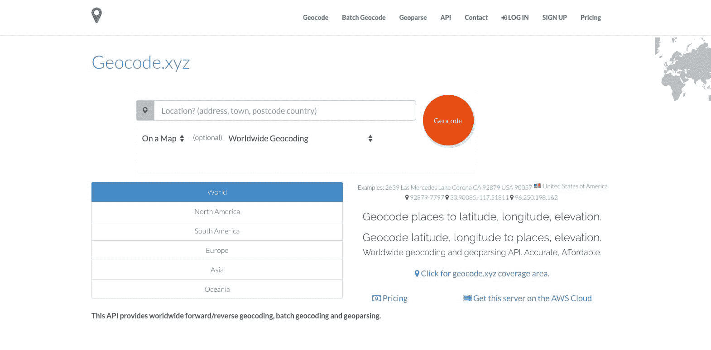
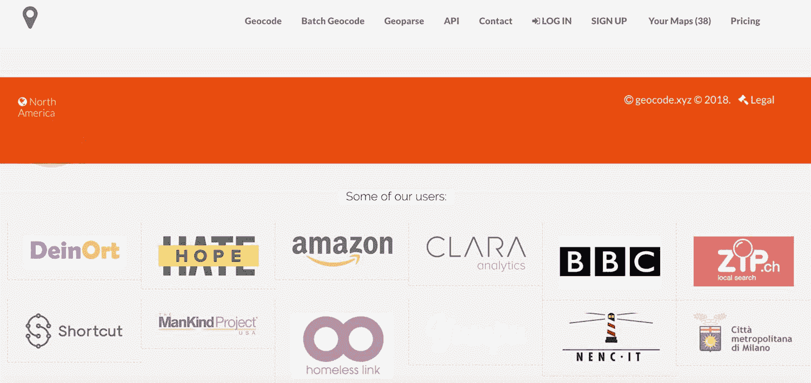
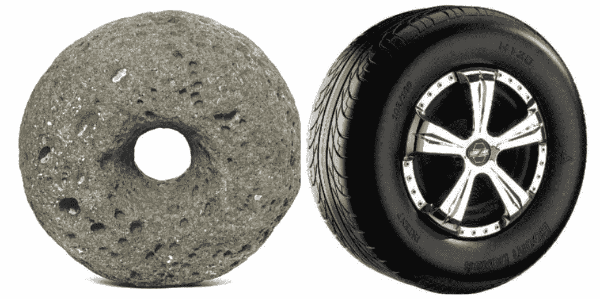

# 使用地理分析/地理编码 API，在不到两年的时间内从 0 美元到 1 万美元/月

> 原文：<https://www.indiehackers.com/interview/from-0-to-10k-mo-with-a-geoparsing-geocoding-api-in-under-two-years-6249ac6f67>

## 你好！你的背景是什么，你在做什么？

我是欧文·汝瓷，安大略省的一名开发者和“企业家”(从 2005 年开始)。我在共产主义时期的阿尔巴尼亚长大，高中时喜欢数学和物理，并在科学奥林匹克竞赛中获奖，但从未学习过任何实用的编程技能。(没有电脑可以入侵。)

1996 年，我作为一名学生从阿尔巴尼亚(途经希腊)来到加拿大(位于新不伦瑞克萨克维尔的芒特艾利森大学)。我学了数学和计算机科学。那是我性格形成最大的几年。作为一名 [MTA 的学生](https://web.archive.org/web/20000930113141/http://www.mta.ca:80/~eruci/)，我尝试了电影制作、创意写作、广播节目、摄影，学习了编码，并写了大量代码，从编译器到在现代计算机架构中执行 [IBM650 机器码](https://web.archive.org/web/20020318032944/http://www.mta.ca:80/~eruci/perl.htm)，到建立在线学位机器人顾问。

我在 1998 年找到了我的第一份全职编程/网页设计工作(当时是二年级学生，是大学的网站管理员)。回顾使用互联网档案库的时候，我的设计技能欠缺，我的编码技能一般。我认为我设计了也许是历史上最糟糕的大学网站。

我在 2001 年完成了计算机科学的非全日制学位，并搬到安大略省的渥太华，在加拿大互联网注册局(CIRA)开始了一份新的工作，担任软件开发员，直到 2005 年。(我没有接触过网页设计。)CIRA 还支付了我的研究生学费(在卡尔顿大学)。我研究的问题为我后来开始的一些爱好项目提供了灵感。(我的论文是[关于计算几何中的一类 3SUM-HARD 问题](https://curve.carleton.ca/system/files/etd/0e3a716d-1977-40ce-990c-1d27868dd587/etd_pdf/bcfd43d4bce764d76ab3749064ea20a3/ruci-cuttingapolygonwithaline.pdf)。)

如果不是因为这段学术和工作经历，我想我今天不会在这里接受采访。

2005 年离开 CIRA 后，我开始了一些业余爱好项目和公司，主要是在“本地搜索”领域。我最大的成功之一是本地餐馆指南, [FoodPages.ca](https://foodpages.ca) ,到 2008 年，每月有超过 100 万的独立访问者。

现在我把它算作我的失败，虽然它仍然支付托管费用，甚至略有盈利。我不知道为什么，也许这个领域现在被少数几个大玩家所主导，主要是谷歌地图，或者我对 SEO 一无所知。不管怎样，互联网上到处都是死去公司的尸体。我只是用 FoodPages 和另外半打左右的东西对这一堆做出了微薄的贡献。

2008 年，我回到阿尔巴尼亚，在发罗拉大学(我的家乡)担任计算机科学讲师和各种行政职务，同时管理我的副业。

从 2008 年到 2011 年，我领导了大学在线管理系统的开发(由我和一名学生从零开始构建)。我还为我教的编程课建立了在线学习和随机测试模块。

2012 年，我辞职搬回了加拿大，因为我在博客中记录了一些奇怪的事情。

回来不到一个月，我就遭遇了加拿大邮政提起的[版权/商标侵权诉讼](https://news.ycombinator.com/item?id=3830211)，起因是加拿大邮政提供了一个[免费的邮政编码众包数据库](https://geocoder.ca/?freedata=1)(根据知识共享署名 2.5 加拿大许可证)以及在我的一个网站上使用了(据他们所说的)“邮政编码”这一商标术语。他们[在 2016 年](https://eruci.com/2016/06/06/ananan-is-in-fact-a-fact-the-postal-code-lawsuit-is-over/)掉了。

2016 年，我开始开发 geocode.xyz ，这是一个全球地理编码/地理解析 API，被成千上万的用户(包括免费和商业用户)用来解析和地理编码自由格式文本中的位置。

我的收入每月超过 1 万美元，年初至今增长 50%。

 

## 是什么促使你开始对 XYZ 进行地理编码？

随着法院强制个人破产的威胁消失，我重新关注我想要解决的公开问题。把世界文学放在世界的物理地图上就是这样一个问题。它涉及到在地理环境中解析书籍中提到的位置，这一过程也称为地理解析。

根据[方向杂志](https://www.directionsmag.com/article/2287)的报道，地质公园是一个近乎神奇的、复杂的技术过程，它依靠数据将地理信息放入环境中。几乎没有可靠的地质分析 API，所以我想我可以创建一个。

四处看看！确定一个你想解决的问题，如果你有灵感，不要害怕重新发明轮子。

TweetShare

这就是 [books.geocode.xyz](https://books.geocode.xyz) 和支持它的 API[geocode . XYZ](https://geocode.xyz)的由来。事实证明，其他初创公司也需要这样的 API，尤其是那些徘徊在大文本数据和地理空间分析交叉点的公司。

书籍。地理编码。XYZ:

 

## 构建最初的产品需要什么？

$1.

经过 5 年的法律纠纷，我的财务状况很糟糕，因此，与往常相比，我不得不从超低成本开始(在 AWS 上使用免费的 t2.micro 服务器)。唯一的代价是 geocode.xyz 域名，这是我在。0.99 美元的 xyz 促销活动。因此，总启动成本约为 1 美元(0.99 美元+税)。

在此之前，我已经启动了 [geocoder.ca](https://geocoder.ca) ，这是一个针对加拿大和美国的地理编码 API。Geocode.xyz 是对 geocoder.ca 的完全重写和再发明。在它们过时和消亡之前，重新发明和/或向不同方向扩展它们是一个好主意。还记得雅虎吗？(他们还建立了一个地质公园引擎:现在已经不存在的 [Yahoo Placemaker](https://mashable.com/category/yahoo-placemaker/) 。)

我花了大约 3 个月的时间来编写最初的工作软件。它仅限于几个欧洲国家，没有批量地理编码功能，也没有商业模式(即没有定价页面)。我们花了大量时间来识别数据源和编写代码，将这些数据源集成到主数据管道中，然后测试/微调一切。

退后一步，什么都不做，放松会有帮助。在做这件事的时候，我可能会想到一个我可能会解决的有趣问题。在这种情况下，我会一步一步来。

TweetShare

我没有收到任何外部资金，无论是 geocode.xyz 还是我之前的任何公司。我做过的一切都是自费的。唯一的主要成本是我的时间，但我确信我在自己的项目上工作比做一份工程类的日常工作更有价值。

代码库超过 100，000 行代码，用 C 和 Perl 编写。

## 你是如何吸引用户和发展 XYZ 地理编码的？

我在 2016 年底发布了 [2016 Perl 降临日日历](http://perladvent.org/2016/2016-12-16.html)。除此之外，或者在会议上发言，我没有做过市场营销，搜索引擎优化，新闻，公关，群发电子邮件，或任何这些事情。

大多数顾客都是从这种利基产品的口耳相传而来。我对目前的增长模式也很满意，我不太想营销、定价模式等问题。我认为让一个产品“成长”的唯一方法是让它更好地工作。如果满足这个条件，用户最终会被产品“吸引”。

下面是我们的一些用户:

 

Geocode.xyz 目前每周服务约 150 万次请求，其中大部分是免费用户，但也有足够多的付费用户。

大多数用户使用 API 的 JSON 输出，相当多的用户使用批量地理编码(HTML) API。我还提供了 XML 和 CSV API，但是很少有人使用这两种 API。(这是用户的[内容类型分类](https://lh3.googleusercontent.com/XPyCojVqrHvawmpr3LwpB0Wyf4pzty7V2tbw1IQnYaCYsVojx4aqD4vjWbIh8Gx3wsT88IhMnumJCA)。orange 的 XML 用户约占 4%。)

## 你的商业模式是什么，你是如何增加收入的？

我提供免费和付费版本的 API:

*   节流 API 访问是免费的。 [API](https://geocode.xyz/api#usagelimits)
*   按使用付费访问的非节流 API 定价为每信用点 0.0025 欧元。[登录](https://geocode.xyz/login)购买积分(1 积分= 1 次 API 调用)。
*   无限制 API 访问每月订阅:每月 100 欧元。[登录](https://geocode.xyz/login)订阅。(您可以随时取消)。
*   AWS 上无限制的地理编码服务器，标准 AWS 许可费用。[在你自己的服务器上运行这个软件。](https://aws.amazon.com/marketplace/pp/B06Y1DVR9L)

定价是以欧元为单位的，因为它最初是针对欧盟市场的，我从来没有改变它，或者创建基于国家/地区的定价选项。

API 客户通过 Paypal 或 Stripe 支付(经常性支付全部由 Paypal 处理，部分 CC 交易由 Stripe 处理)。我将 API 价格保持在最接近我的竞争对手价格的 1/10。我可以做到这一点，因为我的运行成本是最低的。

AWS Marketplace 是另一个收入来源，客户为他们自己在 AWS 云上运行我的软件的实例付费。(我收到按小时计费的软件许可费)。

Geocode.xyz 现已成立两年，收入比一年前增长了 50%以上。

业务费用上涨了一点。我现在使用一组负载平衡的 AWS spot 实例——它们很便宜，但不是免费的。

## 你未来的目标是什么？

我的目标是为某些问题创造有用的解决方案，并因此享受用我的时间做任何我想做的事情的自由。

至于 geocode.xyz 的未来，我希望该软件能够扩展，以便解析数百万本书籍，从而创建迄今为止最全面的世界文学地图。

我目前正在添加新功能，例如将开放的[高程数据](https://geocode.xyz/blog)集成到 API 中，添加对交叉点地理解析(仍未脱离 alpha)、IPv4 & IPv6 地址地理编码(刚刚发布)、自动完成和模糊地理解析(todo)、性能优化(正在进行中)等的支持。

拥有超过 1TB 的基础应用程序数据和快速增长的客户群，扩展是首要任务。

## 你面临的最大挑战和克服的障碍是什么？如果你必须重新开始，你会做什么不同的事？

缺乏数据过去是，现在仍然是最大的障碍。

开放数据的状况在世界范围内并不均衡。([Openstreetmap.org](http://www.openstreetmap.org)和 [Openaddresses.io](http://www.openstreetmap.org/) 是主要的来源，而且近年来已经发布了许多公开的政府数据——如果没有它们，我就不会创建这个行业。)

时间和时机也是挑战。

*   时间:构建运行良好的东西需要很多时间，大部分时间花在测试/微调模式上。
*   时机:当解决问题的需求远在未来时，解决问题是没有意义的。现在是 geocode.xyz 的时候了——数据科学是一个快速发展的领域，需要这样的 API。尽管如此，我还是不清楚 API 的哪些方面更有价值。识别他们是一个挑战，所以我需要找出一个更好的方法从用户那里得到反馈，特别是那些几乎成为用户的人。

在技术方面，我在 Unicode 方面做出了一些糟糕的设计决策，导致 API 对于一些非 ASCII 语言不能很好地工作。该系统的某些部分将不得不重写，直到它们在这些情况下工作得更好。随着代码库变得越来越大，这又是一个挑战。

除了一些技术/设计决策，如果我必须重新开始，我会以完全相同的方式做每件事。

像 geocode.xyz 这样的超级精益创业公司，没有资金，但有解决问题的好主意，这是一个有趣的项目，即使它仍然只是一个小黑客。

但话说回来，更现实的想法是，我只会做我能做的，而不是我希望我能做的。

## 有没有发现什么特别有帮助或者有优势的？

退后一步，什么都不做，放松会有帮助。

在做这件事的时候，我可能会想到一个我可能会解决的有趣问题。在这种情况下，我会一步一步来。

休息好了再工作是有好处的。与长时间的工作相比，我在短时间的创造力爆发中完成了更多的工作。

## 对于刚刚起步的独立黑客，你有什么建议？

四处看看！确定一个你想解决的问题，如果你有灵感，不要害怕重新发明轮子。

 

过去 13 年最大的成功是再发明，比如一个巨大的八卦板(脸书)和一个巨大的广告牌(谷歌)。

我有一种感觉，他们(和许多其他人)将再次被重新发明。

## 我们可以去哪里了解更多？

技术会议对我来说是很好的学习经历。

请查看我在 FOSDEM 2016 和 [TPCiA 2017](https://www.youtube.com/watch?v=2gA3-kJ5avk) 的演讲。

我不认为人们可以从商业书籍/小册子/资源中获得“如何成为企业家”或“如何开始这个或那个”的启发或学习创业者看关于创业的书，就像浪漫的人看言情小说寻找灵感一样。

我也不认为自己是一个“企业家”，只是一个有问题要解决的人。我想出的一些解决方案最终形成了商业计划。有些没有。

我不认为人们可以从商业书籍/小册子/资源中获得灵感或学到很多东西。创业者看关于创业的书，就像浪漫的人看言情小说寻找灵感一样。

TweetShare

然而，我确实喜欢阅读像《独立黑客》这样的出版物，以获得关于其他人*如何找到*灵感的简要介绍。我喜欢研究人，有灵感和动力的人很有趣。

在大多数情况下，我读到灵感如何孕育发明，而发明又反过来孕育验证，黑客们最追求的就是验证，而验证又反过来孕育灵感。我不相信一个人可以“学会”以获得受欢迎的认可为目标去创造或激发。我相信任何有天赋的人都可以从无到有创造出一些东西。我也相信我可能是错的。

我不相信任何东西，不像有些人相信某些东西，也不相信其他东西。

——[<picture id="ember5220342" class="user-avatar ember-view user-link__avatar"></picture>欧文·汝瓷](/eruci?id=Uryag5XDLUVQlBijkoszW0gW1NO2)《地理编码》的创作者。XYZ

## 想像 Geocode 一样建立自己的事业。XYZ？

你应该加入[独立黑客社区](/)！🤗

我们是几千名创始人，互相帮助建立有利可图的业务和副业。来分享你正在做的事情，并从你的同事那里获得反馈。

还没准备好开始使用你的产品吗？没问题。这个社区是一个认识人、学习和实践的好地方。随意[随便浏览](/)！

—[<picture id="ember5220347" class="user-avatar ember-view user-link__avatar"></picture>考特兰艾伦](/csallen?id=ibTLPyjwVebnZjMGKvz6ztarnuV2)，独立黑客创始人

36votes