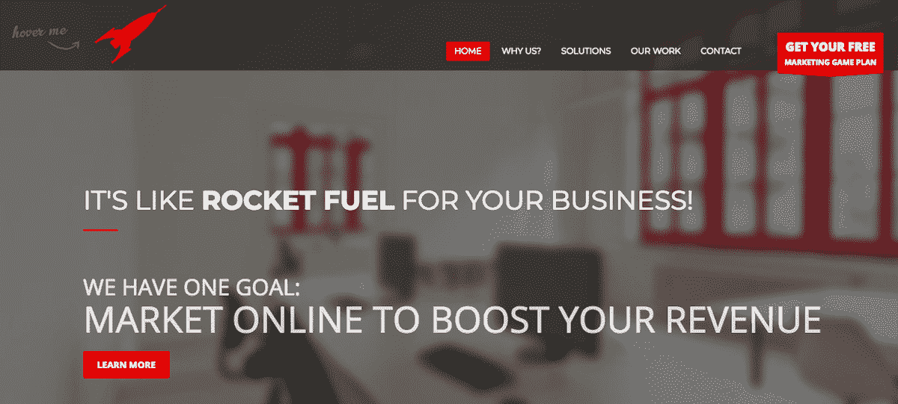
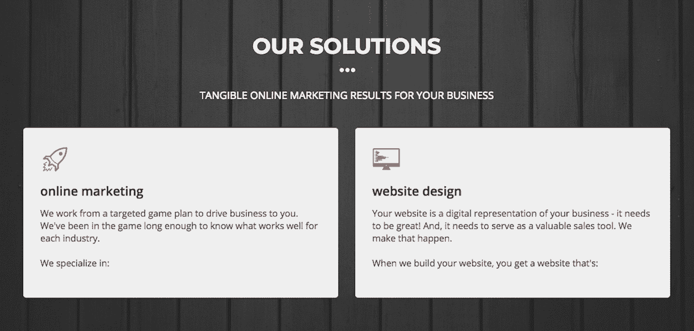
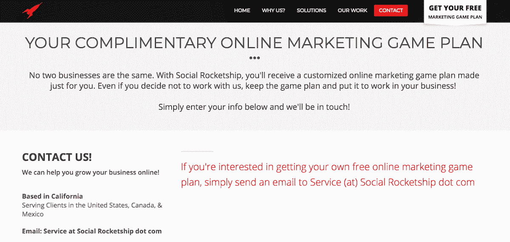

# 从朝九晚五到创业和和家人环游世界

> 原文：<https://www.indiehackers.com/interview/from-9-5-to-entrepreneurship-and-traveling-the-world-with-my-family-fb6ba8113a>

## 你好！你的背景是什么，你在做什么？

你好。我叫肖恩·马歇尔，是数字营销公司 [Social Rocketship](https://www.socialrocketship.com/) 的创始人。

Social Rocketship 帮助小企业主满足他们所有的在线营销需求——从网站设计到 SEO 再到社交媒体。我们的目标受众主要是美国、加拿大和墨西哥的中小型企业。

这项业务建立在每月定期订阅的基础上，一次性的网站建设和其他服务是额外的收入。去年，我们的平均月收入为 16，000 美元。

 

## 是什么促使你开始社交火箭计划？

在 2010 年之前，我在加州拉古纳尼古尔的家附近做过各种工作，在那里我们几乎入不敷出。为了在这个世界上向上爬，我自学了一些基本的在线营销技巧，比如如何建立一个 Wordpress 网站。我了解到，几乎所有人需要的信息都在网上，我花了几个小时在 YouTube、各种论坛和博客上，沉浸在我能得到的一切中。

它得到了回报！我的新知识实际上给了我最后一份办公室工作。在那里，我遇到了一些企业主，当他们发现我熟悉网络时，他们都向我寻求帮助。这就是社交火箭的想法出现的时候。我知道需求就在那里，我只需要和企业主谈谈，让他们参与进来。

被解雇后，我和妻子决定是时候告别为别人工作的传统，全力以赴开创自己的事业。我们决定冒险一试，因为我们想拥有机动性。尽管我们已经有了孩子，但他们还年轻，我们想去旅行，有机会去其他国家生活。

一旦我们有了基础，我们就能做到这一点，我们的第一站是墨西哥的科苏梅尔。我们在那里总共呆了四年半，因为我们非常喜欢那里。从那以后，我们每年夏天都在欧洲和美国旅行，目前住在苏格兰的爱丁堡。

## 构建最初的产品需要什么？

我们做的第一件事就是决定离开奥兰治县。我们喜欢它，但我们知道在发展业务的同时我们负担不起。我们卖掉了所有不适合我们车的东西。我们成了极简主义者，在华盛顿的柯克兰租了一间带家具的房子。我在那里有一些业务联系，所以先去那里是有意义的。

在那之后，开始社交火箭旅行再容易不过了。我在 VistaPrint 上拿到了一包 250 张的名片，在一天内建立了一个 Wordpress 网站，然后开始尽可能多地与企业主交谈。

我对主机、域名、一个好的 Wordpress 主题和名片的总投资不到 200 美元。第一个月，我赚了 2450 美元(其中 1400 美元是新的经常性收入)。我知道与你在独立黑客网站上看到的一些数字相比，这不算什么，但对我来说，这是巨大的！我从一开始就是盈利的。

良好的客户服务和完全透明是业务增长的关键。

TweetShare

至于实际的服务，我完全基于企业主所说的他们需要什么。过了一段时间，我终于把所有东西都打包成产品，并提出了我所谓的沃尔玛、塔吉特和诺德斯特龙模型。基本上，我有一个便宜的套餐(沃尔玛)，一个好得多的套餐(塔吉特)，然后是一个豪华套餐(诺德斯特龙)。大多数人都选择了 Target 套餐，其中相当一部分人选择了 Nordstrom 套餐。

像这样打包服务帮助我将一切系统化，并确定哪些业务会长期存在(我有一些业务从 2010 年就开始了！).这个系统还帮助我确定哪些客户不值得我花费时间。我很快学会了避开那些选择沃尔玛套餐的人，因为坦率地说，他们是最糟糕的顾客。

就技术而言，我使用 SiteGround 托管，Gmail(我自己的域名邮件可以转发/获取)，Dropbox 存储，Asana 项目管理。我开始在自己(大错特错)、Fiverr 和 Odesk(现在是 Upwork)之间分配工作。我最终让我自己的团队成员(作为 Social Rocketship 的承包商)直接向我汇报。

 

## 你是如何吸引用户并发展社交网站的？

我通过与我个人认识的企业主交谈，以及通过我现有的网络介绍给我的人交谈，完成了我的第一笔销售。我们在第一个月就实现了盈利，此后一直在增长。到 2011 年底，我们已经从最初的 2，450 美元增长到大约 5，000 美元/月，2012 年，随着简化的运营系统和新团队成员的增加，收入跃升到 1 万美元/月以上。我们在 2013 年停滞在大约 14k 美元/月，主要是因为我不再积极发展业务了。

在过去的几年里，这项业务几乎完全是通过推荐发展起来的。企业主一旦找到好的数字营销公司，就不想放过。然后他们告诉他们的朋友。这些推荐是非常热情的潜在客户，这实际上只是一个他们会选择哪个套餐的问题。这项业务已经稳步增长到平均每月 16k 美元，但我没有任何计划超过这个数字。

每天记住你为什么创业是至关重要的。

TweetShare

面对面的交流是我推动销售的主要手段。我实际上是一个内向的人，但是当要把食物放在桌子上时，我做了我需要做的。此外，成为房间里的“在线营销人”很容易，因为每个人都想和我交谈。在这种商业模式下，每一个企业都是潜在的客户。

良好的客户服务和完全透明是业务增长的关键，但网络比其他任何东西都更快地帮助我的业务增长。我知道大多数人宁愿运行脸书广告或垃圾邮件/电子邮件的前景，并认为*可以*工作。但我相信，我保留率如此之高，是因为我与客户进行了最初的个人接触。即使是现在，我也喜欢第一个给潜在客户打电话。一个 20 分钟的电话就可以变成一笔生意，让我们一个月接一个月，一年接一年。

我确实尝试了各种其他“更具可扩展性”的方法，比如电子邮件，但是没有一种方法像网络一样有效。

## 你的商业模式是什么，你是如何增加收入的？

我的业务基于定期订阅，这对增长和收入预测至关重要。我们也做一次性网站(通常定价很高)，但我们鼓励他们在网站完成后进行月包。

根据客户的行业、所涉及的工作等，实际的套餐费用是浮动的。但是——这一点非常重要——我们**总是**提供三包价格。它通常看起来像这样:

包装:

*   499 美元(沃尔玛套餐)
*   599 美元(目标包装)
*   1199 美元(Nordstrom 套装)

记住这些是**而不是**包的实际名称。此外，实际数字可以改变，但模式保持不变。这些数字可能是 999 美元/1099 美元/1999 美元或其他数字。这是销售心理在起作用！

大多数人会选择目标套餐，也就是你想卖一整天的套餐。警惕沃尔玛人，张开双臂拥抱诺德斯特龙人。

 

## 你未来的目标是什么？

我对我的企业目前的状况非常满意，也没有太多改变它的计划。事实上，如果你看我的网站，它基本上只是一个登陆页面。我没有团队成员做营销。

这项业务释放了大量的时间，让我可以做其他事情，包括教学。事实上，当我的一个朋友让我帮他赚更多的钱时，我偶然创建了一个完整的课程。我告诉他，他可以“克隆我的生意”。为了帮助他，我写了一本书，然后开设了一门课程，引导他(和其他人)了解创办和扩大一家数字营销公司的方方面面。

我很高兴地说，我的朋友，以及许多其他学生，已经成功地开创了自己的事业。很爽的感觉。这有点可笑，因为这样做我在技术上创造了一堆直接竞争，但有足够多的业务在那里，所以我不担心。

## 你面临的最大挑战和克服的障碍是什么？如果你必须重新开始，你会做什么不同的事？

拓展这类业务的关键是走出自由职业者模式。即使你能做所有的工作，你也不应该。像企业主而不是企业“实干家”那样思考。而不是想“我今天必须做什么？”思考“今天谁在做什么？”

第一年的时候我真的限制了自己和自己的事业，因为我坚持什么都自己做。这是一种完全缺乏的心态。后来，一个朋友向我挑战，让我找一个虚拟助手来做一件事。虚拟助理在一个小时内完成了我要花两天才能完成的工作。总成本？$8.是的，八美元。从那以后，我迷上了外包一切。

即使你能做所有的工作，你也不应该。

TweetShare

那时我把系统放在适当的位置(基本上是 Asana 中的详细清单),并让别人为我做所有的事情。不出所料，我的收入增加了。

拥有运营系统和优秀的团队可以让任何业务更上一层楼。尽你所能让这些尽快到位，但不要让它阻止你销售。出去做一笔生意，然后回头找个人为你做后续工作。

在雇佣团队成员时，你会得到你所付出的。是的，我的团队成员都在海外(大部分在菲律宾)，但是他们的薪水(确切地说是他们开给我的薪水)非常有竞争力。这也是为什么我多年来一直有相同的虚拟助手。

## 有没有发现什么特别有帮助或者有优势的？

第一年年末，我读了两本书，这两本书彻底改变了我做生意的方式:约翰·瓦里洛(John Warrillow)的《为销售而生:创建一个没有你也能繁荣的企业》(T1)和 MJ·德马科(MJ DeMarco)的《T2:百万富翁浪子》(The Millionaire )( T3)。

这两本书极大地改变了我对自己的生意和财务计划的看法。我认为记住你的总体**【为什么】**是非常重要的。我妻子告诉我她想住在热带岛屿上。我也是。我们想移动。所以我们努力工作来实现这个目标。它驱动着我的每一个电话，每一个提议，每一次跟进，每一件事。

每天记住你为什么创业是至关重要的。

## 对于刚刚起步的独立黑客，你有什么建议？

出售。出售。出售。

有人说，在东西卖出去之前，你没有生意。是真的。你可以浪费几周或几个月的时间来完善你的网站、你的产品、你的发布顺序等等。这些都不重要。

真的。

重要的是让一个人(不是你妈妈)买你的产品。然后又是一个。另一个。继续前进。不要担心拥有最酷的标志或最有吸引力的公司文化。卖就是了。太多的人把事情过度复杂化，关注他们业务的错误方面，尤其是在开始的时候。

是的，你可以拥有一个“酷办公室”，里面有乒乓球桌和披萨派对，只要你想得到。完成你的产品。那就卖一次。然后再卖。将系统安装到位。让人们去做工作。多卖。努力扩大你的收入，同时减少你的个人投入，这样你就可以专注于你想做的事情。

尽一切努力去实现它。然后你会发现自己在某个海滩上吃着玉米卷。我保证。

## 我们可以去哪里了解更多？

你可以在[家庭火箭](https://www.familyrocketship.com/)找到我的博客，或者在推特[@家庭火箭](https://twitter.com/FamRocketship)找到我。

请在评论区问我你想要的任何问题。我是一本打开的书！

我很高兴也很荣幸成为独立黑客，并期待尽我所能提供帮助。如果它在我的脑子里，它就是你的了。

——[<picture id="ember8065063" class="user-avatar ember-view user-link__avatar"></picture>肖恩·马歇尔](/DonXan?id=aQkHMRlabuSbUf6pww5tbQWElxe2)，社会火箭技术的创始人

## 想像 Social Rocketship 一样建立自己的事业？

你应该加入独立黑客社区！🤗

我们是几千名创始人，互相帮助建立有利可图的业务和副业。来分享你正在做的事情，并从你的同事那里获得反馈。

还没准备好开始使用你的产品吗？没问题。这个社区是一个认识人、学习和实践的好地方。随意[随便浏览](/)！

—[<picture id="ember8065068" class="user-avatar ember-view user-link__avatar"></picture>考特兰艾伦](/csallen?id=ibTLPyjwVebnZjMGKvz6ztarnuV2)，独立黑客创始人

38votes