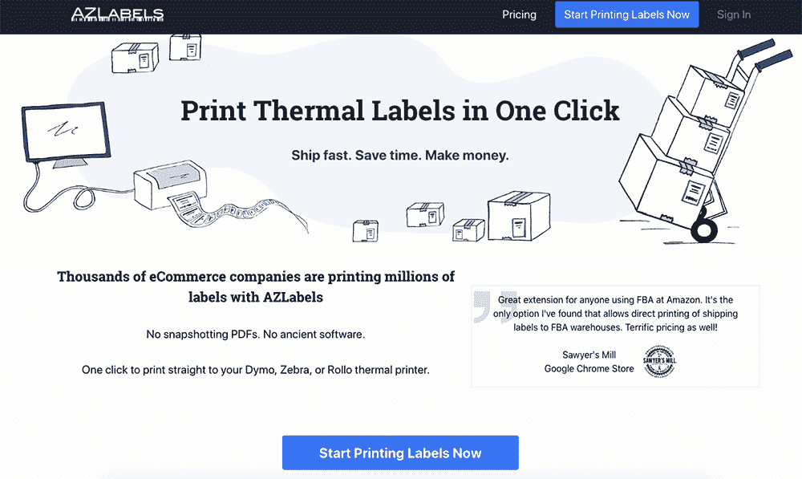
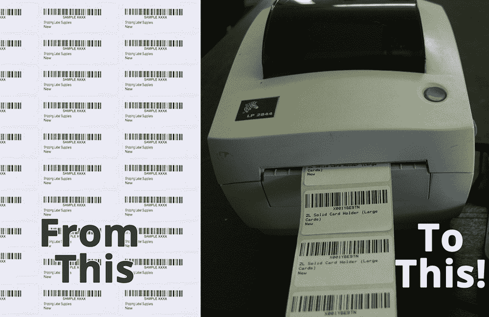
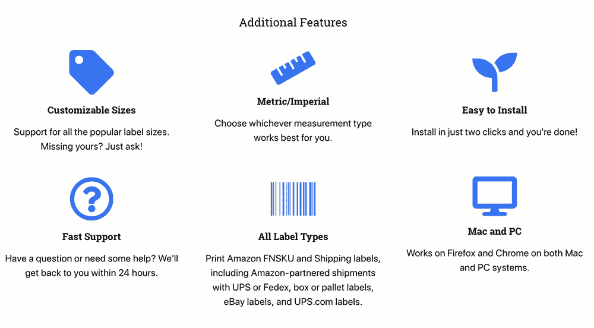

# 从亚马逊卖家到 SaaS 创业创始人

> 原文：<https://www.indiehackers.com/interview/from-amazon-seller-to-saas-startup-founder-cae35e57cb>

## 你好！你的背景是什么，你在做什么？

嘿独立黑客！我是基思·布林克(Keith Brink ),目前正在运营 [AZLabels](https://azlabels.com/) ,这是一款消除热敏打印机打印标签的挫折感的产品，主要针对亚马逊卖家。从一个免费的 Chrome 扩展到一个拥有所有配件的成熟的 SaaS 产品，这是一个有趣的旅程。

我从小就是一名企业家，到目前为止，我还没有走出这一步。我尝试了很多想法，但只有三个是认真的。我的第一份生意是一家虚拟助理采购公司，第二份是在亚马逊上销售玩具和游戏，第三份也是目前的生意是 AZLabels。

自 AZLabels 于 2017 年 5 月推出以来，它已经增长到约 6500 美元的 MRR，3000 名用户和 900 万张印刷标签，我估计这已经为我们的用户节省了超过 7 年的劳动力。

 

## 是什么促使你开始使用 AZLabels？

我自己也是一名亚马逊卖家，每天花一个小时打印标签。超级低效。每个亚马逊 FBA 卖家都必须给每个产品贴上标签，然后给运往亚马逊的每个盒子贴上标签。一旦你开始定期运送产品，你会经历很多标签，所以买一台热敏打印机来节省墨水和标签纸的钱是有经济意义的。

然而，将标签转换成热敏打印机能够理解的格式是一个麻烦的过程。我不得不在每次发货需要 20-30 分钟的漫长人工流程和一些昂贵、缓慢、效率低下且零客户服务的古老软件之间做出选择。

在我花了几个月的时间构建了一个自动化解决方案后，我意识到可能还有其他卖家遇到了同样的问题。因此，我建立了一个带有病毒循环的基本登录页面，看看是否有人有兴趣购买我的产品。

老实说，这并不是一个巨大的成功。我想我一个月只有 20 人注册，比我期望的要低得多。但我想我应该发行它，如果它每月只赚几百美元，那也比什么都没有强。

## 构建最初的产品需要什么？

该产品的第一个版本是一个 Chrome 扩展，它从亚马逊的卖家仪表板中获取标签数据，并将其发送到一个服务器，该服务器为热敏打印机格式化标签并返回一个 PDF。我没有办法收费，也没有合适的客户门户，因为我基本上是为自己建立的。

 

那个版本花了我大约两个月的时间来完成。这绝对是我在晚上和白天的空闲时间做的一个兼职项目。

我想我在这个项目上最多只花了几百美元:域名、谷歌 Chrome 开发者账户、几个数字海洋服务器等等。

我有一点从零开始构建技术项目的经验，因为我已经构建了后端系统来尽可能多地自动化我以前的业务，所以我能够在这一经验的基础上为扩展产品打下坚实的基础。例如，我没有在服务器上硬编码标签模板，而是创建了灵活的工具，使调整设置或添加新类型的标签变得容易，而无需重复大量工作。像这样的小决定使得 AZLabels 现在更容易管理，尽管它需要更长的时间来开发。

我目前的堆栈是 DigitalOcean，CentOS，nginx，MySQL，PHP 7.2，Laravel，Laravel Forge 来管理服务器，Laravel Spark 用于 SaaS，Stripe 用于支付，Jigsaw 来自 Tighten 作为我前端的静态网站构建器，Tailwind CSS 和 Vue.js

我学到的一点是，你需要找到你的领先指标——哪些指标将预测收入/客户满意度/你的任何目标的增长？

TweetShare

## 你们是如何吸引用户并壮大 AZLabels 的？

在我发布了 AZLabels 的第一个版本后，我给几个人发了电子邮件，请他们开始使用它，只是为了解决我个人没有遇到的所有错误。我认为快速发布一个 MVP 很重要，但确保你的产品值得花钱也很重要。我发现一个快乐的媒介是告诉人们一旦你发布了你会给他们多少钱，然后等到产品足够稳定后再给他们收费。

之后，我向注册名单上的 20 个人发起，要求他们每月支付 5 美元，想印多少就印多少。他们中的一半人注册了，我认为这是一个好迹象，并且很高兴看到 Stripe 帐户中每月有 50 美元。当时，我的目标是每月收入达到 1000 美元，作为一份体面的副业。

在那之后，我开始尝试一些不同的方法来吸引用户:

*   Reddit 上的一个帖子相当成功，带来了 10-20 个新客户。在 Reddit 上留下来并与任何发表评论的人接触是很重要的，因为这将增加你的帖子的活跃度，从而延长帖子的寿命。即使他们很挑剔，但这实际上有助于你的帖子保持在顶部，让人们感兴趣。从那以后，我在 Reddit 上通过分享新的博客帖子获得了其他成功。
*   我试着在亚马逊卖家论坛上发帖，这似乎是一个非常明显的推广场所，但他们不允许任何外部链接，并且对自我推广非常警惕。我在那里提到过几次 AZLabels，但几乎都被关闭了。
*   我将 AZLabels 添加到一些亚马逊卖家工具列表中。
*   我评论了几篇关于 AZLabels 的相关博文。
*   我在做独立黑客的采访！:-)
*   我在 Quora 上回答了一些关于打印热敏标签的问题。
*   我在竞争对手的品牌上做了谷歌广告，这些产品很糟糕，有一半时间都不起作用，而且没有客户支持。我用了这样的标题，“其他印刷公司不工作？免费试用 AZLabels，一键打印。”这些网站的流量很低，但是当它们被点击时，转化率很高。
*   我在 Youtube 上放了一个视频解释如何使用 AZLabels 打印标签。我从这个视频中获得的流量几乎为零。
*   我联系了亚马逊卖家空间中有影响力的人，询问他们是否对加盟计划感兴趣。对我来说，这一直是最成功的渠道。我敢说，我们三分之一的销售都是通过这种方式实现的。

在早期，我没有非常准确地跟踪客户的来源，所以很难说什么有效，什么无效。我所知道的是，现在每个月大约有 200 人专门在谷歌上搜索 AZLabels，所以在不同地方提到的一些内容肯定仍然会被人们所接触到。

尽管营销绝对不是我的强项，但我认为尝试几种策略是很重要的，因为你永远不知道什么时候会发生什么。我很想找到一个真正成功的营销策略，但迄今为止，我所找到的都是在许多不同地方取得的小成功。

 

## 你的商业模式是什么，你是如何增加收入的？

我们的商业模式开始时非常简单:每月支付 5 美元，想印多少就印多少。保持简单是有意义的，因为产品本身很简单。我们在第一次开始构建产品后大约三个月开始向客户收费。

当我们每月赚到 500 美元时，我们转向了分级定价系统:每月 100 个免费标签，每月 1000 个标签 5 美元，或每月 20 美元无限量标签。这一定价主要是由我们的联盟计划推动的；我们希望在定价上有足够的空间来支付我们的代销商，并为我们的客户提供促销折扣。

就在几个月前，我们取消了无限制计划，现在根据客户使用的标签数量收费。我们现在有几个客户每月支付 100 美元。这种价格上涨的动机是我们的客户之间的巨大差异:有些人每月打印几十万张标签，有些人只打印几千张。但是两位顾客支付的金额是一样的。我们想确定我们没有把钱留在桌子上。我们还对 AZLabels 进行了一些重大升级，以加快打印速度并实现更多集成，因此现在似乎是永久取消无限制计划的适当时机。

AZLabels 面临的主要挑战是与竞争对手的差异化。其他一些类似的产品已经推出(有些试图完全复制！这是奉承，我想)，但我真的不想卷入价格战。我专注于通过使 AZLabels 更易于使用、打印速度更快、与客户的工作流程更加集成、友好快捷的客户服务以及始终无 bug(这是一个挑战，因为我们必须在几个小时内对亚马逊在其平台上做出的任何改变做出响应)来比所有其他产品执行得更好。

我想提高价格的另一个原因是故意声明 AZLabels 不是低成本、低质量的选择。我们对我们的速度和工作流程整合非常有信心，所以我们有能力收取尽可能多的费用。时间会证明这是否是一个好的选择！

我可以肯定的一件事是，较高的定价在某种程度上导致了较低的流失率。新定价生效后，我们的月流失率从 4%降至 2.5%，这确实增加了我们客户的 LTV。当然，客户流失的减少也可能是我们同时发布的速度或功能改进。

在我们的开支方面，我试图消除自己的任何日常工作，所以我聘请了客户服务、营销任务、簿记、会计、内容创作和销售任务的承包商。所有这些每月的承包商成本高达 1000 美元，但这笔钱花得值，因为它让我专注于改进产品和获得新客户。

我再花 1000 美元/月做广告、代销商付费等营销费用，然后 500 美元/月做软件/硬件费用，比如 DigitalOcean、Forge、Adobe 等等。

## 你未来的目标是什么？

我明白了，你应该总是想着你的下一个 10 倍。我总是问，在我的收入/利润数字后面再加一个零需要什么？这有助于我将注意力集中在可实现的目标上。这意味着我正在想办法让这项业务成为每年 100 万美元的业务。

我学到的一点是，你需要找到你的领先指标——哪些指标将预测收入/客户满意度/你的任何目标的增长？例如，我知道我的 30%的客户在注册后平均需要 30-40 天才能成为付费客户。所以注册数量预示着我未来的收入增长。而我的网站流量预测了注册人数。我花在谷歌广告和内容营销上的钱可以预测我的网站流量。因此，如果我把注意力集中在领先指标上——这是我更能控制的东西——那么我就能实现我的目标。富兰克林·柯维写的《执行的四个原则》是这方面的一本好书。

因此，如果收入的主要指标是营销支出，理论上，我每月在营销上花费 14，000 美元，就可以达到每年 100 万美元。自举的挑战在于，来自收入的现金流目前无法支持这种支出。但是我的一个企业家朋友(s/o Nigel！)有一句很棒的话:“如果你有问题，你要么用钱解决，要么用创意解决。”

因此，我正在寻找其他创造性的方法，让 AZLabels 一点点向前发展:对独立黑客进行采访，给更多潜在的影响者发电子邮件，在 LinkedIn 上联系人们，以及许多小事。

尽管保持专注、主动工作而不是被动工作的原则很好，但规则就是用来打破的。

TweetShare

## 你面临的最大挑战和克服的障碍是什么？如果你必须重新开始，你会做什么不同的事？

在别人的平台(这里是亚马逊的平台)上创业的最大挑战之一是，你很容易受到他们做出的任何改变的影响。如果亚马逊调整了他们的运输流程，我需要立即更新 AZLabels。

最近，亚马逊仅向少数客户推出了一项调整，我可以访问的账户不在更新之列。这意味着我有一部分客户无法处理他们的货物，我也无法为他们解决问题。我有一个相当健壮的错误日志，它让我知道发生了什么，但没有足够的信息来修复它。

在那之前，我从未提供过实时支持，因为我试图保持主动而非被动的模式；但是在几天试图盲目解决这个问题后，我问一些客户是否介意与我分享一个屏幕。之后，我花了 10 分钟来解决这个问题，并推出了一个解决方案。

这对我是一个很好的教训。尽管保持专注、主动工作而不是被动工作的原则很好，但规则就是用来打破的，我对自己强加的规则过于严格，浪费了我和客户的大量时间。

如果我不得不重新开始，我不会改变太多。在开始的时候，我对一些过度优化和复杂的代码有点太着迷了，我本应该把它们变得更简单，因为这使得测试和维护代码变得更加困难。

我也会试着对成长更有耐心。在早期，从零到 1000 美元需要很长时间，但从 1000 美元到 5000 美元似乎非常快。

从头开始是最难的部分。当你知道你在做人们真正想要并愿意付钱的事情时，一切都会变得更有趣；但在这之前，你很容易四处寻找银弹。我宁愿花更多的时间打下坚实的基础，为长期增长做更多的内容营销，而不是追求迅速失败的热门机会。

## 有没有发现什么特别有帮助或者有优势的？

我之前提到过我是如何将日常业务外包出去的，我认为这是专注于真正重要的事情的关键。我和一些了不起的人一起工作过，比如我的一个朋友，他在 AZLabels 成立几个月后成立了一家营销公司。在一年半的时间里，我每月雇用他 10 个小时，他成功地将公司业务增长了 10 倍，从 500 美元/平方米增长到 5000 美元/平方米。).

尼基·l 是一个真正的自我激励者和 LinkedIn 向导，她通过管理营销和销售项目以及我们的内容营销来减轻负担。Katrina M .令人难以置信地处理了我们大部分的客户支持工作；她是如此的耐心、善良和专业。我真的很感谢他们，如果没有他们，我不会喜欢经营这家公司。

这些年来，我读了几本书，这些书真正影响了我的想法:

*   [*好到伟大*由吉姆·科林斯](https://www.amazon.com/Good-Great-Some-Companies-Others/dp/0066620996/ref=sr_1_3?keywords=Good+to+Great+by+Jim+Collins&qid=1562941493&s=books&sr=1-3)
*   [*高输出管理*由安迪·格罗夫](https://www.amazon.com/High-Output-Management-Andrew-Grove/dp/0679762884/ref=sr_1_1?keywords=High+Output+Management%2C+by+Andy+Grove&qid=1562941545&s=books&sr=1-1)
*   本·霍洛维茨著[关于坚硬事物的坚硬事物](https://www.amazon.com/Hard-Thing-About-Things-Building/dp/0062273205/ref=sr_1_3?keywords=The+Hard+Thing+about+Hard+Things&qid=1562941606&s=books&sr=1-3)
*   不完全是一本书，但当我读 GitLab 的员工手册时，我喜欢他们的方法，并为我的团队复制了他们的系统。

当然，亚马逊平台上的卖家比以往任何时候都多(现在活跃卖家超过 250 万！)因为它让我的客户群持续增长。只要亚马逊继续增长，公司就有很大的空间来提高业务效率。

## 对于刚刚起步的独立黑客，你有什么建议？

我的第一个建议是，如果你想找到机会，你必须做点什么——任何事情。我的第一家公司主要是帮助人们增加他们的 Twitter 账户，然后转向虚拟助理业务。当我这么做的时候，我发现当地分类广告上的产品和亚马逊上的产品价格相差很大，所以我开始在亚马逊上卖一些产品来赚点外快。这发展成了一个价值 50 万美元的玩具和游戏业务，正因为如此，我发现了 AZLabels 的产品机会。

此时此刻，我有比我的时间和资源更多的机会去追求，但那只是因为我处在一个我能看到它们的位置上。一旦某件事花费了我不希望的时间或者处理起来很烦人，我就把它记下来作为一个机会。我喜欢解决生活中所有的小问题，如果我能帮助其他人做同样的事情，那我的时间就是值得的。

另一个建议是，每当你觉得自己中了头奖，你可能还没有。例如，我已经和一些真正成功的有影响力的人建立了关系，他们推荐我，我确信我会获得数百名新客户。发射时间到了，却没有一个人皈依。

关键是投入大量小成功的辛勤工作，这些小成功累积起来就是一个大成功。也许有一天我会碰上那些头奖机会中的一个，但是当有这么多的方法可以继续前进的时候，为什么要等待闪电呢？

其他要考虑的是选择一个技术/营销/软件堆栈，并坚持一段时间(见 [Boring Technology](http://boringtechnology.club/) 网站)。我曾经从一个 CRM 跳到另一个，从一个代码框架跳到另一个，从一个记账软件跳到另一个，但我从来没有真正精通过任何一个。现在，我有一套工具，我总是用在每个项目上。拉勒维尔，拉勒维尔火花，帮助侦察，观念，懈怠，VS 代码。我用得越多，速度就越快，而且新工具带来的新特性通常不会超过切换、传输数据和重新学习新工具的成本。

## 我们可以去哪里了解更多？

感谢你一路走过来！请随意查看 [AZLabels](https://azlabels.com/) ，或者阅读我们关于[印刷 FBA 标签](https://azlabels.com/blog/printing-fba-labels-guide/)的博文。我们也在推特上和脸书上。

如果你有任何问题，评论，不同意见，无论你想说什么，我都会在这里。

祝您的项目一切顺利！

—[<picture id="ember8168385" class="user-avatar ember-view user-link__avatar"></picture>凯斯布林克](/KeithBrink?id=KevBBK2ErphzA94rLyfyvp2cTQT2)，AZLabels 创始人

## 想像 AZLabels 一样建立自己的事业？

你应该加入独立黑客社区！🤗

我们是几千名创始人，互相帮助建立有利可图的业务和副业。来分享你正在做的事情，并从你的同事那里获得反馈。

还没准备好开始使用你的产品吗？没问题。这个社区是一个认识人、学习和实践的好地方。随意[随便浏览](/)！

——[<picture id="ember8168390" class="user-avatar ember-view user-link__avatar"></picture>柯特兰艾伦](/csallen?id=ibTLPyjwVebnZjMGKvz6ztarnuV2)，独立黑客创始人

23votes