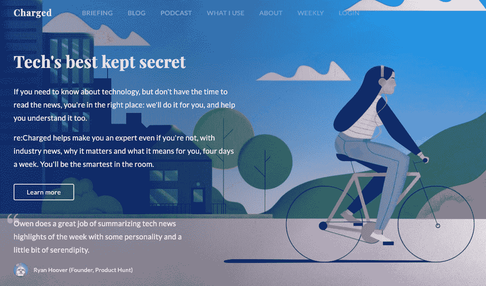
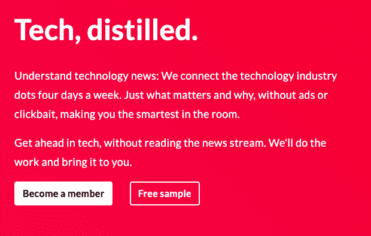
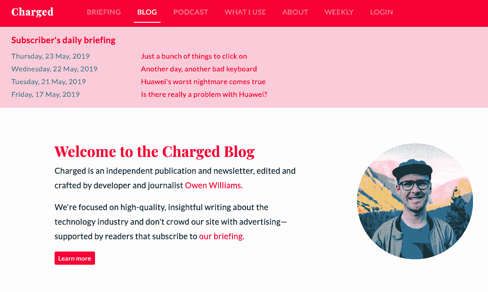
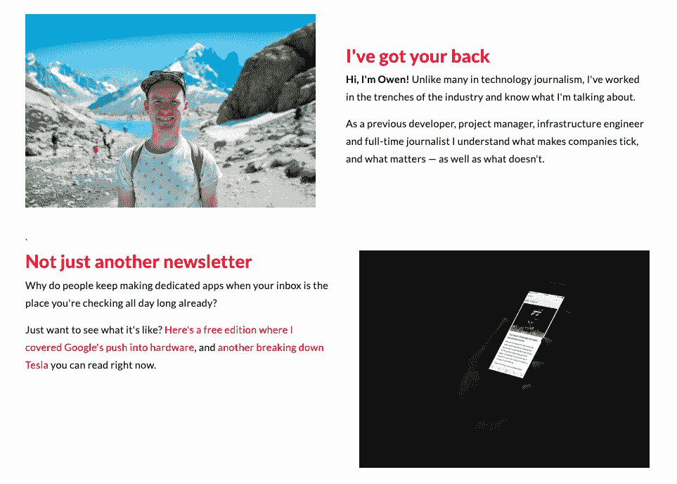

# 18 个月从倦怠到 2300 美元 MRR

> 原文：<https://www.indiehackers.com/interview/from-burnout-to-2-300-mrr-in-18-months-44f603e402>

## 你好！你的背景是什么，你在做什么？

👋我是欧文，一个居住在阿姆斯特丹的新西兰人，是一名自由职业的作家和数字事物的创造者。我的职业生涯始于基础设施工程师，但几年前转向了写作。

我上了大学，认为在服务器上工作会很有趣，虽然我喜欢在新兴的云行业工作几年，修补 DevOps 并帮助公司扩展到他们自己的数据中心之外，但我厌倦了扑灭别人的火。

在那段时间里，我一直在尝试以某种形式写作，并公开怀疑自己是否能全职写作。由于在 Twitter 上异常活跃，我最终以一名编辑的身份全职为 Next Web 工作，在所有那些业内没有人能真正掌握的以开发人员为中心的事情上拥有一席之地——因为他们从来没有做过。

那是我当时梦寐以求的工作——我从没想过全职写会有报酬！但是，事实证明，数字媒体游戏的名称是为点击量而工作，并真正推动大量的观看，我真的被这一点搞得焦头烂额。我想可能有一个更好的方法，向人们要钱来买我的话，因为这是有价值的。

快进到现在，我是一名自由撰稿人，或者为客户，或者为我的创业公司工作，[充电](https://char.gd/)。我们有一个博客、每周简讯(免费)和工作日简报(付费)，试图让技术对那些想跟上行业宏观变化的人更友好，没有你在大网站上看到的广告或新闻。

我们开始提供付费订阅已经有一年了，现在我们有 350 名员工，每月的经常性收入为 2，300 美元。我从没想过我可以直接向读者要钱，但这真的很有效！

 

## 是什么促使你开始使用 Charged？

我在科技媒体工作，但最终我真的开始讨厌它所有的比喻和它产生的大量噪音。如果你想跟上这个行业，你基本上需要整天粘在 Twitter 上，专心致志地查看 RSS 提要，或者坐在那里刷新 Techcrunch 的首页。

即使你知道，你可能也不会理解趋势或者任何东西到底意味着什么。一切都尽可能快地写出来，因为这些天来，记者们真的没有闲工夫坐在一起思考事情，或者试图将长篇故事联系起来。

光是想想这些就让人筋疲力尽，我想尝试一种更慢的替代方式。我的每周简讯获得了不错的吸引力，所以我提出了一个付费简讯的想法，可以更频繁地更新读者，每周四次。这听起来很可怕，但却是可行的内容，也是一种有趣的方式来帮助人们每天都有所了解。

我对这种反应感到惊讶！我本以为大多数人不会感兴趣，但相反，60-70%的人说他们会为这样的服务付费——即使它只是为了帮助跟上，而不是让广告塞进他们的喉咙。这解决了它，我决定给它一个试点运行。

和往常一样，这些事情的问题是，我当时实际上有一份工作:阿姆斯特丹的智能自行车品牌 VanMoof 的数字部门主管，所以必须在工作时间之外完成。这意味着它需要更长的时间来推出一个原型，即使它最终有点意外地推出(稍后会有更多介绍)。

## 构建最初的产品需要什么？

血、汗和泪。我很早就发现，没有人像我一样思考付费社区或内容:光有文字是不够的。你需要以其他方式增加价值，无论是通过一个你们都可以一起玩的不和谐社区，还是其他一些进一步增强对话的额外好处。

我当时看了看周围，这个真的没什么。总的来说，通讯服务少得可怜，但令我震惊的是，没有一种连贯的方式既能收费，又能让会员加入社区平台。当时，Patreon 是最好的选择，但“支持我”的角度感觉不太适合这种类型的产品，所以我不想使用它。

这意味着我需要建立一些东西来代替。我从来没有真正自己开发过一个完整的产品，所以我花了很多时间去寻找开发它的正确方法。我应该在 CMS 中做吗？存在的事物之上？我应该使用什么语言？

光说是不够的。你需要以其他方式增加价值。

TweetShare

我决定做一个粗略的 MVP——做得比完美更好——它将建立在 Craft CMS 的灵活基础之上，并扩展到管理体验的支付部分，为订户发送和阅读时事通讯，以及让他们进入社区。不小的壮举！

我最初的特性集更加雄心勃勃，但是经过一系列的现实检查，我把范围缩小到这三件事:

1.  从用户处收取费用，并提供对管理其订阅的门户的访问
2.  从我的 CMS 向订阅者实际发送这些简讯，并能够以有限的方式与朋友分享
3.  一种简单、简化的方式，将社区内置到订阅工具本身中

选择 NodeJS 和 React 这样的工具花了数周时间，尝试了它们，最终在一堆复杂的东西中感到失败，并在我决定真正的简单之前重新开始:Craft CMS 和 PHP。就是这样，直到我的应用程序被构建出来，我才在其中引入了更多的复杂性。

因为我一边工作一边处理这个问题，所以我教自己早上 5 点起床，在上班前尽可能多的做这个。我不是一个早起的人，但这是唯一能让我安静下来，集中精力去真正运送东西的方法，所以我就这么做了。

坦率地说，我希望我可以说它像魔术一样，我在几个冲刺后就把它运到了这个世界，但它花了几个月的时间来切割这个应用程序令人沮丧的微小部分，以获得任何东西。它对我来说从来都不够好，所以我不停地重写它的一部分，从未真正完成。

最终，经过大约六个月的早起，一点一点地钻研，慢慢地进步，我有了一个工作得足够好的原型，可以和朋友分享。

渴望开始写作，看看人们是怎么想的，我和几个朋友以及时事通讯的超级读者一起播种。他们喜欢它——注册并付费——但也想分享它！

## 你是如何吸引用户并增加收费的？

我希望我可以说我已经计划了一个盛大的发布会，但它来得有点意外:有人过早地将它提交给了 Product Hunt，我决定全力以赴，就这么做，PH 团队允许它推迟一天，让我的市场营销井然有序。

在发布日，简报被列在产品搜索上，我有史以来第一次用电子邮件发送了我的整个简讯列表，告诉他们我已经推出了一些新东西，这也有助于保持每周版无广告。我收到了很多反馈，认为我应该提供免费试用，但我坚持自己的个人感觉，即人们应该预先付费，但可以随时要求退款，因为我认为作为订户参与游戏会更有吸引力。

永远不出货意味着永远不知道或找不到任何市场。

TweetShare

那天结束时，我们的结果让我大吃一惊:大约有 100 人注册付款，并提供了他们的信用卡和所有的东西。我现在致力于每天的时事通讯，所以这是认真的写作，修复错误，回复电子邮件几天，只是试图保持在事情的顶部。

从那以后，我真的用几种不同的方式有机地种植了它:

*   **原创内容** —对读者公开，目前为止转化用户最多。他们不知道我是谁，但伟大的长篇内容是引人注目的，我曾在一篇文章的结尾要求他们考虑支持时事通讯。
*   **每周简讯**——正如我已经提到的，我已经在周末发送简讯好几年了，没有广告。我第一次在邮件中提出了一个简单的行动号召，提供了时事通讯，并提醒他们这有助于支持无广告阅读。
*   **社交媒体** —我内置了一个名为“神奇解锁链接”的功能，让付费用户与自己的粉丝分享时事通讯，并免费解锁，同时展示他们的脸和网站。人们喜欢这一点，它鼓励传统的封闭格式被更广泛地阅读。
*   **交易**——我偶尔会在 Twitter 和网站上提供优惠券或其他折扣，这带来了一系列转换，但我发现这些用户最有可能立即流失。

通过这一切，我发现口碑就是一切，人们希望看到社会认可:还有谁会读这本书，这本书好吗？值得花钱买吗？我问了一些订户，他们是否会考虑在推特上发布相关信息，这样我就可以把他们的推文嵌入到网站中，以帮助解决这个问题。

总的来说，我的发布有点混乱，但总体来说是成功的。我原本预计会赚一小笔钱，但产品搜索提供了一大堆动力，而拥有一批信任我作品的现有读者已经为我提供了一个基础。

如今，很多产品发布了，我看到创始人反复做的就是把它们扔在那里，然后对缺乏回应感到失望。他们没有花时间建立声誉，也没有一小群观众热爱他们所做的事情，并对背后的人充满热情，我认为找到这些人有很大的价值。

我的逻辑和灵感来自于凯文·凯利的理论，即[一个伟大的产品要想成功，需要 1000 名真正的粉丝](https://kk.org/thetechnium/1000-true-fans/)，这类人崇拜你所做的事情，并希望追随你。我对 Charged 的目标(我还没有达到)是获得 1000 个 superfans，我已经在那里走了一段体面的路。

## 你的商业模式是什么，你是如何增加收入的？

考虑到这一点，我在 18 个月的时间里将时事通讯的订阅者增加到了 340 人，并且保持着强劲的势头。我现在有一点混乱，因为时事通讯已经存在了一段时间，收入因此略有下降，但总的来说，我一直保持在这个水平。

商业模式非常简单:向读者要钱，以换取一堆真正经过深思熟虑的分析，每周四天。有两种方案:9 美元/月和 90 美元/年(以鼓励年度订阅者)，这两种方案都包括相同的功能集。

现在，平均而言，我每月从该平台获得 2，200 美元的收入，我的交付成本分为:

*   Sendgrid 每月 90 美元(电子邮件专用 IP 是必备的)
*   一滴数字海洋水滴每月 10 美元
*   Quaderno 的欧盟增值税合规/发票工具每月 79 美元
*   对所有交易收取 1.9%的手续费

令人沮丧的是，遵守欧洲增值税立法是多么困难，我的平台在最初构建时就必须牢记这一点。实际上，我对客户进行地理检测，而欧盟的客户不得不多付一点，因为我为这些客户损失了高达 21%的增值税。

然而，老实说，现在这些都是用唾液和胶带粘在一起的。支付系统是在我购买的第三方 Craft integration 之上定制的，但在他们那里它真的是半吊子，我不得不去重写他们的一堆代码，只是为了保持它的稳定性。教我相信第三方包。这就是我今天的处境。我打赌提供 Stripe 集成的支付工具是垃圾，我建立在一个不稳定的基础之上。我一直在努力平衡构建新功能和改造整个平台，并最终决定停止当前工具的开发，转向完全定制的后端。否则我将不得不永远修复别人的垃圾代码。

我一点也不后悔拼凑出一个解决方案；这让我每个月都赚了一大笔钱，并且获得了一个有价值的 MVP。我鼓励几乎所有的企业家首先使用现成的比特来验证他们的想法。然而，我的问题是，既然我已经推出了这个平台，并且需要继续为这些用户服务，我就没有足够的时间来从这个平台上转移。那真的很难，而且相当耗时。

 

## 你未来的目标是什么？

我已经把我的关注点从时事通讯本身转移到为像我这样的人建立一个平台，让他们的内容货币化，并围绕这些内容发展社区。

我仍然会写时事通讯，但是我想建立我想使用的那种工具(它仍然不存在),并且基本上把它加入到其他人也可以使用的东西中。我的 MVP 也会离开，搬到这个平台上。我将它命名为 Mailcircle，它几乎准备好进行公开测试了，这让我很兴奋，因为付费通讯是一种显然可以与正确的工具一起工作的模式，我确信它们今天仍然不存在。

就简讯而言，我的首要目标是让它拥有 1，000 名订户，那时我就可以专注于此了。这将是大约 8000 美元 MRR，并允许聘请外部帮助的一点喘息空间。当我可以的时候，我想表达我自己以外的声音，但是为人们的工作支付报酬是很重要的。

开发一个产品并将其推向市场会让人焦虑，你应该有办法解决这个问题。

TweetShare

此刻我的障碍很明显:

1.  平台 MVP 有限，我需要完成我的重新工作，才能真正开始推出新功能。
2.  我仍然不太清楚增长的神奇杠杆是什么——付费墙链接似乎有所帮助——但我需要回到 5-10%的增长幅度，以保持健康。

我和我的订阅者谈过，他们建议在订阅的同时提供一些有用的功能:一个事件日历，或者查看完整故事时间线的简单方法。

## 你面临的最大挑战和克服的障碍是什么？如果你必须重新开始，你会做什么不同的事？

我想，我一直在犯错误。如果我重来一遍，我可能会比现在更晚发布，并在上市前做更多的润色。但是，它在一定程度上起了作用，我不确定纠结于此是否有用。

我在很大程度上纠结于我的技术选择，以及在此期间这些选择如何将我束缚在其他决策中。但我也没有真正考虑过这个词如何传播或如何推动流量，直到后来，我意识到每周简讯*和*定期博客帖子是其中的关键部分。本质上，对于这样的产品，内容等于流量，流量等于用户。我太专注于我每天必须为时事通讯写的 1000 多个单词，以至于几个月来我都忘记公开发布，这真的伤害了我的用户群，因为这意味着漏斗是空的。

所以，现在我越来越擅长这个了！我有一个内容时间表，所以我尽量至少每隔一周发布一次，我已经开始再次发送我的每周简讯，为了专注于这件事，我已经大大减少了我从事的自由职业的数量。

我也有点遗憾，我没有更早地开始这方面的技术部分。我意识到我需要一些东西，所以我为自己建立了一个 hacky 解决方案，但当时我没有真正考虑的是更广泛的问题:为什么作为一个创造者赚钱如此困难，以换取一份时事通讯或社区？有几个解决方案，但所有的都让我失望。直到最近我才意识到也许我应该是那个。

现在我已经意识到这一点，我很快就会有一个产品。但是，这浪费了太多的时间，与此同时，竞争者一如既往地出现了。

 

## 有没有发现什么特别有帮助或者有优势的？

一路上我学到了一些东西:

1.  **制造一个产品并向全世界推出是一件令人焦虑的事情，你应该有办法应对。**几个月来，我一直为它的不完美而焦虑，并强调如何在有限的时间内修复它。但这意味着我被错误的事情分散了注意力，并发现很难真正出货。现在我知道了这一点，也理解了焦虑是一个制造者的事情，我有了应对它的策略。

2.  **你的用户比你想象的更宽容！我所有的焦虑通常都是没有根据的，人们比我想象的要宽容得多。如果你是一个人创业，你和你的用户谈论这个，他们完全明白你是人，他们几乎不断地用有用的建议给我惊喜。**

3.  学会说抱歉。我很早就采取了一项政策:如果任何人有问题，我会给他们退款或免费一个月。如果他们讨厌产品，全额退款。这比我预期的赢得了更多的因果报应，我很快养成了向那些感到失望、发现了一个 bug 或其他任何事情的人说抱歉的习惯。我认为很多人只是想让别人听到他们的声音，而这些大公司甚至经常不道歉，即使你的互联网瘫痪了一周，或者其他什么，得到一句真正的“对此我很抱歉”会有很大帮助。

4.  **如有疑问，多收费。**作为一个人创业的公司，你是一种稀缺资源。你的时间是非常宝贵的，较低的价格往往会鼓励用户更多的投诉或需求。几乎不断有人问我，为什么不每月收取 1 美元来获得 10，000 名订户。这可能会奏效，但那是 *10，000 个*人，我现在必须作为一个单独的人提供支持，我无法证明这是正确的。

我一直很佩服 Ghost CMS 的这种思路。他们把价格提高到每月 49 美元。在这个价位上，任何想抱怨你定价的人都不会去打扰，他们的开源版本满足了这个需求，因为他们可以自己托管它。但是，如果你付得起 49 美元，那么付钱给他们帮你解决问题是显而易见的。减少对他们的支持，为客户提供更优质的服务。

这种模式很有趣，因为不断推动这个领域的价格上涨*让我很担心*，我知道推动更高的价格意味着切断那些不太幸运的人的渠道，他们可能实际上需要获得你正在制造的东西。我认为中间的某个地方是一个更好的方法，所以我所做的是给学生提供 60%的折扣，不问任何问题，给任何认为自己是少数民族的人提供 60%的折扣。你不需要告诉我是哪个少数民族，甚至不需要证明这一点，但你必须给我发邮件说“我想要那个折扣”，这似乎很有效。社区变得更加多样化，实际上给人发电子邮件的障碍似乎减少了人们仅仅为了获得折扣代码而使用它。我宁愿得到几个骗我几块钱的人，但有一个更多样化的用户群。

## 对于刚刚起步的独立黑客，你有什么建议？

想学编码？我读过的最好的资源是免费的 Ruby on Rails 书籍。我甚至没有用 Rails 编写我的应用程序，但它教会了我如何思考，而大多数编码平台或书籍只是告诉你一些工具。这本书告诉你在开始之前你必须关心的愚蠢的事情，比如如何使用终端和 Git 是什么，这样你就不会在编写任何代码之前感到完全不知所措。

除此之外呢？仅仅...发射你的东西。不要担心它是否完美。不要为那个花哨的入职而烦恼。把它发布到世界上，看看人们是否想使用它。如果他们喜欢，那就问他们喜欢(或不喜欢)什么，然后按照你的方式去做。

永远不出货意味着永远不知道或找不到任何市场。尽快出货，你会知道你是否在浪费时间。但是所有这些的警告是什么？正如我已经提到的，建立你的观众群。没有观众让这一切成为一场艰苦的战斗。

 

## 我们可以去哪里了解更多？

如果你想试试简报，[就在这里](https://char.gd/recharged)，或者你可以在这里查看[收费网站。](https://char.gd)

你可以在 Twitter 上找到我的超短用户名 [@ow](https://twitter.com/ow) ，或者[我的个人网站就在这里](https://owenwillia.ms)。如果你想看我的话，我正好在 Medium 的 OneZero 上有一个很棒的新专栏。

如果你已经做到这一步，并有问题，让我在评论中知道！我非常乐意回答他们，无论什么话题。

——[<picture id="ember8230434" class="user-avatar ember-view user-link__avatar"></picture>【欧文·威廉姆斯】](/ow?id=YASQC4wGEvQRdtcdLYqWZZzb8ko1)【方正控

## 想像 Charged 一样建立自己的事业？

你应该加入独立黑客社区！🤗

我们是几千名创始人，互相帮助建立有利可图的业务和副业。来分享你正在做的事情，并从你的同事那里获得反馈。

还没准备好开始使用你的产品吗？没问题。这个社区是一个认识人、学习和实践的好地方。随意[随便浏览](/)！

—[<picture id="ember8230439" class="user-avatar ember-view user-link__avatar"></picture>考特兰艾伦](/csallen?id=ibTLPyjwVebnZjMGKvz6ztarnuV2)，独立黑客创始人

22votes