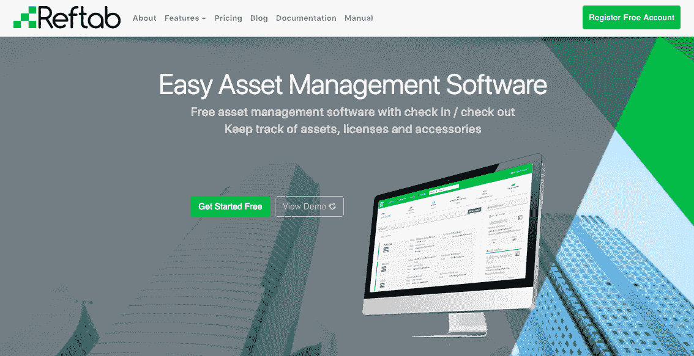
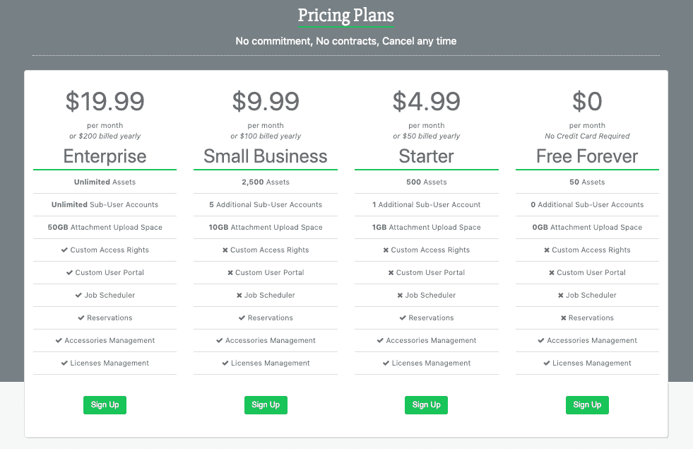

# 从沮丧到 Saas，我如何将一项艰巨的任务变成一项业务

> 原文：<https://www.indiehackers.com/interview/from-frustration-to-saas-how-i-turned-a-tough-task-into-a-business-7e622d515c>

## 你好！你的背景是什么，你在做什么？

你好！我是迈克尔·卡斯洛维茨(Michael Caslowitz)，我是 Reftab 的联合创始人，该公司提供资产管理软件，帮助公司跟踪他们拥有的设备。我们主要面向 IT 行业。我们的客户跟踪员工或学生分配或借给他们的设备，如笔记本电脑、平板电脑、键盘、软件等。

我的职业是 IT 系统管理员，我的联合创始人罗伯特的背景是软件开发。自从我们在中学认识以来，我们一直在研究技术，所以我们决定一起在 SaaS 开一家公司。我们花了很多时间真正专注于我们的产品，并在 2017 年初获得了市场的牵引力。

我们现在发展得相当快，每月收入约为 3000 美元，并且逐月增长。

 

## 是什么促使你开始使用 Reftab？

在我职业生涯的早期，我在一家 IT 托管服务提供商(MSP)工作。我全职驻扎在客户现场，我的部分职责是跟踪 IT 设备。

设备不断来来往往，不断被借出和订购。我很难把事情安排得井井有条，并确保我能准确计算出谁有什么东西，是什么型号，保修期什么时候到期，物品的价格，什么时候该退货，等等。

就在这个时候，罗伯特和我已经在讨论建立一个软件平台。Reftab 实际上不是我们的第一个想法，我们已经开始构建一个与 reddit 非常相似的应用程序，但用于本地新闻报道。在我告诉罗伯特我在跟踪设备方面遇到的挫折后，我们放弃了这个想法，并做了尽职调查，以找出当前市场格局中存在的解决方案。我们看到的所有东西要么太贵，要么功能太多，太复杂，不适合。

接下来，我们花了一些时间来建立一个 MVP。我认识纽约市的其他 IT 管理员，所以当我们的第一个版本完成后，我请他们试用并给我们一些反馈和评论。我们收到了非常积极的反馈，我们认为这验证了我们的想法，所以我们花了一些时间来建立一个桌面网站和 iOS 和 Android 的移动应用程序。我们在 2015 年末上线。我们都不需要投入任何资金来构建产品，因为我们都有所需的技术技能。这也让我们能够保住我们的日常工作。

## 构建最初的产品需要什么？

罗伯特和我都在晚上和周末做最初的产品。我们花了一段时间才到达这样一个地方，我们觉得这个产品足够坚实，可以满足 It 组织的需求，主要是因为有太多的人带着我们没有预料到的、最初没有计划到的不同用例来找我们。

随着我们不断发布功能，我们获得了一些优秀的付费客户，他们为功能提供了输入和反馈，并帮助我们保持正轨。我们还致力于尽可能实现自动化，比如计费和允许用户批量导入和导出数据。

我认为真正阻碍我们的是我们开始在 Backbone 中构建平台的事实。并且不得不使用 Vue JS 重构整个站点。这是一种痛苦，但最终会变得更好，因为 Vue JS 要容易得多。不过，这是有代价的——我们在大约六个月的时间里没有发布任何新功能。另外，在此期间，我们没有做任何广告。

## 你们是如何吸引用户，壮大 Reftab 的？

当 Reftab 推出时，使用该产品的只有我在 IT 行业直接认识的人。我们也没有钱做广告。有鉴于此，我们决定尽最大努力让这个平台变得安全和简单易用。我们研究了竞争对手的软件，并花了大量时间思考我们如何提供相同的功能，但使用起来非常简单，而且没有范围限制。在这方面，我们已经做得非常出色。我们有很多使用过其他软件的客户找到我们，说他们非常喜欢 Reftab 能够捕捉到的简单性。这绝对是我们最自豪的成就之一。

此外，由于周到的用户体验，该产品获得了大量好评，帮助我们吸引了更多客户，随着人们开始在我们的网站上花费更多时间，这也增加了我们的 SEO。

虽然专注于打造最好的产品是很好的，但是如果你不能在客户面前得到它，它就一文不值。

TweetShare

我们肯定有一种“如果你建造了它，他们就会来”的心态。回想起来，我可能应该花更多的时间在拓展上。我在 reddit 和其他地方发布了一些对论坛帖子的回应，这为我们带来了一些付费客户。由于 Reftab 是一个 SPA，我们发现 Google 没有正确地抓取我们的网站，这是一个重大的打击，但我们解决了这个问题。随着更多功能的添加和我们的登录页面的一些修复(添加子页面，修复我们的网址，添加更多的内容，并确保关键字是准确的)，我们注意到我们的有机 SEO 开始起飞。

从那时起，我们开始看到比以往更多的每日注册，但罗伯特和我仍然全职工作。我们能够处理增长、功能请求、产品问题以及随之而来的问题，但我仍然没有留出太多时间进行拓展，这意味着我们的增长没有我希望的那么快。

大约一年后，我们终于有了足够的月收入，可以开始在 Google AdWords 上花钱了。这是巨大的。由于我们的搜索引擎优化表现更好，更有能力站在搜索我们产品的人的前面，我们在付费客户方面经历了一次大的飞跃。

我认为罗伯特和我最擅长的是打造优秀的产品，而且我们在客户支持方面非常出色。但我们的增长一直很缓慢，因为我们没有进行必要的拓展。我对未来保持乐观，因为 2018 年令人惊叹，我们的增长丝毫没有放缓。我们每个月都有成千上万的新用户访问我们的网站，我们的有机流量不断上升，并不断击败我们的付费流量。

如果你正在 B2B 领域打造一款 SaaS 产品，花同样多的时间在产品上，比如营销和广告。我现在意识到，有些活动我可能应该参加，有些论坛和帖子我应该回应，但我没有回应，因为我不认为我们的客户会在那里。那是个错误。在这样做了几年之后，我们有了来自许多不同业务部门的付费客户，他们有许多不同的使用案例，这是我从来没有想到过的——以任何可能的方式宣传这一点至关重要，因为你永远不知道谁可能是客户。

## 你的商业模式是什么，你是如何增加收入的？

我们的客户通常会经历爬行-行走-运行的商业模式。他们通过谷歌搜索找到我们的产品。我们提供几种不同的定价方案。每个客户都是从免费计划开始的，这限制了他们使用付费功能。如果他们使用付费功能，他们可以选择自动升级到我们企业计划的两周免费试用。一旦他们对这个平台有了感觉，他们就会选择一个适合自己的方案，并开始付费。

我们现在每月挣 3000 美元，而且还在逐月增长。我们每个月都有 25000 名新的独立用户，而且这个数字还在逐月增长。我们花了很长时间才走到这一步。我在 B2B 领域发现，客户知道他们想要什么。他们正在寻找使他们的工作更容易的特定功能。这种认识推动了我们的产品开发，添加正确的功能使我们能够发展壮大，并为我们的服务收取更多费用。我们使用 Stripe 进行支付，除了托管费和谷歌关键词规划器，这是我们唯一的开销。

 

## 你未来的目标是什么？

我们未来的目标是做更多的广告，继续开发具有更多功能的产品，并使我们自己成为最容易使用的资产管理软件。没有我们不能处理的技术特征或范围，这允许我们节省非常多的钱。我预见，随着我们加大营销力度，找到正确的广告方式将是一个挑战。

## 你面临的最大挑战和克服的障碍是什么？如果你必须重新开始，你会做什么不同的事？

我们遇到了两个阻碍我们前进的障碍。一个是我们不得不重建我们的整个前端，在这段时间里，我们应该增加我们的功能。必须这么做，但是很痛。同样，我们没有花足够的时间去展示自己。我们应该做更多的广告，或者通过这样的采访，或者联系出版商，寻找论坛帖子等等。

有很多人不知道他们有一个问题，直到一个解决方案提供给他们。

TweetShare

我曾经回避跟进，因为我不想惹恼别人，这是一个巨大的错误。日复一日，我们有如此多的新用户想使用我们的产品。我总是发欢迎邮件，但我从来没有跟进！我有一份长长的线索清单，但我没有让它为我所用。现在情况不再是这样了。现在，我们已经建立了一个自动系统，向一段时间后仍未激活的注册用户发送电子邮件，我将跟踪该系统以评估其性能。

我们早就应该在营销上花更多的时间。虽然专注于打造最好的产品是很好的，但是如果你不能在客户面前得到它，它就一文不值。有很多人不知道他们有一个问题，直到一个解决方案提供给他们。

## 对于刚刚起步的独立黑客，你有什么建议？

如果你足够幸运，有技术背景可以让你做一些东西，那就去做吧。

不要回避线索和跟进。如果你能提供一些有价值的东西，坚持不懈，把它拿出来。人们想知道能为他们节省时间和/或金钱的事情。

## 我们可以去哪里了解更多？

你可以在 reftab.com 的 T2 检验我们的产品。

如果任何人有任何问题，请在下面提问，我会回复。谢谢大家！

——[<picture id="ember8061756" class="user-avatar ember-view user-link__avatar"></picture>迈克尔·卡斯洛维茨](/mcas?id=CcEUz5bBBJaZn4v3GniZ10whSgV2)，Reftab 创始人

## 想像 Reftab 一样建立自己的事业？

你应该加入[独立黑客社区](/)！🤗

我们是几千名创始人，互相帮助建立有利可图的业务和副业。来分享你正在做的事情，并从你的同事那里获得反馈。

还没准备好开始使用你的产品吗？没问题。这个社区是一个认识人、学习和实践的好地方。随意[随便浏览](/)！

——[<picture id="ember8061761" class="user-avatar ember-view user-link__avatar"></picture>考特兰艾伦](/csallen?id=ibTLPyjwVebnZjMGKvz6ztarnuV2)，独立黑客创始人

24votes