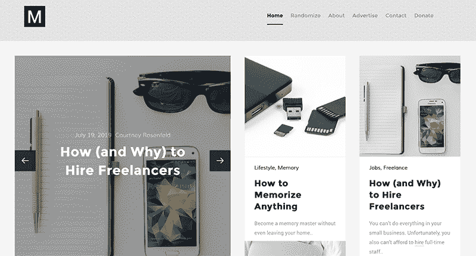
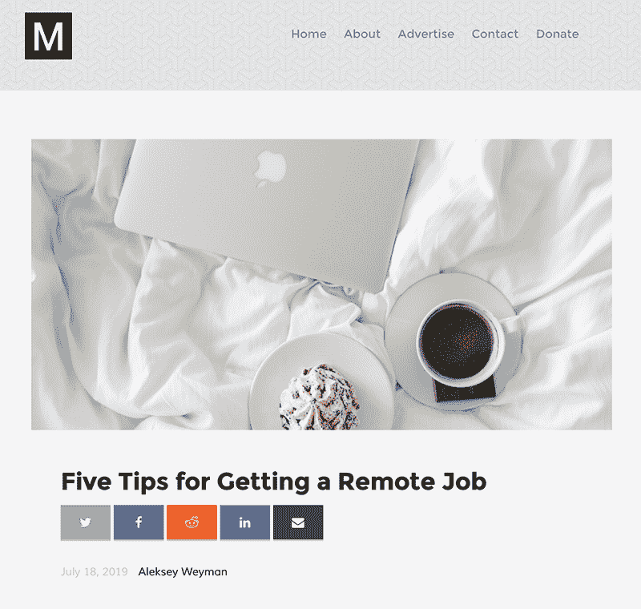
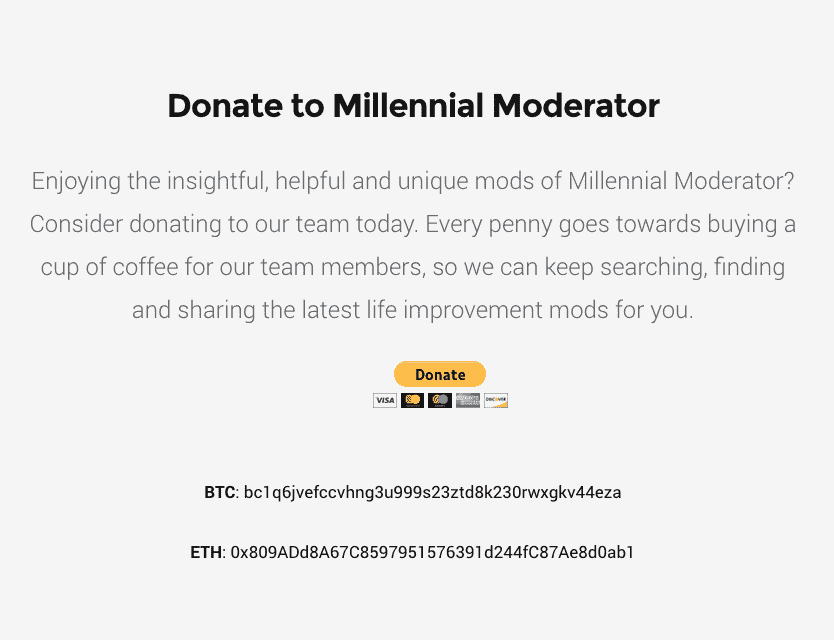

# 从爱好产品到 3，000 用户/月

> 原文：<https://www.indiehackers.com/interview/from-hobby-product-to-3-000-users-month-dc3fba1053>

## 你好！你的背景是什么，你在做什么？

嗨，我是阿列克谢·韦曼。我是[千禧主持人](https://millennialmoderator.com/)的创始人兼编辑。我的背景是云计算和创意产业，我是一名 T2 音乐人和唱片公司经理。更多信息可以在我的[文件夹](https://alekseyweyman.com/)中找到。

千禧主持人是一个在线出版物，寻找和分享关于新兴主题和想法的信息知识(我们称之为“Mods”)，这些主题和想法正在变革各自的行业。我们的使命是成为读者实用技巧的宝库，帮助他们改善生活的各个方面，并向他们展示他们可能不知道但应该知道的事情。千禧主持人不是一份在线报纸，而是一份在商业、技术和生活方式等领域提高生活质量的实用技巧和方法指南。

现在我们每周发布三个 Mods，所有这些都可以在我们的主页[millennialmoderator.com](https://millennialmoderator.com/)上看到。我们还在我们的社交媒体和邮件列表上发布提示和有趣的内容。我们平均每月有大约 3000 名读者，每月收入约 500 美元。

 

## 是什么激励你开始做千禧一代的版主？

我最初对网络开发感兴趣，这让我学会了如何从零开始建立一个网站。我也对新兴技术如何颠覆整个行业非常感兴趣。将这些兴趣与我在华盛顿大学获得的技术创新管理学士学位结合起来，科技/新闻博客成为我将兴趣转化为生产力的明显途径。我也一直认为自己是一个有创造力的人，所以我会抓住一切机会去创造一些很棒的东西。

因为千禧主持人是从一个爱好项目开始的，所以我不需要验证这个概念。在文章发表的前几个月，我只是在测试如何使用 CDN，创建社交媒体共享链接，在多种设备上格式化页面等。当我开始与我的朋友分享一些 mod 时，我意识到人们对千禧一代的主持人所说的话有真正的兴趣。我创建了社交媒体页面作为内容的扩展，以及一个邮件列表，在那里我可以直接发送最新的 mod 供人们阅读。很快，人们开始在自己的网络上分享帖子，直到今天，这还在继续带来新的流量。

你绝对需要在网上随处可见，但只需要一些可靠的流量渠道就能让博客繁荣起来。

TweetShare

## 构建最初的产品需要什么？

千禧一代主持人的最大资源是时间。由于我在 web 开发方面几乎没有技术专长，我花了数百个小时在网上学习课程，并在 Github、Stack Overflow 甚至 Reddit 这样的社区中尝试，向他人学习并提出问题。我想说，花了大约一个月的时间来建立一个像样的 MVP，然后又花了六个月的时间，博客才真正在布局、设计和搜索引擎优化方面赢得了自己的角色。大约在六个月的时候，我也开始理解 MM 对读者的价值，从那以后整个游戏都变了。

作为一个有创造力的人，我是一个有点夜猫子的人，所以很多千禧一代主持人的婴儿期都是在我白天工作后的深夜培育的。最初，建造 MM 的渴望来自于一种类似的创造性兴奋，就像一个音乐家自由地表达他们的想法，或者一个漫画家自己大笑。那种创造的渴望仍然存在；然而，它已经从技术设计转移到向人们展示他们能够并且应该知道的所有这些伟大事物的兴奋。就像把你的名字刻在微芯片上，然后在 2020 年和美国国家航空航天局一起被送往火星。或者从美国国税局获得 2500 美元的税收抵免来帮助抵消教育费用。或者一些聪明的[谷歌复活节彩蛋](https://millennialmoderator.com/5-clever-google-search-easter-eggs)，你可以在休息时间玩玩。人们应该知道有这么多有用的东西存在——我们千禧主持人的使命是成为这类信息的宝库。

 

## 你们是如何吸引用户，成长为千禧一代版主的？

在我们达到六个月的里程碑并将我们的重点从平台转移到我们的读者后，我们很快意识到我们需要找到一种持续吸引读者的方法。我以前从未发展过博客，我花了大部分时间研究从其他成功的博客作者那里获得有机流量的方法和策略。SEO 变得越来越重要，但就 Mods 本身而言，拥有高质量内容也变得越来越重要。我们开始在社交媒体上实施各种赠品和竞赛，包括关注我们的账户，或者注册我们的邮件列表以换取免费的电子书或类似的东西。我们还拓展到其他社交平台进行曝光，如 [Pinterest](https://www.pinterest.com/millennialmoderator/) 和 [Medium](https://medium.com/millennial-moderator) ，这两个平台我们一直沿用至今。随着我们继续在营销计划中增加第三方账户和一致的发布周期，我们开始看到每月读者的增加。

| 月 | 读者 |
| --- | --- |
| 18 年 12 月 | 100 |
| 19 年 1 月 | 300 |
| 19 年 2 月 | 1000 |
| 19 年 3 月 | 1800 |
| 19 年 4 月 | 2200 |
| 19 年 5 月 | 2600 |
| 19 年 6 月 | 3000 |

我们为网站吸引流量的一些最有效的方法是我们的[邮件列表](http://bit.ly/MM_NEWSLETTER)和社交媒体推荐，其中我们使用 [Hootsuite](https://hootsuite.com/) 和 [Sprout Social](https://sproutsocial.com/) 等平台将有机参与(评论人们的帖子)与自动化内容相结合。然而，它需要一些调整，以找到正确的时间表周期和频率。我们使用谷歌分析来跟踪我们所有的流量，通过使用一段时间内的信息，我们已经能够确定发布的最佳时间。我们还使用[热图](https://heatmap.com)，它可以让你看到网页的哪些部分获得了最多的物理参与——触摸以突出显示文本、点击广告、向下滑动页面等。

我们很快发现，一些社交媒体网站几乎没有任何点击流量，尽管该账户获得了大量的喜欢/追随者。其中之一就是 Twitter。我们看到人们喜欢我们的推文，但从来没有点击链接去文章本身。经过一些研究，我们发现点击一条推文中的外国网址对我们的读者来说显然是一个很高的进入门槛(不能责怪他们)，所以我们建立了定制的 [Twitter 卡](https://millennialmoderator.com/improve-seo-with-twitter-cards)，它将我们在 Twitter 上的所有网址都变成了可点击的图像。

在那之后，我们的 Twitter 推荐流量增加了 10 倍。这恰恰说明了降低进入壁垒的重要性，以及区分你的营销渠道的必要性；Twitter 约占我们推荐流量的 30%。

我对任何试图吸引用户的人的建议是，首先通过尽可能多的渠道推广你的内容，然后评估哪些渠道是最有效的，并加倍努力使用这些渠道。优化你的内容，使其在谷歌搜索结果中排名靠前也很重要。你绝对需要在网上随处可见，但只需要一些可靠的流量渠道就能让博客繁荣起来。三大社交媒体平台(脸书、推特、Instagram)是必须的；但是我也建议试试像 Medium 和 LinkedIn 这样的网站，尤其是如果你的产品或服务是基于写作的。

## 你的商业模式是什么，你是如何增加收入的？

千禧一代版主通过三种方式赚钱:

1.  附属网络和横幅广告。我将它们归类在一起，因为它们涉及一定程度的自主参与——读者会看到一个广告单元，他们会根据自己的兴趣程度选择是否点击它。这种收入模式的唯一设计是选择相关的广告内容展示给读者。还有广告单元的位置，虽然我们真的不喜欢让我们的广告太打扰人。有成吨的附属网络可供选择，但我发现 [AWIN](http://www.awin1.com/awclick.php?gid=171448&mid=4032&awinaffid=565991&linkid=362688&clickref=) 是最容易和最值得使用的。

2.  **联盟营销。**这与[中的加盟网络有几个方面的不同](https://millennialmoderator.com/whats-the-difference-between-affiliate-programs-and-networks)。最大的区别是，联盟营销是通过与特定的商业实体的协议决定的。它需要与企业建立个人联系，这使得它在前期更加乏味，但具有更大的长期潜力，并提供更有利可图的商业模式。根据我们合作的业务类型，我们可能会撰写产品评论或简单地在相关模块中提及他们的产品，然后将读者引向他们可以了解更多信息的业务登录页面。对于那些试图为自己的网站带来更多流量/销售线索的小企业和初创公司来说，这是一个绝佳的机会，而且[我们始终欢迎](https://millennialmoderator.com/advertise)与新企业合作，帮助他们获取销售线索并最终提高销售额。然而，我们对业务合作伙伴的质量要求确实很高。毕竟，我们的首要目标是我们的读者，我们只想向他们展示最好的内容。

3.  **捐款。**我们非常幸运地拥有一个非常支持我们的社区，这个社区发现了我们所做的事情的价值。我们的[捐赠页面](https://millennialmoderator.com/donate)通过 PayPal 接受所有捐赠。有趣的故事:我最近在千禧主持人上实现了一个 BTC/联邦理工学院捐赠地址，作为一种额外的捐赠方式，在它活跃的短时间内，我们已经收集了与 2019 年初捐赠页面成立以来相同数量的 BTC 捐赠。我想跟上时代是值得的！

 

值得庆幸的是，像 AWIN 这样的平台为联盟广告网络处理所有的支付处理。B2B 代销商交易只需开具发票并付款，但最方便的方式是(PayPay、Square、Wire 等)。)对双方来说；然而，我认为值得一提的是，有一种非常简单的方法可以让人们在他们的网站上以一种非侵入性的方式收款。我不会在这里进入太多的细节，但它使用了条纹和 Checkoutpage.co 之间的集成。我们实际上写了一个关于如何设置的详细的 Mod，你可以在这里阅读。

我给创业者的建议是:不要自欺欺人。如果某件事不起作用，你知道它不起作用，不要试图找借口来证明为什么让它继续发生是没问题的。这只会带来更多的问题。你越早机智地解决问题，你就能越早进入下一步。当我第一次建立我的博客时，我决定在网站上保留一些有限的功能，因为我不知道(通过编程)如何改变它们。我告诉自己，这些功能对整个博客体验来说并不重要，但我知道在内心深处它们是重要的；最终人们开始要求我修复它，因为它影响了他们在网站上的体验。很难说我失去了多少潜在的读者，因为当这种担忧第一次出现时，我没能解决它。

## 你未来的目标是什么？

千禧一代的主持人有很多雄心勃勃的目标，我们几乎每天都要审查它们，以确保我们在正轨上。到 2019 年底，我们希望每月产生 5，000 名有机访客，每月获得 1，000 美元的收入，拥有一名在职营销总监，使用定制的 CMS，并拥有一支由 15 名以上作家组成的待命团队。我们的愿景还包括赞助社区活动和推出新产品/服务，为读者提供持续的货币价值。我现在不能说太多，但是你可以加入我们的[邮件列表](http://bit.ly/MM_NEWSLETTER)成为第一个知道的人！

现在我们最大的障碍是有一个合适的 CMS 来添加出版物和更新网站；目前，所有这些都是手动完成的。虽然从技术上来说，我不会称之为路障，但更多的是我们成为实践知识宝库的旅程中的一个必要关卡。

如果某件事不起作用，你知道它不起作用，不要试图找借口来证明为什么让它继续发生是没问题的。

TweetShare

## 你面临的最大挑战和克服的障碍是什么？如果你必须重新开始，你会做什么不同的事？

在千禧主持人的创建阶段犯了很多错误，主要是因为我是从头开始构建它的。大量糟糕的格式决策、写作质量/作者不一定会增加 MM 的价值，甚至我手工编写博客的事实可能是个坏主意，因为我们现在正在考虑迁移到 CMS 的复杂性。

就经验教训而言，最有价值的(几乎适用于任何类型的项目)是尽可能地保持领先。对于千禧一代的主持人来说，这意味着在出版前提前几天写好 Mods，以及提前几天安排社交媒体内容。技术给了我们提前完成期限和协议的工具，在千禧主持人为我们的目标而奋斗就是一个很好的提醒。

## 有没有发现什么特别有帮助或者有优势的？

除了是一个有创造力的人，我还是一个理想主义者，还有点浪漫。所以我确实花了很多时间思考千禧一代的主持人打算为这个世界做些什么。我一直觉得詹姆斯·艾伦的《作为一个人思考 的书 *[有助于重新认识我们为什么在做我们正在做的事情。当我采取这种心态，考虑更大的图景时，暂时的障碍和路障就变得微不足道了。](https://amzn.to/2SzNA2M)*

正如我之前提到的，时间管理是一个需要完善的重要习惯；尤其是当你参与了几个项目的时候。在过去的几年里，我实际上已经为自己创建了一个项目管理工具，并且正在把它变成一个有形的服务，供其他人使用。还没有宣布日期，但我会很快通过我的个人[邮件列表](http://bit.ly/AW_NEWSLETTER)分享相关信息。

## 对于刚刚起步的独立黑客，你有什么建议？

对于任何刚开始创业的人来说，我最大的建议是，即使你没有立即看到价值，也要让自己处于学习新东西的位置。我经常强迫自己去参加商务会议和聚会，与业内其他人交谈，了解他们做什么和如何做。即使读了这篇关于独立黑客的文章，我也要说，你已经是获得成为真正的行业领导者所必需的知识和技能的人中的一员了。永远不要放弃对知识的渴望。

## 我们可以去哪里了解更多？

你可以访问[millennialmoderator.com](https://millennialmoderator.com/)查看我们最新的 Mods，也可以加入我们的[邮件列表](http://bit.ly/MM_NEWSLETTER)在其他人之前获得最新消息。我们还会不定期地分发资料，分享除我们自己以外的其他来源的知识——这对普通读者和企业家都有很大的价值。

你可以在 [Twitter](https://twitter.com/alekseyweyman) 和 [LinkedIn](https://www.linkedin.com/in/alekseyweyman/) 上与我本人联系，也可以加入我的个人[邮件列表](http://bit.ly/AW_NEWSLETTER)，在那里我向投资者分享项目更新和私人的每周视频。

那就有点千禧一代版主了！我已经说了很多，现在我很想听听你们有什么问题或意见。我们都可以互相学习，所以请说吧。

—[<picture id="ember7999400" class="user-avatar ember-view user-link__avatar"></picture>阿列克谢(Aleks)韦曼](/alekseyweyman?id=WeVO4ONbVHRZj7ex6iCiWaErxVA2)，千禧主持人创始人

## 想像千禧一代版主一样建立自己的事业？

你应该加入[独立黑客社区](/)！🤗

我们是几千名创始人，互相帮助建立有利可图的业务和副业。来分享你正在做的事情，并从你的同事那里获得反馈。

还没准备好开始使用你的产品吗？没问题。这个社区是一个认识人、学习和实践的好地方。随意[随便浏览](/)！

—[<picture id="ember7999405" class="user-avatar ember-view user-link__avatar"></picture>考特兰艾伦](/csallen?id=ibTLPyjwVebnZjMGKvz6ztarnuV2)，独立黑客创始人

20votes