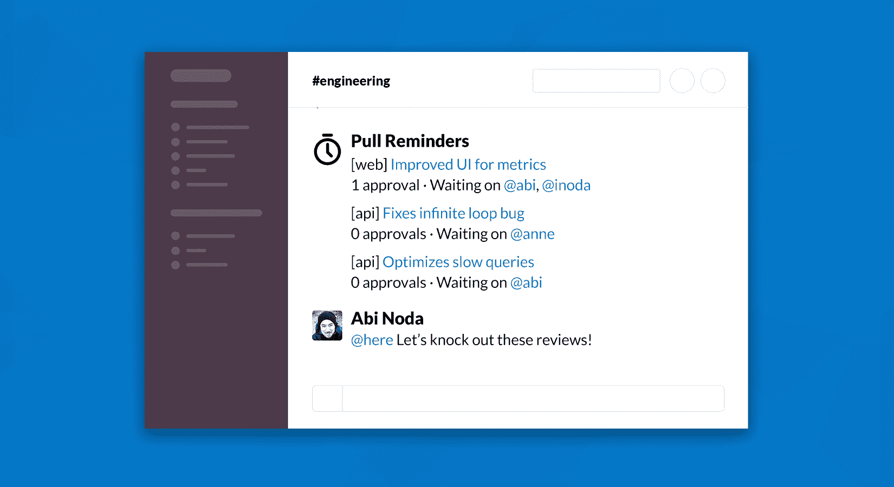
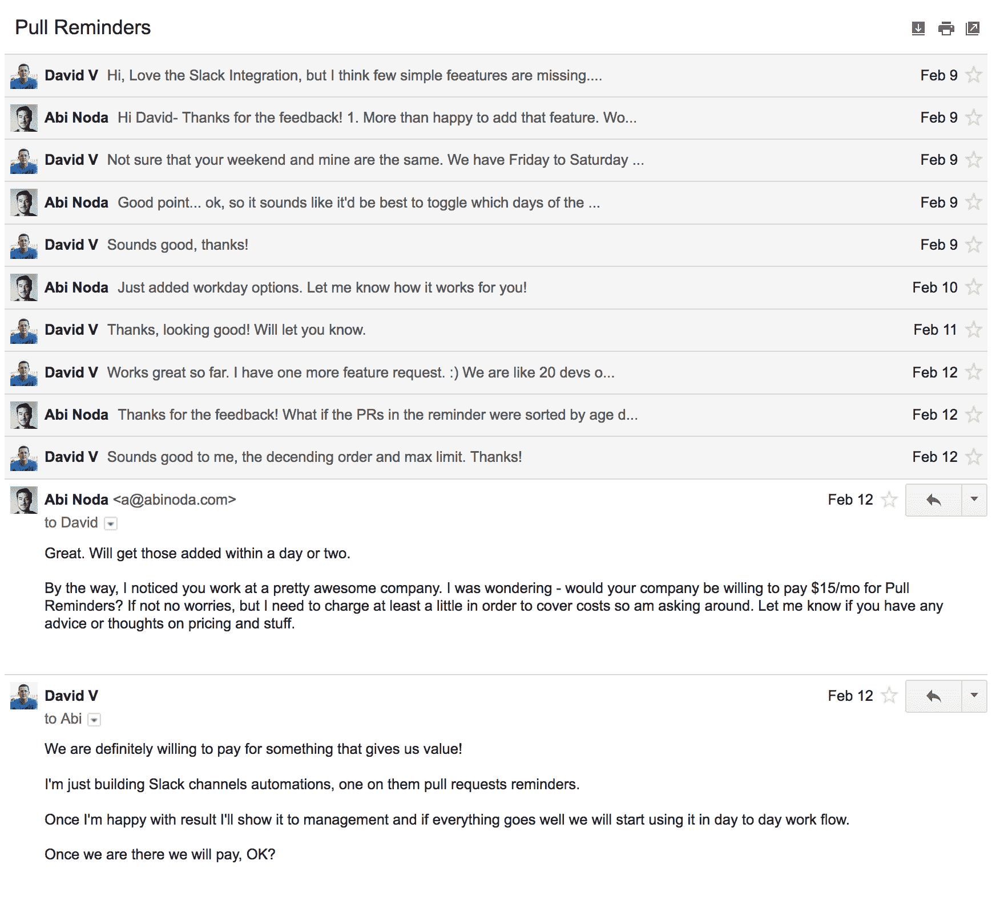

# 从创意到 GitHub 市场和 Slack 上的盈利业务

> 原文：<https://www.indiehackers.com/interview/from-idea-to-profitable-business-on-the-github-marketplace-and-slack-a6ef7d420a>

## 你好！你的背景是什么，你在做什么？

我是芝加哥的一名 27 岁的开发人员。

我在编程和商业方面的第一次经历是在中学。我自学了如何编码，这样我就可以为我的反恐精英团队建立一个网站。我通过在互联网论坛上推销[改装的 nerf 枪](http://nerfhaven.com/mods/)了解销售情况。一位心怀不满的买家甚至教我如何进行客户支持，当他的货物延误时，他会向我的父母告发我。

我在高中时就爱上了网页设计，并在过去的 10 年里从事过不同的全职工作，从 UX 设计到管理企业软件团队。我一直梦想为自己工作，所以当我在 12 月份离开上一份工作时，我决定花些时间尝试推出我的几个产品创意。

我在一月底发布了第一个版本的[拉提醒](https://pullreminders.com)，在过去的六个月里我一直在引导它。

拉提醒帮助开发团队掌握拉请求，并改进他们的代码审查过程。使用拉式提醒，您可以在空闲通道中设置提醒，让每个人都直接收到关于他们所分配的代码评审的消息。

Pull Reminders 还提供了像 pull request size、代码评审周转时间和完成的评审数量这样的度量——这些帮助您识别贡献者并改进您团队的过程。

Pull Reminders 目前的月收入不到 4000 美元，自 4 月份全面推出以来，每月增长约 1000 美元 MRR。包括 Pivotal、Instacart、WeWork 和 Trivago 在内的 400 多家公司都在使用 Pull Reminders。

 

## 是什么促使你开始使用拉动式提醒？

我在担任工程经理的上一份工作中获得了[拉动式提醒](https://pullreminders.com)的灵感。我们有一个非常标准的代码审查流程，我们会打开拉请求并在 Slack 中共享它们。

我记得有一次我问我团队中的一名工程师，一个已经过时几天的拉请求是怎么回事。他告诉我，他已经多次要求某人进行代码审查，并且已经厌倦了唠叨。

我们的团队完成代码审查的速度很慢，所以我会亲自跟进拉取请求，并通知需要采取行动的人。我讨厌以这种方式花费我的时间，但这确实帮助了团队，因为否则拉取请求将会拖延，需要更长的时间来发布。

当我去年 12 月离开那份工作时，我无法摆脱打造一个工具来自动化我一直在做的事情的想法。我也很犹豫，因为我不确定是否还有人想用它。我的副业墓地已经够大了。

我通过做更多的研究克服了这种恐惧。我问“芝加哥 CTO”Slack 小组中的一些同事，他们是否有拖拉拉取请求的问题，一些人回答说。

我还寻找了现有的解决方案，在 GitHub 上找到了一堆与我的想法类似的“拉取请求提醒”项目。这向我证明了这并不是一个不寻常的问题。

尽管如此，我对能够从中赚钱几乎没有任何期望。我计划让人们免费使用我的工具，作为我想开发的另一个产品的营销策略。当 Pull Reminders 推出时，它没有定价页面或支付表单。

## 构建最初的产品需要什么？

我在一月初开始构建[拉提醒](https://pullreminders.com)，并在几周内使用 Ruby on Rails 构建了第一个版本。我认为没有什么比 Rails 更适合发布和迭代新产品了。Rails 的目标是成为“小团队做大事的框架”，所以当你只是一个人的时候，它非常适合。

此时，我已经承诺用今年剩下的时间尝试创业。我的计划是通过寻找兼职合同工作为自己创造一个很长的跑道。然而，从一份稳定的高薪工作到合同工是一个可怕的转变，我对此感到紧张。

当我在构建拉动式提醒时，我必须不断寻找保持动力的方法，因为我的理性告诉我这个项目会失败。我告诉自己的一件事是，发送拉动式提醒就像是为未来的漫长旅程热身，无论它可能会导致什么。

从功能的角度来看，拉式提醒的第一个版本相对简单。用户可以将 Pull Reminders bot 添加到他们的 Slack 工作区，授权访问他们的 GitHub 存储库，然后指定 Pull 请求提醒的频率和 Slack 通道。这个功能非常难以构建，因为我必须集成 GitHub 和 Slack API，然后在其上构建一个接口。

## 你是如何吸引用户并发展拉动式提醒的？

正如我前面提到的，当我在一月底开始使用[拉动式提醒](https://pullreminders.com)时，我并没有期望赚钱。我没有定价页面或付款表格。

在 [Slack 应用目录](https://slack.com/apps/A8MBPB34N-pull-reminders-for-github)中发布该应用后，我开始获得少量注册。我给每个注册的用户发了邮件，询问他们是谁，他们希望从拉式提醒中得到什么。一些早期用户来自大公司，我可以说他们很重视我的产品，因为他们要求很多改变。

我根据他们的反馈不断做出改变，直到他们满意为止。然后我问他们愿不愿意出钱。我认为我有大约 30%的成功机会，但是它成功了。第一批夫妇付费客户的登陆(发生在三月初)真的让我大吃一惊。我突然意识到拉动式提醒可以成为一项真正的业务。

 

我真的很幸运，因为到目前为止，我还不需要自己做市场营销。Slack 应用目录给了我一个稳定的注册流，转化得相当好。

4 月 1 日，我能够在 [GitHub Marketplace](https://twitter.com/abi/status/981597361230184448) 上发布拉取提醒。这感觉像是一个重要的时刻，但它需要大量的工作，我不知道结果会是什么。谢天谢地，这给了我一个很好的提升，加速了我的成长。

我认为企业是三个乘数的总和:创造有价值的产品，接触你的受众，以及销售。

TweetShare

我认为 Slack 和 GitHub 这样的市场非常有效地将你的产品展示在人们面前，并帮助你建立最初的吸引力。我将在下一节分享一些具体的数字，但我在 Slack 和 GitHub 上的流量已经带来了持续而有意义的增长。

也就是说，市场的缺点是没有办法增加你的流量，因为你不能控制市场。我现在正处于增长停滞的阶段，所以我需要找到其他方式来刺激它。

## 你的商业模式是什么，你是如何增加收入的？

[拉催](https://pullreminders.com)是 SaaS 的一项业务。我通过预先设定的 10 美元/月、49 美元/月、99 美元/月等价格计划，向公司收取每个开发人员每月 2 美元的费用。对我来说，定价仍然是一项正在进行的工作，但我喜欢证明每个开发人员每月 2 美元是合理的，因为这对每个开发人员来说还不到一杯咖啡，我认为拉式提醒比咖啡更能提高您的工作效率。

我通过 Stripe 和 GitHub 给客户开账单。GitHub Marketplace 允许人们用他们现有的支付方式购买 GitHub 账户的提醒。

这对我来说很好，因为这意味着人们不必拿出信用卡，这使得购买变得容易得多(尽管 GitHub 确实收取 25%的佣金)。最近，我一直在尝试让更多的注册用户通过 GitHub 付费(而不是只让最初注册的用户付费)，看看这是否会对我的转化率产生重大影响。

现在我每个月的收入不到 4000 美元。就完整的时间线而言，我的收入在 1 月底为 0 美元/月，2 月为 0 美元/月，3 月为 158 美元/月，4 月为 774 美元/月，5 月为 1，508 美元/月，6 月为 2，752 美元/月，本月迄今为 3，450 美元。

如果你能接触到很多人并把它卖得很好，即使是一个没有什么差异化价值的产品也能成功。

TweetShare

我的大部分时间都花在了改进产品和增加新功能上。正如我前面提到的，我现在才开始把时间和精力放在营销上，众所周知，这是一项非常具有挑战性的工作。

上个月，我推出了一个推荐项目，但还没有得到任何支持。我还在试图找出原因。

首先，我试着为每位推荐人提供一包免费的美味咖啡。然后我换成了亚马逊礼品卡。现在这是一个双重激励系统，推荐者和被邀请者都可以获得亚马逊积分。

我相信接触新客户的最佳方式是通过优秀的在线内容，所以这是我现在关注的重点。我正在做一个新网站，在那里我将为有兴趣创业的开发者创建指南和工具。

这包括开源我的法律文档和为构建 Slack 应用程序提供样板代码。我认识的许多开发人员都想拥有自己的事业，他们最终可以全职工作。我希望我能在他们旅途的某个时候帮助他们。

## 你未来的目标是什么？

我没有任何具体的收入目标。只要 Pull Reminders 能赚到足够的钱让我继续全职工作，我就很开心。

我的目标是继续为工程团队构建有价值的工具，同时保持一个人的公司。

我绝对喜欢独自工作。它给了我自由和创造性的自主权，让我可以随心所欲地做事，而不用担心取悦或管理他人。它让旅程变得非常个人化，就像艺术一样。

我认为德里克·西弗斯在他的“关于”页面上说得最好:

*“没有人会因为小说家独自写作而在乎他。但是企业家、程序员或音乐家应该合作。我不同意，对我来说。我更喜欢小说家的生活，不管是写代码、音乐还是系统。”*

我也认为独自工作有一些商业优势，因为我有足够低的开销去追求大多数其他公司都懒得去做的机会。

## 你面临的最大挑战和克服的障碍是什么？如果你必须重新开始，你会做什么不同的事？

我刚说了独自工作，但是天哪，这很难吗？

作为一个单独的创始人，保持积极和有动力是很难的。我认为所有有创造力的人都会处理被拒绝或失败的恐惧。当你投入如此多的精力去创造某样东西时，把它拿出来会非常可怕。

有时候我会因为一些愚蠢的事情而沮丧。例如，如果有一周我的注册量下降了，或者我崇拜的一个客户没有购买订阅，我就开始产生消极的想法。这是一件非常愚蠢的事情，因为我的业务增长良好，我感到很幸运能处于我现在的位置。

我的另一个问题是成为一个完美主义者。我很容易陷入困境，纠结于对我的业务没有实际好处的细节。我不得不阻止自己浪费时间过度重构代码或重新设计看起来足够好的东西。

我认为成为一个完美主义者真的会适得其反，因为当你开始过度检查你的工作时，你经常会把它弄得更糟。例如，当我为我的第一次书面面试起草回复时，我开始把事情弄得越来越长，越来越无聊。我让我的兄弟和我的几个朋友通过校对和告诉我停止来拯救我。

## 有没有发现什么特别有帮助或者有优势的？

我认为，把你的想法变成一个成功的企业，很大一部分是要有精神和情感上的毅力坚持下去，即使有很多理由感到气馁。

当我开始的时候，我不擅长这个，并且会被每天的起伏所影响。这些天来，我积极关注自己的心理健康，保持积极的心态。如果我发现自己情绪有点低落，我会试着休息一两天来充电。我发现，如果你专注于进入正确的心态，创造性的成功会更容易实现，也更有趣。

就学习和提高技能而言，我是一个超级书迷。我认为他们一直被低估为互联网企业家的资源，尤其是那些最终想要创业的开发者。

我的[个人网站](http://abinoda.com/)列出了我读过的一些书，还有详细的笔记。我的第一推荐是《T2》这本书。像精益创业这样的方法得到了很多关注，但我还没有遇到比这本书更好的关于建立 B2B 业务的内容。

## 对于刚刚起步的独立黑客，你有什么建议？

我的弟弟(他也是一名开发人员)最近对创业感兴趣，所以我对他的建议记忆犹新。

我认为企业是三个乘数的总和:创造有价值的产品，接触你的受众，以及销售。我称之为“倍增器”,因为如果你能接触到很多人并把它卖得很好，即使是一个没有什么差异化价值的产品也能获得成功。

独立黑客谈论很多关于“验证”，但这通常只适用于验证产品创意。我相信验证你接触和销售客户的能力和验证你的产品能解决问题一样重要。

例如，假设你为首席技术官开发了一个有价值的产品，如果有机会的话，你甚至可以做得很好。你知道在网上或网下吸引首席技术官 5 分钟的注意力，甚至有机会推销你的产品有多难吗？

我相信验证你接触和销售客户的能力和验证你的产品能解决问题一样重要。

TweetShare

当你没有先回答这样的问题就开发一个产品时，你可能会面临这样的风险:开发一个产品，然后在接触或销售给你的客户时遇到挑战，这是很多人放弃的时候。

我认为验证所有这三个部分的最好方法是，在构建产品原型之外的任何东西之前，尝试通过付费试点向客户预售。这迫使你在继续前进之前想出如何接触和销售客户。这里没有足够的空间，但我正在写一篇博文，解释我过去是如何做到这一点的。

## 我们可以去哪里了解更多？

你可以在我的[个人网站](http://abinoda.com/)上了解更多关于我的信息，该网站将很快更新其他独立黑客的文章和资源。我会在我的[推特账户](https://twitter.com/abi)上发布更多相关信息(该账户对任何想直接向我提问的人开放)。

期待在本次采访的评论区回答问题！

——[<picture id="ember5335535" class="user-avatar ember-view user-link__avatar"></picture>阿比诺达](/abinoda?id=hji2D7zzXzVlZOC6KIRqORfzhRm1)【拉熊猫】创始人

## 想像拉熊猫一样自己创业？

你应该加入[独立黑客社区](/)！🤗

我们是几千名创始人，互相帮助建立有利可图的业务和副业。来分享你正在做的事情，并从你的同事那里获得反馈。

还没准备好开始使用你的产品吗？没问题。这个社区是一个认识人、学习和实践的好地方。随意[随便浏览](/)！

—[<picture id="ember5335540" class="user-avatar ember-view user-link__avatar"></picture>考特兰艾伦](/csallen?id=ibTLPyjwVebnZjMGKvz6ztarnuV2)，独立黑客创始人

172votes