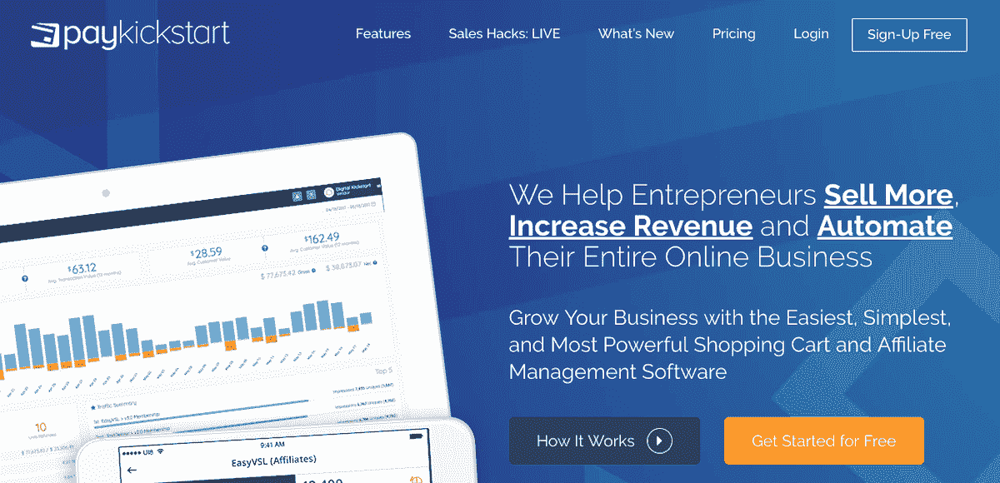
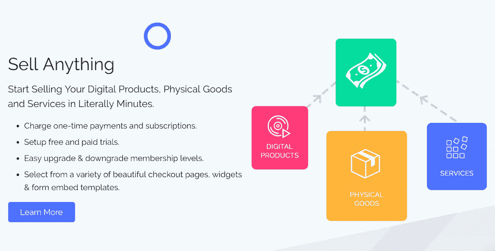
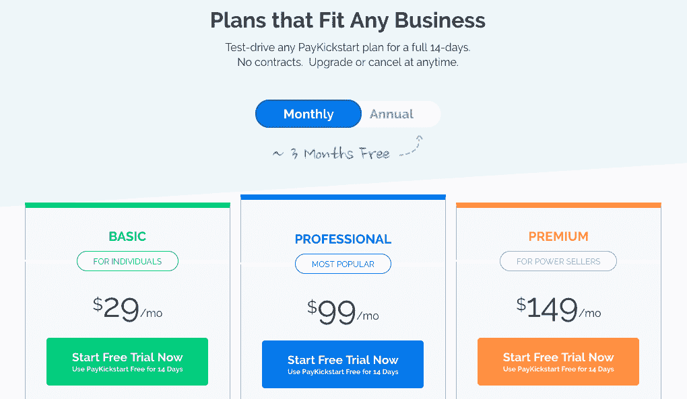

# 从内部工具到每月 8.5 万美元的 SaaS 产品

> 原文：<https://www.indiehackers.com/interview/from-internal-tool-to-85k-month-saas-product-de2f1ac422>

## 你好！你的背景是什么，你在做什么？

我叫马克·汤普森，是一名连续创业者。我创立了 Digital Kickstart，这是一家软件和信息营销公司，自 2009 年以来销售额已超过 2000 万美元。

最近，我一直在从事 [PayKickstart](https://paykickstart.com/) 的工作，这是一个帮助在线企业销售产品和服务、管理基于订阅的收入、最大化客户终身价值以及留住更多客户的平台。

在三年时间里，我们用不到 20 名员工，所有人都在一个虚拟办公室工作，将业务发展到 100 万 ARR(8.5 万美元/月)。

 

## 是什么促使你开始使用 PayKickstart？

我们创办 PayKickstart 纯粹是出于需要。我们无法找到一个合适的解决方案，既能灵活地销售各种类型的产品和服务，又能提供所需的功能，最大限度地利用我们创造的每个新客户和现有客户。

起初，我们从一个基本的内部解决方案开始——构建一个简单的 Stripe 和 PayPal 集成购物车，可以处理支付和管理简单的经常性支付。随着时间的推移，我们开始添加额外的功能，如优惠券代码管理、新的可定制结账页面模板、一键式追加销售功能等。

多年来，我们与数以千计的附属合作伙伴合作，帮助推动我们各种优惠的流量。在早期，我们开始使用 Infusionsoft 来管理分支机构及其推荐佣金。虽然这是一个巨大的学习曲线，解决方案并不完美，但我们知道这是在幕后建立我们自己的内部代销商管理系统的垫脚石。

在内部使用该平台大约一年后，我们有了一个全功能的购物车和代销商管理解决方案！幸运的是，系统做了我们想让它做的一切。仅仅一年后，开发成本就在交易处理费用中收回了，这笔费用是通过放弃我们正在使用的另一个购物车而节省下来的。

我们还很快意识到，通过使用一键式功能，我们的销售漏斗中的追加销售平均转化率增加了 30%。我们对旧购物车和新购物车进行了简单的 A/B 对比测试(流量几乎相同),发现新购物车多产生了约 12.1 万美元的收入。

在那之后，我们开始在我们的结账页面上添加订单-在他们的初始订单上添加额外的产品。结果，我们的收入迅速增加了 40%，61%的顾客在结账时增加了订单。

为短期和长期做好准备，但不要害怕转向。

TweetShare

我们业务中的一个明显漏洞是，我们没有办法从订阅客户那里收回失败或拖欠的款项，这成为了一个巨大的利润漏洞。我跳进我的 Stripe 账户，把过去三年失败的 18119 笔交易加起来，总共损失了超过 90 万美元的收入。我的胃下降了。

这一发现对我打击很大。仅仅因为我们以前的购物车无法与现有客户沟通，告知他们付款失败，他们需要更新他们的付款方式，就损失了近 100 万美元的收入。可以想象，在我们的内部购物车中添加一个催款管理功能成了重中之重，仅在第一年就为我们节省了数万美元。

我们慢慢开始发现并修复那些让我们损失了数百万美元收入的错误。我们当时没有意识到的是，无数其他企业家和企业正在犯同样的错误，需要同样的解决方案。

这个缓慢滚动的雪球是后来成为“薪酬启动”的早期阶段。

## 构建最初的产品需要什么？

令人惊讶的是，在其他 SaaS 公司、信息营销人员和教练开始看到我们正在做的事情后，这个消息传播得如此之快。

在我们知道之前，我们每周都有几十个人就这个项目联系我们，想知道我们如何节省交易费用，提高转化率，增加每个客户的价值。他们用力敲门，这变成了我们的“啊哈”时刻，我们知道我们需要把我们的解决方案提高到一个新的水平。其他在线企业不只是想要我们拥有的东西，他们*需要*它！

我们在 2015 年的大部分时间里都在准备上市战略，从网站、网络研讨会演示、营销宣传材料、品牌推广到用户界面的全面改造。幸运的是，我们的姐妹公司 Digital Kickstart 非常赚钱，也是现在的 PayKickstart 的资金来源。虽然我们将许多资源、时间和精力转移到了 PayKickstart 上，但数字 Kickstart 业务仍在继续运营，尽管精简而高效。

为了便于理解，以下是 PayKickstart 时间表的简要概述:

*   2013-2015 年:内部使用、新开发和测试
*   2015-2016 年:为 PayKickstart 走向市场做准备
*   2016-2017:早期测试者
*   2017 年至今:平台成熟度、增长和规模

在我们成功构建了 PayKickstart 的第一个迭代之后，我们知道真正的工作就在眼前。我们带来了大约 20 名 beta 测试人员，将平台推向极限，像任何新的 SaaS 一样，被新的错误和功能请求所淹没。

回想起来，我意识到我们所做的既是资产也是负债。在接下来的一年里，我们试图满足每一个功能需求，以满足我们的测试组。虽然这让我们的早期用户感到高兴，但它开始将我们的注意力从 PayKickstart 的核心上转移开来——成为市场上最好的购物车和代销商管理解决方案。我们没有实现吸引核心市场(SaaS 公司、基于订阅的企业、信息营销商)的功能集，而是开始添加随机功能，有时只吸引一个测试用户。

我们必须学会如何说“不”

尽管如此，我们还是认真听取了测试组的意见，解决了问题，增加了新的功能，强化了核心框架。一旦我们对产品满意了，我们就转向营销。

我们口袋里的一项资产是一份 10 万页的电子邮件列表，上面列有购买过其他 Kickstart 产品的人。自然，那是第一个开始的地方。我们通过现场网络研讨会和重播推广活动，从一开始就产生了大约 100 家供应商。这个小组，连同一些推广相同网上研讨会序列的分支机构，帮助我们创建了我们的供应商种子小组。

 

## 你是如何吸引用户和扩大 PayKickstart 的？

虽然我们能够从现有的电子邮件列表中相对快速地生成种子组，但要建立甚至保持势头却要困难得多。接下来的 18 个月是艰难的。

我们采取的方法是把所有东西都扔向墙壁，看看什么能坚持下来:ProductHunt 上的推广、目录列表的提交、脸书广告、冷冰冰的电子邮件活动、博客内容、Quora 上的回答问题等等。我们的目标只是让我们的数字足迹出现在网络上。没人认识我们，所以我们需要主动出击。虽然事情的进展没有我们希望的那么快，但我们的名字开始在那里出现。

在最初的几年里，不管市场营销或其他方面发生了什么，我们都致力于提供令人惊叹的客户服务，并继续倾听用户的意见，不管是好是坏。

回想起来，我觉得我们把自己铺得太薄，试图做太多营销相关的活动，而不是专注于研究。我们的资源本可以更好地用于制定一两个针对性极强的策略，以确定并接触我们的目标受众。

但是，嘿，活到老学到老，对吧？

## 你的商业模式是什么，你是如何增加收入的？

早期真正让我们兴奋的一件事是来自我们用户的案例研究的数量。供应商们取得了惊人的成绩，而那些认真销售的企业主(不仅仅是逛逛这个平台，看看它能做什么)已经成为了忠实的大使。

虽然我们希望继续奖励那些在新公司上承担了相当大风险的早期采用者，但我们今天意识到，与该领域的其他公司相比，我们的定价太低了。为 PayKickstart 谱写新篇章的部分计划是调整我们的定价和服务计划，以进一步扩大我们的收入。我们认为，新计划在市场中具有竞争力，将使我们在成长的每个阶段都充满信心。

每隔一段时间后退一步，问问自己，“我们可以做些什么不同的事情来取得更好的结果？”你会对你的发现感到惊讶。

TweetShare

我们将继续处理 Stripe(信用卡)和 PayPal。用信用卡支付的顾客和用贝宝支付的顾客各占一半。这一新篇章的另一部分将致力于成为自己的信用卡处理器，并提供比我们已经集成的一些更大的网关更低的每次交易费用。这是我们从业务中获取额外扩张收入的更大计划的一部分。

 

## 你未来的目标是什么？

我们整个团队都对 PayKickstart 的未来感到兴奋。回顾过去三年，我对我们团队的成就感到惊讶。我们已经能够扰乱市场，重塑企业在线销售的方式，并成为如此多令人惊叹的公司的支柱。

PayKickstart 的未来也是如此:

*   继续倾听我们的用户，以便提供更好的可用性、新的突破性功能、更多的集成和更大的灵活性
*   继续提供令人惊叹的全天候支持
*   继续创新，跟上快节奏和不断发展的形势。

## 你面临的最大挑战和克服的障碍是什么？如果你必须重新开始，你会做什么不同的事？

正如我前面提到的，这是一段漫长而艰难的旅程。每天、每周、每月、每年都是我们需要克服的新挑战、新问题、新障碍。我们追求最好的激情、决心和动力以及让我们的客户拥有最好的产品是我们前进的动力。

我们犯了一大堆错误，多得我都数不过来。但是我们从他们身上学到了很多。为了成长，你必须从你的错误中学习——每隔一段时间后退一步，问自己“我们可以做些什么不同的事情来获得更好的结果？”你会对你的发现感到惊讶。有时候小事情会产生大影响。

## 有没有发现什么特别有帮助或者有优势的？

我真的相信，创建一家企业去做以前从未做过的事情几乎是不可能的。如果没有做到，你需要问自己为什么。这可能有一个很好的理由。

你不需要重新发明轮子。不要陷入不必要的风险，只要做得更好。我们就是这么做的。购物车和代销商管理平台并不是什么新鲜事，我们只是看到了效率低下，并做了改进。我们研究了市场，征求了反馈，从我们的竞争对手、导师、教练和学生那里了解了什么有效(更重要的是，什么无效)。

接受有些事情不在你的控制之下这一事实也很重要。事情会朝着你无法预料或减轻的方向发展。找出处理它们的最佳方式，适应它们，然后继续前进。

在你的生活中创造积极的习惯和常规，就像一个优秀的运动员或其他工艺大师一样。吃好。获得七到八小时的睡眠。努力工作。为短期和长期做好准备，但不要害怕转向。

不要陷入不必要的风险，只要做得更好。

TweetShare

## 对于刚刚起步的独立黑客，你有什么建议？

我最大的一条建议是和志同道合的人在一起，并采取行动。有太多的企业家因为害怕犯错而失败。

我发现这些书(以及其他许多书)真的很有帮助:

*   [零比一](https://www.amazon.com/Zero-One-Notes-Startups-Future/dp/0804139296/)由彼得·泰尔
*   [运行精益](https://www.amazon.com/Running-Lean-Iterate-Plan-Works/dp/1449305172/)由灰 Maurya
*   [穿越鸿沟](https://www.amazon.com/Crossing-Chasm-3rd-Disruptive-Mainstream/dp/0062292986)杰弗里·a·摩尔
*   埃里克·里斯的《精益创业》

## 我们可以去哪里了解更多？

您可以参观我们在 PayKickstart.com 的[或查看我们的](https://paykickstart.com/)[脸书集团](https://facebook.com/groups/paykickstart/)。

这是我的故事，我喜欢分享它，但我也渴望听到你的声音。打个招呼，告诉我一些你在网上销售时面临的最大挑战。

—[<picture id="ember8064493" class="user-avatar ember-view user-link__avatar"></picture>【马克·汤普森】](/paykickstart?id=FGKx4elcs6cVbrLzpcuDqYdA0D83)【pay kickstart】创始人

## 想像 PayKickstart 一样建立自己的事业？

你应该加入独立黑客社区！🤗

我们是几千名创始人，互相帮助建立有利可图的业务和副业。来分享你正在做的事情，并从你的同事那里获得反馈。

还没准备好开始使用你的产品吗？没问题。这个社区是一个认识人、学习和实践的好地方。随意[随便浏览](/)！

——[<picture id="ember8064498" class="user-avatar ember-view user-link__avatar"></picture>柯特兰艾伦](/csallen?id=ibTLPyjwVebnZjMGKvz6ztarnuV2)，独立黑客创始人

17votes