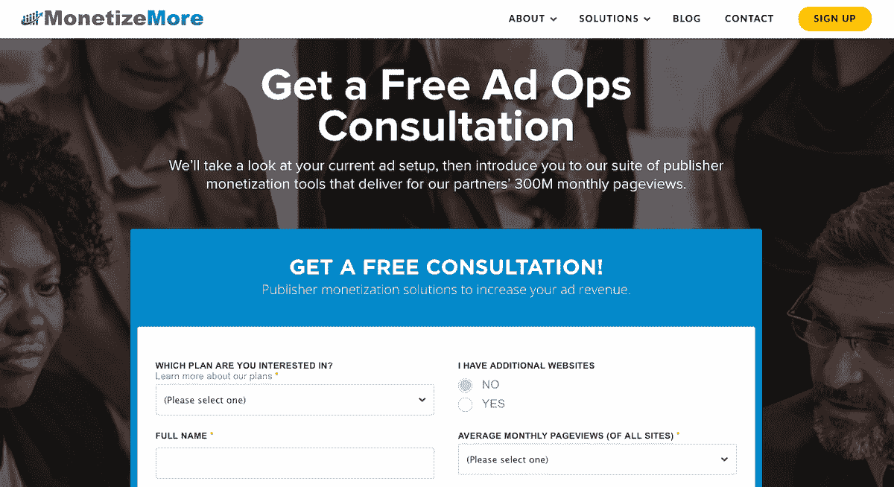
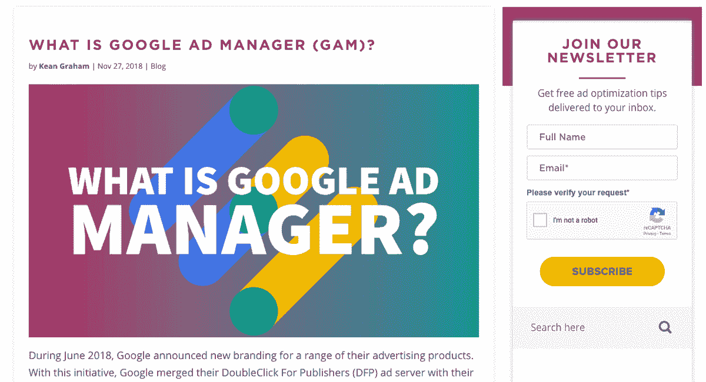
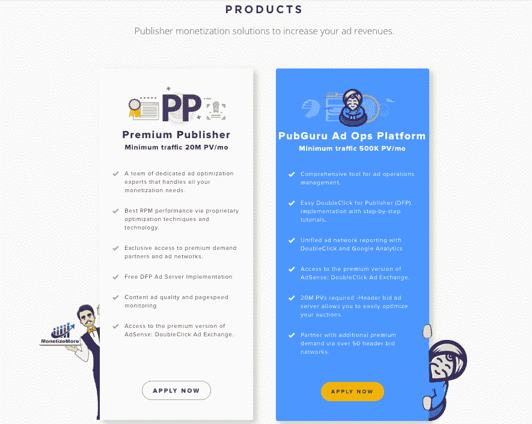
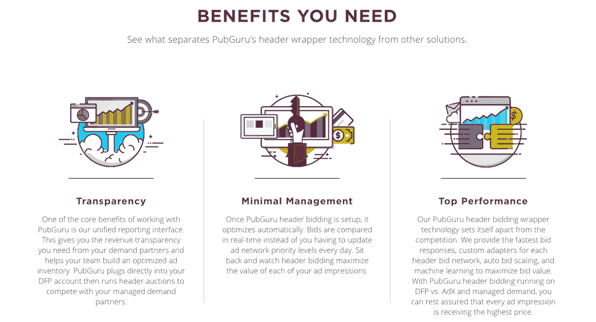

# 从下岗工人到总收入 1600 万美元的行业先锋

> 原文：<https://www.indiehackers.com/interview/from-laid-off-to-industry-trailblazer-with-16mm-in-gross-revenue-5e4b302bab>

## 你好！你的背景是什么，你在做什么？

大家好，我叫基恩，是[money more](https://www.monetizemore.com/)的创始人兼首席执行官。我在 2010 年创办了 MonetizeMore，目标是建立一个能够大幅增加出版商广告收入的自举业务。多年来，我为 money more 开发了一个专有的广告优化模型，现在已经为 40 多个国家的数百个出版商网络增加了广告收入。

MonetizeMore 向大型 AdSense 发布商提供广告技术，这些发布商为每个广告位置选择最高付费的广告商。这导致出版商的广告收入显著增加。到 2017 年，MonetizeMore 的总收入达到了 1670 万美元。

 

## 是什么促使你开始使用 MonetizeMore？

我最初爱上网络行业是在一家大型网络分类网工作的时候。这份工作是一次巨大的学习经历，但是一旦经济衰退来袭，公司决定解雇市场部。我失去了我有过的最好的工作，但我决心把坏事变成好事。

五天后，我登上了去南美的飞机，开始了一次改变人生的旅行。在我背包旅行的第四个月，我进行了为期四天的徒步旅行，穿过不可思议的印加古道前往马丘比丘。结束的时候，我坐在 Wayna Picchu 山顶上，回忆着我整个旅行的经历。

我度过了一生中最充实的时光，它终于实现了:**我将在任何我想去的地方工作和旅行。我决定创业，让这种自主的生活方式成为可能。七个月后，我开始了名为 MonetizeMore 的数字业务，现在为我们团队的每个成员提供一种自主的生活方式。**

有抱负的企业家应该知道，目标是填补目前尚未填补的空白，通过寻找减轻痛苦或增加企业或个人投资回报的维生素来找到自己的位置。

TweetShare

我的第一个客户正是解雇我的雇主。我注意到谷歌垄断了他们未售出的广告库存，所以我计划在他们的广告库存中创建一个竞争性拍卖，而不是只有一个投标人。虽然我在他们业务的内部运作方面有专业知识，但我必须开拓所有的广告优化技能。我给了他们广告收入增长的一部分。

南美之行后，我只剩下少量积蓄，所以我渴望成功。一旦有机会增加我的第一个客户的广告收入，我就能让他们的收入增加数百万。我们仍然将我在此期间开创的最初模式应用于世界各地的网站。

## 构建最初的产品需要什么？

MonetizeMore 的初始阶段涉及到将产品推出的一系列软件。我能够使用一些第三方技术，并将它们结合在一起，提供产品化的服务。最初，我所有的时间都花在如何进一步增加我的第一个客户的广告收入上。这需要创造性的、批判性的、战略性的、分析性的思维和销售技巧。MonetizeMore 的推出相当精简，大部分相关成本是我个人的生活费用。

MonetizeMore 从一开始就已经启动了。它成功的一个重要原因是我从第一天起就 100%致力于赚钱。谷歌广告产品套件启发了一些货币化技术，尽管我们也从 Moz 获得了灵感，因为他们培养了一个网站管理员社区，并赋予他们内容营销和技术。这类似于我们在广告技术行业的表现。

我们的产品从来没有最终目标，并且在过去的八年半中经历了持续的发展。它从大量开创性的手动广告优化流程开始，最终随着技术的发展变得自动化。在最初的几年里，我磨练了我们的广告优化模型，然后标准化了实践，训练了一个团队来做同样的事情，并最终自动化了每个广告优化过程。

## 你是如何吸引用户并增加收入的？

由于一开始没有专有技术，我在第一天就推出了产品化的服务。我最初的客户来自我的网络和会议，最终在 MonetizeMore 的内容营销开始获得牵引力后开始滚雪球。

我们总是从内容营销工作中获得大部分线索，例如:

*   博客
*   Youtube 视频
*   回答论坛上的问题
*   网络研讨会
*   社会化媒体
*   时事通讯
*   内容伙伴关系
*   Wordpress 和 Chrome 扩展商店等市场中的技术
*   一对

内容营销对我们如此有效的原因是我们关注出版商读者的价值。我们的首要目标是增加出版商的广告收入，解决他们的广告技术问题。因此，任何内容要么是解决广告盈利问题的良药，要么是增加广告收入的维生素。我们一直致力于在索取一毛钱之前先提供价值。这就是为什么我们的内容营销在广告技术行业获得了最大的吸引力。

如果你把强烈的观点放到网上，人们会找到你。确保提供支持这些观点的内容。

TweetShare

有抱负的企业家应该知道，目标是填补目前尚未填补的空白，通过寻找减轻痛苦或增加企业或个人投资回报的维生素来找到自己的位置。一旦选择了一个合适的位置，带着信念开始写博客。如果你把强烈的观点放到网上，人们会找到你。确保提供支持这些观点的内容。如果你真的相信你所提供的东西正在为这个行业增加价值，并且一直在努力改进你的产品，你将会有很多东西可以写，人们会有机地找到你。

 

## 你的商业模式是什么，你是如何增加收入的？

货币化更多产品细分为以下产品:

**谷歌广告交易(AdX)** —获取广告技术领域表现最佳的需求来源，以分享 AdX 收入。

**标题竞价** —专有的拍卖技术，确保出价最高者赢得每一个广告印象，出版商获得最大的广告收入。收取标题投标收入的收入份额。

**Premium Publisher**——一项全包式白手套服务，包括 AdX、标题竞价和专门的广告优化专家团队，尽一切可能最大化出版商的广告收入。基于发行商最重要的目标，使用灵活的定价模型。

我从第一天起就一直在充电。我的第一个客户同意从广告收入中提成。由于一些成功的广告优化，我能够在第一个月内增加他们的广告收入。我们在接受付款方面非常灵活。虽然我们通常接受电汇，但我们也接受许多其他支付方式。钱就是钱！

 

从 2016 年到 2017 年，我们经历了 73%的增长，2017 年总收入达到 1670 万美元。这种爆炸性增长是由于我们的广告技术的快速扩展，这提高了我们的业绩，减少了流失，增加了可扩展性和对我们的出版商客户的价值。

我建议有抱负的企业家通过行动来验证他们的商业模式——只要尽快把东西拿出来，然后看看它是如何落地的。您不需要总是从一开始就构建专有技术，有时您可以聪明地将几种现有技术结合在一起，以提供类似的价值和功能。然后，您可以验证和完善业务模型，同时将流程标准化作为构建专有技术的第一步。

在这一点上，我们最大的支出是我们的工资。我们现在有一个超过 120 人的团队，并对业务的长期未来进行了大量投资，放弃短期利润，追求长期增长。第二大开销是技术。为了扩大到我们现在的水平，并继续朝着我们的目标前进，有一些重大的技术成本。

| 月 | 收入 |
| --- | --- |
| 2016 年 1 月 | 245000 |
| 2016 年 6 月 | 235000 |
| 2016 年 9 月 | 310000 |
| 2016 年 12 月 | 449000 |
| 2017 年 1 月 | 746000 |
| 2017 年 6 月 | 1510000 |
| 17 年 9 月 | 1420000 |
| 2017 年 12 月 | 1996000 |
| 2018 年 1 月 | 1440000 |
| 2018 年 6 月 | 1610000 |

## 你未来的目标是什么？

通过展示广告将受众货币化的出版商可以外包其广告运营，以便 MonetizeMore 的一个广告优化团队处理其所有的广告优化策略、执行和战略，或者将其广告运营保留在内部。如果出版商更喜欢内部发布，他们可以使用由 MonetizeMore 开发的平台 [PubGuru](https://pubguru.com/) (广告技术行业的 Hootsuite)来称赞任何内部广告运营团队。PubGuru 提供强大的广告技术，旨在通过一个易于使用的平台提高广告收入并进行优化。使用 PubGuru 时，内部团队仍然可以获得完整的报告透明度，并保持对其广告清单的完全所有权。

 

PubGuru 将于 2019 年初发布，并将成为补充任何出版商内部广告运营团队的首选产品，以维护和实现:

*   完整的广告库存所有权
*   百分之百透明
*   通过复杂的机器学习技术的广告收入潜力
*   通过易于使用的平台，即时优化他们的广告库存拍卖
*   接收广告操作错误和优化建议的通知
*   主动交通质量管理

我们庞大而大胆的目标是成为首屈一指的广告技术平台，在排名前 1000 位的广告收入出版商中占据 25%的市场份额。要做到这一点，PubGuru 必须是最可靠、最易用的平台，在流量上实现最高的广告收入回报。我们有许多技术娴熟的竞争对手，因此在创新上超越他们并不容易，但我们对自己的战略地位和团队的能力充满信心。

## 你面临的最大挑战和克服的障碍是什么？如果你必须重新开始，你会做什么不同的事？

如果我能回到过去，我会建议年轻时的自己早两年聘用我们现在的 CTO。我们目前的首席技术官在重振我们的技术堆栈和将技术置于实现高水平创新的位置方面做了令人难以置信的工作。

如果我能在两年前雇佣我们现在的 CTO，我就能避免可怕的商业伙伴关系和花费超过 200 万美元的谷歌账户禁令。不过，更重要的是，MonetizeMore 将比现在领先两年。我们目前的首席技术官和首席采购官在利用我们的技术赚钱方面做了令人难以置信的工作，成为了业内的先驱。然而，我只能想象如果我们两年前就让 CTO 加入，那么 MonetizeMore 会有多赚钱。

## 有没有发现什么特别有帮助或者有优势的？

以下是一些对我的企业家发展非常有价值的书籍:

克里斯·沃斯和塔尔·拉兹的《永远不要分割差异:谈判就像你的生命取决于它一样》彻底改变了我对有效沟通的看法。它提高了我的积极倾听、移情交流和同情我们每个团队成员的能力，以消除任何障碍，并让他们接受我们的系统和文化。

[蒂莫西·费里斯的每周 4 小时工作制是我接受和理解分权领导的巨大基石。如果没有这本书，我就不会被地理位置独立的商业模式的力量所启发。它还告诉我们，聪明地工作比努力工作更重要。我们在公司文化中非常重视这一价值观。](http://a.co/d/3Q51UuY)

## 对于刚刚起步的独立黑客，你有什么建议？

我认为，对于有抱负的企业家来说，积极主动地解决以下问题很重要，因为这些问题是初创公司失败的最常见原因。

创业失败的头号原因是创始人问题，不幸的是，这种情况很普遍。当领导们不能和睦相处，开始相互对抗而不是相互合作时，公司就会遭殃。如果问题得不到及时解决，他们可能会拖垮公司。

此外，许多企业有伟大的想法，最终会成功，但没有足够的跑道来实现它们。有些创意比其他创意需要更长的时间才能盈利。如果企业没有足够的资本来提供一个足够长的跑道来实现收支平衡，他们可能会破产，即使他们可以在以后实现收支平衡，并在未来很长一段时间内成为一家自给自足的公司。这就是投资有时是必要的。

## 我们可以去哪里了解更多？

请在下面的部分添加您可能有的任何问题或意见。否则，您可以通过以下渠道联系或关注 MonetizeMore:

*   【www.monetizemore.com 
*   推特[@ money more](https://twitter.com/monetizemore)
*   insta gram:[@ money ize _ more](https://www.instagram.com/monetize_more/)
*   [脸书](http://facebook.com/MonetizeMore)
*   [谷歌+](http://plus.google.com/+MonetizeMorePosts)
*   [领英](http://linkedin.com/company/monetizemore)
*   [YouTube](http://www.youtube.com/channel/UCQI2U5c8n9bmEd_rv5K2s9g)

—[<picture id="ember5219879" class="user-avatar ember-view user-link__avatar"></picture>Kean Graham](/KeanMonetizeMore?id=30ckeZAIcDhEu2fckMtnRW52quF3)【money emore 创始人

## 想像 MonetizeMore 一样建立自己的事业吗？

你应该加入独立黑客社区！🤗

我们是几千名创始人，互相帮助建立有利可图的业务和副业。来分享你正在做的事情，并从你的同事那里获得反馈。

还没准备好开始使用你的产品吗？没问题。这个社区是一个认识人、学习和实践的好地方。随意[随便浏览](/)！

——[<picture id="ember5219884" class="user-avatar ember-view user-link__avatar"></picture>柯特兰艾伦](/csallen?id=ibTLPyjwVebnZjMGKvz6ztarnuV2)，独立黑客创始人

17votes