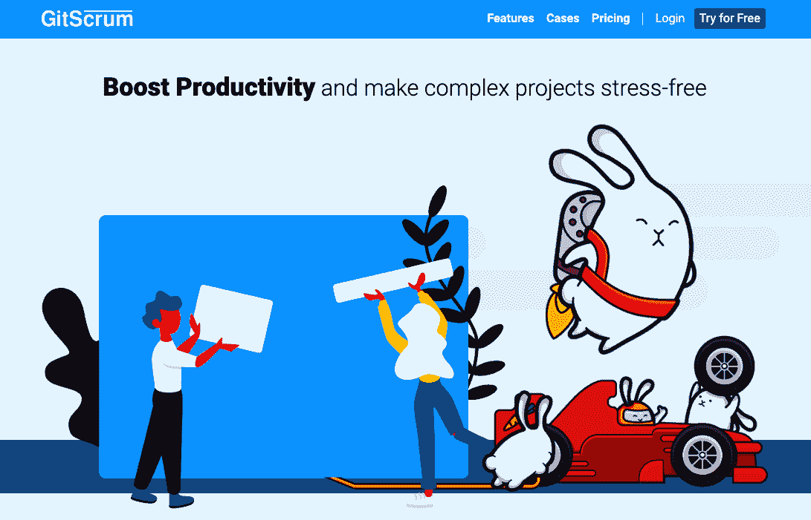
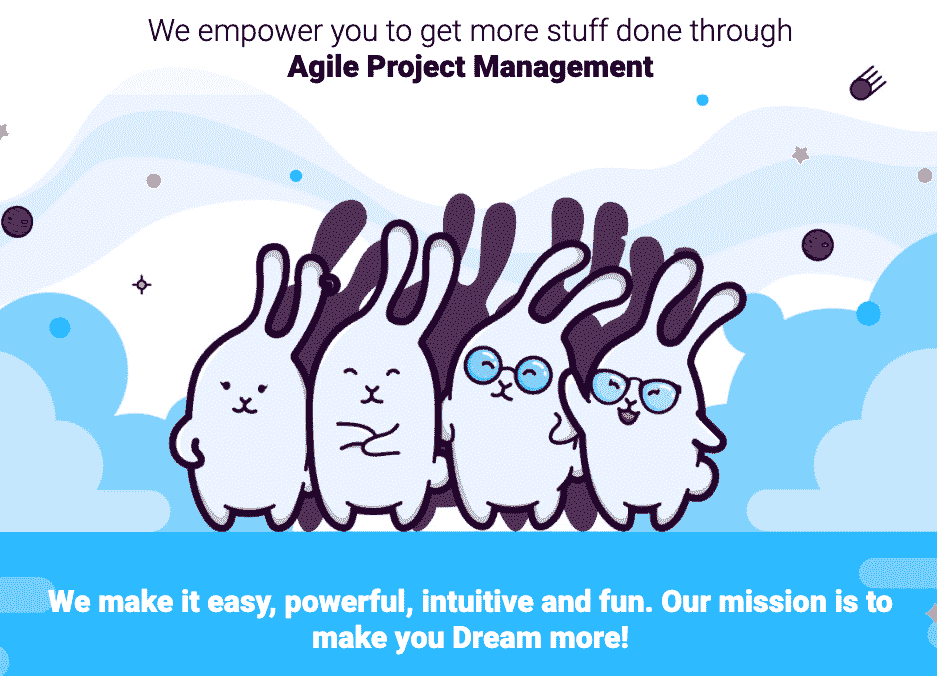
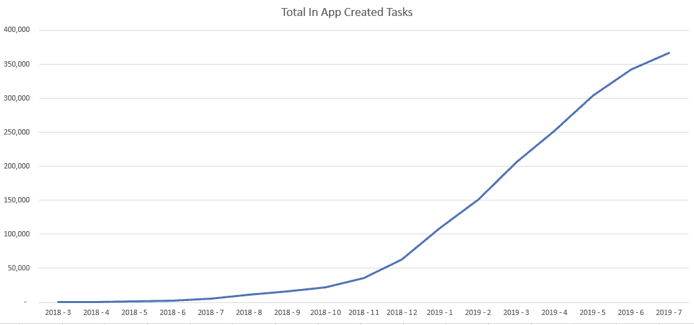
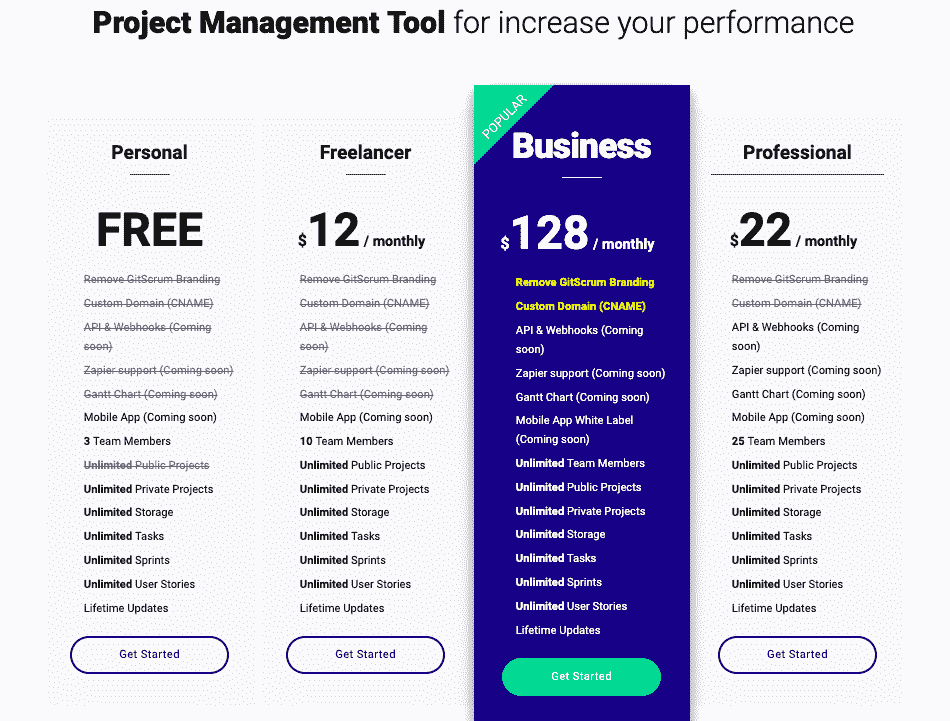
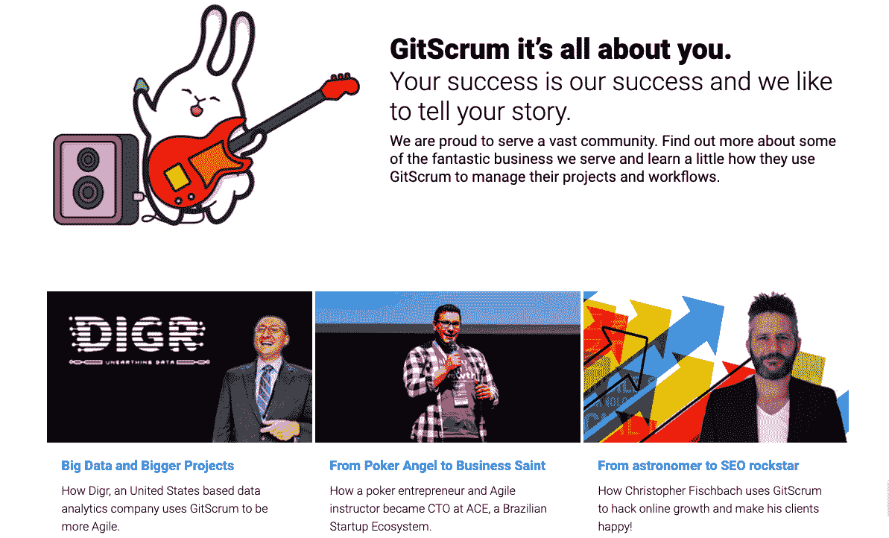

# 仅在 12 个月内从临时项目增加到 60 万美元

> 原文：<https://www.indiehackers.com/interview/from-offhand-side-project-to-600k-in-just-12-months-61127d06a3>

## 你好！你的背景是什么，你在做什么？

嘿，我是雷纳托·马里尼奥， [GitScrum](https://site.gitscrum.com/) 的创始人。我只是系统里的一个小 bug！当我八岁的时候，我问我妈妈要一台雅达利，但是我得到了一台[苹果 II](https://en.wikipedia.org/wiki/Apple_II) 。不知不觉中，这成了我整个职业生涯的催化剂:BASIC 成了我的第一门编程语言，从那以后，事情有了自己的发展势头。我现在已经有超过 15 年的 IT 专业经验(如果你算上我 8 岁时的第一次尝试，会有更多)为大公司和初创公司工作。

我的创业宝贝 GitScrum 是一款敏捷项目管理工具。但这是一个*非常*静态和简单的定义，我们做什么，我们要去哪里。我们的目标是成为精英管理和绩效管理系统的首选。我们希望让工作变得有趣，提高绩效，并帮助雇主和企业家发现和奖励人才。挑战在于创造出能帮助我们实现这些目标的杀手级功能。

大图:我们希望帮助人力资源部门和招聘经理找到合适的人才，部分是通过破坏 LinkedIn 这样的网站，每个人都可以(也应该)写下自己工作经历的风格化版本。我们设想了另一种评估人才的方式，不仅通过自我推销，还通过未来员工每天的工作效率。面试是必要的，但在招聘过程中，面试往往会带来很多误判和漏报。

我们有一个很棒的社区，拥有超过 3 万名用户，第一年的年收入超过 60 万美元。最棒的是。我们还有很多需要改进的地方，还有很多成长的机会。我们非常感激和自豪能够帮助成千上万像我们一样和不像我们的人，释放他们的生产力，以实现梦想、计划和做更多的事情。

 

## 是什么促使你开始使用 GitScrum？

在我过去做 IT 经理的时候，我快疯了。有太多令人沮丧的时刻，糟糕的沟通和缺乏适当的时间管理扼杀了想法并停止了执行。我们正处于一个分心事物层出不穷、拖延症丰富、深度工作低下的时代。当人们没有被充分利用，没有投入到他们的工作中，并且没有让事情继续进行的结构时，想法就会破碎，最后期限就会错过。这仅仅是因为没有合适的系统。

我决定采取行动，开发一个工作和项目管理系统，推动你在团队中做到最好，做最好的自己。作为一名经理，真正困扰我的另一件事是公司或大企业的政治决定谁是值得雇用或晋升的“好”员工。我想要一个客观且可扩展的解决方案来应对这种偏见。我们创建了绩效跟踪功能(例如，我们的 RockStart 团队功能)，让经理们知道哪些贡献者真正做到了最好。我们从脸书小组的用户那里收集了关于这些特性的反馈，结果非常成功！

GitScrum 就是这样诞生的:以精英管理、游戏化和 Scrum 为理念。

我们都面临着相似的障碍，都想给客户留下深刻印象，但是项目管理工具可能会令人困惑。通常它们要么太简单免费，要么太复杂昂贵。我们决定降低其他工具的复杂性，让非技术团队更容易使用。我们存在的理由是帮助用户掌握我们的项目管理风格(通过游戏化特性来提高性能)，而不需要很大的学习曲线或预算漏洞。

在我跳上这条创业之路的时候，我已经是一家创业公司的 CTO，是葡萄牙大公司的顾问。我已经准备好了！

## 构建最初的产品需要什么？

最开始是一个极客的爱好。当我还是一家葡萄牙初创公司的 CTO 时，我请了几天假，开始编写代码来帮助我更有效地管理我的团队，并对此上瘾。很难找到时间来做这件事，我不得不熬夜把事情做完。

然后，我把我的代码作为开源项目分享到 GitHub 上，突然开始从世界各地成百上千的极客那里获得帮助！我就是这样获得了 GitScrum 的 MVP。从那里，我们重新编写了整个应用程序作为一个 SaaS。为了做人们建议的每件事，我真的需要全职工作，并收取一些费用来支付我的账单。

我很幸运也很感激几乎有 100 个极客(和我一样)加入了开源 GitScrum 项目。那是我可能拥有的最好的开始。作为对开源社区的感谢，我确保提供了一个非常慷慨的 GitScrum 免费版本。另一个有价值的资源是我向家人和朋友开放的 kickstart。它允许我雇佣有才华的程序员来创建第一个 alpha 版本。所有这些听起来都很自然，但是请放心，我已经度过了许多不眠之夜，思考如何资助我自己和 GitScrum。

运气偏爱那些努力工作的人。

TweetShare

我们的 MVP 非常基础，还没有像游戏化这样的重要功能。最初的重点是看板仪表板、任务管理和其他简单的构建模块。为了做“复杂”，我们需要做“简单”；否则产品会散架。

我们遵循敏捷和 scrum 原则，并且很早就去小企业市场收集反馈。我们最初的版本花了整整一年才诞生。这种快速的初步反馈使我们能够专注于短期内对客户重要的事情，这样我们就可以盈利并长期生存。

然后我们构建了我们的第一个“游戏”——我们把它比作一个初级的吃豆人。我们仍在不断发展，变得更像堡垒之夜，努力让工作变得有趣，但最重要的是，衡量和奖励绩效的框架已经到位。

我们目前正在招聘，以建立一些重要的功能，我们还没有。强大的移动界面、API 和开放市场将为用户和收入的另一轮大幅增长创造空间。这是我们欠客户的。

GitScrum 是使用非常可靠和快速的技术构建的，如 Laravel Framework、Vue.js、Docker containers 和 AWS Aurora。AWS 为我们提供了首屈一指的安全层，帮助我们创建一个安全的知识共享平台。我们不断分析和测试新技术，以帮助我们提供扩展应用所需的高性能。

 

## 你们是如何吸引用户并壮大 GitScrum 的？

我从圣诞老人那里得到了一份巨大的礼物。圣诞节前后，我和几个同事分享了我对 GitScrum 的承诺，当时这是一个兼职项目，然后我带着家人去了一个滑雪胜地。突然间，这个项目吸引了数十名早期参与者。

我们曾在 [Laravel News](https://laravel-news.com/gitscrum) 上发帖，并最终成为专题。从那时起，雪球越滚越大，以至于我决定停止滑雪，专注于创造更多的雪球！

对于任何软件公司来说，这都是一条幸运的道路，因为它不仅为开源社区做出了贡献，还创造了公司可能拥有的最有价值的资产:追随者！挑战变成了寻找下一个客户。我们为脸书集团提供资源，重点关注初创企业创始人、营销专业人士和小企业主。我们很高兴在脸书找到了一些有专业思想和雄心壮志的人。

我们从这些论坛中学到了很多，并以一种非常健康的方式了解了我们的客户、竞争对手以及他们的路线图。

此外，我们依赖于 GitHub 项目中跟随我们的每一个人。我们在头六个月做得非常好，一个月就获得了 4000 多名客户。其中大部分是免费用户，我们会在内部升级到 GitScrum 的高级版本。

 

今天，我们的主要用户是自由职业者、营销人员和小企业。他们认为 GitScrum 是一种变得更有效率和更有组织性的方式，减少了联系方式的转换，更加专注。这些用户约占我们客户群的 70-80%。剩下的客户是技术团队，大部分是开发人员。

我们最重要的建议是 ABS——永远保持航运。这可以让你收集反馈，更有效地利用你的时间。每当我们等待发布完美的软件时，我们都会后悔没有从更早、更不完美的版本中获得更多的客户反馈。

## 你的商业模式是什么，你是如何增加收入的？

我们还处于货币化之旅的早期。现在我们主要卖给自由职业者和小企业，因为我们希望 GitScrum 对我们的客户来说是最有价值的。虽然我们可能定价过低，但这让我们能够快速扩大用户群，收集更多反馈，这对我们的长期目标非常重要。我们还为那些喜欢分期付款的客户提供许可证的月订阅。

我们目前的年收入超过 60 万美元，考虑到我们进入市场还不到 12 个月，这真是太棒了。

我们最初的定价极具竞争力，因为我们不想让价格成为客户的障碍。我们最高级的许可证开始售价仅为 49 美元——竞争对手每隔一周就收取这个价格。从那以后，我们一直在提高价格，以便雇佣更多的程序员来制作一个伟大的产品。我们是为数不多的提供白色标签的工具之一，因此当客户与他们的客户分享他们的项目时，首先是他们的品牌。

在添加了更多功能和改进了软件之后，我们决定稳步提高价格。与竞争对手相比，我们仍然是便宜货，但是随着我们的价值主张的增长，我们可以允许自己收取更多的费用，以便不断突破界限。我们最初的终身许可价格是 49 美元，勉强够支付我们的运营成本，所以我们稳步提高到 299 美元。我们能够做到这一点，是因为我们专注于保持极高的价值主张，到目前为止，这一点很有效。

每当我们等待发布完美的软件时，我们都会后悔没有从更早、更不完美的版本中获得更多的客户反馈。

TweetShare

作为一家小公司，我们的增长非常强劲。在最初的几个月，我们销售了 5000 美元的许可证，但随着口碑的传播，它很快增长到 40000 美元/月。我们尝试了许多广告场地，但唯一适合我们的是脸书广告。一旦我们开始“掌握”在脸书上投放广告，我们就呈指数级增长。搜索引擎优化的路径更加有机和有利可图，但我们希望快速呈现强劲的数字，所以我们尝试了脸书广告的各种配置，直到我们找到一个适合我们的组合活动。

我们从所有的尝试和错误中学到了重要的一课，我希望这对其他独立黑客有所帮助:不要一开始就试图征服世界。找到你的位置，只要你需要，就一直呆在那里。巨大的成功往往建立在较小的、有意的成功的基础上。

我们也有一个功能市场，我们将向第三方开发者开放，以便他们可以销售他们的应用程序。我们认为它是未来的收入来源，尤其是对免费用户群而言。

我们希望我们雄心勃勃的货币化渠道将帮助我们成为一家专注于绩效管理的人力资源技术公司。我们将绝大部分收入再投资于为客户打造最佳工具，这样我们就可以不断扩大规模，改善我们的投资组合，并改善客户的工作生活。

 

## 你未来的目标是什么？

从第一天起，GitScrum 就是为了生存。适者生存不是最强或最聪明，而是适应能力最强。

我们开始是作为一个 IT 开发工具，但是当我们建立 SaaS 商业模型的时候，IT 开发者社区并没有购买 GitScrum 许可。我花了一段时间才明白我瞄准了错误的观众。为了成为一个成功的企业，GitScrum 需要找到另一个目标受众，并以此为中心。

因此，我们撒下更大的网，在专业领域的几个亚人群中投放有针对性的广告，并钓到了一些鱼。当你最初的目标受众没有转变时，这是令人沮丧的，但与其认输，我强烈建议测试许多新的甚至违反直觉的受众，直到你找到自己的定位。

不要一开始就试图征服世界。找到你的位置，只要你需要，就一直呆在那里。巨大的成功往往建立在较小的、有意的成功的基础上。

TweetShare

幸运的是，我对此持开放态度，我们通过一致和反复的市场适应性测试找到了前进的方向。我们的测试表明，我们需要把目标锁定在自由职业者、营销机构和小企业，而不是铁杆 IT 开发者，所以我们开始了。我们加入了致力于市场营销和创业人群的脸书团队，产品与市场的契合被锁定。在改变我们的关注点之前，我们每月的独立用户不到 10K。在观众发生变化后，我们达到了 12 万，所以我们有信心我们会有所作为。

从某种程度上来说，GitScrum 还处于这个生存阶段。为了生存，我们需要快速适应，并学会如何为客户服务，跟上竞争对手。我们热爱这场自然进化竞赛，因为它推动我们适应、生存和茁壮成长！

就个人而言，我是典型的 IT 极客——非常内向，通宵编码，学习新技术，但完全缺乏商业技能。就销售而言，头几个月是一场灾难。但对我来说，写代码就像写诗:诗人喜欢这样做，不考虑任何商业上的成功。

不幸的是，这种情绪无法支付账单。当宇宙让我陷入困境时，我的个人资金和种子资金都快用完了，银行账户里还有几周的开销。我得到了一份高薪的工作。我妻子非常担心。我们应该追随梦想还是接受这份好工作？我们决定最后一试。要么 GitScrum 自己走，要么我们下个月就把它关了。

我把银行里剩下的钱都拿来买了脸书的广告。这是一个陡峭的学习曲线，但一旦我掌握了脸书广告的窍门，事情就有了转机。我们开始将大量广告转化为销售额，很快就有了足够的资金来支持数月的 GitScrum 编码。

这是老生常谈，但得到的教训是，如果你的心告诉你继续前进，烧你的桥，提高你的游戏，承担风险，永远不要回头！总会有一份工作帮你付账单。

## 有没有发现什么特别有帮助或者有优势的？

我正在读安吉拉·杜克沃斯的《勇气》，这是朋友送我的礼物。这本书的大部分内容引起了我的共鸣，我认为对于任何企业家来说，这都是一本非常鼓舞人心的读物。我也是马尔科姆·格拉德威尔和他的书《T2:引爆点》的忠实粉丝。Ash Maurya 的 [Scaling Lean](https://www.amazon.com/Scaling-Lean-Mastering-Metrics-Startup/dp/1101980524/ref=sr_1_1?crid=3SZOI9O52ZWB1&keywords=scaling+lean&qid=1561722037&s=gateway&sprefix=scaling+learn%2Caps%2C124&sr=8-1) 是我读过的最好的成长型创业书籍之一。

就帮助我将 GitScrum 带入生活的技巧而言，逻辑思维是基础。不留下任何变量、选项或障碍，让我们能够规划出所有的解决方案，从而找到最佳答案。

砂砾也是**根本**。我真的相信运气偏爱那些努力工作的人。我花了一个多月的时间关在家里为我们的第一个 SaaS 版本编码。我回复了成千上万来自世界各地不同时区的客户聊天(也就是说，我没有睡觉)。我创造了一个疯狂的惯例:凌晨 3 点起床，工作到早上 8 点，下午 1 点再睡觉，晚上 11 点再继续工作——为了能够在 GitScrum 的形成期与客户交谈，这是一场真正的马拉松。但我设法让客户开心，收集反馈，并适应。

## 对于刚刚起步的独立黑客，你有什么建议？

GitScrum 是幸运的一击。最初，我没有任何创建世界级创业公司的意图。在短短几年内，我们改善了人们的生活，提高了工作效率，并使工作游戏化，使每个人都受益。奇怪的是，这一切都让我想起了伟哥化合物的发现。他们设法取得革命性的成功完全是侥幸。这表明总会有办法的，即使一开始并不明显。

GitScrum 会如何进化？我一直在努力实现我们将使用机器学习来减少项目管理压力的未来。

我们希望将智能添加到项目经理的日常生活中，这样他们的工作会比现在更有成就感和创新性。我们的目标是让项目管理基本上是自动驾驶的，同时让它对人的控制和干预开放，以便在过程中进行改进和调整。

我们也将继续推进我们的游戏化价值，引导我们的用户尽最大努力。自然，我们将继续跟踪、衡量和奖励绩效，这将使我们走上成为人力资源技术公司的道路。

 

## 我们可以去哪里了解更多？

一个很好的起点是我们网站上的[用户案例](https://site.gitscrum.com/user-cases)页面。它展示了真实的人是如何使用 GitScrum 来提高工作效率的。

另一个神奇的资源是我们活跃的[脸书集团](https://www.facebook.com/groups/gitscrum/)。这对我们来说是一个积极而重要的反馈来源。如果我们的用户没有不断地向我们询问功能、进展和路线图，我们就不会取得如此爆炸性和持续的增长。

另一个重要的评论来源是我们的[产品搜索页面](https://www.producthunt.com/posts/gitscrum)。

对我来说，这只是我们的开始！我们很期待看到我们能走多远。请在下面留下评论，我会尽力回复大家。

—[<picture id="ember8115947" class="user-avatar ember-view user-link__avatar"></picture>雷纳托·马里尼奥](/renatomarinho?id=4V6OwH9m83cVcxbPs7sQ43944pv1)，GitScrum 创始人

## 想像 GitScrum 一样建立自己的事业？

你应该加入[独立黑客社区](/)！🤗

我们是几千名创始人，互相帮助建立有利可图的业务和副业。来分享你正在做的事情，并从你的同事那里获得反馈。

还没准备好开始使用你的产品吗？没问题。这个社区是一个认识人、学习和实践的好地方。随便去[随便浏览](/)！

——[<picture id="ember8115952" class="user-avatar ember-view user-link__avatar"></picture>考特兰艾伦](/csallen?id=ibTLPyjwVebnZjMGKvz6ztarnuV2)，独立黑客创始人

14votes