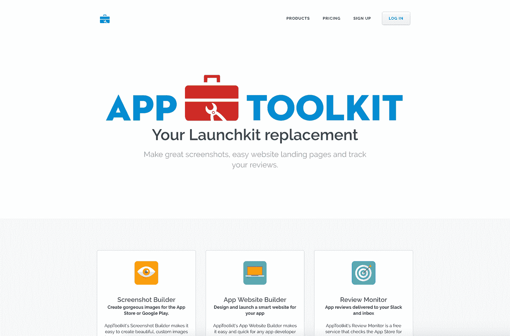
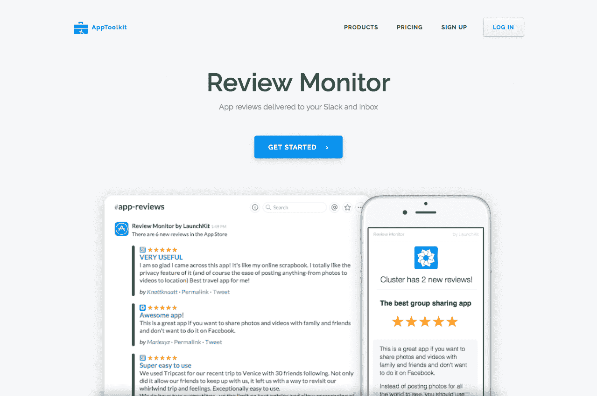

# 为开发商制作营销工具，每月创收 1000 美元

> 原文：<https://www.indiehackers.com/interview/generating-1-000-mo-making-marketing-tools-for-developers-4d79cca8e3>

## 你好！你的背景是什么，你在做什么？

我叫 Ross Rojek，直到 2009 年我才真正作为一名创造者进入科技行业。2008 年，我和妻子海蒂一起创办了书评业务，我们想为我们一直在做的儿童书评制作一个应用程序。所以我在网上四处寻找，找到了一个似乎能做我们想要的事情的平台，并制作了一个应用程序。

这个系统非常简单，以至于我为附近的一个葡萄酒产区制作了第二个个人应用程序，我们已经开始定期访问该地区，该地区的一个主要酒厂问我们是否可以将其公开，并提出帮助支付费用。这是我们进入应用程序开发的入口。从那以后，我们为自己和客户开发了 100 多个应用。一直以来，我们使用了许多应用营销和分析服务。

我是一个相当早期的产品搜索用户——我最初在 Ryan Hoover 的电子邮件列表上。它帮助我了解最新的应用程序、工具和趋势。我通过产品搜索找到的工具之一是 [LaunchKit.io](https://launchkit.io) 。他们推出的第一个工具是截屏生成器，它不仅可以让你创建带有评论的截屏，还可以以各种手机大小导出它们(当时 iTunes 的一个恼人问题)。所以我们开始使用这个和他们推出的其他服务。

2016 年 7 月，LaunchKit 的母公司 Cluster 被谷歌收购，LaunchKit 于 2017 年 7 月日落。我们依赖其中一些服务，所以我们开始寻找替代品，然后决定采用开源版本的 LaunchKit，并将其更名为 [AppToolkit.io](https://apptoolkit.io) 。

## 构建 AppToolkit 初始版本的过程是怎样的？

当他们宣布 LaunchKit 将被关闭时，我最初的想法是，“我希望有人能把它捡起来。”我的第二个想法是，“为什么不是我们？”因此，我们决定投入这项工作是基于需求和假设，即我们并不是唯一需要类似启动工具包的服务的人。

这个特别的项目归结起来就是在正确的时间出现在正确的地点。

TweetShare

因为我们之前已经使用了 LaunchKit 的所有服务，所以我们并不真的需要验证这个项目。从用户体验的角度来看，我们知道什么是我们喜欢的，什么是我们不喜欢的，所以我们的方法更多的是“让我们为自己完成这项工作，然后向其他用户开放，以降低我们的成本”，而不是独立的产品发布。我们最初的工作都是从这个角度出发的。为我们自己和我们的应用程序客户端和任何付费用户创建一个服务将是一个奖金。

随着我们越来越接近推出，并有一些早期测试版用户，我们意识到，我们可能确实有一个独立的平台，可能会有一个严重的用户群。我们对[截图生成器](https://apptoolkit.io/screenshots)的第一个添加是允许水平截图。不管出于什么原因，从来没有人把它们作为一个选项，这让我很惊讶，因为很多游戏都是在风景中进行的。一旦我们添加了这一点，我们的截屏生成器的用户就开始从口口相传中增长。

[

AppToolkit.io 今天的主页。](https://apptoolkit.io) 

我们一直是一家自力更生的公司。我妻子和我仍然做我前面提到的书评业务(她比我多)，我专注于应用程序和一些网站技术。我们用由此产生的现金流来支付 [AppToolkit](https://apptoolkit.io) 的费用，有时 AppToolkit 的开发会被搁置，而我们的应用业务和其他内部任务会优先处理。

## 为发布做准备还需要做些什么？花了多长时间？

我想在大约四个月的时间里，我们可能每周花 20-30 个小时在 [AppToolkit](https://apptoolkit.io) 上。(我们在继续开发新服务的同时，仍然会花这么多时间。)大概花了三个月的时间才开始让用户进来。

我们的长期应用程序开发人员 Casey 将他的主要注意力从更新和添加到我们的应用程序代码库转移到几乎全职钻研 AppToolkit。因为(我们认为)最初的 LaunchKit 代码是固定在每一个以前的片段上的，他必须只在一个片段上工作，然后是下一个片段，并且当我们发现需要更新的问题或用户跟踪元素时，经常回到以前的片段进行新的编辑。

我们用于应用程序开发的许多技术实际上都有助于此。我们开发本地应用，但我们使用在线内容管理系统(CMS)进行内容更新和图像转储。因此，在亚马逊的 EC2 上抛出几个新实例，并设置 Route 53 和 S3 桶是容易的部分。处理负载平衡和几个不同实例之间的数据移动，以及前端开发工作，重写现有内容，并用我们自己的内容替换它更加困难。

我们有一些来自产品搜索社区的朋友，他们对最初的[截图](https://apptoolkit.io/screenshots)和[网站构建者](https://apptoolkit.io/websites)和 [iTunes 评论监视器](https://apptoolkit.io/reviews)给了我们反馈。这是我们开始对每个初始服务进行小的改变感到舒服的时期。

今天，我们真的相信 AppToolkit 不仅仅是一个附带项目。

TweetShare

从以前使用过 LaunchKit 的人那里获得最初的用户反馈也很有价值。我总是担心仅仅根据我的需求或信念做出产品和商业决策，意识到我只是一个样本。加入新的观点对于任何新产品或服务的开发都是至关重要的。

## 你用了什么策略来吸引用户和发展 AppToolkit？

一旦我们对这三个公共服务感到满意，我们就开始寻找产品。我想因为 AppToolkit 并不完全是“新”技术，我们不会有最好的发布，但这是一个好的开始。我们最终进入了前十，但不是前五。那天发布的另一个产品是自动系鞋带，所以我那天的主要目标就是打败他们，我们做到了。

因为我们主要关注的是应用程序开发人员或不是开发人员的应用程序所有者，所以我们的受众非常狭窄。我做了一些 Reddit 帖子和 Show HNs，这是我们早期注册的时事通讯，还有一些博客和目录列表。我们还提交了测试列表和一些其他产品网站，在向其他人发布之前寻找 SDK 的早期用户。但 Product Hunt 和 BetaList 是早期采用者领域的两大巨头。

 

随着我们的发展，我们会通过一些公关渠道，像这样的采访和一些广告来进行全面的推广。我们将尝试 Twitter 广告，针对关注或使用 LaunchKit 并在 Twitter 上发布相关信息的人。我们实际的中期目标是当有人在谷歌上搜索“LaunchKit replacement”时成为搜索结果的第一名，因为 LaunchKit 很快就会关闭，那里的任何遗留用户都需要一个去处。我们还将 LaunchKit API 集成到了 [AppToolkit](https://apptoolkit.io) 中，因此我们可以轻松地从 LaunchKit 中转移现有用户的内容(他们的截图和网站)。

你不能只是把一个 MVP 扔在一起，然后在 Reddit 上发一个帖子。你必须坚持下去。

TweetShare

我们正在试探与[模型](https://www.mockuuups.co/)的合作关系，将他们的一些图片整合到网站建设器中，并在每个使用它们的网站的页脚给予它们信用。这可能会让我们接触到 Mockuuups 的观众，并开始让他们中的一些人使用截屏生成器或网站生成器。

我们考虑过做一个类似于 Mockuuups 的小型副业项目，但作为可以用于应用营销的手机/平板电脑图像的选择。我们认为我们可以创造一系列营销人员喜欢的真实世界中使用的设备的图像，类似于 Crew 在 [Unsplash](https://unsplash.com) 中所做的。然而，如果与 Mockuuups 的合作成功，我们可能不会创建它。

我们在这个项目中投入了大量的工资成本，但比我们从头开始做要少。使用开源代码构建 [AppToolkit](https://apptoolkit.io) 的基础真的很有帮助。否则我们负担不起。

## 你未来的目标是什么，你打算如何实现它们？

我们已经达到了最初的几个目标:

1.  获得足够的付费用户来支付 AWS 账单的成本
2.  总共超过 100 个用户

下一个里程碑将是获得足够多的付费用户，以支付持续开发时间的成本，从而使其成为收入中性的。除此之外，我们希望创造足够的收入来收回所有的初始开发成本，这样 [AppToolkit](https://apptoolkit.io) 将成为一个独立的工作项目。

因为我们最初的产品是基于别人的代码，所以我们列出了一些我们想做的事情来扩展它，使它对我们来说是独一无二的。我们希望成为一个 LaunchKit 用户可以轻松转移的地方，但我们不想被视为只是一个 LaunchKit 的克隆。我们有一个非常好的起点，所以我们的新功能真的可以让我们变得有用。

今天，我们真的相信 AppToolkit 不仅仅是一个帮助我们和我们现有的应用程序客户端的辅助项目。它有可能成为应用程序开发人员营销和用户管理的一整套工具。到 2017 年夏天，我们的目标是从“启动套件替代品”转变为完全开发的独立平台。

## 你最大的挑战是什么？

我最初雇佣了一名外部开发人员来查看代码。虽然没花多少钱，但是很浪费时间。我最终意识到，最好将这项工作交给我们的内部开发人员 Casey，他必须弄清楚 iOS 代码库和 CMS，并从头开始编写 Android 代码。他在开发我们的应用程序和推出[应用工具包](https://apptoolkit.io)方面发挥了重要作用。然而，总的来说，我们可能在开始阶段就浪费了 2 个月的时间。

凯西也住在台湾，远程工作，所以当他决定在感恩节假期搬回加州时，我们可能又失去了一个月的开发时间。但我不知道我们能不能避免这种情况。

[

通过 AppToolkit 查看监视器。](https://apptoolkit.io/reviews) 

这个特别的项目归结起来就是在正确的时间出现在正确的地点。LaunchKit 本可以选择不公开他们的代码，在这种情况下，我们永远不会有机会开发 [AppToolkit](https://apptoolkit.io) 。但与此同时，拿着它做点什么并不是一个周末的项目。在这一点上，我们已经投入了数百个小时，这些时间本可以用在更快赚钱的其他事情上。

## 对于刚刚起步的独立黑客，你有什么建议？

不要害怕尝试只是作为一个测试。你不知道什么可行，什么不可行，除非你让至少一个你不认识的人去尝试一些东西，看看他们会不会用。适合市场的调查只是其中的一部分。我可能会告诉你我对你的想法感兴趣，但在我看到它并使用信用卡之前，你不会知道我是否真的感兴趣。

但是有一个平衡:你不能只是把一个 MVP 扔在一起，然后在 Reddit 上发一个帖子。你必须在一段时间内坚持下去，寻找用户，并根据用户的反应调整你所做的事情。

制作一个 MVP 是关键，但是了解什么能工作和赚钱，以及了解你的目标市场的需求也很重要。

我不像以前那样读那么多商业书籍了。其中太多要么过于狭隘，要么不够具体。(我知道，一个奇怪的抱怨。)但对我来说，一本商业书籍应该是实用的，有具体的工具来帮助你实现书中提出的想法。没有多少商业书籍会这么做。然而，对我影响很大的一些关于如何处理新想法或项目的书籍包括:

*   renée maoborgne 和 W. Chan Kim 的《蓝海战略》
*   [商业模式的产生](http://amzn.to/2nByYTS)亚历山大·奥斯特瓦尔德和伊夫·皮涅尔
*   [精益创业](http://amzn.to/2mGEsaS)作者 Eric Ries
*   布拉德·斯通的《暴发户》；我还为我的[创业博客](http://bookbuzz.email/startup/ "Startup BookBuzz")采访了他

我认为我们将从播客和时事通讯中看到比商业书籍更可行的策略。消费者花在长篇阅读上的时间更少，所以从媒体出版物或 YouTube 视频中捕捉一些想法可能是一种趋势。

播客和时事通讯也很重要。注册一堆，读/听几个星期，退订那些听了四次就没什么新内容的。

这就是我最初开始写书评的原因。我连续六周阅读《纽约时报书评》,却没有看到一本我想读的书。考虑到我对许多不同的流派和风格持开放态度，这不是一件好事。所以我想，对类型小说以及所有主流内容更加开放的书评肯定会有市场。因此，我们在 2008 年推出了[城市书评](http://citybookreview.com)，九年后我们仍将此作为主要收入来源。

## 我们可以去哪里了解更多？

要注册 [AppToolkit.io](http://AppToolkit.io) ，只要去网站戳一下就行了。[SDK](http://apptoolkit.io/sdk)现已推出，您可以立即开始使用屏幕截图构建器和网站构建器，以及 Review Monitor。

我们的社交媒体是:

*   推特— [@apptoolkitio](https://twitter.com/apptoolkitio)
*   脸书—[app toolkit-419422898449313](https://www.facebook.com/AppToolkit-419422898449313)
*   中— [应用工具包-io](https://medium.com/apptoolkit-io)

欢迎提问我的问题或在下面留下评论。我会回头回答所有的问题。

—[<picture id="ember8099926" class="user-avatar ember-view user-link__avatar"></picture>app toolkit](/AppToolkit?id=OuiYmGOlZAOSj20MJawEKcra1dP2)，AppToolkit.io 的创建者

## 想像 AppToolkit.io 一样建立自己的企业？

你应该加入独立黑客社区！🤗

我们是几千名创始人，互相帮助建立有利可图的业务和副业。来分享你正在做的事情，并从你的同事那里获得反馈。

还没准备好开始使用你的产品吗？没问题。这个社区是一个认识人、学习和实践的好地方。随意[随便浏览](/)！

——[<picture id="ember8099931" class="user-avatar ember-view user-link__avatar"></picture>柯特兰艾伦](/csallen?id=ibTLPyjwVebnZjMGKvz6ztarnuV2)，独立黑客创始人

3votes