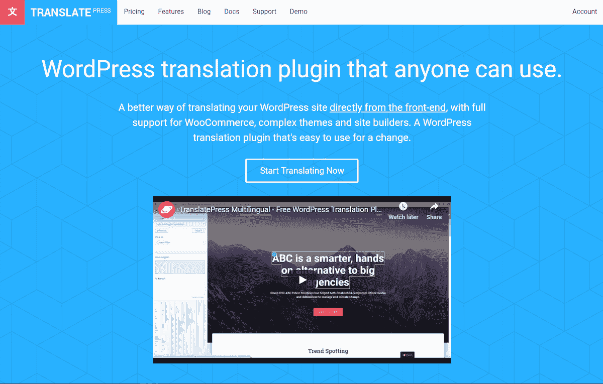
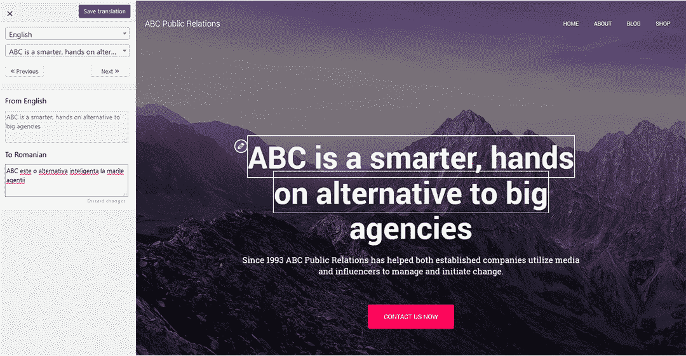
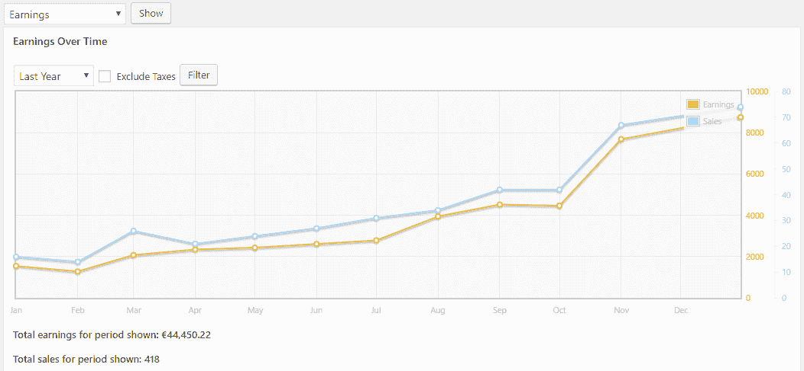
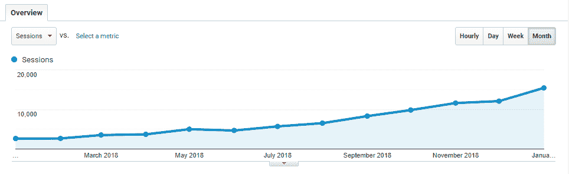

# 通过免费增值业务模式每月创造 10，000 美元的收入

> 原文：<https://www.indiehackers.com/interview/generating-10-000-per-month-from-a-freemium-business-model-16dd43e3ef>

## 你好！你的背景是什么，你在做什么？

你好，我叫艾德里安·斯皮克。我是 [Cozmoslabs](https://www.cozmoslabs.com/) 的联合创始人，也是 [TranslatePress](https://www.translatepress.com) 团队的一员，这是我们的最新产品，旨在让翻译你的 WordPress 网站变得简单直观。

我毕业于电子和电信工程专业，主修多媒体。我从高中开始写代码，并很快爱上了它。大学一毕业，我就和[克里斯汀](https://twitter.com/sareiodata)合作，创办了一家网络开发公司。由于它的简单和所有可用的资源，WordPress 成为我们的主要焦点。

四年后，我们推出了我们的第一款产品 [Profile Builder](https://www.cozmoslabs.com/wordpress-profile-builder/) 。这使得我们能够从一个全职的 WordPress 开发机构转型到构建和支持我们自己的产品。这也是我们每周只工作四天(周五休息)的原因。

如今，TranslatePress 每月收入超过 10，000 美元，免费核心插件[正在 30，000 多个活跃网站上使用。](https://wordpress.org/plugins/translatepress-multilingual/)

 

## 是什么促使你开始使用 TranslatePress？

我们构建多语言网站的旅程始于我们开发定制 WordPress 的时候。我们的项目多种多样，从只有几页的简单演示站点到需要持续开发和维护的复杂多语言设置。

虽然有相当多的 [WordPress 多语言解决方案](https://translatepress.com/wordpress-translation-plugin-comparison-translatepress-vs-free-and-paid-alternatives)，但我们对它们增加的复杂性和翻译工作流程(非可视化、脱离上下文、在多个地方出现)并不满意。虽然作为开发人员，我们可以让它工作，但对于最终客户来说总是有很多摩擦。当客户试图修改翻译时，这导致了破碎的东西，以及重复的电子邮件和请求，关于如何改变本应是直截了当的(但不是)特定的东西。

一旦我们的产品开始表现良好，我们就可以选择分配资源来启动新产品。我们有一段时间在考虑创建一个新的 WordPress 翻译插件，所以这似乎是开始的最佳时机。

## 构建最初的产品需要什么？

我们希望建立一些东西，允许用户直接从前端翻译整个页面，使用一个可视化的翻译界面，只需点击某个字符串并输入翻译(实时)。

 

市场上唯一一个具有类似视觉效果的翻译插件是 Weglot。然而，我们的概念在实现上有很大不同，因为我们想要:

*   一个 GPL 插件(访问代码库)
*   一切都存储在本地，在您的数据库中(您拥有您的翻译)
*   [支持动态字符串](https://translatepress.com/translate-dynamic-strings-wordpress/)(获取文本字符串)
*   要让 TranslatePress 能够与任何 WordPress 插件或主题一起开箱即用(而不是反过来，开发者需要添加对翻译插件的支持)

这包括对 [WooCommerce](https://woocommerce.com/) 的全力支持。

此外，如果你已经用页面生成器创建了你的 WordPress 站点，你可以很容易地用 TranslatePress 翻译它。这是因为我们的方法是在内容生成为 HTML 后在前端处理它，所以您使用什么类型的编辑器来创建内容并不重要。

在开发方面，这一切都始于 Madalin(我们的第三位联合创始人)测试插件的核心，一个 PHP DOM 解析器类，看看我们是否可以使用它。它工作得相当好；我们可以在不降低测试站点速度的情况下从数据库中进行字符串搜索和替换，所以我们开始着手这个项目。我们的同事 Razvan 是首席开发人员，他将 100%负责交付 alpha 和 beta 版本，在这一点上，我们将为项目分配更多的资源。虽然不理想，但这是我们在不雇佣更多人的情况下所能做的一切。

我们对发展的估计相差甚远。我们期望在三个月内推出该产品的测试版。我们花了将近八个月的时间来发布初始版本。总共有四个人积极参与了 TranslatePress 的推出，其中三个专注于开发(只有一个全职)，一个专注于营销。

## 你是如何吸引用户和发展 TranslatePress 的？

TranslatePress 是一款免费增值产品，有免费版和付费版。这种模式在过去对我们有效，所以我们决定坚持下去。

我们从第一天起就知道，将 TranslatePress 转变为可靠产品和可持续业务的关键是为免费版本争取尽可能多的用户。因此，我们的主要焦点是建立一个真正易于使用的免费产品，人们可以不受限制地使用。

获得一些初始牵引力总是最困难的。对我们来说，这不是一朝一夕的事。但是我们真的相信这个产品和它的目的，所以我们继续前进。

TweetShare

以下是我们为传播 TranslatePress 所做的一些事情:

*   通过给现有客户发电子邮件和使用脸书广告，我们建立了一个测试列表，这让我们获得了大约 160 个注册
*   在 wp.org 上免费发布了核心插件，并对关键词进行了优化，如*翻译*和*多语言*
*   寻找在现有产品中交叉推广 TranslatePress 的方法
*   将免费下载添加到 Cozmoslabs 所有客户的账户页面，并发送了第二份简讯
*   赞助了一个单词营，并与主题商店和代理谈了关于推荐 translate press([theme isle](https://themeisle.com/)并将其添加到他们推荐的插件列表中， [Themefuse](https://themefuse.com/) 将其包含在他们的 [Unyson](https://wordpress.org/plugins/unyson/) 框架中
*   外展，主要是联系我们有关系的网站来写它
*   开始在我们的博客上发布与我们产品相关的[教程](https://translatepress.com/translate-dynamic-strings-wordpress/)、[速度测试](https://translatepress.com/top-wordpress-translation-plugins-compared-based-on-page-load-time/)和[透明度报告](https://translatepress.com/category/transparency-reports/)

这有助于免费版本获得一些初始牵引力，并达到近 1000 个活跃安装。

## 你的商业模式是什么，你是如何增加收入的？

TranslatePress 的收入来自其[高级版本](https://translatepress.com/pricing/)。每个套餐基本上都是自动续订的年度套餐，可以随时取消。我们使用 [2Checkout](https://www.2checkout.com/) 来处理支付和订阅。

有效订阅使您可以访问某个包中的所有 pro 加载项(加上我们发布的新加载项)、定期更新(新功能、错误修复、WP 兼容性)，以及访问高级支持。大多数专业插件都是我们免费插件用户不断请求的结果(我们会把每一个都写下来)。

插件的核心是免费的(并将继续免费)，允许用户用第二语言翻译整个 WordPress 网站，没有任何限制(比如字数、主题/插件兼容性等)。).它还集成了谷歌翻译。

然而，如果有人想添加自动用户语言检测、翻译账号、或者让他们的网站可以使用多种语言，他们可能会选择付费版本。

这是去年收入情况的详细图表:

 

我认为收入增长是由于免费用户数量的增加和他们的积极评价，加上它已经存在了一段时间(大约一年半)，越来越多的人认为它是现有解决方案的可行和更容易的替代方案。

最终，越来越多的人开始使用该产品，信任它并选择付费版本。

TweetShare

上个月的收入大约是 1 万美元(约合 8800 欧元)。2019 年 2 月的营收为 9645 欧元(约合 1.1 万美元)。免费版本仍然是我们付费用户的最佳转换渠道。

我们的流量在过去 12 个月也有显著增长，几乎是以前的五倍。这主要是由于免费版本的流行，越来越多的网站谈论 TranslatePress(其中大部分我都亲自接触过)，以及我们的博客帖子专注于多语言主题。

 

拥有易于使用且可靠的产品是关键。然而，由于 WordPress 插件生态系统是一个相当拥挤的空间，这已经不够了。你需要做大量的外联工作，制作高质量的内容来获得关注。

## 你未来的目标是什么？

如果我们能在年底前实现以下目标，我会非常高兴:

*   支持 60K+网站
*   每月收入超过 20，000 美元
*   让我们的网站流量翻倍

这些数字实际上不在我们的控制之下，但我们可以通过以下方式影响它们:

*   有一个清晰的营销计划，并为这一部分雇佣额外的帮助(每月发布两到三个有用的教程，在多语言网站上推出电子邮件课程，增加我们的电子邮件订户，撰写客座博文，参加并赞助单词营，发展合作伙伴关系等)。)
*   提供强大的支持，改进我们的文档，并接受我们用户的需求
*   在开发方面，增加更多的集成(如 [DeepL](https://www.deepl.com/home) )、新特性(如媒体翻译)、更少的错误(通过编写更多的单元测试)，同时记住易用性是 TranslatePress 的强项。

## 你面临的最大挑战和克服的障碍是什么？

我认为获得一些初始牵引力总是最困难的。对我们来说，这不是一朝一夕的事。事实上，发布后的头几个月真的很慢。我们的销售量很少。但是我们真的相信这个产品和它的目的，所以我们继续前进。这无疑是最大的挑战。

最终，越来越多的人开始使用该产品，信任它并选择付费版本。客观地说，在开始做 TranslatePress 的一年后，我们赚了不到 2000 美元。

事实上，我们从[现有产品](https://www.cozmoslabs.com/wordpress-paid-member-subscriptions/)中获得的收入对 TranslatePress 的存在和发展至关重要。我们可以专注于工作，而不必对缓慢的开始过于恐慌。

## 对于刚刚起步的独立黑客，你有什么建议？

*   为你知道的、你理解的、你是其中一部分的观众做点什么(WordPress 在过去的九年里一直是我们的利基)
*   不要害怕谈论你的产品(试着通过提供价值和教育他人来谈论)
*   找一个联合创始人(甚至像我一样找两个)，但要确保你们有相同的价值观。知道你们会互相支持是一种解脱，同时也是一种激励。

## 我们可以去哪里了解更多？

*   translatepress.com(玩[演示](https://demo.translatepress.com/)
*   [cozmoslabs.com](https://www.cozmoslabs.com/)
*   [@translatepress](https://www.twitter.com/translatepress)
*   [【邮件保护】](/cdn-cgi/l/email-protection#1a7b7e68737b745a797560777569767b786934797577)
*   在独立黑客论坛和下面的评论区

——[<picture id="ember5272901" class="user-avatar ember-view user-link__avatar"></picture>阿德里安·斯皮亚克](/adispiac?id=IwItMG5aSvXVSOiiMKwwLdQR2Uv1)【translate press】创始人

## 想像 TranslatePress 一样建立自己的企业吗？

你应该加入[独立黑客社区](/)！🤗

我们是几千名创始人，互相帮助建立有利可图的业务和副业。来分享你正在做的事情，并从你的同事那里获得反馈。

还没准备好开始使用你的产品吗？没问题。这个社区是一个认识人、学习和实践的好地方。随意[随便浏览](/)！

—[<picture id="ember5272906" class="user-avatar ember-view user-link__avatar"></picture>考特兰艾伦](/csallen?id=ibTLPyjwVebnZjMGKvz6ztarnuV2)，独立黑客创始人

35votes