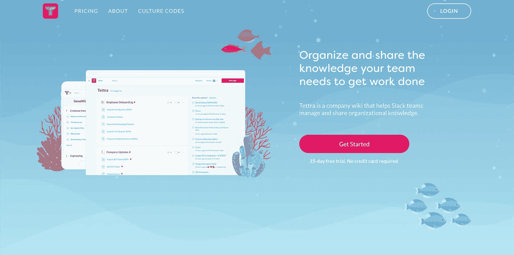
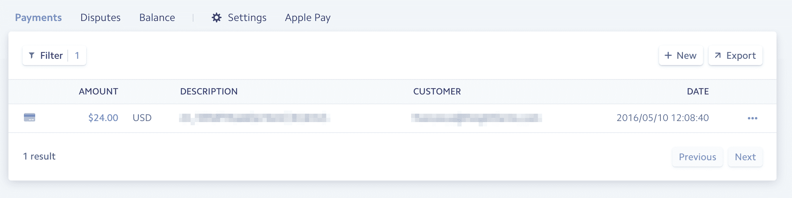
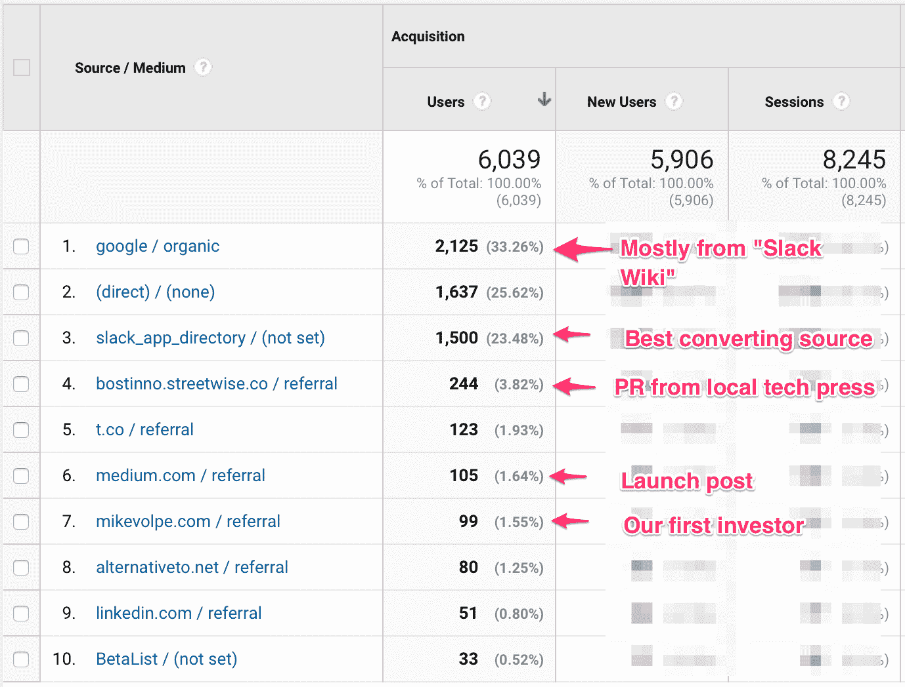
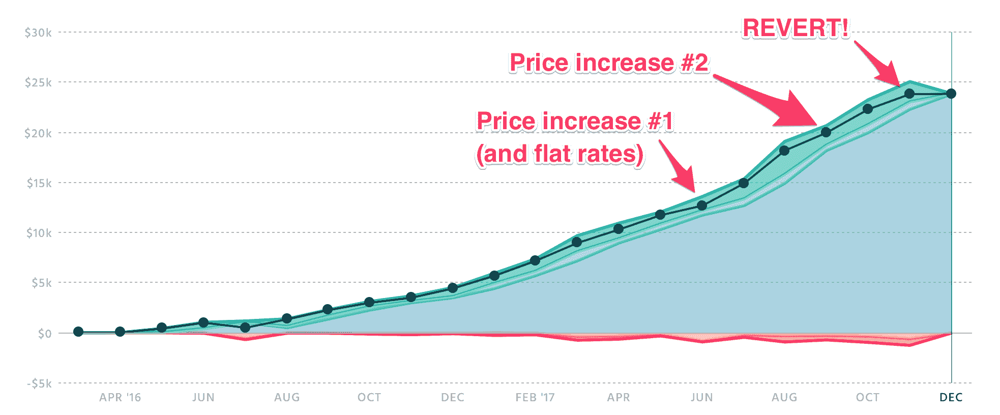

# 向公司的空闲团队提供 Wikis，每月产生 25，000 美元的收入

> 原文：<https://www.indiehackers.com/interview/generating-25-000-mo-offering-wikis-to-company-slack-teams-f7e811e0c2>

## 你好！你的背景是什么，你在做什么？

大家好，我是 Nelson Joyce，一名产品设计师，也是 Tettra 的创始人之一。自 2010 年以来，我一直在设计和制造 B2B SaaS 产品。

Tettra 是团队记录过程、项目和知识的交流工具。大多数工作工具，如聊天、项目管理和电子邮件，都是快速和事务性的。Tettra 是为分享信息而建立的，这些信息需要更深入、更深思熟虑的撰写，如产品规格或公司范围的更新。

向你的团队提供信息可以让他们做出更好的决定，因为他们有更多的背景。你可以把它想象成传统公司维基的新版本。

在我写这篇文章的时候，我们已经有大约两年的时间了，拥有超过 300 个客户，每月经常性收入为 23，844 美元。

 

## 是什么促使你开始接触 Tettra？

在我们创办[tetra](https://tettra.co)之前，我和我的联合创始人安迪在一家名为 HubSpot 的大型上市公司内部进行一个“秘密项目”。只有我们两个人在这个项目上工作了一年多，我们积累了大量困在脑子里的知识。

一旦我们的产品开始得到一些关注，我们的老板决定增加更多的人到我们的团队。由于我们一直对我们的项目讳莫如深，试图将所有这些积累的知识传达给我们的新团队成员是极其痛苦的。

预计到必须与新队友做同样的事情，我们寻找一个简单的知识库工具来共享所有的知识。我们没有找到一个我们想要的工作方式，所以我们决定离开 HubSpot，建立自己的。

由于 HubSpot 几年前已经上市，我们能够出售一些股票，在最初的六个月里自筹资金。

## 构建最初的产品需要什么？

尽管我和我的联合创始人都是技术人员，但我们并没有直接从事建筑工作。在编写一行代码之前，我们花了大约六周时间进行初步的客户访谈。

至于找到要采访的人，我们在自己的个人网络上发帖，做了一些老的冷接触。这里有一篇[关于我写的那些策略的更深入的帖子](https://medium.com/@nelsonjoyce/4-strategies-we-used-to-get-over-100-customer-interviews-c7577429453a)。

当我们让人们接受采访时，我们询问了关于共享内部信息的痛点，特别是当前的 wiki 和文档解决方案。以下是我写的一些面试提问的技巧。

基于这项研究，我们能够在 2015 年 11 月构建一个原型，让一些人尽快使用。实际上，我们刚刚派生了一个名为 P2 的 WordPress 插件，并为最初的测试版用户做了一些修改。这不是我们计划扩展到成千上万用户的完美生产环境；这是一个简单的 WPEngine 设置，只是为了让少数测试用户开始学习该产品。

坏消息是，一旦我们推出了最初的原型，没有人最终参与其中。好消息是我们只花了几个星期而不是几个月的时间来建造一些东西。巧合的是，在我们从头开始的时候，Slack 发布了他们新的平台生态系统。当我回顾我们最初做的所有研究时，我注意到我们交谈过的每个团队都使用并喜欢 Slack。

我们决定做出改变，并在圣诞节和新年前后的两周时间里重建了一个全新的原型，100%用于 Slack。当我们在一月的第一周向公众推出新的 Slack 原型时，我们在头几天就有数百人注册。这是我们需要在这种松弛优先方法上加倍努力的验证。[这里有一个帖子](https://thinkgrowth.org/building-on-slack-saved-our-startup-94953fdaf27a)，你可以在那里读到关于这个过程和结果的更多细节。

在这一点上，我们决定为了抓住 Slack 平台的所有新需求，我们需要提高我们的开发速度。问题是我们几乎用完了投入这项业务的资金。我们要么做合同工作，要么试图筹集一个小天使轮来资助继续发展。

天使轮允许我们聘请一名全职工程师，并重建产品(又一次！)为未来的发展打造一个可扩展的平台。我们选择[在 Laravel](https://medium.com/team-tettra/our-tech-stack-highlights-7a7c23013e9f) 上构建产品，因为它已经内置了很多功能，可以让您快速简单地启动并运行。关于在几个月内完成这一轮谈判的更多细节，请看本期播客。

我们花了 3 月和 4 月在 Slack 平台上构建了这个新版本，并于 2016 年 5 月 10 日注册了我们的第一个付费客户。

 

所以从开始到第一个客户，我们花了七个多月的时间学习和迭代。

## 你是如何吸引用户和发展 Tettra 的？

我们在 2016 年 5 月公开推出了新产品，并发布了一篇[中期文章](https://medium.com/team-tettra/tettra-an-internal-wiki-built-for-slack-teams-edbcf2d388f0)宣布了“公测”和我们的资助。

那篇文章立刻被当地科技刊物 Bostinno 转载。

我们围绕所有可以尝试的渠道进行了一次头脑风暴会议，并遵循[牛眼框架](https://medium.com/@yegg/the-bullseye-framework-for-getting-traction-ef49d05bfd7e)对其中一些渠道进行了优先排序。这是我们进行头脑风暴的真正的 [Tettra 页面](https://app.tettra.co/teams/tettra/pages/launch-channels)。

通过一个走向市场战略，专注于一个目标用户的一个用例。这对资源匮乏的小公司来说更为重要。

TweetShare

我们向所有社交网络(Linkedin、脸书、Twitter 等)进行了典型的分享。).

在发布之前，我们[在 Betalist](https://medium.com/team-tettra/startup-first-steps-post-on-betalist-c53fccc9f982) 上发布了消息，有大约 65 人在等候名单上。我们还发布到所有典型的目录，如 Stackshare、Siftery、Capterra 和 Alternativeto。正如你在下面的图表中看到的，只有 Betalist 和 Alternativeto 最终驱动了大量的流量。

我们决定等到产品更加充实，我们的销售渠道开始小规模运作时，再在产品搜索上发帖。大约六个月后，我们发起了产品搜索，获得了 700 多张赞成票，成为了那天的第三名。这是[实际的 Tettra 页面](https://app.tettra.co/teams/tettra/pages/product-hunt-launch-plan)，我们用它来计划产品搜索发布。

**松弛平台**

当然，另一个巨大的试用来源是 Slack 应用目录。根据我们的经验，我强烈建议在 Slack、WordPress 或 Shopify 这样的平台上发布。

有一整块的功能，你可以基本上“外包”给平台。对我们来说，这就是身份验证、用户管理和对“工作图”的访问。你还可以从母平台获得免费分发，以及你可以吸引的明确的目标人物角色。

这其中肯定有风险，但在我们看来，收益大于风险。在这里，你可以查看我的联合创始人安迪关于[为什么你应该推出一个平台](https://thinkgrowth.org/building-on-slack-saved-our-startup-94953fdaf27a)的更多细节。

**“新兴”关键词**

我们也很幸运，很早就跳到了“Slack Wiki”关键词，并从一开始就排在了前几名。当时这个词没有太多的竞争，我们能够保持非品牌谷歌搜索结果的榜首。我们所做的只是将术语“Slack Wiki”放在我们网站的标题标签和标题中，这足以为一个新术语排名。

**结果**

 

这些是 5 月 1 日到 7 月 31 日到[tettra.co](https://tettra.co)上线后的流量来源。如你所见，大部分流量来自谷歌和 Slack。这两个最重要的渠道也占了试验的 50%。

**漏斗底部**

一旦我们让人们注册试用，我们就让尽可能多的人在屏幕上分享，让他们浏览产品，并在手机上收集他们的信用卡信息。

我们试图继续推广基于演示的内部销售行动手册，但经过多次推动，我们无法让它发挥作用。问题是产品足够简单，我们销售给足够小的团队，他们只是想开始正确地使用产品，而不想做演示。这是让机器开始运行的一个很好的方法，但是它不适合我们。

我们现在的策略是通过电子邮件、入门资源和聊天支持进行“无接触”销售。我们仍然处于这种转变的早期阶段，所以一旦我们看到结果，我将不得不在论坛上报告数据。

## 你的商业模式是什么，你是如何增加收入的？

我们推出了最初的产品，完全没有计费集成——我们只是通过电话收集客户的信用卡，并手动输入到 Stripe 中。没有什么能阻止任何人去 app.tettra.co 免费使用该产品。但是当然没有人知道。这为我们节省了几天的开发时间，并让我们可以立即开始销售。

从那以后，我们测试了一系列不同的定价模型。

我们从每个用户每月 5 美元开始。理由是这是相同的机制，但比 Slack 的定价少。由于客户的反馈，我们最终将定价改为用户的扁平“捆绑”。我们也看到人们需要几个月的时间来添加他们的团队成员，所以我们在新客户的头几个月只收取 5-15 美元。

当我们改为统一定价时，我们看到平均销售价格大幅上涨。我们开始通过做更少的工作来赚更多的钱，这是一个双赢的局面。

我们试图第二次提高价格，虽然我们仍然看到客户注册，但试用数量大幅下降。你最终会用更高的收入换取更少的客户，所以我们决定降低产品档次，以吸引适当规模的客户。

目前，我们使用基于功能的较低“基础”价格(起价 60 美元/月)，并围绕用户捆绑包建立了第二个定价轴。我们认为这是一个很好的平衡，在开始时不会太吓人，随着时间的推移，随着客户使用产品越来越多，客户帐户也能增长。

 

定价的难就难在你不能真的 A/B 测试，所以要花很长时间才能看到一个改变的结果。即使有 15 天的免费试用，我们仍然需要 6-8 周才能看到任何变化的全部效果。

我的建议是，随着时间的推移，逐渐提高价格，直到你看到你的注册量下降到你不舒服的程度。然后把价格降到这个点以下。

## 你未来的目标是什么？

我们的下一个重要里程碑是实现盈利。我们计划明年 Q2 之前到达那里。

除了盈利能力，达到 100 万 ARR 将是一个伟大的成就，我们认为我们可以达到。漏斗顶端流量的增加、入职漏斗的优化以及来自现有客户群的收入增长都将帮助我们实现这一目标。

做好每件事都比你想象的要花更长的时间。除了保持积极和耐心，你对此无能为力！

TweetShare

我们目前最大的障碍是收购(我知道这很令人震惊)。将足够多的合适类型的人带到你的产品或服务中总是一件棘手的事情。

我预见的另一个挑战是学习如何经营一家盈利的公司。我过去工作过的所有地方都遵循典型的“超增长”创业战略，即利用大量风险投资资金亏本经营。这种方法没有错，只是需要一种不同的心态才能成功。

我们非常看好[布莱斯·罗勃兹](https://twitter.com/bryce)正在开发的 [IndieVC](http://indie.vc) 模型，所以我很高兴能从这个社区中像他这样的人那里学到更多。

## 如果你必须重新开始，你会做什么不同的事？

我们最大的错误是试图一次做太多事情，这表现在我们把燃烧率提高得太高。(后来我们降低了它。)这是一个很常见的错误，我几乎不好意思承认。

筹集资金的一个不利之处是你会得到虚假的安全感。这导致我们试图用销售驱动和产品驱动的模式向太多的目标客户销售。这将我们推向了太多的方向。

通过一个走向市场战略，专注于一个目标用户的一个用例。这对资源匮乏的小公司来说更为重要。

## 对于刚刚起步的独立黑客，你有什么建议？

睡觉。说真的，睡个好觉是我保持快乐和高效的最高“秘诀”。

不要把自己累垮了。我看到许多创始人和技术人员为了完成更多的工作而拼命工作。事实上，从长远来看，这些额外的时间可能会损害你的工作效率。当你在工作的时候，努力工作，但是当你在家的时候，让你的身体和精神得到休息，去处理未来的事情。

做好每件事都比你想象的要花更长的时间。除了保持积极和耐心，你对此无能为力！许多产品之所以成功，仅仅是因为它们没有被收购和/或关闭。

了解定价。你能为你的企业做出的最有效的改变之一是适当的定价策略。我*高度*推荐阅读[Patrick Campbell](https://blog.profitwell.com)以 PriceIntelligently 方式撰写的所有书籍——特别是 [SaaS 定价电子书](http://www.priceintelligently.com/saas-pricing-strategy-ebook?__hssc=263140243.2.1482463892066&__hstc=263140243.8b221627a570d9492f726532b7acd60e.1470410574392.1481197338430.1482463892066.7&hsCtaTracking=fa9d47ed-c0a8-4e81-9e20-37d52b0eb473%7C21329f3c-657d-49e5-be40-9e1fdfc59f64)。我们花了太长时间才把这件事做好(而且还有改进的空间！).

了解“市场/产品/渠道/模式契合度”。大多数人关注的是产品和市场之间的整合(又名产品市场匹配)，但是 Brian Balfour 的这个概念已经改变了我对软件业务的理解。

收购可能是你最大的挑战。大家都低估了获取客户的难度，尤其是我们这些黑客类型。几乎所有伟大的公司都因分销优势而获胜。

## 我们可以去哪里了解更多？

如果你对改善团队的沟通和透明度感兴趣，[试试 Tet tra](https://tettra.co?utm_source=indiehackers&utm_medium=referral)并让我们知道你的想法。很高兴在下面的评论[或 Twitter](https://twitter.com/nelsonjoyce) 中回答任何问题。

**如果你已经做到这一步，奖励:**向我们提及这篇文章，我们将给予你前三个月订阅 20%的折扣。

——[<picture id="ember8000398" class="user-avatar ember-view user-link__avatar"></picture>尼尔森·乔伊斯](/Nelson?id=oS7LFpiW6PQTIoGaFrxou8Ad4hf2)，泰特拉的联合创始人

## 想像泰特拉一样建立自己的事业吗？

你应该加入[独立黑客社区](/)！🤗

我们是几千名创始人，互相帮助建立有利可图的业务和副业。来分享你正在做的事情，并从你的同事那里获得反馈。

还没准备好开始使用你的产品吗？没问题。这个社区是一个认识人、学习和实践的好地方。随意[随便浏览](/)！

——[<picture id="ember8000403" class="user-avatar ember-view user-link__avatar"></picture>考特兰艾伦](/csallen?id=ibTLPyjwVebnZjMGKvz6ztarnuV2)，独立黑客创始人

26votes