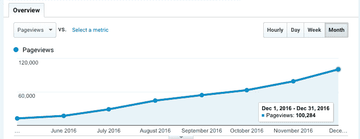
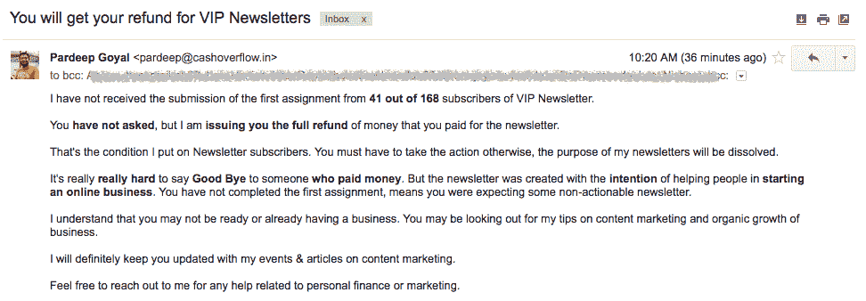

# 从邮件列表订户那里每月获得 3，000 美元的收入

> 原文：<https://www.indiehackers.com/interview/generating-3-000-mo-in-revenue-from-mailing-list-subscribers-c2bce07023>

## 你好！你的背景是什么，你在做什么？

嗨，我叫帕迪普·戈亚尔。本人学历计算机专业毕业，在一家 IT 软件公司工作了七年多。2014 年，我辞去了无聊的工作，全职投入到我的教育科技创业公司中。第[次创业失败了](https://qz.com/556691/how-my-startup-lost-rs15-lakh-and-shut-down-before-its-first-anniversary)，但是我决定不回去做我的 IT 工作。

我学会了讲故事和写作，以探索内容营销的机会。 [Cash Overflow](https://www.cashoverflow.in/) 是一个在线门户网站，我在这里分享我的省钱妙招。人们喜欢我的故事，因为我分享了在旅行、购物、税收和投资方面省钱的可行步骤。

我从 2015 年开始做现金溢出，直到 2016 年 9 月才开始尝试货币化。仅在 9 月份，我的网站就收到了来自 30，000 名独立访客的 50，000 次浏览量，并且我能够[创造 1，000 美元的收入](https://www.cashoverflow.in/first-income-report-september)。现在我的月流量高达 10 万次浏览量，每月收入超过 3000 美元。

12 月增长。

## 是什么促使你着手现金溢出？

我开始[现金溢出](https://www.cashoverflow.in/)作为副业。我喜欢谈论个人理财，所以我开始写自己在信用卡、银行、保险、股市和节税方面的经历。

2015 年学了很多内容营销的东西，所以需要一个入口去实验和学习。现金溢出只不过是一个实验室仪器。

2016 年加入一家创业公司，担任内容营销负责人。在向初创公司创始人推荐之前，我首先尝试了关于现金溢出的高风险内容营销实验。

## 构建最初的产品需要什么？

我的创业失败教会我尽可能推迟产品开发。在我第一次创业时，我们为学校开发了 ERP(企业资源规划软件)，后来却发现没人需要我们提供的东西。

付费时事通讯是我在 [Cash Overflow](https://www.cashoverflow.in/) 上的第一个产品。很多人都向我咨询创业技巧，但只有不到 10%的人认真执行。我决定过滤掉那些浪费我时间的人，以减少噪音。

我只花了一天时间就建立了一个登录页面并建立了一个支付系统。目前，我收取不到 10 美元的一次性通讯费，有效期至 2017 年底。从下个月开始，我将按月收费。

拖延、抗拒和不承诺比其他任何事情都更能扼杀梦想。

TweetShare

今天，我从付费用户那里收集电子邮件，并在月底将它们汇编成一个新的群组。我每月给每个小组发不同的简讯，这样他们就可以从头开始学习网上商业建设。

这些时事通讯的互动性是任何在线课程的 10 倍。我用以下格式发送它们:

*   时事通讯订户的情况如何
*   一个关于内容营销的有趣而有见地的故事
*   他们应该用来解决特定问题的书籍/资源/课程
*   我的个人故事，我上周做了什么，我正在计划什么
*   对下一期简讯内容的建议

我鼓励他们问我问题，执行我的建议，然后提出更好的问题。我每天花大约一个小时回复邮件。

## 你是如何吸引用户和增加现金流量的？

我的网站流量 80%以上来自谷歌搜索。其余的来自我的客座博文。

开始时，增加现金溢出是困难的。在第一年，我只能产生 10，000 个月的浏览量，然而在过去的 6 个月里，我的一些文章已经像病毒一样传播开来。流量就是这样跃升到每月 10 万次的。SEO 也功不可没。

在我的付费时事通讯发布后，我给我的电子邮件订阅者发了一份通知。我以非常低的价格开始——50 美分——我预计第一天会有 10-15 个订户。然而，在头两天，他们中有超过 150 人转向付费订阅。

我不断提高价格，直到达到每天 2-3 人的注册率。目前，每周有 20-25 名新用户订阅简讯。

一旦你的工作或服务变得出色，你将能够收取更多的费用。

TweetShare

我不确定有多少人会加入付费简讯，因为其他人都在免费分发简讯。然而，有一件事我很确定，那就是只有行动者才会报名参加。

由于最初的低价，很多与我的目标不一致的人都报名了。我让每个人填写一份谷歌表格，以了解他们为什么加入时事通讯，以及他们对我有什么期望。

我让每个人都必须遵守这一条——这是保持他们时事通讯会员资格的一个标准。

我把钱退给了 41 个拒绝或者忘记填表的人。我想坚持简讯的目的(帮助行动者)，而不仅仅是赚钱。

你会得到退款的。

## 你的商业模式是什么？

老实说，我仍然在寻找一种商业模式，这种模式是可扩展的，并且不需要我的积极参与。

目前，我通过以下方式赚钱:

*   付费时事通讯
*   联盟营销(银行、科技和购物)
*   与金融公司的伙伴关系
*   展示广告
*   咨询

我认为付费时事通讯和在线课程有很大的潜力。我不想制作人们购买但永远无法实施的信息化课程和电子书。作为一名营销专家，我能够销售这些产品，但我无法以积极的方式影响人们的生活。

与人直接交流给了我一个学习和教学的机会。作为家长，我知道孩子出于自己的好奇心提问时学习最好。我想激发我的订户的好奇心，这样他们就可以问一些关于网上创业的更好的问题。

## 你未来的目标是什么，你打算如何实现它们？

我在这篇文章中分享了我过去一年的回顾和我未来的目标。

我最初的目标是到 2017 年底帮助 1000 人开始他们的在线业务，无论是电子商店、SaaS 公司、网络或移动应用程序，还是小众博客。

我打算积极地帮助这 1000 人*——握住他们的手，带他们从创意走向赚钱的事业。拖延、抗拒和不承诺比其他任何事情都更能扼杀梦想。我试图关注其中的一些核心问题，而不是仅仅用内容营销策略来解决问题。*

 *互联网上有足够多的免费内容。只是人们不知道如何实施。如果我能让人们对他们的行为负责，他们会发现无论他们开始做什么都会成功。

## 你面临的最大挑战和克服的障碍是什么？如果你必须重新开始，你会做什么不同的事？

最大的挑战是找到自我驱动、充满激情的人在我的团队中工作。在过去的六个月里，我雇佣了两个人，但是我已经让他们走了。我不想只根据技能来雇佣我的团队。对我来说，文化契合更重要。

去年，我试图快速扩大规模，但我专注于太多的事情。我意识到我必须放慢脚步，专注于对我真正重要的事情。

如果你想建立一个自举式的企业，就不要跟随受资助公司的脚步。

TweetShare

如果我不得不重新开始，我会围绕一个特定的主题建立一个由热情的人组成的社区。对我来说，可能是金融或营销。

我会找到 1000 个可以加入我的社区的人，选择其中 100 个来管理社区，并亲自与其中 10 个合作(最好让他们加入我的团队)，他们可以在我不在的时候管理一切。

## 你最大的优势是什么？

我很幸运地得到了 Sameer Guglani 的支持和指导，他是印度之外的创业孵化和加速器集团 [The Morpheus](http://morpheusgang.com/) 的创始人。他们被认为是印度的 Y 组合者，他们的投资组合中有成功的公司，如 [HackerRank](https://www.hackerrank.com/) 、 [Practo](https://www.practo.com/) 、 [CommonFloor](https://www.commonfloor.com/) 和 [Akosha](http://www.akosha.com/) 。此后，他们停止了与新创公司的合作，以便专注于围绕教育、食品和生活建立有意识的社区。

我很幸运，在创业生涯的早期就尝到了失败的滋味。这给了我理智去做对客户有价值的事情。我也很幸运有朋友在我的创业之旅中帮助过我。

我从未想过我能在市场营销领域建立起自己的职业生涯，因为我来自一个没有任何写作或营销教育的技术背景。

我关注了 100 多个关于金融和营销的博客，去年我读了 24 本书，其中最有影响力的两本是尤瓦尔·诺亚·哈拉里(Yuval Noah Harari)的《智人》(T0)和本·哈迪的《T2 滑流时间黑客》(T3)(免费)。

## 对于刚刚起步的独立黑客，你有什么建议？

如果你想建立一个自举式的企业，就不要跟随受资助公司的脚步。

专注少一点，做得更好。正如赛斯·戈丁所说，“变得非凡。”一旦你的工作或服务变得出色，你将能够收取更多的费用。

阅读与你现在工作相关的书籍和博客。去年对我有用的书今天对我不再有用了。

## 我们可以去哪里了解更多？

你可以查看我的网站[现金溢出](https://www.cashoverflow.in)，并通过 Twitter ( [@pardeepg](https://twitter.com/pardeepg) )与我联系。

我喜欢围绕内容营销和有机业务增长进行有意义的对话。下面有什么问题可以随时问我。

—[<picture id="ember5276198" class="user-avatar ember-view user-link__avatar"></picture>帕迪普·戈亚尔](/PardeepGoyal?id=cash-overflow-owner)，现金溢出的创造者

## 想建立自己的企业像现金溢出？

你应该加入独立黑客社区！🤗

我们是几千名创始人，互相帮助建立有利可图的业务和副业。来分享你正在做的事情，并从你的同事那里获得反馈。

还没准备好开始使用你的产品吗？没问题。这个社区是一个认识人、学习和实践的好地方。随意[随便浏览](/)！

——[<picture id="ember5276203" class="user-avatar ember-view user-link__avatar"></picture>考特兰艾伦](/csallen?id=ibTLPyjwVebnZjMGKvz6ztarnuV2)，独立黑客创始人

10votes*