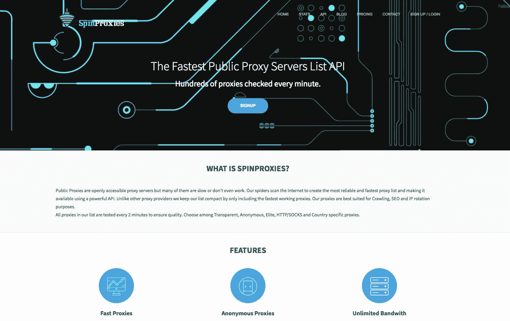
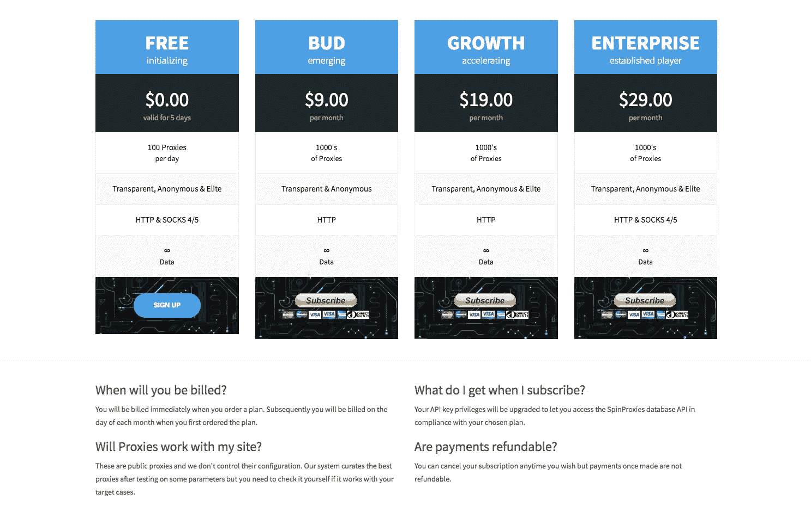
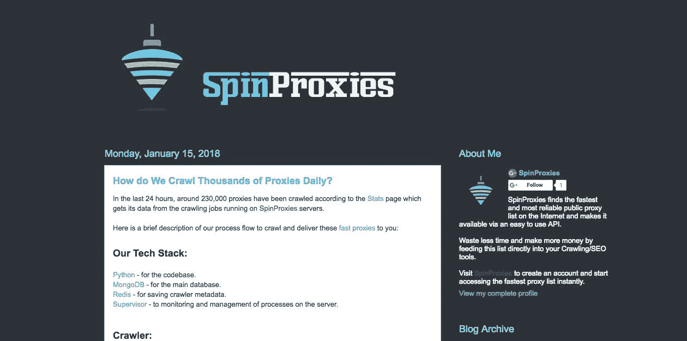

# 通过代理服务器 API 每月创造 300 美元的被动收入

> 原文：<https://www.indiehackers.com/interview/generating-300-mo-in-passive-income-with-an-api-for-proxy-servers-6fa97bf106>

## 你好！你的背景是什么，你在做什么？

你好！我叫 Kaustubh Pratap Chand，是一名远程软件开发人员。我基本上是自学的，自从我 7 年级有了第一台电脑，我就一直在做黑客(从书呆子的角度来说)。

我开发并运行[spin proxy](https://spinproxies.com/)，这是一个获取公共代理的 API。整个系统在没有任何主动干预的情况下运转，每月产生 300 美元的被动收入。

SpinProxies 是我开发的一个工具，主要用于解决我在 web 爬行项目中遇到的一个关键问题。我需要访问快速和廉价的代理，唯一可能的方式是使用公共代理。我尝试的大多数其他工具都没有达到标准。所以我创建了 SpinProxies，希望能为像我一样的人解决这个问题。

 

## 是什么促使你开始使用 SpinProxies？

我曾在几个数据分析系统上工作过，有时我不得不编写爬虫来聚集数据。

获取数据是任何数据管道的第一个也是最重要的组件。有些数据可能只能在特定位置访问，或者您要访问的网站不允许您想要的爬网类型。

在所有这些情况下，你将需要代理，可以通过转换位置，身份和速度来解决这些问题。

你可以租用私人代理，但随着流量的增长，你很快就会产生账单。因此，我尝试了网上大量的公开代理名单，我的经历令人沮丧。大多数代理都不工作或者非常慢。

这是我在项目中经常会遇到的问题，所以我想，“为什么不开发一个实际可行的解决方案呢？”

## 构建最初的产品需要什么？

我花了大约两周的时间安装并运行这个系统。代码全是 Python。爬行器连续扫描前十个公共代理站点，并通过通用解析器从中提取代理，该解析器可以识别页面的结构并标记所有相关数据。

目前，它每天抓取大约 10 万个页面。

这些代理然后被发送到监控模块，该模块测试每个代理的一些参数，如速度、位置和匿名性。由于每分钟都有数千个代理需要测试，所以我使用异步 Python 框架 *Eventlet* ，在不消耗太多资源的情况下加快处理速度。

如果你认为你的产品解决了一个问题，那么你应该尽快把它展示在世人面前。

TweetShare

因为这是一个 I/O 绑定的问题，所以像 eventlet 这样的异步框架工作得很好。当代码等待一个请求的结果时，它可以在同一个线程中触发另一个请求。这有助于保持较低的 CPU 使用率，并控制服务器成本。

我在周末的时候做这个，所以我不需要在我通常的工作日程上妥协，尽管我不得不放弃那些周五的啤酒。

这不是典型的独立黑客的成功故事，但该系统需要我很少的手动干预，并产生足够的影响。

## 你是如何吸引用户和发展 SpinProxies 的？

用户增长是有机的。我基本上只是推出了网站，并给了有限数量的代理免费试用。这让用户可以自己试用产品，看看它是否符合他们的需求。

最初，我在 Fiverr 上雇佣了一些反向链接服务。但是这些对大多数通过有机搜索的用户来说影响不大。

还有一些其他的事情有助于建立一个权威:

*   在 [ProgrammableWeb](https://www.programmableweb.com/api/spinproxies) 上创建页面。
*   在 [GitHub](https://github.com/spinproxies) 上创建 API 的包装器。

这些都是非常低努力的倡议，但我相信他们的目的是成功的。

如果你没有真正的反馈，那么很有可能把你宝贵的工作放在了错误的地方。

TweetShare

论坛、reddit 和 Twitter 上的人工发布等其他方式也有助于宣传。

作为一名程序员，我对编码部分如此着迷，以至于我没有把我应该付出的努力投入到市场营销中。但这是一个需要大力改进的领域。我正在考虑可能有用的新功能，当务之急是做好产品营销，这样我就可以接触到更多的人。

 

## 你的商业模式是什么，你是如何增加收入的？

SpinProxies 的主要收入来源是订阅费。用户订阅三种计划中的一种，每种计划根据可用的代理类型而有所不同。PayPal 是我使用的支付网关，但我也在考虑加入加密货币支付。

其他收入来源是一些经销商网站，他们每月支付佣金，允许在自己的网站上显示 SpinProxies 的代理。

截至目前，SpinProxies 的总用户数约为 500 人，包括非付费用户，其收入约为 300 美元。我唯一的开销就是服务器托管。目前，有一个运行在 OVH 上的 35 美元的 VPS 安装程序，它与优化后的代码完美配合。

## 你未来的目标是什么？

在爬行过程中有几个我正在寻找解决的痛点。这些主要是编程挑战，我希望尽快将它们上线。

另一个主要的增长机会是搜索引擎优化。我正在考虑通过在围绕爬行/代理领域的博客上添加有用的材料来进行内容营销。这个想法是让人们在搜索与这个领域相关的主题时对 SpinProxies 感兴趣。

 

## 你面临的最大挑战和克服的障碍是什么？如果你必须重新开始，你会做什么不同的事？

最具挑战性的部分是搜索引擎优化。

我有一个好用的产品，但是我怎么让别人意识到这个产品的价值？

我意识到，这里的最佳策略是将关键产品功能作为主要卖点。我的目标是使用“最快的代理……”因为我认为这是 spin proxy 的一个优点，也是人们在代理中寻找的最重要的一点。

## 对于刚刚起步的独立黑客，你有什么建议？

*起步快。*

如果你认为你的产品解决了一个问题，那么你应该尽快把它展示在世人面前。很多时候，我们陷入追逐神话般的完美，而这总是在逃避我们。

作为一名程序员，我能理解在你把产品放在世人面前之前尽可能多的打磨产品的倾向。但是如果你没有真正的反馈，那么很有可能把你宝贵的工作放在错误的地方。来自真实用户的反馈是确定你的作品应该放在哪里的唯一方法。

这不是典型的独立黑客的成功故事，但该系统需要我很少的手动干预，并产生足够的影响。

TweetShare

如果它不起作用，那么你仍然领先一步，因为现在你知道什么不起作用，因此，你离真正起作用的东西更近了一步。

我也相信 B2B 领域有很多未开发的机会。通过帮助解决那些解决他人问题的人的问题，可以获得很多收益。

## 我们可以去哪里了解更多？

你可以去 spinproxies.com[的](https://spinproxies.com/)试试看。 [API](https://spinproxies.com/apidocs/) 文档给出了让这个工具为您工作的快速入门。

当我有有趣的事情要说时，我会把它发布在这里的[博客](https://blog.spinproxies.com/)上。

请在下面的评论区告诉我任何问题或建议。

—[<picture id="ember5305148" class="user-avatar ember-view user-link__avatar"></picture>Kaustubh Pratap Chand](/kausality?id=rbnbcfJf6PQZ6PmVRuwMdJL8iFk2)，SpinProxies 的创始人

## 想像 SpinProxies 一样建立自己的事业吗？

你应该加入[独立黑客社区](/)！🤗

我们是几千名创始人，互相帮助建立有利可图的业务和副业。来分享你正在做的事情，并从你的同事那里获得反馈。

还没准备好开始使用你的产品吗？没问题。这个社区是一个认识人、学习和实践的好地方。随便去[随便浏览](/)！

——[<picture id="ember5305153" class="user-avatar ember-view user-link__avatar"></picture>考特兰艾伦](/csallen?id=ibTLPyjwVebnZjMGKvz6ztarnuV2)，独立黑客创始人

24votes