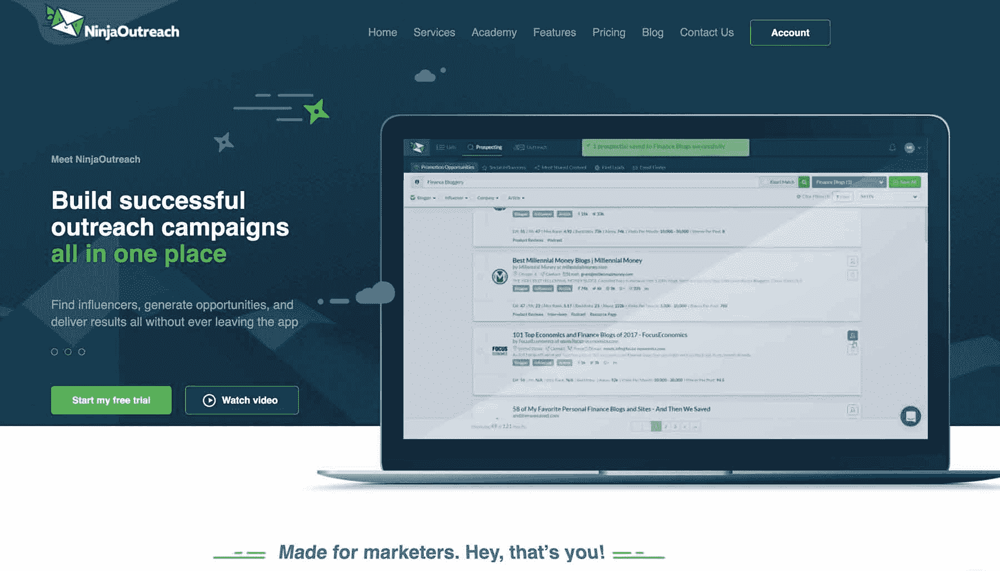
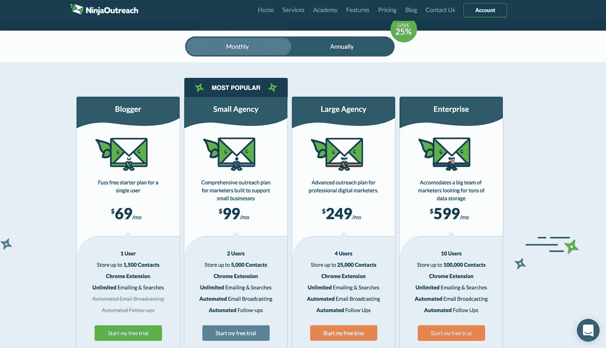
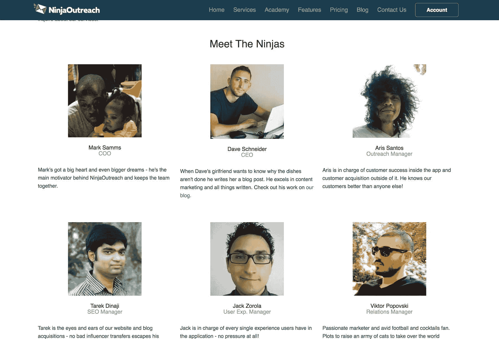

# 每月创收 5 万美元，帮助用户开展推广活动

> 原文：<https://www.indiehackers.com/interview/generating-50k-mo-helping-users-build-outreach-campaigns-9181488c59>

## 你好！你的背景是什么，你在做什么？

我是戴夫，哈佛大学应用数学系毕业生。目前，我是 NinjaOutreach 的联合创始人兼首席执行官，ninja outreach 是一个有影响力的潜在客户和外联工具。

在一家金融机构工作了几年后，我意识到极端的公司生活方式不适合我。于是我辞职了，用自己的积蓄和女朋友一起环游世界。当你最近听到这样的故事时，这听起来很老套，但回想起来，我仍然相信这是我做出的最好的决定之一。

我的工具，NinjaOutreach，帮助代理公司为他们的客户找到可以合作的博客。它被数字营销机构、小企业主、电子商务网站、创业公司和企业家使用。

2015 年第一年年末，我们每月收入 1 万美元。2016 年以后是 30k 美元。上个月，我们净赚了 5 万美元。

 

## 是什么促使你开始玩任天堂游戏的？

在 NinjaOutreach 之前，我有自己的创业博客，“self made 商人”，我的大部分收入来自联盟营销，从来没有真正达到多少。我最终决定转向一个更加基于产品的行业——特别是与软件和数字营销相关的行业——这就是我进入 SaaS 的原因。

当我为集客营销领域的另一位有影响力的人做播客时，我遇到了我的第一位联合创始人马克。原来他也在酝酿着我和他的一个程序员(我们的第三个联合创始人)同样的想法。他做了大量的手动潜在客户，并联系了大量有影响力的人和博客，以展示他的播客，他的程序员说，“嘿，我们可以自动完成大部分工作。”

就我而言，我对手头现有的工具有点失望，因为没有一个工具能提供我推广博客内容所需的特定功能。我们想:为什么要通过使用和购买所有这些不同的工具来弥补功能缺陷呢？

我们还联系了该领域的其他知名营销人员，如 Brian Dean 和 Matthew Barby，他们表示对我们计划开发的类似工具感兴趣，这增加了我们的验证。(事后看来，我们做的验证太少，这使得道路非常崎岖。)

因此，我们建立了一个一体化的工具，我们可以使用一个平台完成所有的潜在客户、电子邮件拓展、活动管理、关系管理等工作。这就是[忍者外联](http://ninjaoutreach.com/)的由来。它是为了解决我们自己对当时用于寻找潜在客户和联系客户的工具和流程的不满。

## 构建最初的产品需要什么？

构思始于 2014 年 6 月。我们花了大约 4 个月的时间建造原型。显然，我们意识到这也能让其他营销专业人士、机构和企业受益，所以我们联系了他们，看他们是否想参与测试。

我们的第三个联合创始人，马克的朋友 Gurpal，做了所有的开发工作。他有一个最初的原型——桌面软件，我们决定在其上构建，因为我们不想从头开始。

马克和我当时的工作是调查竞争对手，为最小可行产品(MVP)制定设计和功能集。因此，我们注册了许多竞争对手的工具，并通过电话采访了许多人，以获得他们的建议。然后我们把它们反馈给我们的开发者。

(顺便说一下，我刚才说的话让我们看起来很清楚自己在做什么。其实我们什么都不知道！结果，我们犯了很多错误，我稍后会谈到。)

我们想:为什么要通过使用和购买所有这些不同的工具来弥补功能缺陷呢？

TweetShare

所以我们努力改进产品。它处于测试阶段大约 2 到 3 个月，到 2015 年 1 月 14 日，我们正式推出。因为所有的错误，没有人从测试版购买，我们基本上不得不重新开始！

## 从那以后，你是如何增加任天堂的收入和用户群的？

为了充实我们的销售流程和定价，我们开始通过 Twitter、电子邮件和 LinkedIn 进行直接销售。他们很快建立起来，并看到结果。最终，我们会选择更长期、更可持续的策略，比如 SEO 和与有影响力的人建立关系。基本上，我们最终会大量使用我们自己的工具。:-)

我们与[勇士论坛](http://www.warriorforum.com/)和 [AppSumo](https://www.appsumo.com) 建立了推广伙伴关系，帮助销售我们的产品，这给了我们更多的链接、流量和曝光率。我们还向许多早期用户提供免费账户，这为我们带来了产品评论和频繁提及。

从我们在 2015 年 1 月推出到同年 7 月，该业务的月经常性收入从 0 美元增长到约 3000 美元(MRR)。当时我们只有 100 个订户。然后我们提高了价格，到 12 月份，我们能够达到我们的第一个目标:1 万美元的 MRR。之后，我们停滞了几个月。

正是在这一时期，我认为我们已经达到顶峰，这是我们所能获得的业务。我们在第一年有一个糟糕的开始，我们已经没有主意了。

我们最大的错误来自于没有做足够的研究，没有和足够多的人交谈。

TweetShare

当我做出艰难的决定，让 NinjaOutreach 吸收我的第一个博客“白手起家的商人”时，我们度过了难关。我们从那里重新发布文章，并将所有链接重定向到[任天堂](http://ninjaoutreach.com/)。这导致了流量和注册人数的大幅增长。

我们跟进了其他商业网站的收购，以及断开链接和竞争对手的链接建设活动，这导致了更多的流量和注册。

对于内容营销，我们最有效的产生权威的方法之一是建立专家综述。我们选择一个相关的主题，并从几十个有影响力的人那里收集答案。这通常会导致大量的参与和反向链接。我们还发布了客座博文，并在博客上加入了与我们的目标受众一致的播客。

最终，我们通过达到 [$20k 每月经常性收入](https://www.reddit.com/r/Entrepreneur/comments/42botq/in_september_2014_we_set_a_goal_to_build_a/)改变了那个糟糕季度的进程，并最终以 [$30k MRR](https://www.reddit.com/r/Entrepreneur/comments/5rmdi9/last_year_we_set_a_goal_to_grow_our_saas_business/) 结束了这一年。

回顾过去，我明白了糟糕的一年并不一定意味着你的生意注定要失败。你会碰壁一段时间，但你必须不断尝试，用尽你所知道的一切，然后放弃。我们已经利用了我们能找到的每一个机会！

## 你们的价格变化了多少？

我们最初完全依靠订阅收入，我们的价格从 19 美元到 149 美元不等。现在我们有几个价格从 49 美元到 599 美元不等的计划，我们还在测试不同的定价计划。

 

## 你未来的目标是什么，你打算如何实现它们？

从单纯依赖我们的工具获取收入，我们已经推出了其他盈利途径。我们现在有了[忍者学院](https://ninjaoutreach.com/academy/)，一个在线商业指导服务，还有我们的[代劳服务](https://ninjaoutreach.com/done-for-you-outreach/)，比如线索生成、拓展、链接建设和博客写作。

虽然这些服务没有软件大，但它们很好地增加了我们的总收入，并为业务增加了新的维度。我们 2017 年的下一个收入目标是 8 万美元/月。

## 你在旅途中遇到过什么样的挑战？

嗯，所有的事？

正如我之前提到的，我们在 MVP 上犯了很多错误。我们把它做成桌面应用；使用贝宝为我们的支付处理器；有一个丑陋、不直观的设计；雇佣额外的廉价开发人员，他们的工作质量很差；未能与足够多的客户交谈；用错了工具。

你会碰壁一段时间，但你必须不断尝试，用尽你所知道的一切，然后放弃。

TweetShare

我知道这听起来像是我在夸大其词，也许我有一点，但这是有很多道理的。

不可避免地，错误会发生。但是我们最大的错误来自于没有做足够的研究和没有和足够多的人交谈。如果一个决定很重要，花时间通知自己！

## 你没有和顾客谈过哪些事情？

我们不会和客户谈论我们认为显而易见的事情。

比如，我们没有问他们用的是 PC 还是 Mac。我和我的伙伴使用 PC，我只知道使用 PC 的人，我看了维基百科上的市场份额，上面说 PC 代表了 90%的市场。因此，鉴于我们已经有了一个原型，为 Windows 开发一个桌面应用程序似乎并不是一个坏主意。我还知道其他几个类似的工具。例如，MassPlanner 多年来一直是一款 Windows 专用的桌面应用。

我们没有问他们如何购买软件。他们用的是贝宝账户、信用卡还是别的什么？

我们没有问他们是否习惯使用桌面应用程序。

对此没有好的补救办法。最终，当人们开始试用该软件时，他们会对我们大喊大叫，这变得非常明显，我们需要与 Stripe 集成，我们需要一个 web 应用程序等等。这种转变是漫长、痛苦和代价高昂的。

## 你最大的优势是什么？有什么特别有用的吗？

就工作流程而言，我们在开始时更加敏捷。只有三个联合创始人，所以这是一个多任务环境，每个人都参与各种任务，决策也很快做出。

从那时起，我们已经成长为一个大约 15 人的团队，他们的角色是灵活的，但是随着我们不断提高我们的标准，人们已经开始专业化。有一些工作流程我们需要解决，特别是因为团队的产出量导致了更多需要组织的内部文档。

 

## 对于刚刚起步的独立黑客，你有什么建议？

因为这是我学到的最昂贵和来之不易的教训之一，所以我经常重复的是，当谈到建立你的业务时，要注意从一开始就启动一切——尤其是如果它与基础设施有关。

如果你有一个产品，确保你雇佣了高质量的员工，因为在我看来，产品质量胜过营销。

此外，在为你的产品推出像支付处理系统这样至关重要的东西之前，要对你的目标市场进行适当的研究。

## 我们可以去哪里了解更多？

如果你想知道更多，你可以通过[【电子邮件保护】](/cdn-cgi/l/email-protection)或者在 Twitter [@ninjaoutreach](https://twitter.com/ninjaoutreach) 联系我。

我还在 Reddit [这里](https://www.reddit.com/r/Entrepreneur/comments/5rmdi9/last_year_we_set_a_goal_to_grow_our_saas_business/)和[这里](https://www.reddit.com/r/Entrepreneur/comments/42botq/in_september_2014_we_set_a_goal_to_build_a/)发布了更多关于我们旅程的细节。

最后，你可以在我们的博客[上阅读更多关于我们的 NinjaOutreach 的故事。](https://ninjaoutreach.com/story/)

## 更新(2018 年 8 月 9 日):

戴夫不再运营这些网站，但可以在 [lesschurn.io](http://lesschurn.io/) 和 [daveschneider.me](http://daveschneider.me/) 找到。

—[<picture id="ember7997421" class="user-avatar ember-view user-link__avatar"></picture>忍者联盟](/ninjadave?id=YPHWQVI8Y4RggBonBZLoIEqSMK23)，忍者联盟联合创始人

## 想像 NinjaOutreach 一样建立自己的事业？

你应该加入独立黑客社区！🤗

我们是几千名创始人，互相帮助建立有利可图的业务和副业。来分享你正在做的事情，并从你的同事那里获得反馈。

还没准备好开始使用你的产品吗？没问题。这个社区是一个认识人、学习和实践的好地方。随意[随便浏览](/)！

——[<picture id="ember7997426" class="user-avatar ember-view user-link__avatar"></picture>柯特兰艾伦](/csallen?id=ibTLPyjwVebnZjMGKvz6ztarnuV2)，独立黑客创始人

3votes