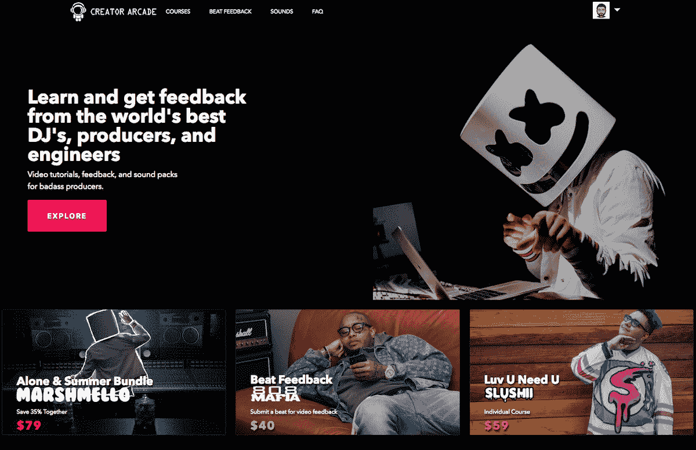
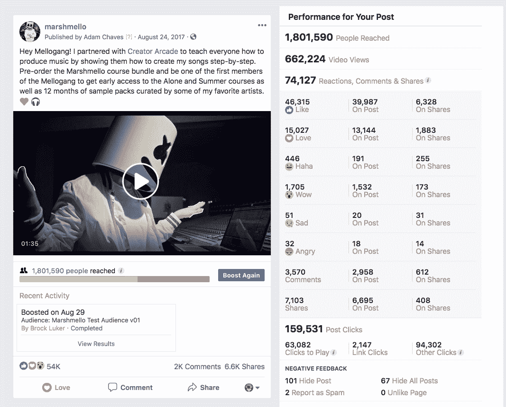
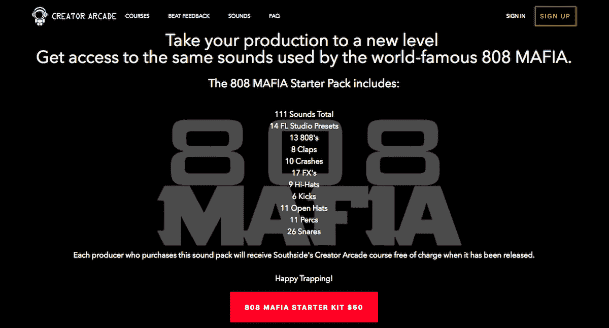

# 教授我们喜爱的工艺，每月产生 7500 美元

> 原文：<https://www.indiehackers.com/interview/generating-7-500-mo-teaching-the-craft-that-we-love-0936ba4fe5>

## 你好！你的背景是什么，你在做什么？

嗨，我是布洛克·卢克，我是一名企业家，执行制片人，在加州洛杉矶经营 808 黑手党唱片公司。在过去的 10 个月里，我和我的联合创始人[克里斯·墨菲](https://www.linkedin.com/in/rchrismurphy/)一直在从事 [Creator Arcade](http://www.creatorarcade.com) 的工作，这是一个音乐教育平台，允许有抱负的音乐制作人向世界上最好的 DJ、音乐制作人和工程师学习并获得反馈。

如今，我们通过销售课程、个性化节拍反馈和声音包，每月可以赚到大约 7500 美元。

## 是什么促使你开始玩 Creator Arcade？

2016 年 11 月，在 2014 年他们收购了我的第一家创业公司 [Engodo](https://techcrunch.com/2014/09/22/zefr-engodo/) 后，我在 [ZEFR](https://zefr.com/) 担任产品开发副总裁。Engodo 是一个社交分析工具，主要用于帮助公司识别广告活动的正确影响者。在创建 Engodo 的过程中，我亲眼目睹了如何战略性地利用影响者来推出公司和产品，并且我知道下次我创建东西时，我会想办法让影响者参与进来。

Creator Arcade 的想法来自于我在亚特兰大巡回拜访 Marshmello 的时候。他的经纪人 Moe Shalizi 是我的好朋友，我会在他巡回演出期间飞去见他们。在他的节目开始之前，我们都出去吃了晚饭，Moe 向我展示了他的一个朋友，她成为了一个“化妆”教程的影响者，并建立了一个网站，人们可以在那里购买她的课程。

我开玩笑地说，我们应该开设一门课程，让学生们学习如何重新创作马希梅洛的歌曲。莫伊看着我说，“我们真的应该……”我说，“嗯……好吧。让我们试一试。”

 

当我思考这个行业会变成什么样时，我把我学习编程的方式和音乐创作的方式进行了对比。我最喜欢的编程教程网站之一是 [Code4Startup](https://code4startup.com/) 。他们提供基于项目的视频教程，教你如何编码。比如你可以通过一步一步的搭建 Airbnb 的轻量级版本来学习 Ruby on Rails 和 Postgres。我总是从做/构建一些东西中学到最好的东西，所以我采用了 Code4Startup 方法来制作音乐教程。

在我看来，通过从头开始学习如何创作一首歌来学习音乐是有意义的。你不会一开始就成为一名专业的制作人，但你会学到像 Marshmello 这样有才华的 DJ/制作人所使用的工具、技术和框架，你可以将它们应用到你自己的混音中。另外，我觉得和你最喜欢的艺术家一起创作一首歌会很酷。

## 构建最初的产品需要什么？

Chris 和我都在 ZEFR 全职工作，但因为我们对与 Marshmello 这样的人一起工作的前景如此兴奋，我们决定牺牲我们的夜晚和周末来获得一个 MVP。

最初，我们开始在 Rails 中构建平台，但是一个名叫 Kirk Ouimet 的朋友鼓励我们使用 firebase 构建后端，因为它很便宜(基本上是免费的)，并且可以根据我们想要构建的内容轻松扩展。更不用说 Google 使得构建认证变得极其简单。我们在 React 中构建了 web 应用程序，并修补了构建自己的视频播放器的想法，但我们决定使用像 [Wistia](https://wistia.com/) 这样的服务会更容易。因为我们决定使用 Wistia 来托管我们的视频，所以我们真正需要做的就是建立一个漂亮的付费墙。

如果我可以重新开始，我会更认真地记住一个结局，并战略性地思考如何实现这个结局。

TweetShare

正如我们所看到的，我们需要启动和运行的基本要素是:

*   用户创建帐户的一种方式(脸书认证)
*   课程
*   用户探索课程的一种方式
*   一种收集信用卡信息的方法(条纹)
*   自动化电子邮件

很明显，我需要花大部分时间整理课程和拍摄内容，所以在我完成最初的设计后，Chris 完全控制了编码。构建课程是 Creator Arcade 最具挑战性的部分。Marshmello 以前从来没有教过课程，所以我请来了我的一个朋友，名叫[Andrew Law](https://www.linkedin.com/in/andrew-law-51448871/)——他是一名受过专业训练的工程师，曾在 [Rob Cavallo](https://en.wikipedia.org/wiki/Rob_Cavallo) 手下工作——帮助指导我们如何安排他的课程。一旦我们最终确定了课程安排，我们就连续坐了两天，用 [ScreenFlow](https://www.telestream.net/screenflow/overview.htm) 录制课程。我花了接下来的几个星期编辑视频，直到他们准备好上线。

尽管我在[草图](https://www.sketchapp.com/)中做了大部分的设计工作，我们确实使用了[99 个设计](https://99designs.com/)作为我们的标志，并且我们使用了 [UpWork](https://www.upwork.com/) 来外包一些前端工作，这样 Chris 可以专注于后端。

## 你们是如何吸引用户，壮大 Creator Arcade 的？

当我们仍在构建课程时，我建立了一个登录页面，允许潜在用户提交他们的电子邮件地址，以便在我们推出时第一个知道。在向我的整个联系人列表发送垃圾邮件并在 subreddit[r/EDM production](https://www.reddit.com/r/edmproduction/)上发布链接后，我们设法收集了大约 600 封电子邮件。

大约在我们完成前两个 Marshmello 课程的所有制作前一个月，我在 reddit 上发布了另一个帖子，并要求人们免费查看我们为该课程制作的前十个视频，以换取反馈。他们需要做的就是注册，我会给他们视频。大约有 300 人注册，所有人都给出了有用的反馈。

试图向你不太了解的用户群营销是一个愚蠢的举动，因为你不能正确理解他们的动机。

TweetShare

我们知道，让 Marshmello 成为我们的第一位艺术家是一种银弹，一旦他将它发布到他的社交网站上，就会产生一些严重的牵引力，所以我们决定投资一个宣传片，吸引他的观众，并希望他们到网站上购买课程。

[https://www.youtube.com/embed/PvfzqoimUpo](https://www.youtube.com/embed/PvfzqoimUpo)

在我们正式“发布”的那天，在发布视频之前，我让 Marshmello 在 [Product Hunt](https://www.producthunt.com/posts/creator-arcade) 上发帖。我们得到了惊人的 8 张赞成票(lol)。那天晚些时候，我们在他的脸书主页上发布了我们的宣传视频，然后我们等待着。

 

我们在上市当天赚了**4165**美元。

我们知道，我们不能要求 Marshmello 继续向他的观众发送垃圾邮件，所以我决定我们将开始在脸书和 Instagram 上为视频投放广告，以保持势头。脸书的广告很酷，因为一旦你把[的脸书像素](https://www.facebook.com/business/learn/facebook-ads-pixel)和你的网站联系起来，你就可以向长相相似的观众推销。一开始，我对脸书的广告不太熟悉，但是脸书有一些很棒的[文档](https://www.facebook.com/business/products/ads)，他们允许你一次测试各种各样的广告，并选择那些创造最多销售的广告。

归根结底，我们的大部分销售来自直接/有机搜索和观看我们的 YouTube 推广视频，该视频有超过 150 万的浏览量。我们大约 80%的流量来自 YouTube。

## 你的商业模式是什么，你是如何增加收入的？

Creator Arcade 通过三种不同的方式赚钱:

一:[课程](https://www.creatorarcade.com/explore)

到目前为止，我们有三门课程可供购买。我们的视频课程提供了如何创作歌曲的分步指导。我们还包括出售的每门课程的所有声音、词干文件和项目文件。

*   [独自一人由马什梅洛](https://www.creatorarcade.com/marshmelloalone)
*   马什梅洛的《夏天》
*   [Luv U Need U by Slushii](https://www.creatorarcade.com/SlushiiLuvUNeedU)

二:[反馈](https://www.creatorarcade.com/producerprofile)

一个由策划制作人和工程师组成的平台，任何人都可以将他们的音乐提交给他们选择的制作人，并接收关于他们曲目的视频反馈，以及如何改进的技巧和技术。

三:[声音包](https://www.creatorarcade.com/soundpacks)

顶级 DJ、制作人和工程师策划的免版税声音和样本。

 

当我们开始的时候，我们只有来自 Marshmello 的两门课程。为了增加网站的流量，我们决定花 5000 美元制作一个宣传视频，我们可以在他的脸书、Instagram 和 Youtube 上发布。课程还没有结束，所以我们决定捆绑课程，一旦视频掉线就预售。我们犯了一个巨大的错误，将捆绑包的价格定得太低，尽管预售很成功，但事后看来，如果我们将捆绑包的价格提高一倍，我们的预售收入就会增加一倍。

| 月 | 收入 |
| --- | --- |
| 2017 年 8 月 | 12152 |
| 17 年 9 月 | 16219 |
| 17 年 10 月 | 4361 |
| 17 年 11 月 | 4258 |
| 2017 年 12 月 | 3679 |
| 2018 年 1 月 | 4966 |
| 2018 年 2 月 | 4673 |
| 18 年 3 月 | 9704 |
| 2018 年 4 月 | 6232 |
| 2018 年 5 月 | 3977 |
| 2018 年 6 月 | 3484 |
| 2018 年 7 月 | 3749 |

## 你未来的目标是什么？

在 Creator Arcade 工作最酷的事情之一是近距离观察艺术家如何发展他们的音乐。一旦你学会了一首歌的基本结构，这个过程并不像你想象的那么复杂。我们的许多用户对开始音乐制作感到害怕，但我们以这样一种方式建立我们的课程，即使对新手来说，我们也使这个过程变得平易近人。

我们希望继续推出更多的课程，目标是到 2019 年 1 月拥有足够的内容，开始对订阅模式收费。我们有几个艺术家对每个月创建一个新的课程感兴趣，这对我们来说是朝着正确方向迈出的一大步。

我们建立的另一个功能是 beat feedback platform，它使希望获得混音反馈的学生能够将混音发送给顶级 DJ/制作人和工程师，并获得关于他们曲目的视频反馈、如何改进以及获得关于创建不同声音的提示和技巧。这个功能一发布就带来了收入，我们非常兴奋能够让 [Slushii](https://www.creatorarcade.com/producerprofile/slushii) 成为这项计划的一部分。以下是《808 黑手党》制片人马克斯·洛德的一段视频，我们把它放在了 YouTube 频道上:

[https://www.youtube.com/embed/pvienleUIhQ](https://www.youtube.com/embed/pvienleUIhQ)

我们还对我们的一对一计划感到非常兴奋，该计划为贫困学校和社区提供音乐教育课程和资源。如果你能[提名一所学校](https://www.creatorarcade.com/charity)，我们将不胜感激！

最大的障碍将是生产。不过，我们已经找到了一个解决方法，为我们节省了一大笔钱。如果你在 Youtube 上有 10K 的订户，那么 Youtube 允许你免费使用他们在洛杉矶的空间和所有设备，只要所使用的内容是在它拍摄的频道上分发的。这对我们来说是一件好事，因为我们可以继续免费制作宣传视频，并在艺术家的频道上分发这些宣传视频。这是一个小黑客，但它将在未来几个月为我们节省数万美元。

哪怕是小有成就，都是先难后易。

TweetShare

我们还开始为购买课程的人建立一个私人脸书小组。他们将有机会接触到创建课程的艺术家，并能够向他们提问，获得签名商品和设备等酷东西。

最后，播客是我们非常兴奋的事情。我们将关注一些你最喜欢的歌曲和艺术家背后的创作过程。我们发现，我们的大部分销售来自有机搜索，因此，我们有责任继续建立品牌，并让名字出现在那里。

## 你面临的最大挑战和克服的障碍是什么？如果你必须重新开始，你会做什么不同的事？

我们仍然会犯很多错误，然而最突出的一个错误是，在我们开始建立课程之前，我没有音乐制作的背景。试图向你不太了解的用户群营销是一个愚蠢的举动，因为你不能正确理解他们的动机。最终，我开始联系购买我们课程的用户，询问他们是否愿意与我通话，这样我就可以了解他们购买课程的原因，我们在课程中做得好的地方，最重要的是，我们做得不好的地方以及如何改进。

我严重低估了投入生产所需的时间、计划和准备。我原以为要花几周时间的事却花了几个月，在这方面我太天真了。现在，我们知道一个课程的制作需要两到三个月的时间，还需要另外两到三个月的业务发展时间来完成所有的艺术家协议。这里的关键是保持势头。出于某种原因，音乐行业的每个人都说好，因为他们不想被排除在外，但一旦他们说好，他们就会推迟交易，以便他们可以向其他人购买。

努力为你的业务创造动力，并保持下去。

TweetShare

我们必须克服的另一个障碍是获得歌曲的版权。时至今日，我们所有的艺术家都是独立艺术家，所以获得他们的认可并不困难。但当我们扩展到其他流派时，这肯定会成为一种痛苦，我们将不得不为主要唱片公司制定某种收入分成计划，类似于我们目前给艺术家的分成。

我肯定会做很多事情。如果我可以重新开始，我会更认真地记住一个结局，并战略性地思考如何实现这个结局。当我们推出 Creator Arcade 时，我们并没有一个真正的游戏计划，也不知道它会带来什么，或者事情会如何发展。我们只是把世界放进去，尽最大努力相应迭代。

我还会接触更多的用户，建立一个“可信学习者”社区，为我们提供有价值的、一致的课程创建反馈。同样，我会让课程变得更短、更容易理解，并尝试立刻创建一个循环订阅模式。我们没有表现出应有的耐心，我认为这让我们受到了一点伤害。

## 有没有发现什么特别有帮助或者有优势的？

我非常幸运地与我们的第一批艺术家建立了关系，因为他们并不关心赚钱，而是很兴奋地想看看这是否真的可行。

我们开始我们的课程时，马希梅洛的歌曲[狼](https://open.spotify.com/track/0tBbt8CrmxbjRP0pueQkyU?si=W2m1k_zeQ_yY4cY2ljBWbw)与赛琳娜·戈麦斯和[沉默](https://open.spotify.com/track/7vGuf3Y35N4wmASOKLUVVU?si=uqdzNe1YSpOLMJvCn3j3ww)与哈利德成为超级主流。Marshmello 成为 Spotify 全球排名前五的艺术家。我们从来没有预料到。我们非常幸运，它为我们带来了大量的流量和销售额。

## 对于刚刚起步的独立黑客，你有什么建议

这似乎是显而易见的，但不要在你没有经验的领域创业。你会花太多时间去理解市场想要/需要什么。理想情况下，您有一个想要解决的棘手问题，并且有一个解决该问题的详细策略。

哪怕是小有成就，都是先难后易。希望你的生意能成为你生活的增长机制。创业必须要有坚韧的皮囊，在很多方面都要有点自虐的感觉，这个过程肯定能够也应该激发一些个人成长。

我相信生活是动力的函数，一旦你有了动力，你会觉得你可以冲破任何阻碍。努力为你的业务创造动力，并保持下去。

我最喜欢的几本商业书籍非常有帮助，它们是:

*   [鞋狗](http://a.co/41verUa)菲尔·奈特著
*   大卫·库什纳的《毁灭大师》
*   彼得·d·考夫曼和埃德·韦克斯勒的《可怜的查理年鉴》
*   肖恩·康纳斯的《中国古代军事战略经典》

## 我们可以去哪里了解更多？

您可以在 [Creator Arcade](https://www.creatorarcade.com/) 查看我们的课程。我不怎么写博客，但我总是喜欢一对一的谈话。你可以在 [Instagram](https://www.instagram.com/brockluker/?hl=en) 或者 [Twitter](https://twitter.com/brock_luker?lang=en) 上和我联系。

如果你有任何问题，请在评论中提问。感谢有机会成为独立黑客的一部分！

—[<picture id="ember5245993" class="user-avatar ember-view user-link__avatar"></picture>布洛克·卢克尔](/OakToeBark?id=6XYvPhYnOVUanWqr6hgFmfKfj1X2)，【创造者街机】联合创始人

## 想像 Creator Arcade 一样建立自己的事业？

你应该加入独立黑客社区！🤗

我们是几千名创始人，互相帮助建立有利可图的业务和副业。来分享你正在做的事情，并从你的同事那里获得反馈。

还没准备好开始使用你的产品吗？没问题。这个社区是一个认识人、学习和实践的好地方。随意[随便浏览](/)！

——[<picture id="ember5245998" class="user-avatar ember-view user-link__avatar"></picture>柯特兰艾伦](/csallen?id=ibTLPyjwVebnZjMGKvz6ztarnuV2)，独立黑客创始人

39votes