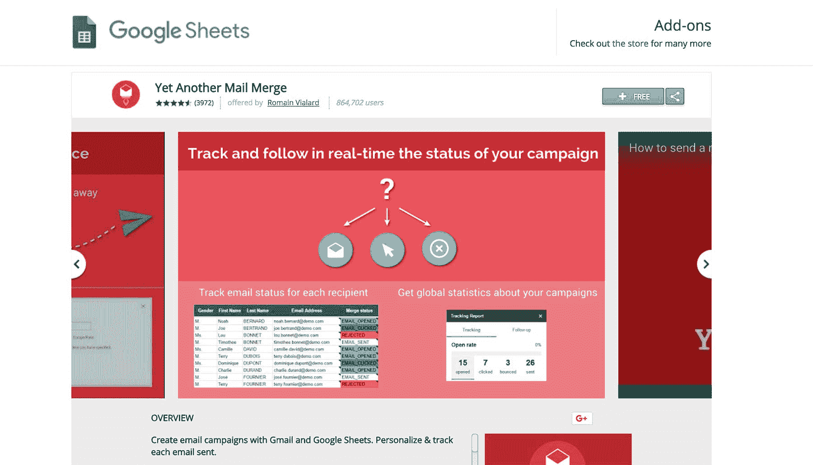
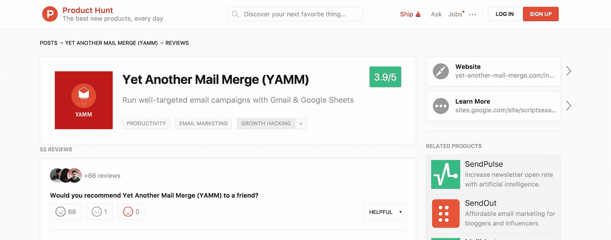
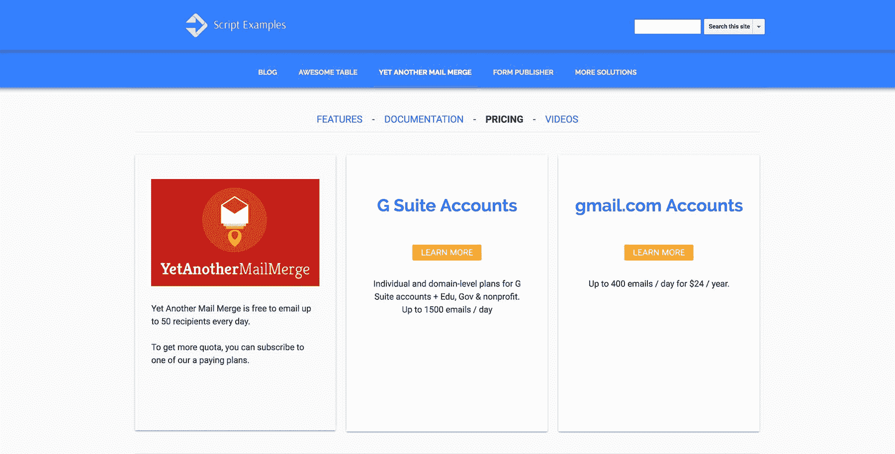

# 通过有机增长方法每月创造 70，000 美元

> 原文：<https://www.indiehackers.com/interview/generating-70-000-per-month-through-organic-growth-methods-3d1d726b51>

## 你好！告诉我们关于你自己和你正在做什么？

你好！我是罗曼·维亚拉德(Romain Vialard)，一名来自法国巴黎的白手起家的程序员，也是[又一个邮件合并(YAMM)](https://chrome.google.com/webstore/detail/yet-another-mail-merge/mgmgmhkohaenhokbdnlpcljckbhpbmef) 的创造者——一个电子邮件营销和电子邮件个性化工具。

感谢我们的用户，我们是 Gmail 的顶级邮件合并插件，拥有超过 860，000 名用户，我们现在每月赚 7 万美元。

 

## 你是怎么想出又一个邮件合并的主意的？

2010 年，大约在谷歌宣布谷歌应用套件脚本的同时，我开始了在法雷奥的实习，这是第一批“走向谷歌”的大型企业之一。然后我在欧洲最大的谷歌 G 套件经销商 Revevol 实习。

在那个时代，商业实习生被期望在微软 Excel 中编写宏来自动化繁琐的任务和过程。当我为那些正在迁移到 Google 生产力工具(Gmail、Google Drive 和 Google Docs)的公司工作时，我选择了 Google Apps Script 来为 Google 电子表格编写宏，这是最适合这项工作的工具。有了它，我创建了许多有用的自动化脚本，提高了生产率。

我创建的一个脚本简化了内部培训注册。我将谷歌日历和谷歌电子表格与谷歌表单集成在一起，并自动化了这个过程。在每次注册结束时，该工具会向注册者发送注册确认电子邮件，其中包含适当的培训详细信息。换句话说，该工具发送带有个性化信息的交易电子邮件。瞧啊。这就是今天的 [YAMM](https://chrome.google.com/webstore/detail/yet-another-mail-merge/mgmgmhkohaenhokbdnlpcljckbhpbmef) 的种子。

## 构建最初的产品需要什么？

另一个邮件合并的第一个版本是基于当时谷歌自己提供的[谷歌应用程序脚本代码样本](https://developers.google.com/apps-script/articles/mail_merge)构建的。我的公司正在为一个客户处理邮件合并需求，项目人员选择 Google Sites 作为邮件合并模板源。对我来说，这似乎是一个相当麻烦的解决方案。

大约在同一时间，谷歌发布了一个新的 Gmail 连接器。它给了我一个想法，在 Gmail 中把邮件合并模板作为草稿。所以我创建了一个脚本，命名为“又一个邮件合并”，并分享到谷歌的应用脚本库中，供其他开发者和用户使用。

谷歌的一些人喜欢这个想法，在发表《YAMM》几周后，我与人合写了一篇[客座博文](https://gsuite-developers.googleblog.com/2011/10/4-ways-to-do-mail-merge-using-google.html)，在这篇博文中，我将它作为使用谷歌应用套件脚本进行邮件合并的几种方法之一进行了展示。

小规模构建，尝试，然后失败。一旦你有了更多的用户，你就可以担心更多的挑战。

TweetShare

第一个版本更像是一个最小可行产品(MVP ),提供的功能仅足以满足早期用户。我花了几个晚上和额外的时间来使它成形。我做这件事不要钱。我第一次与其他开发人员分享我的脚本的 Google App Script gallery 是一个脚本库。人们可以将脚本源代码的副本导入到他们的电子表格中，并将其作为自己的电子表格使用。

新用户继续采用这个脚本。有了这些反馈，我不断完善我的解决方案。与此同时，Google Apps 脚本本身也变得越来越好，给了我改进 YAMM 的新工具。

## 你是如何吸引用户并发展另一种邮件合并的？

2014 年 3 月，谷歌用它的[附加商店](https://drive.googleblog.com/2014/03/add-ons.html)取代了它的应用脚本库，使得用户安装脚本和开发者维护它们变得更加容易。 [YAMM](https://chrome.google.com/webstore/detail/yet-another-mail-merge/mgmgmhkohaenhokbdnlpcljckbhpbmef) 是在附加商店推出的首批 50 个附加产品之一。而且是成功的！这个新市场吸引了许多用户，YAMM 从中受益匪浅。

 

时至今日， [YAMM](https://chrome.google.com/webstore/detail/yet-another-mail-merge/mgmgmhkohaenhokbdnlpcljckbhpbmef) 已经从附加商店的访问者那里获得了 86 万+的用户。我们的增长是 100%有机的。我们作为顶级邮件合并插件的地位以及我们从忠实客户那里获得的正面声誉为我们吸引了更多的新用户。

此外，我们的推荐计划和最近的[产品搜寻发布](https://www.producthunt.com/posts/yet-another-mail-merge-yamm)继续为我们带来新的流量。凭借每月超过 100，000 的活跃用户和每月发送的 2，300 万封电子邮件，YAMM 的新安装保持增长。

## 你的商业模式是什么，你是如何增加收入的？

我们提供 [YAMM](https://chrome.google.com/webstore/detail/yet-another-mail-merge/mgmgmhkohaenhokbdnlpcljckbhpbmef) 作为免费增值产品。该脚本对任何拥有 Gmail 账户的人来说都是免费的，可以每天合并多达 50 封邮件。我们的高级计划以可承受的价格为用户提供了更高的电子邮件配额(Gmail 用户每天 400 封，G Suite 用户每天 1500 封)。我们的收入来自年度订阅和续订。

我们的利润率非常高，因为我们没有在电子邮件服务器上花任何钱(我们使用 Gmail API 发送电子邮件)，也没有支付在谷歌附加商店销售的佣金。

直到 2014 年 9 月，YAMM 还可以在新的谷歌附加商店免费下载。但是在这个市场上的成功意味着我将越来越多的空闲时间花在支持和改进上。当我在假期回答支持请求时，我决定是时候赚钱了。另外，这似乎是一个有趣的挑战。:)

由于 YAMM 是一个批量发送电子邮件的工具，对我来说，基于配额限制而非高级功能来赚钱更有意义。我已经在谷歌分析中收集使用统计数据:2014 年 7 月，我的用户每天发送超过 30 万封电子邮件。其中 97%的人一次发送不到 200 封邮件。

我决定将剩下的 3% (重度用户)作为目标，并将免费版的配额从每天 1500 人(谷歌设定的上限)减少到 200 人。我用 PayPal 为那些想发送更多电子邮件的人迅速推出了一个付费计划。而且成功了！当然，一些用户离开去寻找免费的替代品，但许多人对产品很满意，愿意付费。

在成功地从 100%免费产品转换到免费增值产品后，我做到了(我现在还在做！)进行一些微调，提高价格，或降低免费配额，以尽可能产生最大的收入，同时继续扩大我们的用户群。为此，我知道我必须找到一个解决方案来留住一些不太愿意付费的用户。所以我决定简单地复制 Dropbox，去做一个应用内推荐程序。同样，使用 Google Analytics 跟踪的[插件使用情况有助于我为每个推荐选择正确的配额。](https://gsuite-developers.googleblog.com/2016/01/google-apps-script-tracking-add-on.html)

直到今天，我们的客户仍然觉得 YAMM 物超所值。我们允许通过 PayPal 或信用卡在我们的网站上直接购买 [YAMM 高级计划](https://sites.google.com/site/scriptsexamples/available-web-apps/mail-merge/pricing)。

 

## 你未来的目标是什么？

成长！YAMM 的用户对目前的产品非常满意。所以我的首要目标是让更多的新用户发现并爱上它。

凭借每月超过 100，000 的活跃用户和每月发送的 2，300 万封电子邮件，YAMM 的新安装保持增长。

TweetShare

在接下来的几个月里，我希望看到 YAMM 成为附加商店中安装数量最多的 Google Sheets 附加软件。(现在是第二。)下一个目标是成为第一个安装量达到 100 万的 Google Sheets 插件。

## 如果你必须重新开始，你会做什么不同的事？

我卖掉了我的一个脚本，[Gmail Meter](https://gmail.googleblog.com/2012/04/know-your-gmail-stats-using-gmail-meter.html)——一个发送你的电子邮件使用情况&行为统计月度报告的工具——赚了些快钱。

当时我非常高兴有人愿意给我钱买它。但也许这不是一个好主意，尤其是以低价出售，而随着时间的推移，我完全可以将这个工具货币化。

## 有没有发现什么特别有帮助或者有优势的？

是的。大多是谷歌人和谷歌！

从我深深爱上 Google Apps 脚本的那天起，我就一直在倡导这项技术，并在产品论坛上传播关于它的好消息。就在这个时候，Google Apps Script 的第一位产品经理联系了我，想更多地了解我以及我在实习期间是如何使用 Google Apps Script 的。

后来，他给我寄来了一些糖果和一张手写的明信片，感谢我的贡献。他的姿态让我很感动，他们让我一直保持动力这么久。是他邀请我在 Google Apps 脚本上写第一篇[客座博文。](http://googleappsscript.blogspot.fr/2010/06/custom-reporting-with-apps-script.html)

当插件商店推出时，最初添加到其中的每个插件都经过了彻底的审查和测试，以改善用户体验和用户界面。这意味着谷歌在提供给用户之前要确保每个附加软件的质量。当时负责那些评论的人给了我很大的反馈，告诉我如何改进我的产品。

谷歌非常善于认可和奖励支持其产品的粉丝和人们。我早期与谷歌员工的这种密切关系被证明是足智多谋的。

我是[谷歌开发者专家](https://developers.google.com/experts/people/romain-vialard)，也是[谷歌顶级贡献者](https://topcontributor.withgoogle.com/profile/romain-vialard-b98ce0)。多亏了这些身份，我可以提前接触到谷歌的技术和产品团队。

## 对于刚刚起步的独立黑客，你有什么建议？

尝试创建一个[插件](https://developers.google.com/apps-script/add-ons/)！需求量很大，但没有那么多的报价。还有更多的用例可以用插件来解决，特别是在 Google Sheets 上(因为几十年来，人们一直使用电子表格来构建应用程序，而插件正在使这个过程变得更好)。

我已经能够在这个市场的基础上经营一个成功的企业。仍然有很多机会，谷歌的附加商店足够大，可以让更多的开发者和公司开发新的东西:

*   这是一个活跃的市场，许多用户都在寻找适合他们谷歌技术堆栈的产品。
*   谷歌应用程序脚本很容易使用。创作你的第一个剧本并不需要高超的技术。
*   你可以小试牛刀，然后失败。一旦你有了更多的用户，你就可以担心更多的挑战。

最终，一个有更多新的有趣产品的附加商店不仅对谷歌用户有益，还能为所有可用的附加产品带来越来越多的潜在买家，包括我自己的。

## 我们可以去哪里了解更多？

你可以尝试 [YAMM](https://yet-another-mail-merge.com/install.html?referrer=indiehackers) 为独立黑客提供一个特殊的 3 个月免费高级许可证！

我的其他产品有:

*   [牛逼的表格](https://gsuite.google.com/marketplace/app/awesome_table/56088344336):谷歌电子表格数据的数据可视化工具，有漂亮的视图(卡片、地图、表格、甘特图)。

*   [Form Publisher](https://chrome.google.com/webstore/detail/form-publisher/hgmhbdjdjoahflgfmfpjlgpplihlechm?utm_source=revevol&utm_medium=direct-link&utm_campaign=referral-program) :一个数据合并工具，将 Google 表单提交数据转换成具有预定义布局的文档(可能的格式有 Google Docs、Sheets、Slides 和 PDF)。

我在我的 G+页面上发表关于谷歌技术和我的产品的博文。

感谢您的阅读。请给我留下你的评论。如果你想为谷歌插件商店创建你的第一个插件，欢迎你把我作为一个共鸣板。

—[<picture id="ember5312716" class="user-avatar ember-view user-link__avatar"></picture>罗曼·维亚拉德](/Romain_Vialard?id=XjSHeMFzp9XKAjrSZB81547c2a22)，又一个邮件合并的创建者

## 想像另一个邮件合并一样建立自己的事业吗？

你应该加入独立黑客社区！🤗

我们是几千名创始人，互相帮助建立有利可图的业务和副业。来分享你正在做的事情，并从你的同事那里获得反馈。

还没准备好开始使用你的产品吗？没问题。这个社区是一个认识人、学习和实践的好地方。随意[随便浏览](/)！

—[<picture id="ember5312721" class="user-avatar ember-view user-link__avatar"></picture>考特兰艾伦](/csallen?id=ibTLPyjwVebnZjMGKvz6ztarnuV2)，独立黑客创始人

20votes