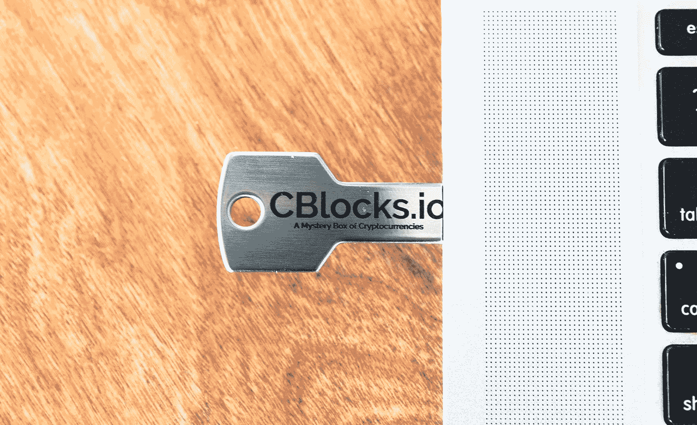
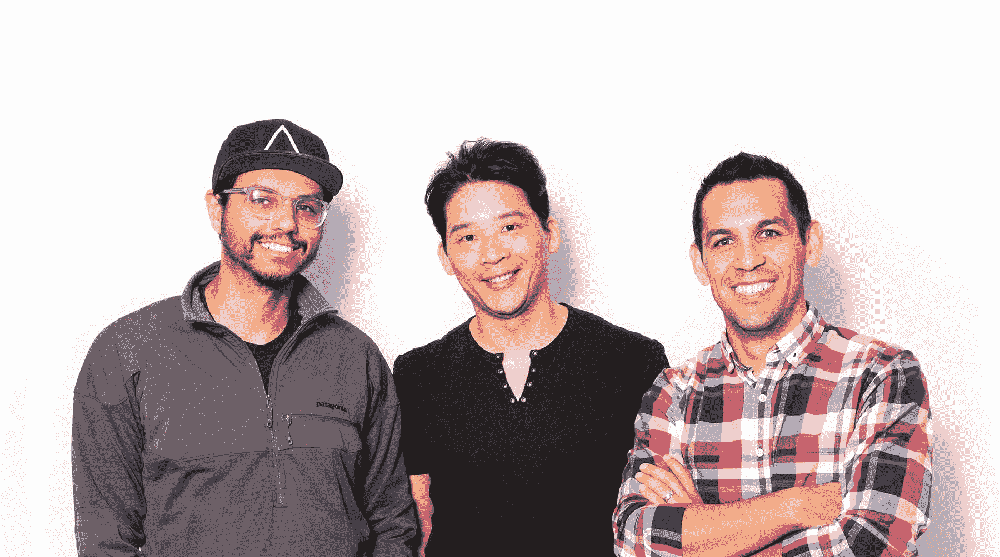

# 领先于加密货币浪潮并创造早期收入

> 原文：<https://www.indiehackers.com/interview/getting-ahead-of-the-cryptocurrency-wave-and-generating-early-revenue-92356ba891>

## 你好！你的背景是什么，你在做什么？

我叫奥斯顿·本生。我是 [CBlocks](https://www.cblocks.io/) 的联合创始人——还有 PK Banks 和 Mario Aguayo。我是一名自学成才的 web 开发人员，有大约 12 年的经验。目前，我是一名名为 [Wyncode](https://wyncode.co/) 的编码训练营的老师。过去，我是一家名为 [LifeWallet](https://www.lifewallet.com/) 的初创公司的 Ruby 开发人员，在此之前，我是一家名为[1Sale.com、年入 1.6 亿美元的公司的首席技术官。自从 2011 年在当地一个名为](http://www.1sale.com/) [Hack & Tell](https://hackandtell.org/) 的聚会上从我的朋友迈克·格林伯格(Mike Greenberg)那里第一次了解到加密货币以来，我一直在学习和涉足加密货币。

CBlocks 是一款向人们介绍排名前 100 位的 5 种随机加密货币的产品，并帮助他们了解管理加密货币意味着什么。

我们制作了一个带有定制软件的 USB，客户可以用它来跟踪他们所持有的密码的价值。我们的客户通常是在技术之外工作的人。他们希望了解更多关于加密的知识，并希望看到、感受和手中持有的加密货币。

我们在一月底发布，第一个月就完成了 3 万多美元的销售额。

 

## 是什么促使你开始使用 CBlocks？

这基本上是一个社会实验。有一天我们一起出去玩，马里奥提到他想深入研究加密技术。我最近看到了一个名为 [cryptoroulette.info](https://cryptoroulette.info/) 的很棒的网站，这个网站会告诉你，如果你在 2017 年的某一天向 6 种随机加密货币投资 1000 美元，你会有多少钱。

这基本上是一个社会实验。

TweetShare

我建议“你应该先投入 1000 美元，然后从这里开始学习。你几乎肯定会赚钱，而且在这个过程中肯定会学到很多关于加密货币的知识。就在那时，PK 说“我最近帮了一个朋友，在账本中预装了比特币，并把它寄给了他。如果我们建立一个网站，任何人都可以在 USB 上获得 5 个随机密码，会怎么样？”

在那一刻，我们都想了大约两秒钟，说:“好吧，是的，让我们这样做”。

现在，如果你对加密货币有所了解，你就会知道你应该**永远不要信任**持有或生成你的私钥的人。你应该知道你买的是什么加密货币，你甚至可能关心对美元的汇率。我们把这些都扔出窗外了。

我们认为尝试这个实验会很有趣:人们会相信我们会为他们购买密码，生成他们的私钥并把它发送给他们吗？

## 构建最初的产品需要什么？

我们都是对成本非常敏感的人，所以我们决定在时间和金钱方面尽可能的节约。我们最终使用了来自 [Landing Lion](https://www.landinglion.com/) 的免费计划和一个 [Stripe](https://stripe.com/) 账户。这些工具使得验证这个想法是否真的可行变得很容易！

马里奥和我周末花了大约 10 个小时完成了这个网站的简单版本，并于周一早上发布。这绝对是一个 MVP 我们写了大概 20 行 Ruby 代码用于简单的支付处理。不过说实话，大部分时间都花在了马里奥写文案和调整设计上。当我们推出时，仅来自朋友和家人的销售额就达到了 300 美元。那时，我们甚至还没有真正的产品。直到有完全陌生的人从我们这里购买，我们才开始创建真正的 CBlock USBs。我们非常重视[精益创业原则](http://theleanstartup.com/principles)。

我们花了很多个工作日的晚上来构建订单执行自动化工具，打印定制 USB，对用户插入 CBlock USB 时看到的实际用户界面进行编码，加密以保护他们的私钥安全，并实际运送客户订单。我想在最初的两个星期里，我们每晚最多只能睡 3-5 个小时。我们从上午 9 点到下午 5 点正常工作，然后我们会到我家，从晚上 8 点工作到凌晨 4 点或 5 点，然后马里奥和 PK 开车回家，早上 8 点醒来又去工作！

总而言之，我们从构思到第一次销售只用了 3 天时间。我们从第一次销售到交货只用了 7 天。我们实际上手工制作了第一批 10 个左右的钱包！

## 你们是如何吸引用户，壮大 CBlocks 的？

在我们发布的前一天，我们向一些网站的记者发送了几封电子邮件，我们认为这些网站可能对撰写关于 CBlocks 的文章感兴趣:确切地说，是 *TechCrunch* 和 *TheNextWeb* 。 [TheNextWeb](https://thenextweb.com/hardfork/2018/01/16/cryptocurrency-mystery-box-cblocks/) 在我们发布后的第二天就结束了回应，这最终滚雪球般地变成了它自己的事情，因为[福布斯](https://www.forbes.com/sites/jasonevangelho/2018/01/17/cblocks-is-a-new-mystery-box-service-for-crypto-coins/1)写了关于我们的文章，然后是[大纲](https://theoutline.com/post/2979/i-bought-a-cryptocurrency-mystery-box?zd=1&zi=sevug75v)和[生活黑客](https://twocents.lifehacker.com/no-you-probably-shouldnt-buy-a-cryptocurrency-birchbox-1822190992)。

这是一份让我们进入 *TheNextWeb* 的邮件副本:

> 亲爱的编辑们，你们好，
> 
> 我和一些朋友创造了 c blocks——一个用于密码的神秘盒子。我们从这个奇妙的地方获得了灵感:[https://cryptoroulette.info/](https://cryptoroulette.info/)。
> 
> 我们创建了这个艺术项目，你支付 75 美元、150 美元、200 美元或 500 美元，我们从排名前 300 位的加密货币中随机挑选 5 种，将纸质钱包加载到 USB 上，安装在纪念品盒中，并通过联邦快递运送给你。我知道你在想什么:“这是一个价值百万美元的想法。”不——错了！这是一个价值十亿美元的想法。
> 
> 这也降低了对加密感兴趣的人的门槛，他们不了解拥有一件价值可能波动的艺术品的唯一目的。
> 
> 哈哈哈 JK 我们知道这很傻，但这种加密热潮也是如此。
> 
> 背后的人是我(奥斯顿·本森)，马里奥·阿瓜约，PK 班克斯。
> 
> 你可以在这里查看我们的网站——我们今天(星期一)正在进行我们的发布活动:[https://www.cblocks.io/](https://www.cblocks.io/)
> 
> 又及:我将这封信专门发给你，但在周二，我会试着发给其他媒体。

这是我们每周的收入明细——第二周的激增与新的媒体报道相一致:

| 月 | 收入 |
| --- | --- |
| 第一周 | 3575 |
| 第二周 | 7965 |
| 第三周 | 5300 |
| 第四周 | 12420 |

我们做的另一件有趣的事情是提交给像*产品搜索*和*黑客新闻*这样的普通网站。我们试图走在技术社区的前面，但是失败了。这是一个甚至没有从我们这里购买过 CBlock 的人发来的带有 1 星评论的[产品搜索帖子，这是一个人评论的](https://www.producthunt.com/posts/cblocks-io)[展示 HN 帖子](https://news.ycombinator.com/item?id=16152525)。实际上，我很高兴我们没有受到 HN 或产品搜索的关注。我猜他们不认为我们的项目很酷，或者是愚蠢透顶。

除此之外，我们只是告诉了几个朋友和一些家人。他们最后买了几块。

## 你的商业模式是什么，你是如何增加收入的？

我们的商业模式其实相当简单。我们收取 50 美元的服务费，为您的 CBlock 提供我们的定制软件，并在上面加载这 5 种随机加密货币。这是我们目前赚钱的唯一方式。我们从第一天就开始充电了。在这 50 美元中，除去商品和运输成本，我们还剩下 30 美元。

我们的支付系统实际上是 20 行 Ruby 代码，与 Stripe 集成，处理成功的支付和失败的支付尝试。

每次我们出现在主流媒体上，我们都会有新的客户。我们已经一个月零一周大了——所以除了我在上面列出的第一个月之外，我们没有任何月份的数字！

## 你未来的目标是什么？

我们对未来感到非常兴奋。我们花了很多时间通过电话或视频聊天与客户交谈，了解他们喜欢 CBlocks 的什么。他们是了不起的人，给了我们巨大的洞察力，为什么加密还不能成为主流！

我们希望最终建立一个包罗万象的解决方案，让非技术人员获得和管理加密货币以及代币。我们的客户告诉我们，目前的形势太困难了。他们不想存储助记短语，担心保护私钥，扫描二维码进行支付，了解冷热钱包的区别，或者向朋友发送一长串字母/数字来收取付款！

我们将通过全职研究 CBlocks 来获得这些东西；Mario 和 PK 已经在全职工作了，从目前的情况来看，我刚刚向 Wyncode 递交了辞呈，以帮助他们更快地实现愿景。

我们希望今年的销售额能达到 50 万到 75 万美元。

## 你面临的最大挑战和克服的障碍是什么？如果你必须重新开始，你会做什么不同的事？

我们必须面对的最大障碍之一无疑是如何处理大量涌入的订单和履行订单的复杂性。我们实际上已经停止接受新订单，并开放了一个等待列表，这样我们就可以控制每天新订单的数量。

另一件我们没有意识到的事情是，在前 300 名中，技术和区块链的质量有多大差异。有硬币字面上没有多平台支持的前 300 名。有些硬币要求你在实际交易或生成钱包之前同步它们的整个区块链(*可能需要几个小时*)。

我们试图走在技术社区的前面，但是失败了。

TweetShare

其他硬币要求你只发送整数(*例如，允许 1 尼奥，但不允许 0.5 尼奥*)。有太多的小障碍需要跨越，最终感觉就像是障碍赛。

我们最终把前 300 名中的 5 个随机减少到了前 100 名。对于前 100 名，仍然有很多东西需要学习，但是自动化前 300 名将花费我们几个月的时间。通过关注前 100 名，我们能够对其中的 80%进行自动化覆盖，并手动完成另外 20%的覆盖，直到实现自动化。

如果我们重新来过，我想我们会选择前 50 名中的 3 个随机密码。

## 有没有发现什么特别有帮助或者有优势的？

最明显的资源是[精益创业方法论](http://theleanstartup.com/principles)。在过去，我们每个人都花了相当多的时间来开发一个很少有人想要的产品。这一次，似乎我们真的做出了人们想要的东西。

问题不是“这个产品能造出来吗？”相反，问题是“该不该造这个产品？”

TweetShare

其他让我们感激的还有 [Stripe](https://stripe.com) 、[落地狮](https://www.landinglion.com)和 Google Sheets。这些免费软件确实帮助我们快速建立和运行了 CBlocks。

我们非常幸运地处于我们认为的加密货币浪潮的开端。我们认为，仅在美国，就可能有近 2 亿多加密货币所有者等待购买他们的第一枚硬币。围绕加密货币的激动人心太棒了！

此外，我们真的很喜欢我如何制作这个 播客的 *[！](https://www.npr.org/podcasts/510313/how-i-built-this)*

## 对于刚刚起步的独立黑客，你有什么建议？

冒着听起来像破唱片的风险:使用精益启动原则，在消除产品或技术风险之前消除市场风险。对于开发者来说，这似乎总是违反直觉的！我们认为**问题不是“这个产品能造出来吗？”相反，问题是“该不该造这个产品？”**要回答这个问题，唯一的办法就是让客户感兴趣。

## 我们可以去哪里了解更多？

一定要去报名等候名单:[https://www.cblocks.io/](https://www.cblocks.io/)。我们为在等候名单上注册的人提供了一些非常棒的激励措施！

你也可以在推特[和脸书](https://twitter.com/CBlocksIo)上关注我们。

作为一个粉丝这么久，我很高兴能够接受独立黑客的采访。非常感谢科特兰和钱宁。PK，Mario，和我会阅读评论并回答每一个问题，不管有多难，问吧！

 

——[<picture id="ember8100904" class="user-avatar ember-view user-link__avatar"></picture>奥顿·本生](/bunsen?id=zwZot2SPqUew8zcHTQ1XpG7xb353)，CBlocks 创始人

## 想像 CBlocks 一样建立自己的事业？

你应该加入[独立黑客社区](/)！🤗

我们是几千名创始人，互相帮助建立有利可图的业务和副业。来分享你正在做的事情，并从你的同事那里获得反馈。

还没准备好开始使用你的产品吗？没问题。这个社区是一个认识人、学习和实践的好地方。随意[随便浏览](/)！

——[<picture id="ember8100909" class="user-avatar ember-view user-link__avatar"></picture>考特兰艾伦](/csallen?id=ibTLPyjwVebnZjMGKvz6ztarnuV2)，独立黑客创始人

44votes