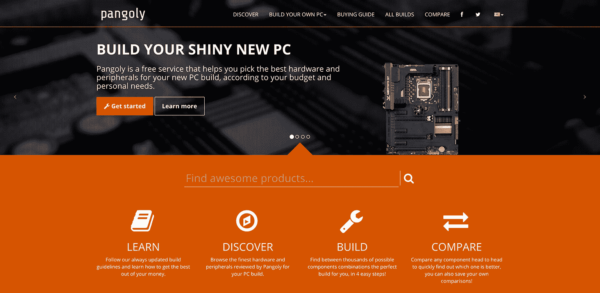
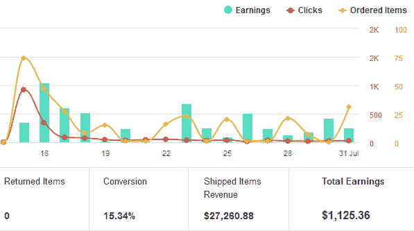
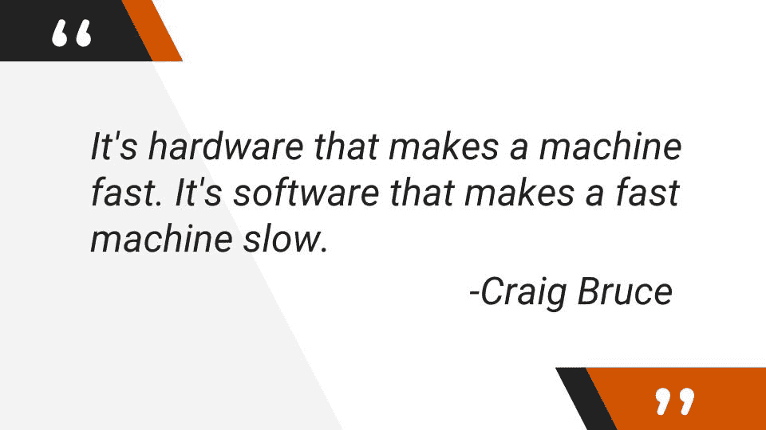

# 通过倾听用户意见，让我的副业项目达到每月 1，500 美元

> 原文：<https://www.indiehackers.com/interview/getting-my-side-project-to-1-500-mo-by-listening-to-users-c8c2c52818>

## 告诉我们关于你自己和你正在做的事情。

大家好，我是阿尔贝托，我是总部位于意大利米兰的 [Pangoly](https://pangoly.com) 的创始人。我是一名拥有 10 多年微软经验的全栈开发人员。网络堆栈。

[Pangoly](https://pangoly.com) 是一项免费服务，可以根据您的预算和个人需求，帮助您为您的新电脑选择最佳的硬件和外围设备。我们一些最受欢迎的功能包括基于您的预算和首选组件的自动构建；建议始终安全且相互兼容的组件；并提供补充信息，如最新的最佳实践、评论、价格历史和直接比较。

我们开始时规模很小，但是今天超过 339，946 个硬件组件(而且还在增加！)已经通过 [Pangoly 的](https://pangoly.com)服务安全组装，我们平均每个月的收入约为 1500 美元。

 

## 你是怎么开始潘古利的？

我在 2013 年开始和我的一个朋友一起做 Pangoly 这个兼职项目。我们的想法(以及作为专业人士的技术专长)是建立一个解决实际问题的免费服务:帮助硬件新手构建他们的下一台 PC，而不需要了解/时间来跟上硬件市场的发展，也不需要在业余论坛上寻求建议。

为服务选择名字很有趣。我们想要一些新颖且容易记忆的东西。我们最终选择了“pangoly”，这个词来自拉丁语“pango”，意思是“在地上固定/种植某种固体”。(当您委托我们的服务来帮助您构建下一台电脑时，这正是我们试图为您做的事情。)我们只是添加了一点带“ly”后缀的英语俚语。

我们从零开始，头脑风暴并在 Trello 上写下一些想法，然后按照重要性组织和分类。我们最初的产品是一个小型的单一英文网站，包含 4 个安全预配置的 PC 版本。今天，我们正在运行一个响应式 web 应用程序，它有 5 个地区站点，支持多种语言和货币，8 个安全预配置的 PC 版本，以及一个专家构建模式。

## 你的技术是什么？

我们的技术体系包括:

*   ASP。NET MVC C#
*   SQL Server
*   实体框架
*   弹性搜索

*   雷迪斯
*   引导程序
*   微软 Azure
*   Cloudflare CDN

近年来，微软在拥抱开源社区并为其做出贡献方面做得非常出色，此外，它还提供了一套非常棒的工具来提高您的工作效率，所以我认为这是推进这个项目的完美选择。

## 你是怎么找到时间和资金来建造 Pangoly 的？

在将它推广到一个小的焦点测试组之前，花了大约 3-4 个月的晚上/晚上的工作(同时还有一份全职工作)来构建第一个 MVP。当我编写整个 web 应用程序时，我的业务伙伴负责网站的编辑部分:添加产品、评论、PC 配置和 PC 构建指南。

至于资金，我们是一家白手起家的公司。我在开发过程中支持自己，除了基础设施成本，我们没有任何其他需要资金的昂贵资源。

## 你是如何吸引用户和发展业务的？

2014 年 7 月，我们向《黑客新闻》提交了我们的网站，反响令人印象深刻。在 2006-2015 年期间,[“展示 HN”顶级项目](https://github.com/antontarasenko/smq/blob/master/reports/hackernews-top-show-hn-100.md)中，Pangoly 仍然排在第 14 位。

(在 Hacker News 的首页，我们设法在一天内处理了超过 50，000 个独立用户，而网站没有宕机，所有这些都是在使用每月 4 美元的 ASP.NET MVC 主机的情况下完成的，这要归功于大量的缓存和 CDN！随着时间的推移，我们最初的主机性能下降，我们最终不得不扩展到更严肃的企业云计算基础设施，如 Microsoft Azure。新平台为我们提供了更大的微调空间，并根据我们的需求快速扩展资源。)

在我们取得初步成功后，我们开始快速实现新功能并修复错误，始终听取用户的反馈并与社区互动。我们花了很多时间让 [Pangoly](https://pangoly.com) 更容易访问，改进了 UX，增加了高级过滤和产品比较等功能。我们还改进了[页面渲染](https://developers.google.com/web/fundamentals/performance/rendering)以达到一致的 60fps，增加了查询优化，实现了延迟加载，改进了 SEO 和微数据，切换到 HTTPS(现在也是[排名信号](https://webmasters.googleblog.com/2014/08/https-as-ranking-signal.html))，等等。

除此之外，口碑、有机搜索和论坛上的提及已经完成了剩下的工作。

## 你的营收背后有什么故事？

[Pangoly 的](https://pangoly.com)唯一的收入是通过联盟营销实现的。我们不会在我们的网站上展示任何广告，因为你知道，广告很烂！

虽然我肯定有很多赚钱的好方法，但货币化并不是我们的首要目标之一。Pangoly 的使命是利用我们的专业知识，根据用户的需求和偏好，提供最公正、高质量和相关的建议，即使这与最佳的收入产生背道而驰。

## 你未来的目标是什么？

仍然有很多可预见的方法来扩展 Pangoly 的业务。最明显的一个是不断增加内容本地化，区域网站，并扩大我们的产品基础。

我认为最有趣和最具挑战性的前景是将我们的整个平台作为服务出售给在线硬件零售商，这样任何拥有在线商店的人都可以创建自己的配置，并使用我们的 PC configurator 向导和分析服务作为插件，有可能增加额外的好处，如在工作流程中组装零件和安装操作系统。这可以极大地改善任何在线电子商务网站的购物体验、转化率和收入。

## 如果你必须重新开始，你会做什么不同的事？

从技术角度来看，我认为一切都很顺利。另一方面，我可能会在营销方面投入更多资源，因为在我们这样一个过度饱和的市场中，很难引起人们的注意并吸引用户。

## 你会和有抱负的独立黑客分享什么建议？

专注于提供一个优秀的产品，然后思考如何将它货币化。

不要害怕失败。90%的创业公司都会以某种方式失败。试着从一个小的原型开始，这样你就能立刻明白你的想法是否会成功。它还使您能够快速解决在与用户进行测试之前，您在开始时甚至没有想到的问题。

分析并向你的竞争对手学习。他们肯定比你更有经验。利用他们的弱点，以便比他们更有优势，获得你的市场份额。

不要超负荷工作。通过保持平衡的生活方式来避免精疲力竭，并让你的身体和大脑得到所需的适当休息。

互联网上有很多伟大的人，他们每天都在努力工作，让网络成为我们所有人更美好的地方。这里有一个对我有很大启发的人的名单，你也应该追随他们。排名不分先后，分别是:

*   萨拉苏伊丹([@萨拉苏伊丹](https://twitter.com/SaraSoueidan))
*   雷米·夏普([@雷姆](https://twitter.com/rem))
*   斯科特·汉瑟曼([@山瑟曼](https://twitter.com/shanselman))
*   埃里克·迈耶([@迈耶网](https://twitter.com/meyerweb))
*   卢克乌鲁布莱夫斯基([@卢克](https://twitter.com/lukew))

*   Lea Verou ( [@LeaVerou](https://twitter.com/LeaVerou) )
*   保罗爱尔兰人([@保罗 _ 爱尔兰人](https://twitter.com/paul_irish))
*   布拉德·弗罗斯特([@布拉德 _ 弗罗斯特](https://twitter.com/brad_frost))
*   艾迪·奥斯马尼([@艾迪·奥斯马尼](https://twitter.com/addyosmani))

## 我们可以从哪里了解更多信息？

如果您有任何问题或业务咨询，您可以给我们留言[这里](https://pangoly.com/en/contact)或发送电子邮件 [【电子邮件保护】](/cdn-cgi/l/email-protection#82f1f7f2f2edf0f6c2f2e3ece5edeefbace1edef) 。我们也在社交上！在[脸书](https://www.facebook.com/pangolycom)、Twitter ( [@pangolycom](https://twitter.com/pangolycom) )和 [Slideshare](http://www.slideshare.net/ejjpi/build-your-shiny-new-pc-with-pangoly) 上找到我们。

记住:

也可以在下面留言评论！

——[<picture id="ember8121970" class="user-avatar ember-view user-link__avatar"></picture>阿尔贝托·卡斯泰利](/ejjpi?id=W57fRGYyHkbX1GR104KN0jbtm8o1)《潘戈利》的创作者

## 想像 Pangoly 一样建立自己的事业？

你应该加入[独立黑客社区](/)！🤗

我们是几千名创始人，互相帮助建立有利可图的业务和副业。来分享你正在做的事情，并从你的同事那里获得反馈。

还没准备好开始使用你的产品吗？没问题。这个社区是一个认识人、学习和实践的好地方。随意[随便浏览](/)！

—[<picture id="ember8121975" class="user-avatar ember-view user-link__avatar"></picture>考特兰艾伦](/csallen?id=ibTLPyjwVebnZjMGKvz6ztarnuV2)，独立黑客创始人

3votes