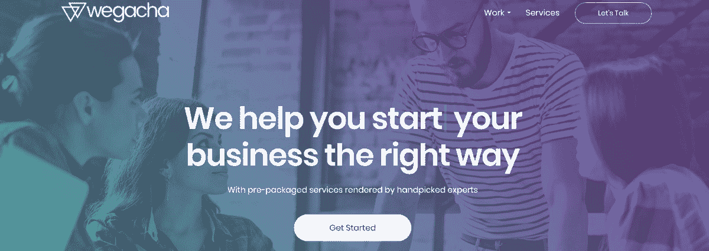
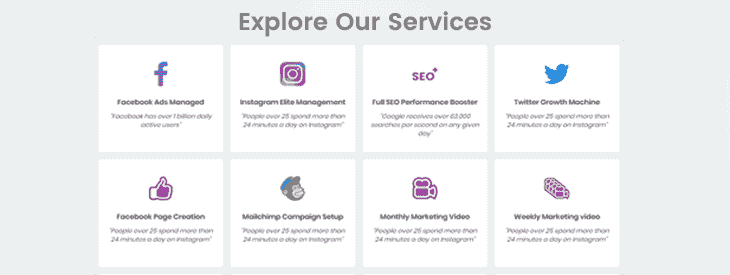

# 走出财务困境，建立一个成功的机构

> 原文：<https://www.indiehackers.com/interview/getting-out-of-a-rough-financial-spot-to-build-a-successful-agency-2d8939f083>

## 你好！你的背景是什么，你在做什么？

大家好，我叫 Andres Aguerrevere，我是 Wegacha 的创始人兼首席执行官。

Wegacha 是一家位于佛罗里达州迈阿密的在线营销机构。我们为世界各地各种规模的企业提供大量服务，尤其是那些希望打入美国市场的企业。我认为他们选择我们是因为他们意识到我们是许多面临营销相关问题的品牌的幕后推手，我们帮助他们做大。

我们喜欢与小企业和企业家合作，但我们已经有许多大公司带着挑战来找我们，我们一起取得了成功。

在 Wegacha，我们是思想家、梦想家、实干家、故事讲述者和有目标的黑客。这将引导你进入数字世界的新旅程。

所以，让我们开始吧！

当我第一次开始 Wegacha 的时候，我一年大约挣 3 万英镑。在决定全职在 Wegacha 工作并将自己 100%奉献给公司后，我想我一年能挣 12 万美元。

 

## 是什么促使你开始使用 Wegacha？

当我决定需要做些什么来改变我的状态时，我正经历着一个非常艰难的财务和个人状况。那时我在 Vapiano 做披萨饼师傅，我没有足够的空间来发挥创造力或给出建议，更不用说添加新想法了。

我知道市场上已经充斥着营销机构，但不知何故，我注意到他们的兴趣并不是帮助企业取得成功。所以我想开一家自己的公司。我知道我想要什么，市场缺少什么，但我不知道从哪里开始。我去找了一些同事，但他们认为这个想法被滥用了。

对于我生命中那个时候的一切，我只是开始怀疑很多，并考虑改变我的职业，专注于一些更简单的事情，因为我没有从我周围的人那里得到太多的支持。但是后来，有一天我遇到了一个像我一样在市场部门工作的有远见的家伙。他碰巧和我有同样的感觉，所以我们连续几天讨论这个想法，以理解业内其他人到底在哪里失败了。

所以我迈出了第一步。我开始用我想为观众创造的形象来吸引注意力并产生影响，研究趋势，并吸引合适的人组成团队。渐渐地，观众开始注意到我们并与我们联系，所以我们现在在这里。

## 构建最初的产品需要什么？

我的想法是创造一种超越人们金钱的服务。当然，我想盈利，但理想情况下，我想向人们保证，他们在我们身上的投资会给他们的业务带来现实的变化。我想让他们知道，我们为他们提供了共同迈向成功的工具。最后一个词成为了 Wegacha 的基础；事实上，我们希望在他们身边，在为他们做项目时考虑到他们。

正如我之前所说，迈出这一步并不容易。大约花了一年的时间，我终于能够给我想要强调的东西一个框架，又花了一年多的时间给这个愿景一个坚实的基础。我需要工作，这样我才能让自己坚持下去，所以这让整个过程变得更慢，但我从未放弃。

经过一段时间的酝酿，这个项目帮助我吸引了一些人投资它，并帮助我把它变成现实。我的愿望是为客户和公司创造一个双赢的局面，同时仍然成为一个有利可图的企业。

## 你们是如何吸引用户，壮大 Wegacha 的？

当我想发射时，我明白前面有一个过程。我能够吸引到正确的支持，但是，一个人永远不要认为任何事情是理所当然的。如果你不知道如何做市场营销，如何在网上展示你的品牌，那么你是否有钱或有才华都没用。

我们在适当的地点、时间和使用的渠道进行了发布，而接收情况与我们的计划不符。然而，我们在社交媒体广告上投入了一些时间和金钱，我们建立了一个 SEO 友好的网站和一个博客。我们还参加了提高品牌知名度的论坛(大部分活动我们仍在进行),渐渐地，客户开始向我们提问并与我们接洽。此后不久，我们开始帮助那些需要工具进入当地或全国市场的企业家。

大多数策略对我们的目标受众产生了积极的影响。然而，我们尝试了外向营销，但效果并不好。我会说，这是因为我们刚刚起步，我们需要建立信任和坚实的形象，让客户感到舒适。

我能想到的对新创业者来说最重要的一条建议是，无论通过什么渠道，都要与观众保持联系。在网上和面对面一样保持欢迎的态度。不要因为数字世界而限制自己。如果有意义的话，你仍然可以在网上微笑。

在网上和面对面一样保持欢迎的态度。

TweetShare

不要害怕与观众建立联系，因为这将吸引人们。这应该反映在你计划使用的每一个营销策略中。此外，你在做生意，为了成功，你必须珍惜人际交往。

## 你的商业模式是什么，你是如何增加收入的？

Wegacha 有两种商业模式:

1.  传统的代理形式，人们去现场，看你的作品，打电话预约，然后雇用你。

2.  我们的第二个模型更罕见。我们提供预打包服务，以加快转换速度。我们把它们作为产品在市场上出售。您可以通过自己选择的支付平台(包括加密货币支付)在我们的网站上直接购买。

我们在 2017 年 7 月推出了我们的平台，仅用了几天时间就转化了我们的第一个线索(这很少见)。

 

我们从一个非常激进的搜索引擎优化策略开始，时不时地做一些谷歌广告。此外，朋友和家人成为我们最好的交通来源之一。

提示:用很少的钱或没有钱来创业是非常困难的！可能需要几周甚至几个月才能做成第一笔生意。不要让一个糟糕的开始毁掉你的创业精神。利用两种免费的方式来增加你网站的流量。第一种方式是 SEO(搜索引擎优化)。第二种方式是亲朋好友(请他们分享、点赞、发帖等。关于你的新业务)。

## 你未来的目标是什么？

现在，我们正在投资时间和金钱来发展。我们知道我们的潜力，我们希望接触更多的受众，不仅是在美国。我们帮助外国品牌在这个市场取得了成功，就像我们帮助美国企业主一样。我们期待着成为一家知名的代理机构，并在团队、财务、物理空间和我们可以处理的客户数量方面增加我们的数量。

仍有许多潜力巨大的小企业很容易陷入困境。这些是我们希望继续关注的企业家，因为好想法仍有发展空间。

## 你面临的最大挑战和克服的障碍是什么？如果你必须重新开始，你会做什么不同的事？

我花了很多钱购买我从未用过的工具和订阅。所以，我想教新创业者的是大量阅读(博客、杂志、视频等。)来感受一下什么是真正满足您需求的最佳工具。

## 有没有发现什么特别有帮助或者有优势的？

我以前没读那么多，但是我的一个朋友鼓励我读几本与企业家有关的书。他实际上给了我一些。乔斯林·k·格雷写的《管理你的日常生活》一书让我明白，我可以改善我的日常生活，让时间成为我最好的朋友。在这本书里，她基本上谈论的是生产率。

我知道我不是唯一一个因为时间的因素而有了难以实现的想法的人。事实上，这是我不去做我需要做的额外工作的借口。我认为我的想法有多好并不重要。直到我读了这本书，我才意识到在我的时间里投资时间会对我的生活产生巨大的影响。

至于那些我无能为力的事情，我相信我是在正确的时刻想要开始这样的生意。市场需要它，所以也许我很幸运，在为时已晚之前让它运行起来。但最终，运气比不上毅力。

## 对于刚刚起步的独立黑客，你有什么建议？

我在许多其他人和我自己身上看到了一些东西，那就是即使你有一个团队，也要尝试自己做所有的事情。如果你不能把任务托付给团队，那团队还有什么意义呢？我们是有正常局限性的人，所以寻求帮助并不意味着你是一个失败的企业家。这可能很难接受，但如果我们想要成功，我们就必须共同努力。

我们是有正常局限性的人，所以寻求帮助并不意味着你是一个失败的企业家。这可能很难接受，但如果我们想要成功，我们就必须共同努力。

TweetShare

找到你可以信任的，适合和你一起工作的人。委派任务，把时间投入到更重要的事情上，这些事情是你业务发展的重中之重。

## 我们可以去哪里了解更多？

我们很乐意回答任何问题。如果是关于市场营销、业务发展或任何你想做的事情，不要害怕，尽管问！

你可以通过我们的[网站](https://wegacha.com/pages/home)查看更多我们的工作并获取我们的联系信息。在那里，我们也有一个博客，我们总是在那里谈论有趣的数字营销话题和营销业务。

您也可以在社交媒体上找到我们:

*   [Instagram](https://www.instagram.com/wegacha/)
*   [推特](https://twitter.com/wegacha)
*   [脸书](https://www.facebook.com/wegacha/)
*   [领英](https://www.linkedin.com/company/wegacha.com/)

——[<picture id="ember5261474" class="user-avatar ember-view user-link__avatar"></picture>Wegacha](/Wegacha?id=vKVUKs6gChSLN1A5Wes3LPmugsC3)Wegacha 创始人

## 想像 Wegacha 一样建立自己的事业？

你应该加入[独立黑客社区](/)！🤗

我们是几千名创始人，互相帮助建立有利可图的业务和副业。来分享你正在做的事情，并从你的同事那里获得反馈。

还没准备好开始使用你的产品吗？没问题。这个社区是一个认识人、学习和实践的好地方。随意[随便浏览](/)！

——[<picture id="ember5261479" class="user-avatar ember-view user-link__avatar"></picture>考特兰艾伦](/csallen?id=ibTLPyjwVebnZjMGKvz6ztarnuV2)，独立黑客创始人

15votes