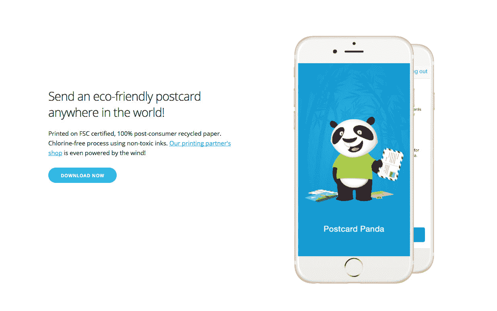
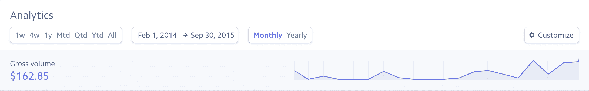
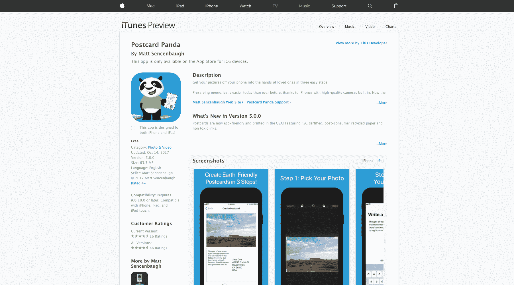

# 与风投资助的竞争对手竞争，增长到每月 400 美元

> 原文：<https://www.indiehackers.com/interview/going-against-a-vc-funded-competitor-to-grow-to-400-mo-356741b3c3>

## 你好！你的背景是什么，你在做什么？

我是 Matt Sencenbaugh，我创造了[明信片熊猫](http://postcardpanda.com/)——一个 iOS 应用程序，可以让你在邮件中发送环保明信片。

我在华盛顿长大，后来搬到加州斯坦福大学学习计算机科学。我目前在做兼职，运行一个名为[的 Saas，并试图让明信片熊猫变得可行。](https://www.wrestlingiq.com)

今天，超过 1000 人使用了[明信片熊猫](http://postcardpanda.com/)，在过去的几个月里，每月收入在 400 到 600 美元之间。

## 是什么促使你开始玩明信片熊猫？

傲慢。

回到 2013 年 12 月，在我帮助创办的初创公司与我们雇佣的一个好朋友发生了关系后，我正在进行自我反省和旅行。(之后我就立马辞职了。)

圣诞节期间，我去看望我的父母，我爸爸录制了一集《鲨鱼池》,里面有一个名为“奔跑中的明信片”的应用程序。赛琳娜·戈麦斯是投资者之一，我想其中一个“鲨鱼”也投资了。我有所有开发人员都会有的本能反应:

“为什么这个想法需要风险投资？我可以自己制造一个更好的版本，价格也更低。”

接下来的六周，我在太浩湖滑雪，制作明信片熊猫的第一版。我开始吸引大量的人下载我的应用程序，并在公司门口打出明信片。

开玩笑的。完全，完全是开玩笑。我开始玩蟋蟀，我的 v1 并不比他们的好。于是明信片熊猫诞生了。

 

## 构建最初的产品需要什么？

我坐在短期租赁的公寓里，编写了第一个版本，使用了一个相当著名的 API-to-print 服务来处理繁重的工作。我把所有东西都搭配到它的核心，并推出了一个只有客人结账体验、没有铃声或哨声的应用程序。第一个版本可能花了我 30 个小时的时间和 700 美元的 logo。

我基本上什么都做错了。

我没有和任何潜在客户交谈。我没有计算单位经济学是如何运作的。我没有邮件列表可以发送。我并不打算在发布后就对外宣传。

## 你们是如何吸引用户，让明信片熊猫成长起来的？

这张图表应该能让你了解这款应用从 2014 年 2 月到 2015 年 9 月有多惨淡:

 

是的，那是 162.85 美元——或者大约每月 8 美元的收入。然后“大(幸运)突破”发生了，具有讽刺意味的是，当明信片在运行中倒闭了。我很幸运地在 app store 搜索中排名第二，当他们停止搜索时，我的“奔跑中的明信片”排名第一。

2015 年 10 月，我获得了 210.94 美元的收入，这比我在这款应用的整个生命周期中获得的收入还要多。在那一点上，这个应用基本上仍然是一个非常糟糕的 v1，但我决定在这一线希望上投入更多的努力。

我在 2015 年 11 月推出了 v4。V4 提供用户账户，这在接下来的一年中推动了大部分的保留和增长，因为我乘坐了一家倒闭公司的大衣尾巴(重播仍然是一件事！).

你需要做出非常明智的决定，但是你每天都精力充沛，这对公司来说是一种胜利。

TweetShare

《明信片熊猫》的用户保持率相当高，我也确实获得了相当数量的口碑推荐。一旦用户进入，我似乎处于一个不错的位置，尽管使用严重偏向典型的假期月份，所以我处于一个年度周期。这意味着在进行指标分析时，我倾向于比较上个月和一年前的情况。

自 2015 年 10 月以来，收入最高时为 840.35 美元，平均约为 400 美元。

V5 最近推出，它增加了一个可选的订阅模式，并转向环保打印格式。转向环保让我个人感觉更好，我希望这将成为明信片熊猫的一个真正的区别。

目前，我正在再次尝试苹果搜索广告([第一次尝试不太顺利](https://mattsencenbaugh.com/postcard-panda-april-2017-income-report/))，努力拓展博客，并考虑引入一个推荐项目。

## 你的商业模式是什么，你是如何增加收入的？

随着第五版[明信片的推出，熊猫](http://postcardpanda.com/)通过两种方式赚钱。首先是来自明信片的交易收入。第二个是来自熊猫 Plus 的年度经常性收入，这是一种可选的订阅。

我属于 iOS 应用中直接在应用中收取信用卡费用的少数，因为应用内购买仅适用于数字购买。

**提示:** Apple Pay 在该应用中非常受欢迎——过去六个月中约 40%的交易都是通过它完成的。如果你直接收集卡片，它的建造时间是值得的，并且[条纹](https://stripe.com/)使它变得容易。

到目前为止，夏季是我最美好的时光…不幸的是，我还没有找到把一年中的每个月都变成七月的方法。

TweetShare

这种商业模式的最大问题是利润率非常低，尤其是与传统软件相比。明信片熊猫有真实的成本与雇用印刷公司，纸张，墨水和邮票。

你最初的直觉反应可能是，我可以保留额外的收入，因为苹果不再提成了，但是单位经济学意味着我每完成一个订单都要损失 30%以上。如果你正考虑以软件开发人员的身份进入实物领域，在通过 go 之前，花相当多的时间在电子表格中做分析。

收入增长的最大驱动力来自一些特性和季节性。用户账户是一个巨大的胜利，因为它们使客户能够保存他们的支付方式，并允许复制明信片并将其发送给更多的人。(我有一对夫妇顾客，他们给家人寄了 100+张卡片。)

到目前为止，夏季是我最美好的时光…不幸的是，我还没有找到把一年中的每个月都变成七月的方法。

以下是过去几个月的收入情况:

| 月 | 收入 |
| --- | --- |
| 五月 | 636 |
| 六月 | 408 |
| 七月 | 497 |
| 八月 | 456 |
| 九月 | 264 |
| 十月 | 399 |

V5 包括价格变化以及订阅选项，你可以看到，对于传统的非度假月份来说，这个月已经比 9 月好了。

## 你未来的目标是什么？

v5 变化的主要驱动力是我对邮寄明信片的环境影响的担忧。我寄的卡片现在是用 FSC 认证的 100%消费后再生纸印刷的，使用的是无氯工艺和无毒墨水。[我的打印伙伴](http://rollingpress.com/)也是风力驱动的。

我未来的目标是试图将明信片行业推向一个更加环保的未来。希望这意味着[明信片熊猫](http://postcardpanda.com/)作为一个企业也做得更好，但我通常希望向其他公司施加压力，让它们效仿。

为什么这个想法需要风险投资？我可以自己造一个更好的版本，也更便宜。

TweetShare

就原始数据而言，我希望在未来六个月内每月收入达到 1000 美元。

## 如果你必须重新开始，你会做什么不同的事？

如果我不得不重新开始，我会直接与真正的印刷厂合作，而不是使用 API。我的第一个 API 合作伙伴让我焦头烂额，因为他们不通知我就弃用了他们的 iOS SDK。有一天，生产应用程序停止工作了。

对于[明信片熊猫](http://postcardpanda.com/)的 v5，我与许多环保印刷合作伙伴进行了接触，以获得价格和估价。我不得不花费大约一周的时间来构建后端基础设施，以便从用户提交的明信片中生成批量 pdf，但现在我可以保留更多的利润。

寻求商业关系真的没有那么可怕，尽管我以前从未这样做过。如果你想让自己听起来聪明，并有可能拥有高品位，你可以称之为“[脱媒](https://en.wikipedia.org/wiki/Disintermediation)”。

 

有些人可能会说，对于一个“MVP”来说，找一个合适的搭档太费力了，但我不同意。商业中一个经常被忽视的挑战是个人动力。

如果你今天开始的事业成功了，你还想继续经营下去吗？还是会很痛苦？如果你没有足够的动力去努力让一个项目*真正可行*，那么你可能一开始就不应该开始这个项目。

你绝对需要毫不留情地将你的想法与核心结合起来，以获得一些东西，但这并不意味着走捷径，割裂你产品的所有实用性。

## 有没有发现什么特别有帮助或者有优势的？

我做过的最好的一件事就是去做兼职，这给了我一个“无限的跑道”去做我自己的事情。我不认为我会离开我的日常工作，即使明信片熊猫能支付我的薪水，但这是一个很好的平衡，让我压力小了很多，也让我对创造性感到满意。

我最近采用的另一个方法是为每个项目建立一个单独的账户。(如果你是独资经营者，这可以是一个单独的个人支票账户。)然后，我用“种子”基金“投资”这个项目，对我来说，这通常意味着从我的储蓄中拿出一小笔钱——5000 美元或更少。

我有一个简单的电子表格，然后我跟踪我的项目的所有收入和支出。在这个项目的早期，这往往是负面的，所以我要么直接从那个账户支付我的信用卡，要么把它转移到我的主要储蓄账户，从那里支付我的信用卡。

这模拟了一个燃烧率，让你诚实地说出你在这个项目上花了多少钱。如果您的项目费用与您的个人费用混合在一起，那么很容易在不必要的工具上花费数千美元。如果你的银行账户里有一个很小的数字，逐渐减少到零，那就很难做到这一点。

我倾向于使用番茄工作法来集中注意力，并每周锻炼四到六次来保持身体的敏锐。令人惊讶的是，大量的体育活动也提高了我的精神敏锐度。

我[读了不少](https://www.goodreads.com/user_challenges/7625780)的书，对科幻和奇幻有着强烈的偏好。我最喜欢的作家可能是布兰登·桑德森，我最喜欢的“经典作品”是尼尔·斯蒂芬森的《冰雪奇缘》。如果你不在乎这种小说风格，我的书给企业家的建议是:

*   [创新者的解决方案](https://www.goodreads.com/book/show/2618.The_Innovator_s_Solution)
*   [比拼运气](https://www.goodreads.com/book/show/28820024-competing-against-luck)
*   [思考的快与慢](https://www.goodreads.com/book/show/11468377-thinking-fast-and-slow)
*   [大魔法](https://www.goodreads.com/book/show/24453082-big-magic)
*   [返工](https://www.goodreads.com/book/show/6732019-rework?from_search=true)

## 对于刚刚起步的独立黑客，你有什么建议？

继续磨。

我一生中的大部分时间都是一名摔跤运动员，我在垫子上最尊敬的竞争对手是那些具有持续、凶猛能量储备的人。没有华丽的动作或巨大的能量高峰和低谷。在幕后大量训练的支持下，在整场比赛中聪明、持续的努力。寻求创业的创客也是如此。

这种东西需要很长时间才能实现，所以你必须做好长期坚持的准备。当然，你需要做出真正明智的决定，但你每天都精力充沛，这对企业来说是一种胜利。

## 我们可以去哪里了解更多？

你可以在[mattsencenbaugh.com](https://mattsencenbaugh.com/)找到我的个人博客，还有我的推特 [@MattSencenbaugh](https://twitter.com/MattSencenbaugh) 。

请随时在下面留下您的评论或问题。我会留下来回答问题。

——[<picture id="ember5299802" class="user-avatar ember-view user-link__avatar"></picture>马特·森博](/msencenb?id=yNgpfjeaVgZ4MEfx7NuIFVcNezx2)《明信片熊猫》的创作者

## 想像明信片熊猫一样建立自己的事业？

你应该加入[独立黑客社区](/)！🤗

我们是几千名创始人，互相帮助建立有利可图的业务和副业。来分享你正在做的事情，并从你的同事那里获得反馈。

还没准备好开始使用你的产品吗？没问题。这个社区是一个认识人、学习和实践的好地方。随意[随便浏览](/)！

—[<picture id="ember5299807" class="user-avatar ember-view user-link__avatar"></picture>考特兰艾伦](/csallen?id=ibTLPyjwVebnZjMGKvz6ztarnuV2)，独立黑客创始人

9votes