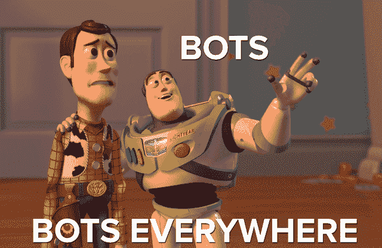
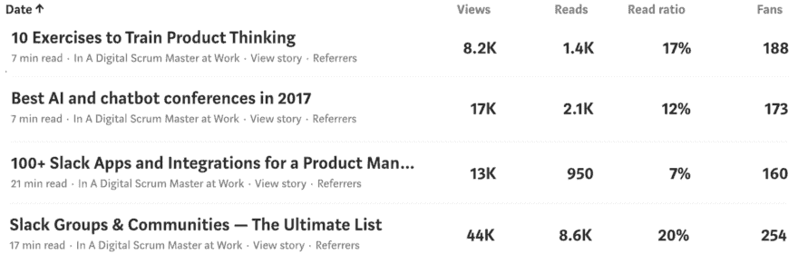
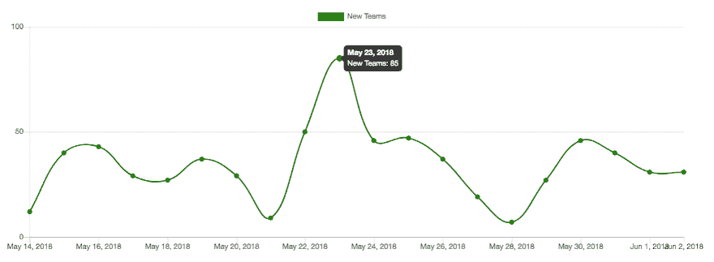
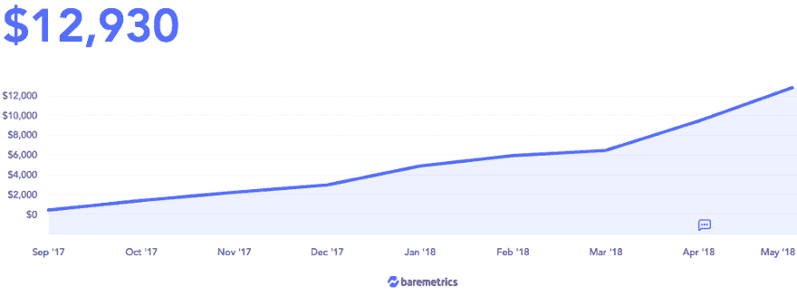

# 用我们所有的积蓄在一个新的平台上建立业务

> 原文：<https://www.indiehackers.com/interview/going-all-in-with-our-savings-to-build-a-business-on-a-new-platform-3501f0b9cd>

## 你好！你的背景是什么，你在做什么？

我叫阿历克斯·基斯泰涅夫。我是来自西伯利亚托木斯克的企业家。Artem Borodin 和我直立着建造了。

Standuply 是一个 Slack 机器人，在 Slack 中运行站立会议和团队调查。把 Standuply 想象成一个 Scrum 大师，他在成千上万的团队中工作，并且应用最佳实践。

2018 年 5 月，Standuply 的收入达到了 2.5 万美元。它现在为 Slack、Evernote、Adobe、IBM、SAP、GE 和其他大公司的 700 名客户提供服务。

## 是什么促使你开始使用 Standuply？

聊天机器人的炒作开始于 2016 年。我对新的机会感到兴奋，并与 Artem 分享了我的商业想法。我们一起设想了一个对敏捷团队有帮助的 Scrum Master bot，并开始试验。

 

作为平台，我们选择了 Slack。我们花了几个月的时间在 BetaList 上创建了第一个 MVP。几天之内，我们有 300 个团队注册，只有一个登录页面。

Artem 是一名项目管理老手，他也教授项目管理课程。他看到了敏捷团队是如何发展的，也感受到了他们在管理过程中的痛苦。我们证明了一旦产品启动并运行。

在 Standuply 之前，我们试验了电报机器人。起初，我们推出了 Botfamily.com，一个电报机器人目录，并建立了几个机器人。我们发现 Telegram 不透露用户数据，所以这意味着没有目标。此外，保留率太低(~0.5%)。这就是我们改用 Slack 的原因。

## 构建最初的产品需要什么？

我们拿出积蓄，全力以赴在 Slack 上创建了一个机器人。我们盲目地相信我们能成功，并且在途中没有筹集到任何资金。但是我们有很大的动力，因为没有第二次机会。所以从第一天开始，我们就一直在做 Standuply。

 

我们雇了一名工程师，和我们的三人小组一起，开始了漫长的旅程。新平台给我们的工程师带来了新的挑战。因此，我们的团队进展比预期的要慢。这就是自举时要付出的代价。

我们的团队在 2016 年进行了 9 个月的 MVP 建设和 Slack bot API 实验。我们三次改变概念，在某些时候，我们几乎准备放弃。后来在创业桑拿加速计划的帮助下，我们幸运地找到了焦点。

我们在创业桑拿中与许多教练交谈，并将我们的价值主张缩小到 Slack 上的站立会议。Standuply 作为一个概念和品牌就是这样诞生的。我们在 Slush 的演示日推出了它。

如果你的增长速度比你所在领域的其他公司慢得多，那就意味着出了问题，所以你的任务就是找到并修复它。

TweetShare

2017 年初，我们有一个测试版，正在为大约 200 个团队服务。然而，就功能和稳定性而言，它远非完美。因此，我们决定完全重写这个机器人，以提供用户要求的附加功能。我们用了 4 个月，而不是 1.5 个月。哎呀。

发布后，添加答案的功能并没有流行起来。这就是我们如何了解到，与核心功能相比，附加功能并不那么重要。不管你做了多少漂亮的小东西，一个产品的成功在于人们购买的核心功能。

## 你是如何吸引用户并独立成长的？

Standuply 在 2017 年 3 月登上了 Slack 应用目录的主页。两周内，我们获得了 750 个新注册，达到了 1000 个团队的里程碑。即使这个功能结束了，我们仍然从 Slack 获得了稳定的新用户。

我们在 2017 年非常依赖内容营销，并在 2018 年继续这样做。我发表了几篇长篇阅读。它帮助我们提高了搜索引擎优化，并为我们的博客带来了可观的流量。我的帖子在 2017 年获得了 15 万次浏览。

 

在过去的 18 个月里，我们在产品搜索上推出了 8 次 Standuply 和相关的 Slack bot 产品。起初，是我们的首次发布带来了我们的第一批用户。这并不成功，我们最终获得了第七名。但是，它给我们带来了 150 支队伍。

我们最好的产品是最新的:Standuply 3.0。它成为了当天的第一产品和本周的第四产品。因此，我们同时出现在每日和每周的产品搜索邮件列表中。了解它如何影响我们的注册:

 

以下是我们在推出产品搜索时了解到的情况:

1.  您可以根据部署的次数来发布特性和主要版本。产品发布往往会吸引更多的关注，带来更多的注册。

2.  在发布日与谁竞争是一个运气问题。周二和周三是难熬的日子。如果你不是 100%确定，就选周一。

3.  总的结果是关于产品有多吸引人，你带来了多少外部支持者。

我们还在脸书、Twitter、Hacker News、Reddit 和其他较小的网站上发布关于 Standuply、Slack 机器人和我们博客的消息。在过去的 18 个月里，这总共为我们带来了大约 2 万次访问。

此外，我们在 2017 年的三个会议上设有展位:柏林的 Chatbot 峰会、赫尔辛基的 Slush 和柏林的 TechCrunch Disrupt。因此，在零营销预算的情况下，我们在这三场会议上的注册人数最多相当于平常的一天。然而，观察人们对我们的总结中的信息的反应是非常有见地的。

上述所有活动都产生了一些反响，因此到 2018 年 6 月，我们最终有 15，000 个团队注册。

## 你的商业模式是什么，你是如何增加收入的？

Standuply 通过 SaaS 订阅和按用户收费来赚钱。价格范围从每个用户 2 美元到 4 美元。

有些人主张从第一天开始收费。我们没有遵循这一惯例。在测试期间，我们的产品是免费使用的。那个决定有利有弊。我们通过这种方式吸引了更多的注册用户，但我们也有一些用户根本不准备付费。有时，他们的反馈会分散注意力，降低积极性。

我们非常顺利地推出了定价。起初，我们发布了一个关于即将结束试验的通知，并附有一个付费链接。没有团队被关闭或限制功能。销售开始出现。后来，我们在 Slackbot 和 web 应用程序中实现了提前通知。这导致了更多的销售。

用这种方法，我们在 MRR 六个月内从几百美元涨到了 6000 美元。

 

后来，我们推出了两个具有更多功能的额外定价计划。有些是在我们提出计划后交付的。这些功能被标记为“很快”,以便我们随时通知客户。效果真的很好。我们开始看到购买新计划，这增加了我们的平均检查。

就收入增长而言，下一步是最重要的。我们部署了一个系统，将我们的客户限制在他们购买的范围内。一旦我们推出了这个系统，我们的销售和扩张就一飞冲天。我们有点担心客户会如何反应，但进展顺利。

对比一下我们的 MRR 前后。该系统于 4 月全面投入使用。

 

我们了解到，没有必要害怕与客户一起遵守规则。有时候太好会损害你的生意。

## 你未来的目标是什么？

盈利的感觉很神奇。意味着你会活下来，而另外 90%的创业公司可能活不下来。

这就是为什么我主张尽快达到盈利，为你的公司打好基础(读作:商业)。除非你是 B2C。

我们设定了一个短期目标，即达到 10 万美元的 MRR，这是 SaaS 证明真正商业潜力的一个转折点。然而，从长远来看，我想知道 Slack bot 是否有能力达到 100 万美元的 MRR。

我认为这将取决于市场规模。如果市场继续增长，那么更大的企业将在 Slack 和替代平台上诞生。

## 你面临的最大挑战和克服的障碍是什么？如果你必须重新开始，你会做什么不同的事？

一切都需要时间，尤其是在 SaaS。所以，我们学到了宝贵的经验。一些最有见地的经验教训是在我们构建 MVP 的过程中获得的:

1.  我们做了大量的采访。我们讨论了客户的棘手问题、工作流程，并听取了他们的功能需求。采访帮助我们看到一个更大的画面。然而，我们感到惊讶的是，他们没有在新功能上帮助我们。

2.  为了向前推进，我们需要关于我们的 SaaS MVP 是如何被谁使用的数据。我们一开始没有内部统计。这就像没有雷达的飞行。我无法想象没有它我们如何工作。我们应该从一开始就构建它，而不是发布额外的功能。

3.  我们发现在一个项目中只有一个技术人员可能会导致编码人员的阻塞。一个人可以卡住，而几个人找到解决方案的机会更大。因此，团队中有一个开发人员可能比两个开发人员的成本更高。

## 有没有发现什么特别有帮助或者有优势的？

我发现有一个持不同意见的人在你身边是非常有益的。它帮助我权衡自己的决定，减少错误。说到决策，令人惊讶的是，我能说出的对我们很有意义的关键战略决策寥寥无几。这意味着有时仔细思考比匆忙做出快速决定更好。

此外，我相信与他人比较你的表现有助于你了解自己的动态。例如，如果你的增长速度比你所在领域的其他公司慢得多，这意味着有问题，所以你的任务是找到并解决它。

这些资源对此很有帮助:

*   [Baremetrics Open Startups](https://baremetrics.com/open-startups)
*   [内森·拉特卡的顶级企业家播客](http://nathanlatka.com/podcast-thetop/)
*   独立黑客；)

## 对于刚刚起步的独立黑客，你有什么建议？

以前，我做了很多事情，但缺乏专注。它并没有给我从事的每个项目带来最好的结果。现在，我相信一次做一件事:无论是公司、营销活动还是其他。一次爬一座山，一旦你到达那里，选择另一座山去征服。

Slack 应用生态系统正在快速增长，为利基产品提供了商机。此外，Slack 用户愿意尝试新的机器人，并为解决他们痛点的解决方案付费。然而，竞争越来越激烈。Standuply 在 Slack 上有 20 多个直接竞争对手。

一次爬一座山，一旦你到达那里，选择另一座山去征服。

TweetShare

因此，如果你正在考虑建立一个 Slack bot，不要等太久。

## 我们可以去哪里了解更多？

你可以在 https://standuply.com 的[试试 Standuply。有时我们会在 Standuply 博客上分享我们的见解。请随意查看。](https://standuply.com)

在 [Twitter](https://twitter.com/alexkistenev) 、[产品搜索](https://www.producthunt.com/@sprinter)上关注我，或者在下面的评论中向我提问。

谢谢你邀请我来这里！

—[<picture id="ember8161328" class="user-avatar ember-view user-link__avatar"></picture>alextomsk](/alextomsk?id=eCQQEp3FMDfgWTEF55SeInWMxUi2)【Standuply】联合创始人

## 想像 Standuply 一样建立自己的事业？

你应该加入独立黑客社区！🤗

我们是几千名创始人，互相帮助建立有利可图的业务和副业。来分享你正在做的事情，并从你的同事那里获得反馈。

还没准备好开始使用你的产品吗？没问题。这个社区是一个认识人、学习和实践的好地方。随意[随便浏览](/)！

——[<picture id="ember8161333" class="user-avatar ember-view user-link__avatar"></picture>柯特兰艾伦](/csallen?id=ibTLPyjwVebnZjMGKvz6ztarnuV2)，独立黑客创始人

33votes