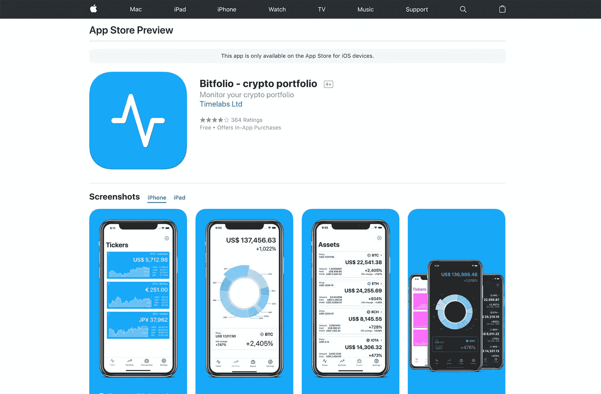

# 带着我自己想要的加密组合应用程序走向市场

> 原文：<https://www.indiehackers.com/interview/going-to-market-with-the-crypto-portfolio-app-i-wanted-for-myself-fd8cc9deed>

## 你好！你的背景是什么，你在做什么？

大家好，我是 Francesco Pretelli，我创建了 [Bitfolio](http://www.timelabs.io/bitfolio/) ，这是一个简单的 iOS 应用程序，用于跟踪您的加密投资组合。

我已经做了 10 多年的软件工程师，目前在一家大公司做全职的移动开发人员，同时也喜欢开发副业。

我开始是一名嵌入式工程师，最近转向了移动开发。

多年来，我创建了不同的应用程序(移动和桌面)。Bitfolio 是最新的，也是迄今为止最赚钱的，每天有大约 800 名活跃用户，每月收入约 1000 美元。

 

## 是什么促使你开始使用 Bitfolio？

当 crypto 还不酷的时候，没有多少应用程序可以跟踪你的投资组合，现有的应用程序也不适合我的需求。

作为一个长期的“霍德勒”(主要持有，而不是一个活跃的交易者)，我不做每日交易，我只是想不时地检查总价值。

我记得曾和我的同事谈论开发 [Bitfolio](http://www.timelabs.io/bitfolio/) ，但没人理解；他们只是不熟悉密码世界。(他们现在都在坐火车，同时假装他们一直都是这么做的。)

如果我必须重新开始，我可能会对人们想要什么做更多的调查。我最初的所有决定都是基于我想要的，这只是一个开始。

TweetShare

我的计划很简单，我想要一个显示当前价值和历史趋势图表的应用程序。就是这样！

这就是我需要开始的全部:我有一个问题，我需要开发解决方案。我从来没有考虑过财务方面的问题。

## 构建最初的产品需要什么？

一天晚上，当我在做一个不同的项目时，我决定做一些关于 API 和如何检索当前比特币估值的调查。幸运的是，不同的交易所和服务提供比特币的当前和历史数据，所以我很快建立了一个新的 Xcode 项目，并制作了第一个工作原型，第二天早上运行。

最初的应用程序在我的手机上调试了一年多；足够我当时的需求了。但后来更多的加密货币开始出现，我决定购买少量莱特币和以太币(当时只有一种)，我在设备上名为 [Bitfolio](http://www.timelabs.io/bitfolio/) 的测试应用程序已经不够用了。

我刚刚完成了另一个兼职项目，这是修改我的应用程序并添加更多功能的绝佳时机。我在纸上写下一些想法和草图，制作了一个快速模型，并创建了一个新的 Xcode 项目。

谦虚一点，从小事做起，专注于自己真正想要和理解的事情。

TweetShare

花了四个月的业余时间(中间有大约 2-3 周的短暂停顿，迎接女儿来到这个世界)才把第一个版本做好。它只具备运行所需的最基本的功能:

*   自动收报机区
*   支持 BTC、LTC 等和 ETH 的投资组合部分
*   添加购买交易的交易部分

这真的非常非常简单，但在当时已经足够了。我很自豪，因为这个应用程序看起来真的很棒，它工作得很好，很好地服务于目的。

然后大的加密热潮来了…

## 你是如何吸引用户和增加投资组合的？

在应用商店发布之前，我开始在 Reddit 和其他加密相关论坛上询问人们是否有兴趣测试我的应用。我收到了大约 100 个回复，并有大约 50 名活跃用户在我的应用发布前对其进行了测试。

一旦发布，我在做任何实际的“营销”工作之前等待了大约一个月。我想确保它在最初的用户中运行良好。当我确定这个应用足够稳定时，我又把它发布在 Reddit、其他加密社区和 Product Hunt 上。

这给了我第一个 1000 名用户和足够的动力来每天获得新用户。我一直在努力，增加功能，并开始使用应用商店搜索广告。

该应用有一个评级弹出窗口，在应用可用一段时间后出现。应用商店的评论开始进来，这吸引了更多的用户。用户数量日复一日地稳步增长，直到有一天比特币跃升至 5000 美元。Crypto 突然变得很酷，这款应用开始腾飞。

 

## 你的商业模式是什么，你是如何增加收入的？

[Bitfolio](http://www.timelabs.io/bitfolio/) 是一款面向最终用户的产品。它提供了一个免费版本，可以添加多达五个报价器和五项交易，还有一个专业版本，可以解锁应用程序中的所有内容。

我一直在尝试不同的策略，看看什么对我的收入和用户都是最好的。起初，限制只有 1 个股票和 2 笔交易，但这显然不足以让用户坚持使用该应用程序。专业版的最初定价是 2.99 美元，这对大多数用户来说似乎是公平的。

我试过做圣诞促销，把 Pro 价格降到 99 英镑。我不认为它吸引了更多的人，但我相信人们认为它是一个廉价的应用程序。

目前的型号，定价为 4.99 美元，目前看来工作得很好；它给用户足够的空间来评估应用程序，这样如果他们决定升级，他们就知道他们会得到什么。

Bitfolio 目前平均每月产生 1000 美元，显然总是与加密货币价格相关，通常从每天最低 10 美元到最高(目前为止)180 美元。

我已经尽力把费用控制在最低限度(实际上是零)。我没有进行任何付费营销，我目前进行的搜索广告活动使用的是苹果公司提供的促销信贷。

## 你未来的目标是什么？

在短期/中期内，我希望能够实现用户在过去几个月中要求的所有功能。我想为每个人提供一个好的解决方案，从普通人到专业交易者。

当然，我希望在发展的同时继续享受乐趣和学习。

如果能找到其他人与我合作开发一款更好的产品，那就太好了，这款产品涵盖了从加密到股票交易的各个领域，可以在任何平台上使用。

## 你面临的最大挑战和克服的障碍是什么？如果你必须重新开始，你会做什么不同的事？

我的主要错误是依赖于一个没有任何通知就停止使用的 API。有一天我醒来，发现应用程序不工作了。我认为服务器有问题，但几天后，很明显，开发人员决定取消我正在使用的 API。

我必须找到一个替代方案，而且要快。

如果我必须重新开始，我可能会对人们想要什么做更多的调查。我最初的所有决定都是基于我想要的，这只是一个开始。但是显然我会节省很多重构时间。

## 有没有发现什么特别有帮助或者有优势的？

正如我上面所说的，我很幸运在大的加密浪潮到来的正确时间进入市场。但正如我的朋友所说，一个低劣的应用程序不会赚一毛钱，无论如何！

作为一个非常光滑、简单、好看的应用程序，对弥补功能的不足有很大帮助。

## 对于刚刚起步的独立黑客，你有什么建议？

谦虚一点，从小事做起，专注于自己真正想要和理解的事情。

不要害怕犯错误，即使是在生产中；倒楣的事情发生了，除非你处理的是救命的硬件设备或者别人的钱，不要太担心！

## 我们可以去哪里了解更多？

如果你有 iOS 设备[http://www.timelabs.io/bitfolio/](http://www.timelabs.io/bitfolio/)，请下载 Bitfolio，并给我发送你的反馈。

您可以关注以下网站的发展:

*   [@推特上的 bitfolio app](https://twitter.com/bitfolioapp)
*   [脸书](https://www.facebook.com/bitfolioapp)
*   [中型博客](https://medium.com/bitfolioapp)

也可以直接在 Twitter 关注我[@ time Francesco](https://www.twitter.com/timefrancesco)；并且，请在下面随意评论，问我任何事情。

—[<picture id="ember8170320" class="user-avatar ember-view user-link__avatar"></picture>弗朗西斯科·普雷利](/timefrancesco?id=C2aKVv4nUUaKCa4RZERRKO9SJ9I2)，Bitfolio 的创始人

## 想像 Bitfolio 一样建立自己的事业？

你应该加入独立黑客社区！🤗

我们是几千名创始人，互相帮助建立有利可图的业务和副业。来分享你正在做的事情，并从你的同事那里获得反馈。

还没准备好开始使用你的产品吗？没问题。这个社区是一个认识人、学习和实践的好地方。随意[随便浏览](/)！

——[<picture id="ember8170325" class="user-avatar ember-view user-link__avatar"></picture>柯特兰艾伦](/csallen?id=ibTLPyjwVebnZjMGKvz6ztarnuV2)，独立黑客创始人

13votes