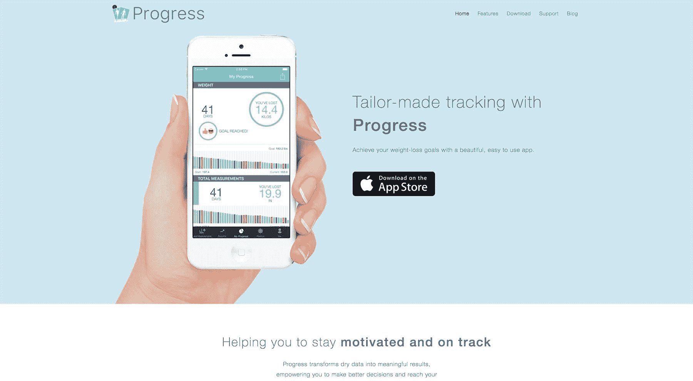
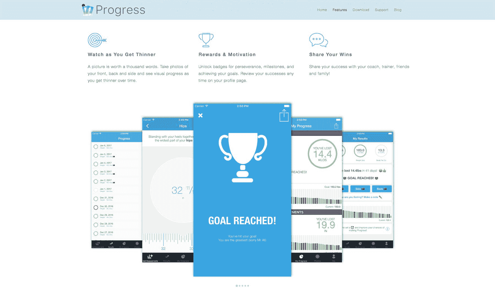

# 将一款人体测量应用的月收入提高到 3，000 美元

> 原文：<https://www.indiehackers.com/interview/growing-a-body-measurement-app-to-3-000-in-monthly-revenue-0d0c5cfd05>

## 你好！你的背景是什么，你在做什么？

嗨！我叫刘易斯，来自英国。我第一次接触编程是在 10 岁左右，当时我父亲从他任教的学校带了一台 BBC 微型电脑回家。从那以后，我一直以这样或那样的方式编写代码。

我以编程为职业，并最终在一家咨询公司工作，为巴克莱、伊莱克斯、马克&斯潘塞和英国宇航系统公司(英国一家大型军事防御供应商)等公司做项目。

我的应用程序 [Body Tracker](https://theprogressapp.com/) (之前的“Progress”)旨在帮助人们跟踪体重减轻，但它超出了通常的体重和身体质量指数指标。孤立地跟踪体重可能会产生误导，因此该应用程序通过为用户提供跟踪身体测量值、体脂百分比、进度照片以及体重的工具，让用户看到更全面的图片。

该应用程序每月赚 2000-4k 美元，在 2018 年元旦，我度过了有史以来最好的一天，在 24 小时内赚了超过 1000 美元——这是我去年同一天的 4 倍。

 

## 是什么促使你开始使用身体跟踪器应用程序？

2011 年我想为我的婚礼减肥，所以我的未婚妻推荐了蒂姆·费里斯的 4 小时身体。除了饮食建议，Tim 建议跟踪体重、尺寸和照片。我不想用电子表格来记录数据——这需要太长时间，而且我讨厌电子表格——但是当我转向应用商店寻找替代方案时，没有一个符合要求。

因为我已经在找借口学习如何制作 iPhone 应用程序，所以我决定自己制作。

你要解决一个真正的问题，创造独特的价值。我认为这是许多应用程序开发人员出错的地方。

TweetShare

我做它纯粹是为了符合我自己的目的，第一次迭代非常非常基础，但我还是决定把它放在 App Store 里。我惊奇地发现人们为它付费。从那以后，我一直断断续续地研究它。

## 构建最初的产品需要什么？

我当时在做全职工作，我知道下班后我会太累而无法学习新技能，所以我开始提前一个小时起床，在去办公室之前学习 iOS 开发。我发现这是开始一天的好方法，而且在上班前完全为自己工作真的很愉快。

我花了大约 30 美元买了一本关于 iOS 开发的书，一个苹果开发者账户大约 100 美元，但除此之外我没有任何支出。但你确实需要一台苹果电脑来为 iOS 设备制作应用。

从创意到应用商店，这款应用花了大约三个月的时间。作为一个从事软件开发的人，我非常清楚“范围蔓延”,并且想要做出理想的 MVP。我也黑过我想不通的东西。举个例子，那时候 iOS 里做图表的库不多，但是 web 的库很多。所以我为图表制作了一个网页，并将其包含在应用程序中，而不是制作原生图表。

在这个过程中，我有几个真正帮助我的工具: [Head First](http://amzn.to/2Bc5Yof) 系列书籍是学习编程的一个令人难以置信的资源，但遗憾的是，它们不再为 iOS 更新。我还使用了来自 [Ray Wenderlich](https://www.raywenderlich.com) 的一些教程，它们仍然是我向任何想要学习 iOS 开发的人推荐的主要资源。

## 你是如何吸引用户并让身体追踪器应用成长的？

随着时间的推移，我尝试了很多方法来发展这款应用，但没有一种方法能让这款应用在应用商店的有机搜索中更显眼。对我来说，这是吸引用户的第一要素。

我的另一个应用程序出现在美国应用程序商店中，每天有一百万次点击。市场是巨大的，但是你需要能够发现并利用它。

然而这并不容易——减肥领域竞争非常激烈，我的大多数竞争对手的 [LTV](https://en.wikipedia.org/wiki/Customer_lifetime_value) 都比我高得多，所以他们有能力在广告上多花很多钱。我实际上被收费广告挤出了这条路。我也无法从公关或赞助文章中获得投资回报。

 

到目前为止，我最大的成功是通过关注 ASO ( [应用商店优化](https://en.wikipedia.org/wiki/App_store_optimization))。这对有多少人能够找到这个应用程序产生了巨大的影响，而且它真的很容易和快捷，至少在开始时是这样。

我还发现，发布定期更新、将崩溃降至最低、鼓励用户留下评论(以及最近的评级)都有助于我的 ASO 工作。

## 你的商业模式是什么，你是如何增加收入的？

这款应用的盈利方式有两种:应用内购买(IAP)以解锁更多功能，以及广告。从广告中获得的回报微不足道，但我认为付费删除广告是一个很好的升级激励。

我最初的产品是预先收费，每月收入不到 100 美元。

在为 iOS 7 对它进行了更专业的重新设计后，我用 IAP 使它免费，它开始每月花费高达 500-1000 美元。

你不必在释放价值之前创造所有的价值。早点发布，真正听取你的反馈。

TweetShare

2016 年底，我开始真正关注 ASO，这让我每个月的收入增加到 2000-4k 美元。我还改进了应用程序的图标和销售页面，我相信这也有所贡献。

现在我喜欢做实验，挑选一个特定的转化率，尝试一些提高它的东西。我也增加了我做的 A/B 测试。

## 你未来的目标是什么？

在经历了一天 1000 美元后，我真的想每天都去。

我一直在播种的一个领域是建立一个邮件列表，这样我就可以向已经信任 Body Tracker 品牌的人销售相关产品——例如，销售健康食谱。

我也很想让这款应用成为订阅服务。这可能需要添加卡路里追踪、减肥计划或其他有价值的持续功能。

我也有一个很长的愿望清单，我想添加的功能，我认为会增加保留。

我很想用我的另一个应用程序复制身体跟踪器的成功。我认为它目前表现不佳，所以看看我能否用类似的方法扭转它将会很有趣。

最后，我想建立一个全职应用程序开发人员社区，这样我们就可以在发展业务时通过反馈和支持来互相帮助。

## 你面临的最大挑战和克服的障碍是什么？

最困难的事情是这么多年来一直相信这个应用程序，而它仍然是一个表现不佳的辅助工具。我花了很长时间在支付账单的需求和开发应用程序的需求之间寻找平衡。但我尽我所能不断改进。

2016 年，我签下了一份为期六个月的全职合同，打算在合同到期后休息几个月来开发这款应用。然后，我给自己设定了三个月的期限，让这款应用成为我的全职关注对象。只是在最后一周，我才得以扭转局面。这些期限很难强加给自己，也很难认真对待，但对我来说却有很大的不同。

## 有没有发现什么特别有帮助或者有优势的？

我已经提到过 Ray Wenderlich，你可以在那里获得很多有用的信息。我还推荐《T2:让用户变得棒极了》这本书，这本书给你一个全新的视角，让你了解你的软件(和所有产品)对你的客户意味着什么。对于 ASO 来说，[应用大师播客](http://www.appmasters.co)有很多好的信息。

我认为跟上苹果设定的趋势也是一个非常好的主意。迅速跟上新技术——这样，你就有更好的机会成为苹果公司的特色，你也不必浪费时间去追赶那些在得到提示时就抓住了线索的竞争对手。事后看来，很容易理解他们是如何通过在 iPhone 发布前几年发布的 UI 工具来暗示 iPhone 尺寸变大的。

也就是说，非常重要的一点是要超级务实。开发人员有一种想要制作完美代码和永远重构的倾向。你必须问自己:“这会对我的客户产生影响吗？”如果答案是否定的，那很可能不值得你花时间。

与此相关的是，如果你打算生产自己的产品并降低成本，你很可能不得不成为一个多面手。学习设计、市场营销、销售、客户沟通和统计。做一个不错的程序员，在这些事情上还不错，比做一个世界级的程序员，在其他方面没有能力要好。

## 对于刚刚起步的独立黑客，你有什么建议？

你要解决一个真正的问题，创造独特的价值。我认为这是许多应用程序开发人员出错的地方。制作另一款体重追踪应用相对容易——应用商店里有很多，但很少有下载量可观的。正是身体跟踪器中的多层额外功能使它脱颖而出，并使其更难复制。

也就是说，你不必在释放价值之前创造所有的价值。早点发布，真正听取你的反馈。尽你所能鼓励反馈。

如果你打算生产自己的产品并降低成本，你可能不得不成为一个多面手。

TweetShare

我发现的另一件有用的事情是:当考虑添加新功能时，问问自己它是否会出现在你的销售文案中。如果新功能不能鼓励更多的人下载你的应用程序，它可能就不值得添加。

而对于应用开发者来说，把精力放在 ASO 上。这看起来可能会分散注意力，但如果你想在应用商店谋生，这是必不可少的。

## 我们可以去哪里了解更多？

我的个人博客是 [Lewis Makes Apps](https://lewismakesapps.com) ，我是 Twitter 上的 [@lewisMakesApps](https://twitter.com/lewisMakesApps) 。我最近也找到了上 [YouTube](https://www.youtube.com/channel/UCpmX0g0vepWqVdDdtUCpTFw/) 的方法。外面全职 iOS 独立开发者不多，如果你也是一条船上的请联系！

如果你有任何关于应用程序开发或独立生活的问题，请在评论中联系我！

——[<picture id="ember5199617" class="user-avatar ember-view user-link__avatar"></picture>刘易斯·史密斯](/lewis42?id=iXKBDQHw2ucpYJsCqKAMW7OC61R2)，身体追踪器 App 创始人

## 想像身体追踪器 App 一样建立自己的事业？

你应该加入独立黑客社区！🤗

我们是几千名创始人，互相帮助建立有利可图的业务和副业。来分享你正在做的事情，并从你的同事那里获得反馈。

还没准备好开始使用你的产品吗？没问题。这个社区是一个认识人、学习和实践的好地方。随意[随便浏览](/)！

——[<picture id="ember5199622" class="user-avatar ember-view user-link__avatar"></picture>柯特兰艾伦](/csallen?id=ibTLPyjwVebnZjMGKvz6ztarnuV2)，独立黑客创始人

14votes