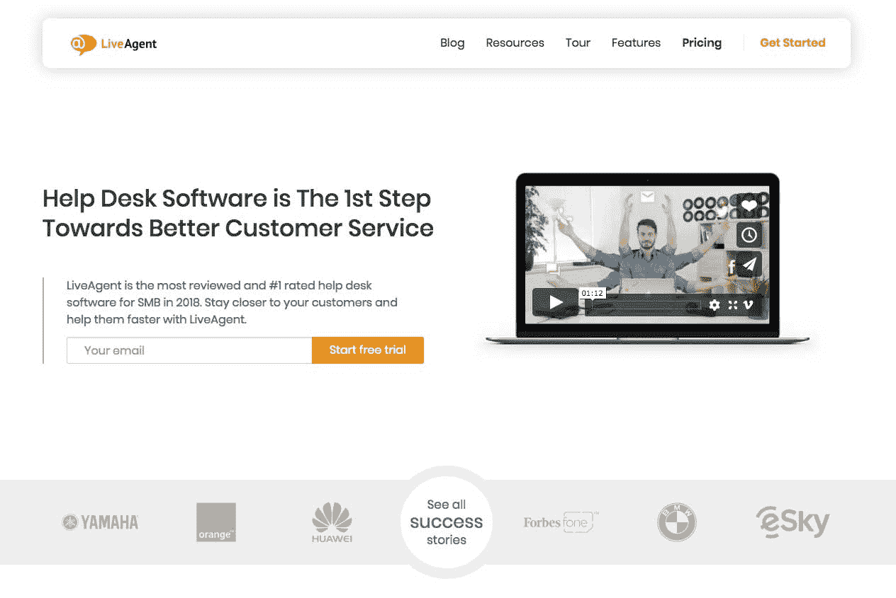
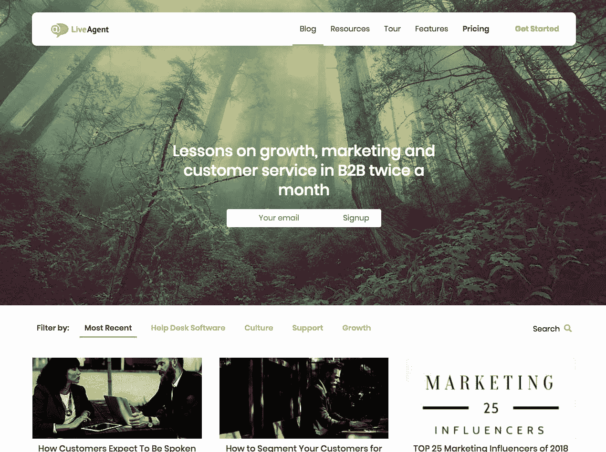

# 将一个自举的副业项目从每月 20，000 美元增长到 250，000 美元

> 原文：<https://www.indiehackers.com/interview/growing-a-bootstrapped-side-project-from-20-000-to-250-000-a-month-51b744f1f3>

## 你好！你的背景是什么，你在做什么？

大家好，我是 David Cacik，我是 LiveAgent 的增长主管。我高中时开了第一家公司，大学时又开了一家。我卖掉了它，在 LiveAgent 担任了一个令人兴奋的角色。我是第一个加入公司的“营销人员”,并帮助 MRR 从 2 万美元发展到 25 万美元。

[LiveAgent](https://www.ladesk.com) 是一款多渠道[客服软件](https://www.ladesk.com/customer-service-software)。我们是一个自助 SaaS，总部设在布拉迪斯拉发，斯洛伐克(中欧)。我们与 Zendesk 和 Freshdesk 等数百万美元支持的公司竞争，这使得它更具挑战性和趣味性。

 

## LiveAgent 是怎么诞生的？

LiveAgent 是作为一个附带项目创建的。该公司的第一款产品是 [Post Affiliate Pro](https://www.postaffiliatepro.com) ，这是一款代销商追踪软件。我们研究了一个好的客户服务工具，但是找不到。那时，我们决定开发仅供内部使用的 LiveAgent。过了一段时间，客户，主要是 B2B，开始问我们用什么做客户服务。这就是我们如何出售 LiveAgent 的第一个许可证。

几年后，LiveAgent 在 MRR 和团队成员方面都超过了 Post Affiliate Pro。

## 构建最初的产品需要什么？

我们对两种产品使用了相同的技术，这样我们就可以腾出相同的团队来转移工作重点。LiveAgent 最初并不是一个多渠道支持软件。它实际上是两个独立的应用程序，一个用于电子邮件票务，另一个用于实时聊天。2012 年，我们将它们合并在一起，这就是 LiveAgent 的诞生。

我们投入到 LiveAgent 建设中的一切，都是由 Post Affiliate Pro 的销售额资助的。当时最艰难的决定是，是继续用 PAP 的收入资助 LiveAgent，还是决定这些收入是否可以更好地用于改进和营销 PAP。我们一致认为，客户服务软件的市场要大得多，我们承担了风险，并专注于 LiveAgent。

你不必拥有一支由脸书和优步辍学生组成的豪华团队，也不必在湾区拥有一个办公室，就能与 1.5 亿美元以上的融资公司竞争。

TweetShare

也有风险投资的选择，但自举一直存在于我们的 DNA 中，伴随着健康稳定的增长。过去是，现在仍然是，接受外部资金非常诱人，但这不是我们目前所寻求的。

## 你是如何吸引用户并发展 LiveAgent 的？

我们通过接触客户群和客户直接询问我们用于客户服务的软件获得了第一批客户。我们还向我们的合作伙伴和朋友赠送了一些许可证，这对收集反馈和推荐非常有用。其中一个朋友是当地的虚拟主机公司。在他们开始使用 LiveAgent 之后，我们注意到四分之三的其他领先的本地虚拟主机公司也开始使用它，并且他们现在都在继续使用它。

不要害怕免费赠送一些许可证。

TweetShare

在我们的小工具上展示的口碑和品牌，如“LiveAgent 的实时聊天软件”,带来了 50%的新线索，其余的由我们的 SEO 努力、附属推荐和 PPC 驱动的有机流量组成。尽管点击非常昂贵，关键词竞争非常激烈，但我们仍然设法找到了方法，并通过我们的 PPC 活动获得了积极的投资回报。

 

不要害怕免费赠送一些许可证。如果你对你的产品有信心，你可以肯定“免费”许可迟早会得到数倍的回报。

## 你的商业模式是什么，你是如何增加收入的？

我们从销售自托管的单一支付许可证开始，客户可以购买许可证，安装在他们的云中，如果需要，每 12 个月购买一次产品更新。使用 LiveAgent，我们还可以通过添加更多席位或高级功能来追加销售客户。2012 年后，我们开始订阅 SaaS，现在他们约占我们年收入的 90%。

我们仍然提供自托管许可证，但我们的重点主要是订阅。定价对我们来说一直是一个很大的问号，老实说，我们几乎每年都要改变两次。

专注于打造一个人们会喜欢的伟大产品，如果你需要外部资金，等待风险投资来找你，接受最好的交易。

TweetShare

借助 [LiveAgent](https://www.ladesk.com) ，我们在 MRR 获得了约 25 万美元的收入，其中包括订阅销售、自主许可销售、企业销售和服务。我们已经尝试了数百种增长技巧，但大多数都失败了。如果让我选择效果最好(投资回报率最高)的，我会选择:

1.  通过在软件目录/比较网站注册您的产品来建立在线形象；收集评论，利用他们的 PPC/潜在客户生成计划，并推广社会证明。这种做法是我们做过的最有投资回报的一次黑客攻击，我在这里详细介绍了它如何给[的 MMR 带来 300%的增长](https://www.saasgrowthhacker.com/boosting-your-presence-at-software-directories-300-percent-increase-mrr/)。
2.  改善入职用户体验。LiveAgent 是一个复杂的软件，可以以多种方式使用。我们修改了“入门”指南，使其非常容易设置，这有助于我们提高试用>付费漏斗的转化率。
3.  投资客户服务。我是第一个加入 LiveAgent 的“营销人员”,当时，我们已经有六个客户支持代表了。照顾好你的客户至关重要，再加上拥有一个好的产品，为病毒式传播和口碑营销奠定了基础。

## 你未来的目标是什么？

我们刚刚开设了一个新的办公室，并希望雇用更多优秀的人来帮助我们更快地发展。我们还推出了新的呼叫中心功能，并计划推出新的云环境，以提供更快、更好的体验。

我们不做典型的营销预算规划。我们只投资于可衡量的活动，这些活动会带来积极的投资回报。我们对在哪里以及如何消费非常谨慎。

我们可能面临着和其他软件公司一样的问题——寻找合适的人才。东欧的技术人才水平非常高。然而，我们很难接触到有经验的销售和营销人员。

在不久的将来，我们希望建立重要的合作伙伴关系，并探索特定的当地市场。

 

## 你面临的最大挑战和克服的障碍是什么？

雇佣销售人员就像在《哈利·波特》中寻找黑魔法防御术老师一样。他们中的大多数都没有持续超过几个月。这可能是我们最大的挑战。

当我们把它外包出去的时候，我们也在 PPC 上花了很多钱。那时，我们决定关键项目必须由内部团队成员来处理，分享相同的思维模式和高度关注绩效和责任的自举文化。

## 对于刚刚起步的独立黑客，你有什么建议？

专注于打造一个人们会喜欢的伟大产品，如果你需要外部资金，等待风险投资来找你，接受最好的交易。

此外，正如我们的故事所证实的，你不必拥有一支由脸书和优步辍学生组成的豪华团队，也不必在湾区拥有一个办公室，就能与 1.5 亿美元以上的融资公司竞争。

## 我们可以去哪里了解更多？

你可以在这里查看 LiveAgent 的博客。最近，我也开始了我自己的 [SaaS 成长黑客博客](https://www.saasgrowthhacker.com)，在那里我分享我的经验和我用 LiveAgent 尝试过的技巧和诀窍。你可以在 [LinkedIn](https://www.linkedin.com/in/davidcacik/) 上和我联系，也可以在下面自由提问。我保证我会回答所有问题。:)

—[<picture id="ember5266818" class="user-avatar ember-view user-link__avatar"></picture>大卫·卡西克](/mnzrs?id=KNfYPK6CteYseZ2SQoYKNGNw5jF3)

## 想像 LiveAgent 一样建立自己的事业？

你应该加入独立黑客社区！🤗

我们是几千名创始人，互相帮助建立有利可图的业务和副业。来分享你正在做的事情，并从你的同事那里获得反馈。

还没准备好开始使用你的产品吗？没问题。这个社区是一个认识人、学习和实践的好地方。随意[随便浏览](/)！

——[<picture id="ember5266823" class="user-avatar ember-view user-link__avatar"></picture>柯特兰艾伦](/csallen?id=ibTLPyjwVebnZjMGKvz6ztarnuV2)，独立黑客创始人

43votes