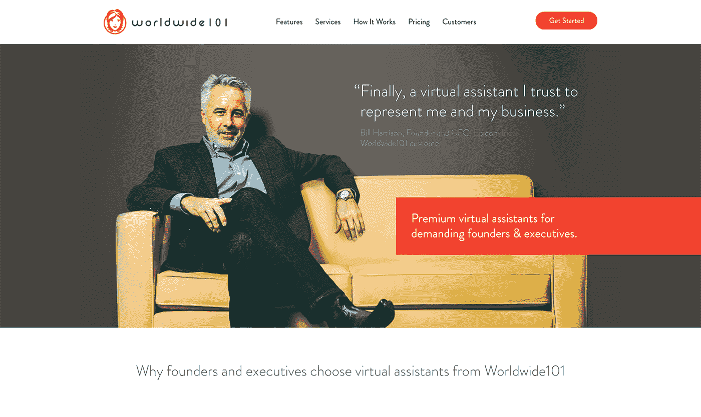
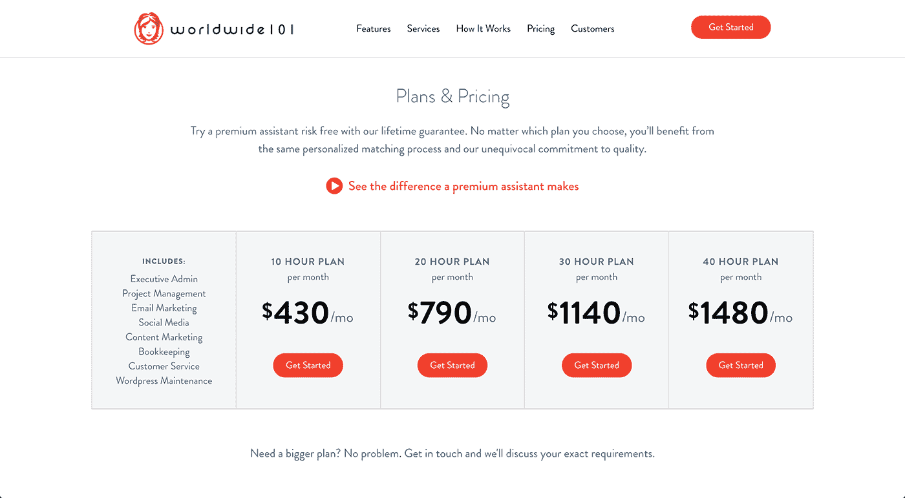

# 将咨询业务发展成虚拟助理公司

> 原文：<https://www.indiehackers.com/interview/growing-a-consulting-business-into-a-virtual-assistant-company-e8d3d2205a>

## 你好！给我们介绍一下你自己吧！

嗨！我是桑德拉·刘易斯，全球 101 虚拟助理公司的创始人。我们帮助忙碌的创始人和高管腾出时间，提供他们可以信任的高技能专业人士来代表他们的业务和履行职责。

寻找可靠的、值得信赖的、胜任的帮助一直是运营一个成功的企业或项目的最重要的挑战之一——当使用远程资源时，这一点更加重要。Worldwide101 的经验丰富的虚拟助理团队为企业提供发展所需的专业支持。

 

## 是什么促使你开始学习环球 101？

早在 2009 年，我和丈夫就把家从美国搬到了英国。在纽约做了 22 年多紧张而消耗精力的工作后，我想找到一种方法继续拥有一份有回报的职业，没有通勤压力、办公室政治和全方位的疲惫体验！当时，自由职业正在兴起，所以我决定尝试一下。

我开始在虚拟的基础上帮助企业家进行人力资源咨询和项目管理，很快我的客户开始向他们的朋友推荐我的服务。与此同时，我注意到，对于成功的企业主和企业家来说，找到并培训有才华的承包商，让他们在不倾家荡产的情况下灵活工作，似乎有多么困难。所以我给自己设定了提供解决方案的任务，这就是 [Worldwide101](http://worldwide101.com) 的诞生！

我们从第一天就启动了全球 101。

TweetShare

## 你是如何吸引用户并在世界范围内成长的？

我们将所有精力集中在打造优质品牌和持续为客户提供卓越服务上。结果是，我们的大部分增长来自推荐——我们的客户推荐他们的朋友和同事。

因为 [Worldwide101](http://worldwide101.com) 提供了一个 100%远程的团队来支持高管、创始人和企业主，所以提供出色支持的风险非常高。出于这个原因，我很早就意识到我们的成长与我们建立一个真正优秀的团队的能力直接相关，这个团队能够带来真正的改变，一个我们的客户信任的团队！

一路走来，我们学到了很多，尤其是招聘技巧。我承认，在我们成功招聘到合适的专业人士之前，我们也经历过几次惨痛的失败。(我在[这篇中型文章](https://medium.com/startup-grind/how-a-clandestine-las-vegas-birthday-party-changed-my-approach-to-hiring-aa79e2c5da)中写了很多。)

## 你的商业模式是什么，你是如何增加收入的？

从第一天起，我们就在全球范围内自力更生，我很高兴我们做到了！实现这一目标的一个关键因素是，我们选择了一种经常性收入模式，因此现金流始终为正。我们专注于提供一个长期的解决方案，这样我们的流失率总是在最低水平，我们的客户每月为我们的服务支付一笔预聘费。

 

在我们开业的第一年，我们会在每个月底为客户消费的服务开具发票。你可以想象，我们遇到了许多企业都有的问题:一些客户会延迟付款，让我们一个月又一个月地不确定我们是否能够支付工资。

在第二年，我开始明白，我们的大多数客户不仅爱我们，而且希望我们茁壮成长。这让我有信心开始要求新客户在提供服务之前向我们付款，并保证满意。我为愤怒的反弹做好了准备，但它从未到来:没有一个客户质疑这一要求。

细节汗！…我们日复一日所做的所有小事情都是伟大产品的来源。

TweetShare

在过去的一年里，我们建立了一个专有的仪表板，这样我们所有的支付和报告都可以无缝处理。它彻底改变了我们与客户互动的方式，节省了我们的时间，让我们可以专注于更大的事情。它还产生了关于我们如何更好地为客户服务的非常有价值的数据。

## 你未来的目标是什么，你打算如何实现它们？

我们招聘有才能和有技能的专业人士的能力给全球的[101](http://worldwide101.com)带来了最大的变化。我怎么说都不为过——我们的团队令人惊叹，我们的声誉和我们提供的优质服务非常依赖于我们的团队对客户成功的承诺。

我们目前正以每月五名新专业人员的速度积极招聘，我们填补这些职位的能力是我们发展的关键。

因此，我们的大计划就是继续成长，超越我们所做的一切！我们希望提高对虚拟助理行业的认识，以便更多的企业和高管了解雇佣虚拟助理来支持其业务增长的价值。当我们开始时，我们对理想客户“是谁”没有一个清晰的愿景。随着时间的推移，我们已经完善了我们的品牌，以迎合寻求优质服务的客户。

## 你最大的优势是什么？

我尽可能地让事情变得简单。每个企业家都面临着许多复杂的问题，所以我尽量不要让事情变得更复杂！引用理查德·布兰森的话，“复杂性是你的敌人。任何傻瓜都能把事情变得复杂。很难做出简单的东西。”

可能我们最大的优势是我们的人力资源背景和我们识别优秀人才的能力。这就是我们与竞争对手真正不同的地方——我们员工的素质。

## 对于刚刚起步的独立黑客，你有什么建议？

我非常相信保持积极的观点是任何企业家成功的第一要素。将会有挑战，困难时期，令人不安的未回答的问题，等等。所以保持积极的态度是坚持下去并找到正确解决方案的关键。

一些客户会延迟付款，让我们无法确定，一个月又一个月，我们是否能够支付工资。

TweetShare

我想说的另一件事是“关注细节”！我坚信，我们日复一日所做的所有小事情都可以成就伟大的产品。因此，在早期，记得花时间创建流程，并弄清楚如何展示你的品牌。当然，它会不断发展——但不要低估小细节对你的业务的影响，以及如果你不抓住它们，它们会破坏一切的能力。

最重要的是，一定要专注于为你的客户提供真正出色的服务和体验——因为其他的事情会接踵而至。

## 我们可以去哪里了解更多？

你可以在[Worldwide101.com](http://worldwide101.com)了解更多关于我们的信息，也可以在推特[@ bestvuritualhelp](https://twitter.com/BestVirtualHelp)了解，或者在[Worldwide101.com/blog](http://worldwide101.com/blog)查看我们的博客。我们也很乐意在这个博客的评论区听到你的任何问题！

——[<picture id="ember8115473" class="user-avatar ember-view user-link__avatar"></picture>桑德拉·刘易斯](/AFairbro?id=VCi9L3ccUzfjLIlk8fDZZJFMtd42)，大胆地创始人

## 想大胆地建立自己的事业吗？

你应该加入[独立黑客社区](/)！🤗

我们是几千名创始人，互相帮助建立有利可图的业务和副业。来分享你正在做的事情，并从你的同事那里获得反馈。

还没准备好开始使用你的产品吗？没问题。这个社区是一个认识人、学习和实践的好地方。随意[随便浏览](/)！

—[<picture id="ember8115478" class="user-avatar ember-view user-link__avatar"></picture>考特兰艾伦](/csallen?id=ibTLPyjwVebnZjMGKvz6ztarnuV2)，独立黑客创始人

13votes