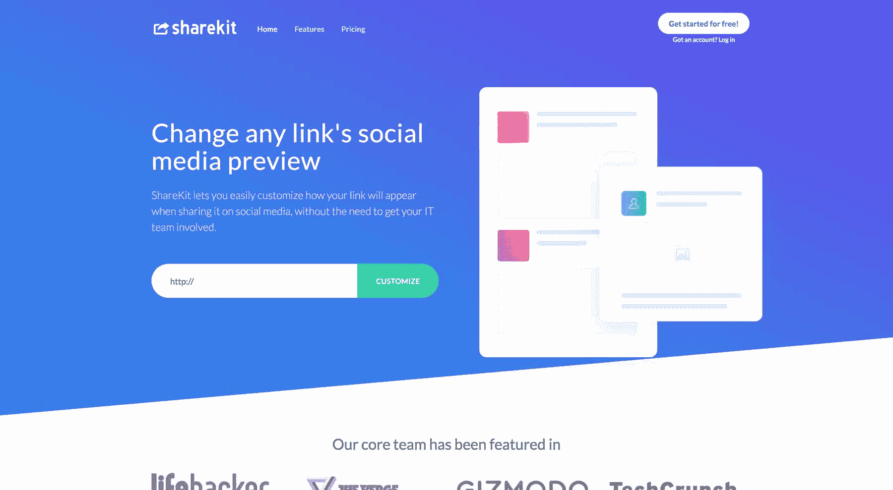
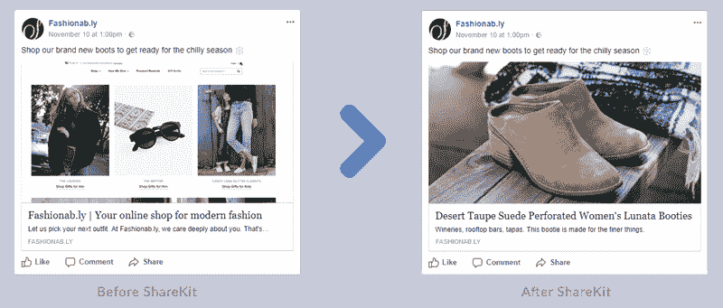
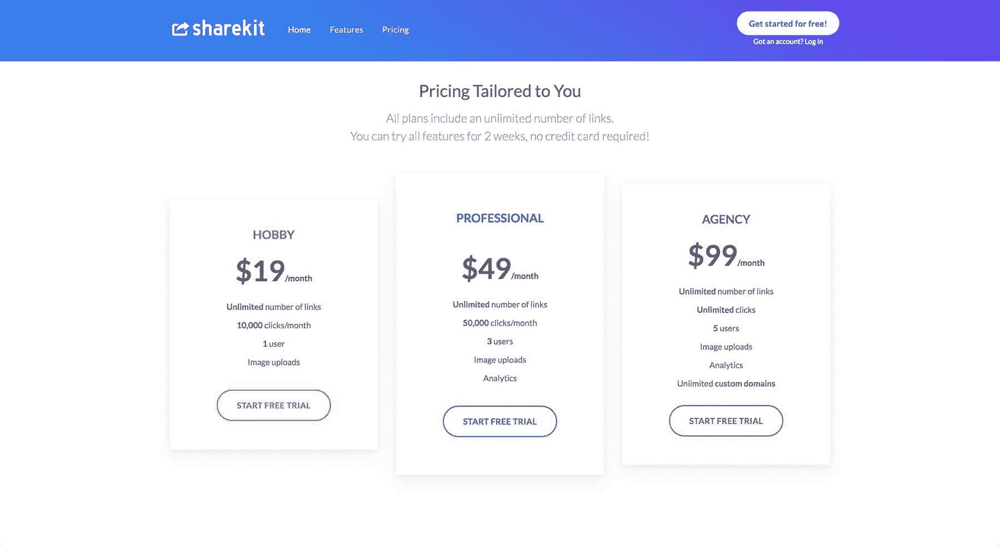

# 将脸书预览版编辑器增加到每月 1，600 美元

> 原文：<https://www.indiehackers.com/interview/growing-a-facebook-preview-editor-to-1-600-mo-e1617218b6>

## 你好！你的背景是什么，你在做什么？

嘿，我叫尼克。我的职业是软件工程师，在过去的五年里，我一直忙于不同的兼职项目。当脸书宣布他们将禁用定制链接预览的功能时，我与两个朋友合作开发了一个解决方案，为数字营销机构解决了这个问题。

[ShareKit.io](https://www.sharekit.io) 恢复了在脸书上编辑链接预览的功能——用户只需上传一张图片，输入标题和描述，ShareKit.io 就会生成一个新的链接，然后可以用漂亮的预览发布到脸书。

自 11 月份推出以来，我们在 MRR 的价格已经涨到了 1600 美元。今天， [ShareKit.io](https://www.sharekit.io) 被大小公司的社交媒体经理、营销机构和独立自由职业者使用，他们关心他们(客户)的脸书页面看起来如何。

 

## 是什么促使你开始使用 ShareKit.io？

我的大多数朋友都在创业公司和营销机构工作，当脸书宣布他们在脸书上发布链接时，将不再能够自定义预览图像、标题和描述时，他们震惊了。他们很多客户的网站没有定义脸书生成有意义的链接预览所需的“开放图形”元标签，因此默认的预览通常是像素化的，或者没有传达帖子的信息。

然而，他们的工作是让客户的社交资料看起来更清晰，这些客户并不满意“这是脸书的错”这个回答，为什么他们的链接预览突然变得普通而乏味。

事实上，我曾参与多个“业余爱好”项目，这对于快速获得 ShareKit.io 的早期 MVP 非常有帮助。

TweetShare

脸书实施这一限制是为了阻止假新闻的传播，但在这个过程中，他们伤害了很多与假新闻无关的社交媒体机构和自由职业者。我的朋友们继续烦我，帮助他们找到解决这个问题的办法，在九月，我终于花了几个漫长的夜晚和周末完成了一个 MVP。

## 构建最初的产品需要什么？

我在 9 月份开始从事 [ShareKit.io](https://www.sharekit.io) 的工作，在尝试从不同角度解决这个问题后，我在四周之后达成了一个可行的概念验证。

ShareKit.io 的工作原理是充当脸书和目标网站之间的中介。用户将他们想要分享的链接粘贴到我们的工具中，然后可以定制链接预览的图像、标题和描述。ShareKit.io 生成一个新链接，然后共享到脸书，脸书将显示新的预览图像/标题/描述。

 

基于我们早期客户的反馈，我添加了一个分析功能和一个自定义域功能，这允许我们的用户在共享链接时使用他们自己的域。由于我们产品的一部分可以归结为一种先进的链路缩短器，正常运行时间对我们来说非常重要。我们使用 [Uptime Robot](https://uptimerobot.com/) 作为公共状态页面，使用 [New Relic](https://newrelic.com/) 来监控我们的 AWS 基础设施。

## 你们是如何吸引用户并壮大 ShareKit.io 的？

因为这解决了他们的问题，我朋友的雇主立刻愿意付钱让我访问 [ShareKit.io](https://www.sharekit.io) 。我们还向那些在推特和脸书上表达了对脸书行动不满的营销人员发了冷邮件。一旦我们有了足够的反馈和初步增长来建立产品的市场适应性，我们[推出了](https://www.producthunt.com/posts/sharekit-io)产品搜索，这导致了流量和新注册的激增。

现在，我们开始尝试谷歌和脸书的广告，并在社交媒体博客上寻找客座博文的机会。我们还继续通过 LinkedIn 直接联系社交媒体经理，并对 Twitter 上的求助做出回应。为了增加从试用用户到付费用户的转化，我们实施了一项推广活动，展示 ShareKit.io 的不同功能(例如分析和我们的自定义域名选项)，以鼓励人们升级到付费计划。

## 你的商业模式是什么，你是如何增加收入的？

我们提供为期两周的免费试用，然后要求用户从三个月订阅计划中选择，每个计划针对不同的角色(自由职业者、全职社交媒体经理和代理)。

我们的代理包允许我们的客户在共享 ShareKit.io-link 时使用他们现有的域名，这推动了最大计划的注册。我们从第一天开始收费，并使用 [Stripe](https://stripe.com) 处理支付。我们从网站访问者到免费试用注册的转化率目前为 10%，我们将 3%的试用用户转化为订阅用户。到目前为止，我们的客户流失率达到了惊人的 0%——但愿如此！我们目前在 MRR 挣 1600 美元。我们可能会在不久的将来尝试更高的价格点，并可能为企业客户推出“无限一切”计划。

 

## 你未来的目标是什么？

目前，我们专注于增加我们的流量——我们对我们的转化率和流失率感到满意，我们的用户喜欢这个产品。我们希望在 2018 年年中达到 5000 美元的 MRR，我认为根据我们目前的轨迹，这是可以实现的。

就我们对产品本身的目标而言，我们希望让 A/B 测试不同的链接预览变得更容易——目前，您已经可以使用 ShareKit.io 通过为同一个目标 URL 生成两个 ShareKit.io URLs 来对哪个链接预览最适合您的受众进行分割测试。然而，我们希望将这变成一个实际的功能，ShareKit.io 比较同一时间段内两个预览的性能，并根据每个链接的点击量为用户提供统计有效的答案。

我们不断与客户交流，了解他们希望看到的下一个功能，并根据他们的回答列出我们的待办事项。

## 你面临的最大挑战和克服的障碍是什么？如果你必须重新开始，你会做什么不同的事？

一开始，我们在纵向扩展我们的基础架构时玩了一场猫捉老鼠的游戏。每当一家新机构签约时，他们通常会从客户的社交媒体页面带来数百万次点击，我们必须通过立即增加容量来优雅地处理这些点击。

现在，我们使用自动缩放来自动响应我们的增长。从一开始就交付一个完美的产品和缩短上市时间之间总是有一个权衡——如果我必须再做一次，我可能不会改变我的方法，因为如果你没有客户，并且还不确定你是否会超越当前的服务器，那么拥有一个精心设计的自动扩展系统是没有意义的。

## 有没有发现什么特别有帮助或者有优势的？

事实上，我曾参与多个“业余爱好”项目，这对于快速获得 ShareKit.io 的早期 MVP 非常有帮助。即使你的目标不是赚钱，你也能通过验证一个想法、开发产品、推出产品和营销的过程学到很多东西。

我会从你非常关心并且已经沉浸其中的东西开始——这样更容易知道你的用户想要什么(因为你自己就是用户)，并且你知道在哪里可以找到潜在用户(因为他们和你在同一个地方闲逛)。明确地把它框定为一个“只是为了好玩”的项目，可以减少快速增长的压力。

## 对于刚刚起步的独立黑客，你有什么建议？

有一些早期客户和我们一起工作来确定产品本身是非常有价值的。如果可以的话，做一些对人们来说被证明是痛点的事情(他们实际上已经告诉你了，而不仅仅是基于你的猜测)。

与你的扩展网络交流——如果人们认为你能提供帮助，他们喜欢分享他们的日常业务问题。确保你与多人交谈，以确认所有人都存在这个问题。不要害怕选择一个利基市场——你可以随时扩大你的关注点，但你不能解决没有一个明确的目标客户和走向市场的战略。

不要害怕选择一个利基市场——你可以随时扩大你的关注点，但你不能解决没有一个明确的目标客户和走向市场的战略。

TweetShare

努力发现市场中的空缺，这些空缺经常会突然出现。如果像脸书或 Dropbox 这样的大公司改变了一些让很多人愤怒的东西，你就有机会提出一个替代方案或解决方案，让它们立即被卖掉。

从更广的范围来看，法律改革也是如此，比如你可以利用的市场放松管制。彼得·泰尔的 [Zero to One](https://www.amazon.com/dp/0804139296/) 更多地谈到了这种机会，我认为它们目前在独立黑客和 SaaS 企业所做的事情中没有得到充分的体现，因为它们可能没有区块链支持的机器学习初创公司那么有魅力。

## 我们可以去哪里了解更多？

*   我们的网址: [https://www.sharekit.io](https://www.sharekit.io)
*   我们的博客:【https://blog.sharekit.io/ 

欢迎在评论区提问或者发邮件给我 [【邮箱受保护】](/cdn-cgi/l/email-protection#7917101a12390a11180b1c12100d571016) ！

—[<picture id="ember8115220" class="user-avatar ember-view user-link__avatar"></picture>尼克](/nick_f?id=tilwjo7UtdT72ny7dni063fyoSX2)，ShareKit.io 联合创始人

## 想像 ShareKit.io 一样建立自己的事业？

你应该加入[独立黑客社区](/)！🤗

我们是几千名创始人，互相帮助建立有利可图的业务和副业。来分享你正在做的事情，并从你的同事那里获得反馈。

还没准备好开始使用你的产品吗？没问题。这个社区是一个认识人、学习和实践的好地方。随意[随便浏览](/)！

—[<picture id="ember8115225" class="user-avatar ember-view user-link__avatar"></picture>考特兰艾伦](/csallen?id=ibTLPyjwVebnZjMGKvz6ztarnuV2)，独立黑客创始人

14votes