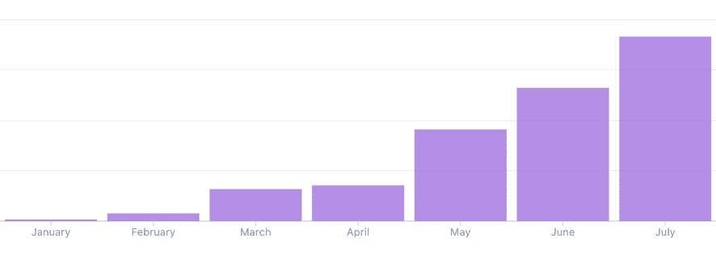
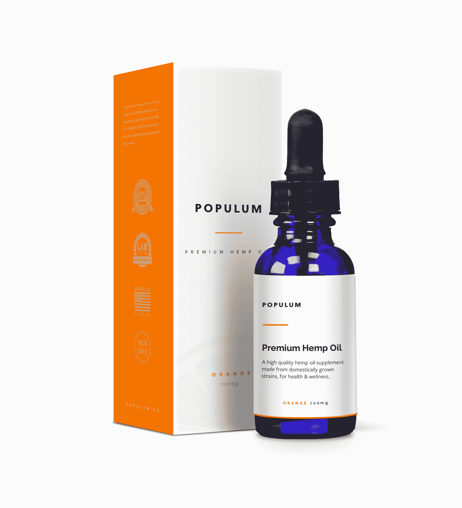
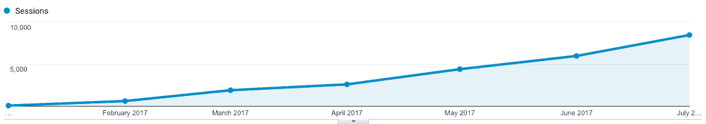
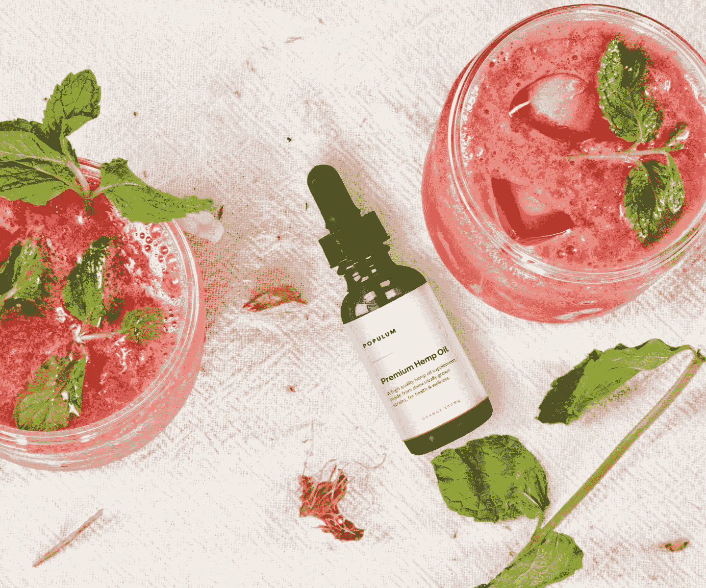

# 在第一年将大麻油业务发展到每月 70，000 美元

> 原文：<https://www.indiehackers.com/interview/growing-a-hemp-oil-business-to-70-000-mo-in-the-first-year-4f9c325878>

## [ 钱宁](https://twitter.com/channingallen)感谢您抽出时间接受联合采访！介意让我们知道你的背景和你在 Populum 做什么吗？

[ Gunhee Park, co-founder of Populum](https://twitter.com/gunhee_park) 

我叫朴君熙，我是 [Populum](https://populum.co) 的联合创始人。我的背景是运营。在与 Ola 合作创办 Populum 之前，我在德克萨斯州奥斯汀的一家科技公司工作了几年。我目前负责运营、销售和客户服务。

[ Ola Olusoga, co-founder of Populum](https://twitter.com/olaolusoga) 

我叫 Ola Olusoga，也是 Populum 的联合创始人。我的背景是设计和营销，这是我在 Populum 领导的领域。

[ Gunhee](https://twitter.com/gunhee_park) 

简单介绍一下我们是谁——popul um 是一个高级麻油品牌。大麻提取物补充剂在过去几年里获得了很多关注，因为大麻中的化学化合物被发现对我们的身体至关重要。通过使用高品质的成分，并与美国农民和认证博士合作，我们向寻求大麻益处的客户提供了一种透明的优质产品。

我们在今年早些时候正式开始销售，我们很快经历了一些重大增长。我们的月销售额从 1000 美元增加到 7 月份的 7 万美元。这是我们 2017 年销售增长的快照。

 

## [ 钱宁 ](https://twitter.com/channingallen) 是什么促使你开始使用 Populum？

[ Gunhee](https://twitter.com/gunhee_park) 

在公司工作了几年后，我真的想辞职。我知道我不会乐于往上爬，而且我已经厌倦了在大公司工作时伴随而来的官僚主义噩梦。

辞职是一个可怕的想法——切断你两周一次的工资，并时刻担心“如果我失败了怎么办”的情况。但在了解了大麻行业，并有机会与 Ola 合作后，我决定尝试一下。我们用共同的积蓄支撑起了公司，并通过继续将利润进行再投资来发展我们的业务。

在对大麻有了更多的了解后，我们开始热衷于创办 Populum。尽管这是人类历史上最古老的栽培作物之一，但我们很好奇为什么很少有人真正了解这种植物。这是因为在最近的历史中，大麻被政府污名化和压制，经常被描绘成与大麻一样的东西。(其实不是。)所以我们想对此做点什么——不仅要扰乱大麻产业，还要帮助大麻市场扩大到更多的客户。

在我们对 Populum 有所设想之前，我们对大麻植物的好处做了几个月的研究。我们发现大麻提取物，主要以大麻二酚(CBD)闻名，具有惊人的益处，而大多数公众完全没有意识到。但即使有这样的潜力，我们发现完全缺乏关于这些产品的信息和透明度。

最终，我们决定违背我们行业的传统智慧…这就是我们开始赢的时候。

TweetShare

这对消费者来说是一个巨大的挑战，其中很大一部分人希望购买麻油作为他们自己或他们所爱的人——配偶，孩子，甚至他们的宠物——的补充。因此，他们能够信任原料的质量，并相信公司会支持自己的产品，这一点至关重要。

我们带着这些想法创立了 Populum。我们的主要目标是创造一种在美国本土采购和制造的高品质大麻油。

## [ 钱宁 ](https://twitter.com/channingallen) 什么东西成了建筑最初的产品？

[ Ola](https://twitter.com/olaolusoga) 

推出我们的第一个产品并不是一件容易的事情。我们对其他大麻，大麻，甚至主流补充品牌进行了基准测试，以让我们了解那里有什么。这也帮助我们找到了如何让自己与众不同的方法。

当 Gunhee 与制造和运营合作伙伴一起工作时，我正在钻研 [Populum](https://populum.co) 的品牌。我们还不知道它会被称为“Populum ”,但我们花了整整一周的时间来来回回地发短信，直到我们找到了一个听起来合适的名字。这一切都发生在 12 月初。我们给自己一个月的时间来完成一切——品牌、产品形象、产品开发、文案等等。

一旦我们选定了 Populum 这个名字，我们就开始冲刺，完成我们的网站和产品。

第一个冲刺是决定品牌声音。也就是说，调色板，排版，图像，标志等。我们从几个选项开始，到周末我们对最终的落脚点感觉很好。

第二周关注产品图片。一旦我们从制造商那里得到了原型，我们就使用在线教程创建了一个超级蹩脚的灯箱，并开始拍照。

第三周关注网站设计。在进入前端代码之前，我们使用 [Sketch](https://www.sketchapp.com/) 来创建网站的页面，以便我们可以迭代设计并就它们进行对话。

在第四周，我们把所有的东西放在一起。我们已经购买了域名并设置了主机。我们选择使用 WordPress 作为基本的 CMS，因为它易于操作，并且可以为你完成 90%的工程工作。我们选择了一个名为[钾](https://kaliumtheme.com/)的主题，并开始建造网站。

总共花了整整四周时间启动，同时并行管理业务的制造方面。我们能够获得所有的产品图像、品牌、履行基础设施、网站、电子邮件等。元旦前一切就绪。

对于真正好奇的人，这里有一个帮助我们通过 sprint 的大多数产品的快速概要:

*   [草图](https://www.sketchapp.com/)和 [Photoshop](http://www.adobe.com/products/photoshop.html) 进行设计
*   [通信松弛](https://slack.com/)
*   [项目管理的 Asana](https://asana.com/)
*   [用于文件共享的 Dropbox](https://www.dropbox.com/)
*   [笔记用收纳盒纸](https://www.dropbox.com/paper)
*   作为 CMS
*   [数字海洋](https://www.digitalocean.com)用于托管
*   [名贱](https://www.namecheap.com)为域名
*   用于商务邮件的 Gmail G 套件

## 你是如何吸引用户并扩大人气的？

[ Ola](https://twitter.com/olaolusoga) 

有了设计背景，我们的目标之一就是通过我们的品牌脱颖而出。我们知道拥有高质量的产品是不够的。在今天的市场上，光有好的客户服务、高质量的产品和合理的价格是不够的。你也必须看起来很棒。

一个巨大的竞争优势在于来自优质品牌的认知，所以我们确保了这一点。今天，人们期待视觉质量。你可以在 Airbnb、脸书和苹果等品牌中看到这一点。他们唤起一种感觉，有个性。这就是我们试图关注的——用视觉表现信任和质量。

与设计平行，我们非常重视的另一个领域是客户服务。我们知道，对许多人来说，麻油是一种相对较新的外国产品。他们中的许多人以前从未听说过或使用过它，这可能会使他们更加犹豫是否要尝试它。我们通过 30 天的无风险试用帮助客户克服这种不安，这在业内尚属首次。

通过这一政策，我们让客户知道我们有多相信我们的产品，以及我们有多关心用户对我们品牌的体验。

推荐是我们的另一大增长领域。我们意识到，在客户使用我们的产品并与我们一起购物后，他们喜欢与朋友和家人分享他们的体验。我们希望鼓励我们的客户继续这样做，并感谢他们让其他人了解我们。所以我们开始了一个简单明了的推荐项目。这种口碑营销确实帮助我们利用了有机增长。

## [ 钱宁 ](https://twitter.com/channingallen) 你的商业模式是什么，你的收入是如何增长的？

[ Gunhee](https://twitter.com/gunhee_park) 

我们是一个直接面向消费者的品牌，直接在我们的网站上销售，也通过亚马逊销售。身处这样一个充满争议的行业，创办公司和发展业务迫使我们更多地跳出框框思考。

围绕这种植物仍然有很多规定和污名。像 Stripe 这样的支付处理器拒绝与我们合作。脸书拒绝以大麻为主题的促销和广告。谷歌还将使用 adwords 进行推广的账户列入黑名单。因此，从一开始，我们就不得不寻找非正统和替代的方式来推广我们的产品。

最早帮助我们的是使用有机的牵引策略，如口碑和评论。我们与评论网站合作，让我们的产品得到测试，通过活跃在 Reddit 等在线论坛的讨论板上，参与在线论坛，还提供免费赠品，让人们体验这种补充剂。

起初，所有这些方法都是费力的手工操作，并且不可扩展。但我们的目标是获得一批真正的粉丝，让产品自己说话。总的来说，这些手动牵引策略为我们带来了回报。迄今为止，我们还没有将流量导向我们网站的广告，但是我们已经看到了流量的持续增长。以下是今年我们网站上的总会话(每月)快照:

最终，我们也获准在亚马逊上销售，这真的帮助我们的销售起飞。亚马逊公正的评论帮助客户信任我们的产品，我们能够利用他们的平台向更广泛的客户传播关于大麻油的意识。

今天，我们的网站和亚马逊的销售额几乎对半分，我们的月收入为 7 万美元。

## [ 钱宁](https://twitter.com/channingallen)你未来的目标是什么？

[ Ola](https://twitter.com/olaolusoga) 

我们的产品得到了一些令人惊讶的反馈，很高兴看到我们的麻油帮助了很多人。我们的主要目标之一是通过成为行业中的市场领导者来加速主流中大麻油的认知度。为了有效地做到这一点，并使顾客更容易尝试麻油，我们意识到我们的产品选择需要改进。

对于我们所有的顾客来说，将补充剂作为酊剂，将液体滴在舌下，并不是理想的方法。相当多的潜在客户被它拒之门外。所以我们的目标是成为一个创新者，开发更多种类的油，比如你可以涂抹的外用产品，比如乳液，胶囊，甚至是含油的糖果。

作为一家白手起家的公司，我们的目标是管理我们的增长，并将利润进行再投资，以不断提高我们的质量、运营和产品供应。我们计划很快通过与零售店合作，如健康商店和诊所，使我们的分销多样化。

## [ 钱宁 ](https://twitter.com/channingallen) 你说你面前最大的拦路虎是什么？

[ Gunhee](https://twitter.com/gunhee_park) 

大麻行业每个人最大的拦路虎就是政府监管。过去，大麻提取物和大麻被归为一类。这种困惑今天依然存在。

实际上现在有一个正在进行的诉讼，大麻产业的利益相关者正在寻求一些澄清，因为美国药品管理局已经发表了声明，导致了更多的不确定性。这个案子如何解决将对我们和业内的每个人都有巨大的影响。

## [ 钱宁](https://twitter.com/channingallen)

[ Gunhee](https://twitter.com/gunhee_park) 

从一个禁忌行业开始，我们早期犯的一个错误是在方法上过于谨慎。我们在验证市场和分销渠道时非常保守。我们会不断怀疑某些事情是否被允许，或者我们是否应该去问“行业专家”。在过去的一年里，我认识到这种想法是错误的。

例如，我们被告知不能在亚马逊上销售。我们被告知没有办法销售我们的产品，因为像谷歌和脸书这样的平台禁止销售。我们被鼓励“咨询”大麻行业的专家，因为他们最了解。

最终，我们决定违背我们行业的传统智慧——这就是我们开始获胜的时候。我认为这对进入任何行业的企业家来说都是宝贵的一课。我们创建 [Populum](https://populum.co) 是为了给这个行业带来积极的变化并加速其发展。牢记这一点，我们所做的一切都应该是挑战现状，改变现状。

 

## [ 钱宁 ](https://twitter.com/channingallen) 有没有发现什么特别有帮助或者有利的事情？

[ Ola](https://twitter.com/olaolusoga) 

拥有科技背景帮助很大。但是，在我们前进的过程中，有很多东西我们需要去理解和学习。我和 Gunhee 都是狂热的读者，所以我们利用这些机会深入我们不熟悉的领域。

例如，当我们第一次开始时，我们并不擅长数字营销，所以我们谷歌了“营销方面的最佳书籍”，并订购了在结果中不断出现的书籍。

这里有一些我们从中学到很多的书:

*   加布里埃尔·温伯格和贾斯汀·马雷斯
*   Alistair Croll 和 Benjamin Yoskovitz 的精益分析
*   埃里克·里斯的《精益创业》
*   [运行精益](https://www.amazon.com/Running-Lean-Iterate-Works-OReilly/dp/1449305172/)由 Ash Maurya
*   [克里斯·史密斯的转换代码](https://www.amazon.com/Conversion-Code-Capture-Internet-Appointments/dp/B01N9Y1W7K)
*   [品牌差距](https://www.amazon.com/Brand-Gap-Distance-Business-Strategy/dp/0321348109)作者马蒂·纽梅尔
*   [脸书广告终极指南](https://www.amazon.com/Ultimate-Guide-Facebook-Advertising-Potential/dp/1599185466)佩里·马歇尔和基思·克朗斯著
*   佩里·马歇尔和迈克·罗兹的《谷歌广告词终极指南》
*   罗伯特·恰尔迪尼的影响

你说出一本书的名字，我们要么读了它，要么把它放在我们的必读清单上。我们坚信深入挖掘书籍，通过他人的经验来学习，然后将这些知识应用到我们正在做的事情中。这样我们知道地形，不会措手不及。

我还要说，我们最大的习惯/技能是思想开放、学习能力强、适应性强。我们习惯于不确定性，并且知道没有什么是确定的，所以当出现问题时，我们能够后退一步，分析情况，并改变方向。

一些对此有帮助的书籍包括:

*   [纳西姆·尼古拉斯·塔勒布笔下的黑天鹅](https://www.amazon.com/Black-Swan-Improbable-Robustness-Fragility/dp/081297381X)
*   纳西姆·尼古拉斯·塔勒布[抗脆弱](https://www.amazon.com/Antifragile-Things-That-Disorder-Incerto/dp/0812979680)
*   乔纳·伯杰的《传染性:为什么事物会流行》
*   [可预见的非理性](https://www.amazon.com/Predictably-Irrational-Revised-Expanded-Decisions/dp/0061353248)丹·艾瑞里
*   [思考，快与慢](https://www.amazon.com/Thinking-Fast-Slow-Daniel-Kahneman/dp/0374533555)丹尼尔·卡内曼著
*   《智人:人类简史》作者尤瓦尔·诺亚·哈拉里

## [ 钱宁 ](https://twitter.com/channingallen) 我们可以去哪里了解更多？

[ Gunhee](https://twitter.com/gunhee_park) 

请访问我们在 populum.co 的[了解更多关于我们的麻油。你也可以在亚马逊网站上阅读顾客对我们产品的评论。](https://populum.co)

如果您对 Populum 有任何问题或反馈，请在下面的评论区给我们留言，我们将尽快回复。谢谢！

—[<picture id="ember5201190" class="user-avatar ember-view user-link__avatar"></picture>朴群熙](/populum?id=gWocx1b2fzeUeJYZjz73RbIgDCC3)，Populum 的创建者

## 想像 Populum 一样建立自己的事业吗？

你应该加入独立黑客社区！🤗

我们是几千名创始人，互相帮助建立有利可图的业务和副业。来分享你正在做的事情，并从你的同事那里获得反馈。

还没准备好开始使用你的产品吗？没问题。这个社区是一个认识人、学习和实践的好地方。随意[随便浏览](/)！

——[<picture id="ember5201195" class="user-avatar ember-view user-link__avatar"></picture>柯特兰艾伦](/csallen?id=ibTLPyjwVebnZjMGKvz6ztarnuV2)，独立黑客创始人

9votes