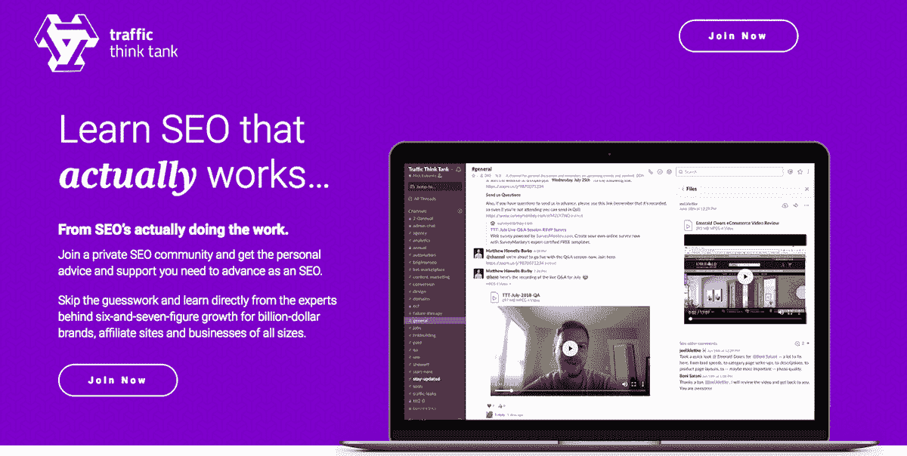
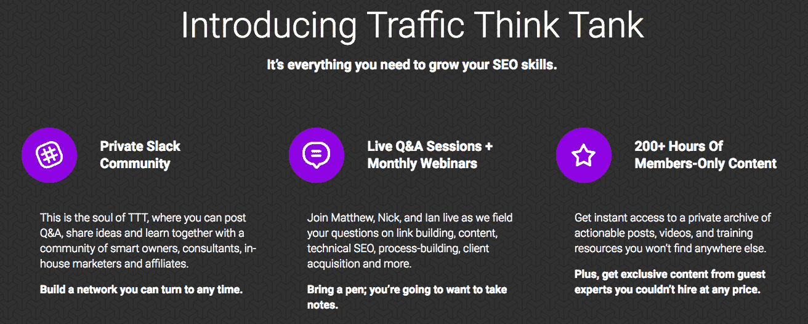
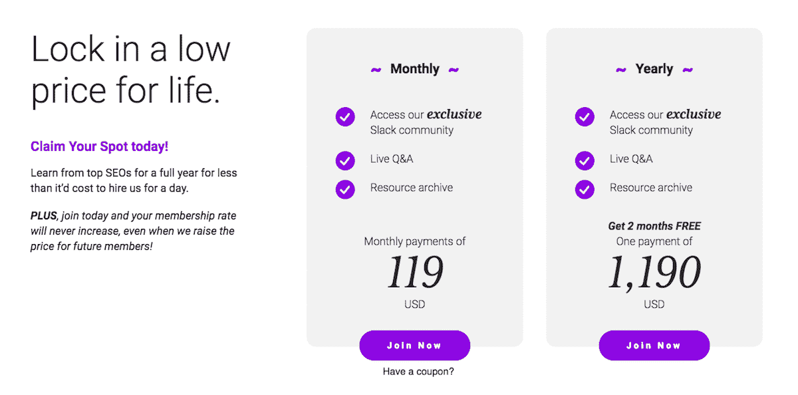

# 在十个月内将知识共享社区发展到六位数

> 原文：<https://www.indiehackers.com/interview/growing-a-knowledge-sharing-community-to-six-figures-in-ten-months-980ea57924>

## 你好！你的背景是什么，你在做什么？

我叫尼克·尤班克斯，是一名连续的数字企业家。我目前正在为一组新的公司工作，包括:

*   来自未来的数字代理公司
*   [NK Tech](http://nktech.ventures) :一家数字资产投资公司(这是一家拥有交通智库等的公司)
*   [semantic.io](https://semantic.io) :关键词智能工具

交通智库是一个私人 SEO 培训社区，在这里，营销界一些最好奇、最聪明的人聚集在一起，提高我们的技能。因为它的私密性和相对紧密性，在内部分享的帮助和信息水平是我在网上其他地方经历过的最好的。它也向任何想加入的人开放，我们有各种经验水平的人。

TTT 目前每月的经常性收入超过 31，000 美元，这个社区已经推出 10 个月了。

 

## 是什么激励你开始做交通智库？

我*过去常常*用电子邮件发送我的简讯列表，提供建议，询问问题和反馈，经常收到数百个回复，这些回复需要几周才能回复- **但我喜欢这样做**。我对自己说，如果我能够分享我的 SEO 活动和测试策略的更多细节，那就太好了，这样 1)它们将通过更容易消费/参考的媒体更容易访问，2)有一种获得补偿的方法，这样我就可以投入更多的时间。

TTT 的第一次尝试是把它提供给我的电子邮件列表，每月 500 美元，一年的承诺，所有内容都托管在一个私人脸书集团的 Kajabi 网站上。Kajabi 内部没有参与，两个平台之间失去了很多对话，更不用说 500 美元/月对很多人来说是一大笔钱。

所以经过一番搜索，我找到了一个平台，可以让你在 Slack 建立一个付费社区。我联系了我认识的两个最聪明、最有成就的 SEO([Hubspot 的收购主管 Matt Barby](https://www.matthewbarby.com/) 和[lending tree 的 SEO 主管 Ian Howells](http://ianhowells.me/) )，我们决定以 99 美元/月的价格建立一个私人 Slack 社区，在那里我们将分享*一切*是一项值得的努力。

我以前从未运营过一个付费社区，但比“付费简讯”更活跃、更吸引人的东西的诱惑力让它成为一个显而易见的正确选择，在“付费简讯”中，每个参与者之间可以进行真正的互动，而不仅仅是我和我的电子邮件收件人。

## 构建最初的产品需要什么？

说实话，不多。

第一个版本看起来很像现在，我们在 [LaunchPass](https://launchpass.com/) (当时称为 SlackPass)上使用了一个登陆页面，将它与 Slack 和 Stripe 集成在一起，并开始通过我们的电子邮件列表发送流量。

自那以后，它成熟了一点，但不是一吨。我们转向了我们的定制设计，并与 Slack 直接集成(仍然通过 [LaunchPass](https://launchpass.com/) 来处理 Slack 中的会员资料)，并在 WordPress 中建立了一些定制帖子类型，以使会员更容易访问[独家内容的完整档案](https://trafficthinktank.com/member-exclusive-content/)，并每周更新[最受欢迎的帖子](https://trafficthinktank.com/start)。

我们目前的计划包括在主网站中添加一个更强大的 LMS，以支持更结构化的培训“模块”,并构建我们自己的 Slackbot，以支持我们仍然手动进行的一系列用户入职和计费功能。

## 你们是如何吸引用户，壮大流量智库的？

我们最初的发布仅限于 100 名用户。我们不确定我们会遇到什么，也不知道这实际上会花费我们多少时间。仅仅通过给我们各自的名单发电子邮件和发几次推特，我们就在几天内售罄了。我们等了整整两个月，才再次向另外 100 名会员敞开大门，与此同时，我们把登陆页面翻到一个基于电子邮件的等候名单。

在我们下一次开业前，等候名单上的人增加到了 200 多人，我们又一次在几天内就卖完了接下来的 100 个名额，不过这次我想大概是六七天。

然后我们又关闭了两个月，并把新会员的价格提高到每月 119 美元。在这一点上，流失率仍然很高，因为我们还没有建立内容和线索目录，也没有足够的人来保持渠道的活跃。

可以说，这是第三次也是最后一次机会，让我们能够齐心协力。

 

自那以后，我们开始在脸书上测试付费广告，但没有取得多大成功，所以我们准备转向一种带有培育序列的形式活动，看看这是否会做得更好。我们还向一些精选会员推出了私人会员计划，但尚未产生任何显著效果。最后，我们将在 2019 年 1 月举办一场活动，我们希望为我们的会员创造一次真正特别的体验，并为那些可能对加入持观望态度的人带来大量口碑。

我们的头号增长渠道是会员们有机地谈论他们的经历。TTT 营销人员的水平和谈话的质量非常令人难以置信——它已经成为一个社区，我真的很自豪能成为其中的一员，不仅仅是因为我帮助创建了它。

## 你的商业模式是什么，你是如何增加收入的？

我们从一开始就开始收费，我们的第一批客户来自我们现有的观众。我们目前有大约 360 名成员，该项目每月收入超过 31，000 美元，并计划继续增长，直到我们的下一个主要成员里程碑，即 500 名成员。

现在 100%的收入来自会员订阅。如果我们开始提供个人内容供购买，这种情况可能会在未来发生变化，价格将远远高于会员费用，尽管你可以随时访问所有内容。

 

我们目前最关注的指标是用户流失。这是我们的北极星指标，让我们快速了解我们创造了多少价值，以及我们是否填补了市场的真正空白。现在客户流失率在 6%左右，我们希望能降到 4%以下。

## 你未来的目标是什么？

我们希望继续扩大会员数量，开发独家内容，为数字营销人员提供行业领先的培训和支持。

投资你的教育，永远不要认为你对一个对你或你的职业生涯很重要的话题“知道得足够多”。

TweetShare

虽然我们的大部分品牌和营销只关注 SEO，但我们有付费、转化、代理、工具、工作、域名等渠道。信息和访问远远超出了 SEO，我认为我们没有做更多来展示这一点，可能会给自己带来一点伤害。

即将发生的一件大事是，我们将在链接建设空间发布一个大品牌的独家内容。这位顾问已经同意让我们独家授权他的内容，所以它将只提供给 TTT 成员。这将是我们第一次测试这种功能，所以我们很期待看到它的进展。如果成功了，我们可以在未来扩大规模。

这并不是一个真正的障碍，但 Slack 的成本不是微不足道的，而且还有其他平台开始出现，它们在功能上极其相似，但在成本上明显更便宜。所以这可能是我们在未来某个时候要跨越的一座桥。

## 你面临的最大挑战和克服的障碍是什么？如果你必须重新开始，你会做什么不同的事？

因此，我们仍处于这一旅程的早期，但我们迄今为止所犯的错误几乎完全是关于用户登录和通信方面的疏忽。例如，在最初的几个月，我们没有向会员发送任何电子邮件来强调内容和即将举行的活动。

我们还购买了一批我们认为我们想要/需要的软件，但最终却没有增加我们认为会增加的价值。

## 对于刚刚起步的独立黑客，你有什么建议？

投资你的教育，永远不要认为你对一个对你或你的职业生涯很重要的话题“知道得足够多”。

立即开始，就像今天一样。规模有多小或者你做什么都不重要——采取行动开始实现你的想法。我最喜欢用来激励自己的一句名言是“昨天你说‘明天’。”

## 我们可以去哪里了解更多？

你可以在我们的网站[TrafficThinkTank.com](https://trafficthinktank.com)了解 TTT，我*总是*在 twitter [@nick_eubanks](https://twitter.com/nick_eubanks) 上回答关于 SEO 的问题或辩论

如果你有任何我没有回答的问题，请在下面给我留言，我会跟进的。

 

—[<picture id="ember8183107" class="user-avatar ember-view user-link__avatar"></picture>尼克·尤班克斯](/NickEubanks?id=BIRAaSxJ8ebpNExFeQhhGDUbbQh2)，交通智库创始人

## 想像流量智库一样自己创业？

你应该加入[独立黑客社区](/)！🤗

我们是几千名创始人，互相帮助建立有利可图的业务和副业。来分享你正在做的事情，并从你的同事那里获得反馈。

还没准备好开始使用你的产品吗？没问题。这个社区是一个认识人、学习和实践的好地方。随意[随便浏览](/)！

—[<picture id="ember8183112" class="user-avatar ember-view user-link__avatar"></picture>考特兰艾伦](/csallen?id=ibTLPyjwVebnZjMGKvz6ztarnuV2)，独立黑客创始人

46votes