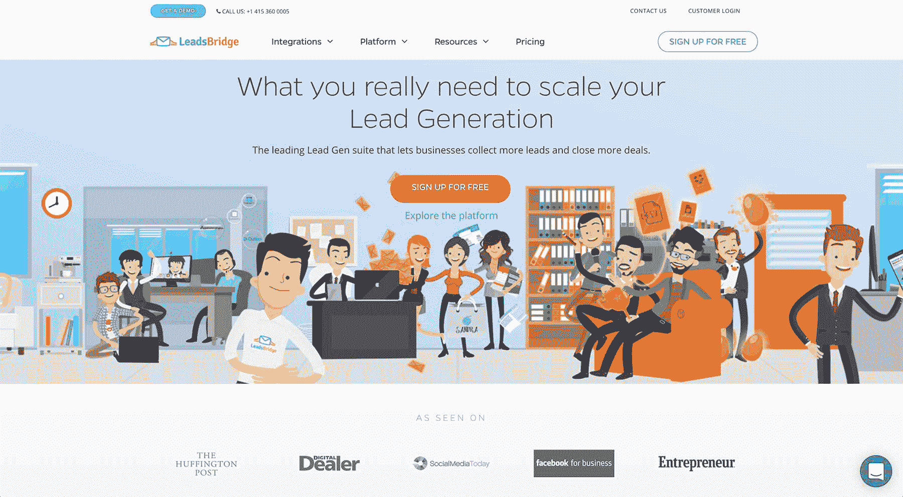
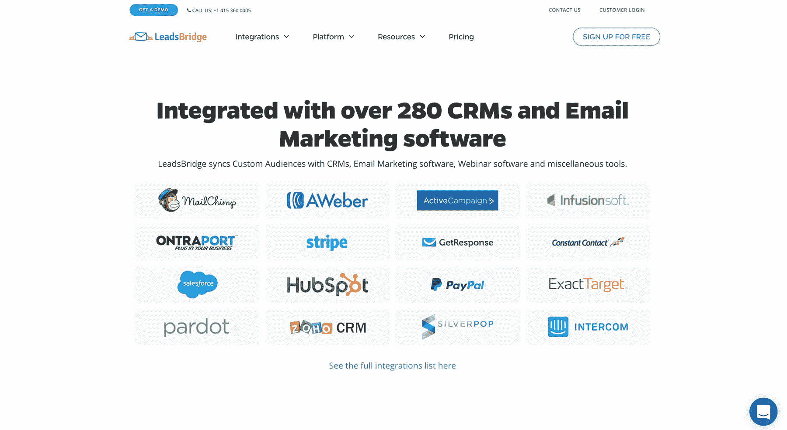
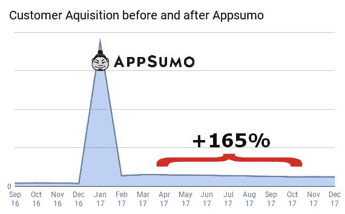

# 将销售线索挖掘应用的月收入提高到 15 万美元

> 原文：<https://www.indiehackers.com/interview/growing-a-lead-generation-app-to-150-000-in-monthly-revenue-c5dc25a357>

## 你好！你的背景是什么，你在做什么？

嗨！我叫斯特凡·德斯，很高兴和你们分享我的故事。

我很小的时候就开始做上门推销员，在那里我学到了一些销售的重要原则。后来，我对数字世界产生了兴趣，一有机会，我就成为了一名在线企业家，开始了几项数字业务，这给了我加深对这一现实的了解的机会(也让我能够谋生)。

在玩了多年各种形式的在线商业游戏后，我发现自己对 martech(营销技术)环境特别感兴趣，所以我开始了几个雏形的创业项目，其中 LeadsBridge 成为了迄今为止最大、最成功的项目。

[LeadsBridge](http://leadsbridge.io/2mWSfgr) 是一个一体化的销售线索挖掘平台，主要由小企业主和数字机构使用，以节省大量时间和精力来管理他们的销售线索挖掘和电子邮件营销策略。由于它建立的桥梁，它允许客户优化他们的营销渠道。

如今，LeadsBridge 的月收入约为 15 万美元。自 2015 年开始以来，我们经历了稳定的 52%季度收入增长率。

 

## 是什么促使你开始使用 LeadsBridge？

我一直在数字营销领域工作——这是我多年来的热情所在。

几年前, [LeadsBridge](http://leadsbridge.io/2mWSfgr) 的想法出现了，当时脸书 Lead Ads 向广告界预先宣布。那时，我已经在市场上呆了足够长的时间，知道用户将他们的线索同步到他们的 CRM 会有一个痛点，所以我看到了在这个问题出现之前解决它的机会。

提供一些能让人们的生活变得更容易的东西，这也是他们渴望的原因，这是成功的关键。

TweetShare

LeadsBridge 最初是另一个更大的项目的附带项目，该项目已经产生了每月 1 万美元的收入，但它很快成为我们感兴趣的主要焦点。因为我们从一开始就有吸引力，所以我们相应地不断投资。

关于经济形势，说实话，在领导布里奇之前，我挣的钱更多。但我在寻求改变。我的生活需要新的挑战，启动这个项目无疑为我提供了大量的挑战！

## 构建最初的产品需要什么？

实际上，我们在三个月中只在周六和周日致力于这个项目。在此期间，我们开发了一个非常基本的 MVP，并尽快投放市场。除了我们的时间和精力，我们只在广告上投资了几块钱，但这笔钱来自我们已经在运营的另一个项目，所以总体来说我们可以说我们的初始投资是 0 美元，我们从“第一天”就开始了[leads bridge](http://leadsbridge.io/2mWSfgr)([，我们现在仍然做](https://hackernoon.com/how-we-bootstrapped-our-startup-to-1m-in-12-months-and-you-can-too-dad55578062c))。

一开始，只有我和另一位创始人亚历克斯，但当我们发展壮大后，我们开始雇人。

 

## 你是如何吸引用户和发展 LeadsBridge 的？

我们的第一笔销售发生在我们的第一天，所以我们一开始就很顺利！然后，我们通过创造内容和使用脸书广告和谷歌广告词，像滚雪球一样吸引了更多的客户。

它奏效的原因很简单。即使我们的 MVP 真的很基础(当时它只提供了 7 个集成和很少的特性)，我们还是出现了，解决了一个真正的问题。这才是真正的不同之处。我并不是说，如果你不解决一个真正的问题，你就不能建立一个企业，但它可能需要更多的钱和更多的时间来让它工作。

提供一些能让人们的生活变得更轻松的东西，这也是他们为此渴望的，这是成功的关键。

## 你的商业模式是什么，你是如何增加收入的？

我们从一开始就只有一种商业模式:每月定期订阅我们的在线平台。我们一开始以每月 7 美元的价格提供 MVP，但是随着项目的发展，我们增加了提供给客户的价值，并相应地提高了价格。为了提出最佳方案，我们测试了 70 多种定价方案！我们很自豪地说，我们的客户一直认为我们的价格是“公平”的。

最初，我们非常关注的指标是每月经常性收入(MRR)和流失率。我们如此强调客户流失，是因为我们希望拥有极高的客户保持率。我们竭尽全力将客户从“免费”计划转变为“付费”计划。他们中的许多人是通过免费试用进入的，所以为了鼓励他们留下来，我们建立了一个真正脱颖而出的客户快乐团队。我们照顾我们的客户，帮助他们做他们要求的任何事情，在[几乎不收任何费用。这与保持他们对我们的忠诚有很大的不同。](https://medium.com/@leadsbridge/how-we-bootstrapped-our-startup-to-1m-in-12-months-and-you-can-too-dad55578062c)

我们获得的高保留率在两个非常重要的方面帮助了我们:首先，它为我们提供了每次收购的真实成本的可靠估计，其次，它使我们能够更准确地预测未来的客户收购增长。

尽管我们的业务稳步增长，但我们必须提到的是,[在 AppSumo](https://hackernoon.com/why-you-want-to-be-featured-on-appsumo-even-if-its-risky-f6b60c8c0ab1) 上推出我们的产品给了我们在扩大项目规模方面一个根本性的推动，使我们的客户获取率每月增加 165%以上。

 

## 你未来的目标是什么？

我们目前的目标是帮助公司在 2019 年第四季度收集 10 亿条线索。

我们还致力于在不久的将来为领先一代市场推出革命性的本土产品。它们现在正在申请专利，但即将被淘汰。我们坚信，在接下来的几年里，销售线索挖掘市场将会扩大规模，因此我们在这方面投入了大量资金。

我们不仅想参与这个市场，还想引领它前进。在这样做的时候，我们试图破解代码，将业务规模从七位数扩大到八位数。

## 你面临的最大挑战和克服的障碍是什么？

我知道这听起来可能有点自大，但老实说，我们在第一年主要关心的是找到一种方法，使我们的创业成为七位数的业务。

直到我们把它投放市场后，我们才意识到我们的资产对市场的价值。只有当数字证实了我们的业务，我们才开始投入越来越多的时间和金钱。

LeadsBridge 最初是另一个更大的项目的附属项目，该项目已经产生了每月 1 万美元的收入。

TweetShare

无论如何，我们当然面临许多挑战，其中最大的挑战之一是将一个兼职项目转变为一个超过 25 人的“公司”。在我作为营销人员的整个职业生涯中，我与许多人合作过，但在我参与的大多数项目中，我都是独自或与几个伙伴合作。

不仅建立和管理这样一个大型团队非常困难，而且通过远程应用程序(Slack)来完成这项工作也是一个额外的挑战。

也就是说，通过分享我们的企业文化和价值观，我们[成功吸引了许多有才华的人](https://medium.com/@leadsbridge/how-we-built-a-25-talents-team-in-8-months-with-almost-no-money-d8732465a41f)与我们一起工作，在保持灵活性的同时每天都在壮大。拥有一个拥有更多资源的结构化组织有助于我们更好地为客户服务，并继续减少客户流失。

## 如果你必须重新开始，你会做什么不同的事？

如果我不得不重新开始，我会带着更多的信心和决心开始，我的想法正在解决一个人们愿意为之付费的重要问题。

虽然我会确保先解决利基市场的问题，但我会努力更加关注向更大市场扩张的计划。这将有助于防止我们在一个过于狭窄而无法扩大规模的市场中运营，也将保护我们不会被我们运营的某个平台关闭。

## 有没有发现什么特别有帮助或者有优势的？

我会推荐大家读读 Eric Ries 的《精益创业》，非常实用，很有启发性。我建议的另一件事是采用与企业完全相反的方法——敏捷。这是绝对关键的。

例如，几个月前，我们必须做出一个重要的管理决策，这将对我们的工作环境产生重大影响。我们分析了大约 40 天的数据和指标，然后我和我的联合创始人打电话讨论了这个问题。两个小时后，改变已经实现。

这种快速决策通常对大企业来说是不可能的，我怎么强调它的重要性都不为过。时间是关键，缺乏响应真的会危及整个项目，尤其是对于初创公司。

对于大企业来说，快速决策通常是不可能的，我怎么强调这一点都不为过。

TweetShare

## 我们可以去哪里了解更多？

要了解更多关于我们所做的事情，请查看我们的网站或 T2 的博客。

我们也有一个 [Twitter](https://twitter.com/LeadsBridge) 账户，一个 [Medium](https://medium.com/@leadsbridge) 上的个人资料和一个 [YouTube](https://www.youtube.com/channel/UCml6sDXzUSHTJarxe327J3g) 频道。

对于独立黑客的读者们，我提出以下建议:

告诉我你现在最大的痛点，我会给你最好的直截了当和残酷的建议。我会告诉你你想听的，而不是你想听的。

我喜欢帮助其他创业公司，我会超级高兴地根据我的真实经历给出建议，无论是击掌还是踢屁股！干杯！

——[<picture id="ember5337044" class="user-avatar ember-view user-link__avatar"></picture>铅桥](/leadsbridge?id=xgeKSVtwFcP3I1011UjHaoe8Hoi2)

## 想像 LeadsBridge 一样建立自己的事业？

你应该加入[独立黑客社区](/)！🤗

我们是几千名创始人，互相帮助建立有利可图的业务和副业。来分享你正在做的事情，并从你的同事那里获得反馈。

还没准备好开始使用你的产品吗？没问题。这个社区是一个认识人、学习和实践的好地方。随意[随便浏览](/)！

——[<picture id="ember5337049" class="user-avatar ember-view user-link__avatar"></picture>考特兰艾伦](/csallen?id=ibTLPyjwVebnZjMGKvz6ztarnuV2)，独立黑客创始人