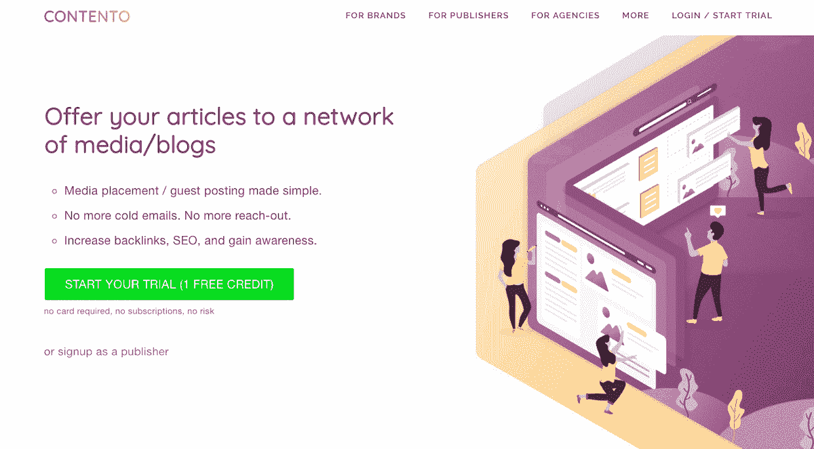
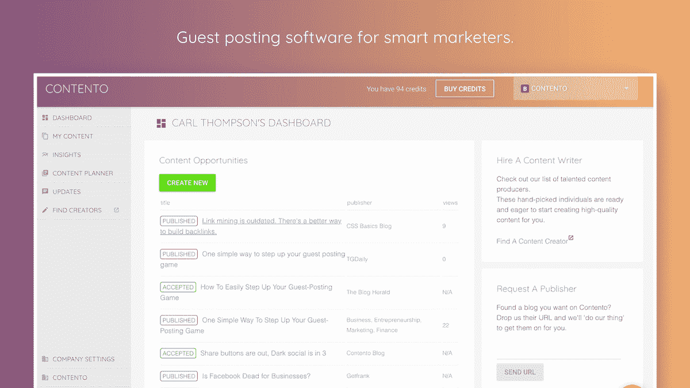
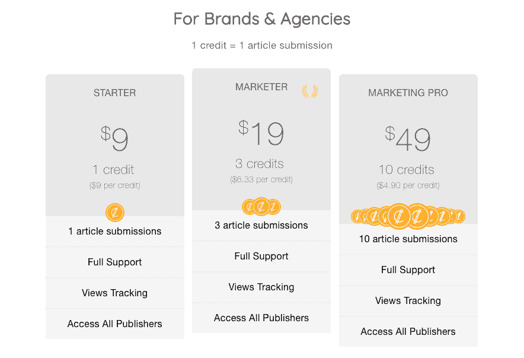

# 在业内人士的帮助下为营销人员开发产品

> 原文：<https://www.indiehackers.com/interview/growing-a-product-for-marketers-with-the-help-of-an-industry-insider-553bbab325>

## 你好！你的背景是什么，你在做什么？

嗨，我叫[尼尔森·肖](https://nelsonshaw.com)。我是一名程序员和企业家。我最初在大学学习计算机科学和数学，然后在批发金融领域工作了三年。从那以后，我花了四年时间，经历了多个创业公司、项目和自由职业，有过几次成功，也有过几次失败。

我的联合创始人[卡尔·汤普森](https://www.linkedin.com/in/carlthompson1/)和我建立了 [Contento](https://contento.marketing) ，一个面向营销人员的客座博文平台。

自从数字营销出现以来，卡尔一直是一名数字营销人员。他在 17 岁时从高中辍学，成为一名数字营销人员，然后继续创建了几家公司，包括 TradeGecko 和后来的数字营销机构。Carl 是一个内容传播者，他对把好内容送到好人手里感到沮丧，这就是 Contento 诞生的原因。

 

## 是什么促使你开始使用 Contento？

在新加坡完成 TradeGecko 的工作并搬回新西兰后，Carl 创办了数字营销机构 Momentum Marketing。在那里，他经历了试图通过出版商分发内容的困难。通过成熟的媒体/博客分享内容对品牌认知和链接建设很有价值，但必须与出版商建立关系是一个缓慢而痛苦的过程。

客座博文和媒体投放是集客营销的关键组成部分。然而，外联过程总是极其繁琐。我们认为一定有更好的方法。

Contento 仍处于早期阶段，但 Carl 认为这个概念是可行的，在一些初步的客户开发之后，我被哄进了这个团队。在与各种品牌、代理商和出版商进行了三个月的会谈后，我们发现了一些现在塑造 Contento 的关键发现。

我们发现出版商正努力在网上赚钱。横幅广告收入现在处于历史最低点，大约为每千次展示 4 美元。这是几年前的十分之一。

另一个有趣的发现是，出版商不想要新闻稿——它们已经过时，大多数几乎立刻就被扔进垃圾箱。除非你是现有的付费客户，否则你的新闻稿不会被看第二眼。公关人员似乎仍然无法理解这个新的现实。

免费安置的日子结束了。市场上的鱼和一瓶桃红葡萄酒再也买不到保险了。我们相信我们现在处于一个 SEO 和 PR 正在努力融合的时代:PR 机构不理解反向链接的价值，SEO 机构不想和媒体打交道。

## 构建最初的产品需要什么？

在一月下旬，我们已经收集了足够的反馈和数据来开始最初的设计。我们绘制了整个来宾发布流程的用户旅程。很明显，我们可以通过一些巧妙的设计来简化整个过程。

Carl 有将近 18 年的网页设计经验，他开始在 Adobe XD 中模拟最初的设计。材料用户界面是我们的用户界面基础，我们开发了自己独特的定制。使用从 XD 导出的点击设计，我们能够通过客户开发阶段建立的一些联系进行一些基本的用户测试。

当涉及到构建产品的时候，我知道把东西快速送到用户手中是很重要的。因此我选择 ReactJS 和 Firebase 作为堆栈。我已经构建了相当多的 React 应用程序，所以我相信这可以很快构建。我也用过 Firebase，知道用它开发会很快。

在过去，我使用过 Firebase RealtimeDB，所以我想我会在 Contento 中再次使用它。我没有意识到的是，实现安全规则和业务逻辑会很快变得一团糟。Contento 没有复杂的安全需求，但是像处理团队成员权限和谁可以查看/编辑内容这样简单的事情实现起来有点困难。

在我开始的时候，Firebase 实际上已经发布了一个名为 Firestore 的新数据库。它类似于 RealtimeDB，只是更加结构化，并且内置了更强大的安全性和权限设置。我最初决定不使用它，坚持我所知道的，但在我们推出该产品几个月后，我意识到使用 Firestore 将使我们所有的安全规则和数据库结构更加简单。然后我又花了两个星期的时间把我们从 RealtimeDB 转移到 Firestore。

免费安置的日子结束了。

TweetShare

Contento 的第一版是按月订阅的。我们有一些不错的用法。我说的好，是指每周有几篇文章，包括一篇 1200 美元的文章。但我们很快意识到，并非所有品牌都会定期发布客座博文，经过一番讨论后，我们决定转向现收现付的信用体系。

通过这种方式，每个新客户在注册时仍然可以获得一次免费试用(一次免费积分),如果他们有良好的体验并想做更多，他们可以这样做。这降低了准入门槛，我们几乎立刻就看到注册人数的增加。

如果一家企业希望每月只使用我们一次，他们可以这样做，而不会觉得他们在为一项他们并不使用的服务付费。我们相信剩余的积分可以激励我们使用它们，而且无论如何，我们可以从我们的出版费用中赚更多的钱。

 

## 你是如何吸引用户和发展内容的？

最初，它来自我们自己的网络。Carl 在新西兰的媒体行业有一个庞大的网络，所以我们利用这个网络让我们的第一批出版商签约，以及试用品牌和代理机构使用它。在过去的几个月里，我们尝试了四种主要策略。

**付费流量**

一开始，我们使用付费网络，如脸书、Instagram、LinkedIn 和通过 AdRoll 的横幅广告。我们发现付费频道在赢得早期客户方面效果不错。对我们来说，LinkedIn 的投资回报率最差。事实上，我们就是做不到。我们可以在脸书和 Instagram 上获得大约 15-17 美元的转化率，但这对我们来说还是太贵了。

我们还使用 AdRoll 进行重定目标。我们开展了两项活动:一组是针对品牌的横幅广告，另一组是针对出版商的。这很好，但随着时间的推移，随着观众数量的增加和质量的下降，投资回报率下降了。这里可能需要一个更有针对性的方法。

我们发现 reddit 的付费广告最成功。当直接向 r/seo 等相关子领域营销时，销售会更容易，因为人们已经更熟悉痛点，并能看到我们产品的价值。根据我们的目标国家，reddit 的转换率可能在 3-10 美元之间。

**SEO/内容驱动**

创造优质内容来促进和增加有机流量对我们来说是一个关键举措。我们使用自己的产品在博客上发表文章。

这对我们的搜索引擎优化和我们的域名权限增长非常快。我们已经看到有机流量有了可观的增长——平均每月增长 40%——但在我们的细分市场中仍未达到顶峰。我们显然在这方面有更多的工作要做，并打算把它作为我们的主要优先事项。

| 月 | 会议 |
| --- | --- |
| 2018 年 7 月 | 213 |
| 2018 年 8 月 | 567 |
| 18 年 9 月 | 927 |
| 18 年 10 月 | 1323 |

**邮件外联**

我们有一个双边市场，但事实上，顶级出版商获得了大部分文章提交。我们发现，这意味着我们可以专注于通过 2:1 的方式向每个出版商的品牌/代理进行宣传。

我们使用 HubSpot 进行实际的电子邮件排序，因为它可以很好地跟踪我们需要的所有电子邮件指标和客户生命周期。

在发布者方面，互联网上有许多博客帖子，包含接受客座博文的博客/发布者站点的列表。我已经编写了脚本和工具来收集信息，使用 Hunter 等工具收集电子邮件地址，并将其纳入我们的外联漏斗。

我们为品牌做类似的事情。事实上，我们已经开发了一些秘密的酱料来自动寻找数字营销代理。我们收集电子邮件，并在 HubSpot 中进行排序。

没有适当的客户开发，你就完了。

TweetShare

当我们第一次开始这样做时，我们遇到了一些阻力，特别是来自开发人员的阻力。事实证明，很多开发人员讨厌任何看起来像自动消息的东西。我们通过确保不针对任何“技术”类型来解决这个问题。通过只针对代理机构，我们围绕 Carl 以前经营代理机构的工作以及在发布客座博文上浪费了多少时间来创建电子邮件。

这有助于让我们变得更有亲和力，而且我们非常确定这有助于提高回复率，回复率约为 12%。

**论坛发帖**

我们在九月下旬进行了一次产品搜索活动，最终获得了 500 张赞成票。这导致了不到 100 个直接来自产品搜索的注册，还不包括直接收到的额外注册。

我们也花时间回答 Quora 上的问题，并尝试过付费写答案。在为答案付费时，每个答案的成本最终在 10 美元左右(我们花了 120 美元，收购了 12 个品牌)。Quora 对于曝光率来说很棒，但是我们发现通过它获得的品牌质量没有我们有针对性的推广或 reddit 广告高。从那以后，我们不再关注它，除了在休息时间或者当我们需要从正常工作中休息一下的时候自己写答案。

## 你的商业模式是什么，你是如何增加收入的？

我们的第一个假设是，这将是一个经典的 SaaS 模型。我们从每月订阅开始，但很快意识到用户行为适合于现收现付模式。虽然我们希望鼓励重复使用我们的客座博文产品，但有些客户就是不愿意按月订阅。在改为基于信用的支付系统后，我们看到重复使用的增加，否则他们会在免费试用后停止使用。

我们通过两种方式赚钱:我们从出版费用中获取利润，同时在文章提交时收取一个积分。注册时你可以获得一个免费积分，然后是购买更多的分层模式。信用系统也作为一个质量检查，以淘汰低质量的链接收获机构。

| 月 | 收入 |
| --- | --- |
| 2018 年 8 月 | 530 |
| 18 年 9 月 | 932 |
| 18 年 10 月 | 730 |

我们使用 Stripe 进行支付，使用 Paypal 进行支付。我们最终可能会把所有东西都转移到 Stripe，但目前使用 Paypal 支付是最简单的系统。

 

## 你未来的目标是什么？

我认为 5 万美元的月总收入是一个里程碑，在这个时候，我们会考虑进行大量投资，将这个平台提升到一个新的水平。下一个层次目前看起来是概念和想法的混合体。整合、附加产品、全方位服务解决方案以及可能的媒体收购都是我们更大的“待测试”计划的一部分。

## 你面临的最大挑战和克服的障碍是什么？如果你必须重新开始，你会做什么不同的事？

我们最大的问题是每月缺少文章。近 60%的品牌表示希望每周至少客串一次，但实际一个月甚至一次的品牌客串次数远少于此。

所以，意图是存在的。现在，我们必须帮助和鼓励我们的客户定期创建内容。我们正在尝试许多不同的方法来解决这个问题。

我们推出了一项名为 Contento Plus 的全方位服务计划。通过这项服务，我们将品牌与文案匹配，并与他们合作，每月开发四篇文章，每月收取固定费用。用户也可以选择接收鼓励邮件，我们会定期发送提示、技巧和灵感，帮助他们保持专注和动力。

另一个问题是提高签约品牌的质量，降低收购成本。我们目前的重点是建立更多的内容和改善我们的搜索引擎优化。现在的挑战是在我们还在创业、还没有给自己发工资的时候为这项工作提供资金，这意味着我们还需要兼职做合同工作。

从积极的方面来看，我们的有机注册仍然足以继续工作，同时我们还可以在产品中插入更多的漏洞。

## 有没有发现什么特别有帮助或者有优势的？

对我来说，这是关于建立一个不断学习的习惯，无论是从播客，博客帖子，还是经常与朋友聊天，了解他们的业务并分享建议。我也更加努力保持平衡的生活方式，更加聪明地工作，而不是更加努力。

我最近读到，表现的最佳预测因素之一是你的情绪状态。快乐和放松不仅意味着你更加享受生活，还意味着你会在工作中表现得更好。随着新西兰夏天的临近，我希望把我的日子分成几段，尽可能多地骑山地车出去！

对 Carl 来说，有一些资源帮助他克服了过去 12 个月中出现的一些问题。他一直是一个“唯唯诺诺”的人，一个完全讨人喜欢的人，在 Contento 之前，他有大约 11 个不同的项目在进行中。在他为期三天的休假期间，他发现了格雷格·麦克欧文的《本质主义:对更少的自律追求》，这本书教授如何说不，以及按照目标排列活动优先级的重要性。对卡尔来说，这是一个“啊哈”的时刻，并帮助他确定了优先事项。

我们都意识到要保持身体和精神上的平衡健康生活。我们每天练习各种正念技巧和锻炼。

## 对于刚刚起步的独立黑客，你有什么建议？

我们都已经“创业”多年了，都是通过加速器、孵化器、创业研讨会和社区活动作为参与者、演讲者和导师。有一样东西是创业成败的关键因素:客户发现。

许多创始人非常害怕被拒绝，以至于无法正确完成客户开发阶段。没有完全了解你的市场，随后又没有数据和洞察力来支持你的假设，这注定会失败。我们一遍又一遍地看到它。

没有这个关键的基础，一切都将失去它的标记。品牌、营销、产品设计——你所做的一切都基于你对目标受众的内在理解。没有适当的客户开发，你就完了。

 

## 我们可以去哪里了解更多？

更多信息请访问我们的网站， [Contento](https://contento.marketing) 。提及你从独立黑客那里听说过我们，我们会给你几个免费积分！

——[<picture id="ember5236242" class="user-avatar ember-view user-link__avatar"></picture>尼尔森·肖](/nznelson?id=JMl1l1WLiTgTgW8GwrGK379GBwU2)，Contento 的创始人

## 想像 Contento 一样建立自己的事业？

你应该加入[独立黑客社区](/)！🤗

我们是几千名创始人，互相帮助建立有利可图的业务和副业。来分享你正在做的事情，并从你的同事那里获得反馈。

还没准备好开始使用你的产品吗？没问题。这个社区是一个认识人、学习和实践的好地方。随意[随便浏览](/)！

——[<picture id="ember5236247" class="user-avatar ember-view user-link__avatar"></picture>考特兰艾伦](/csallen?id=ibTLPyjwVebnZjMGKvz6ztarnuV2)，独立黑客创始人

22votes