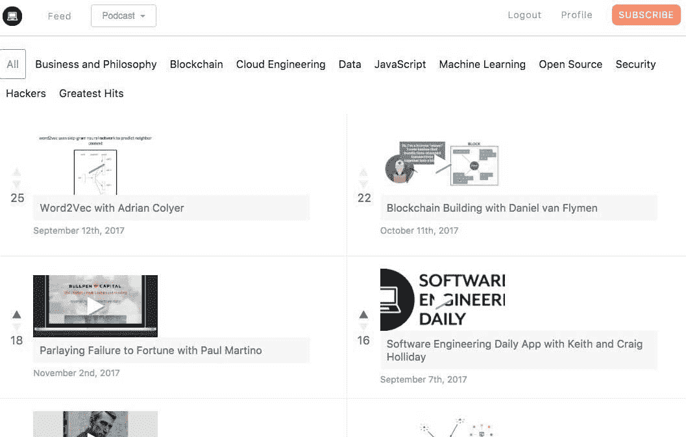
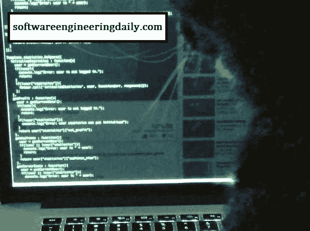
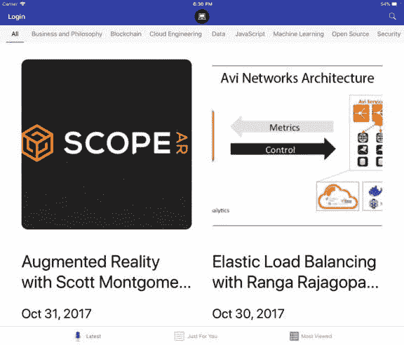
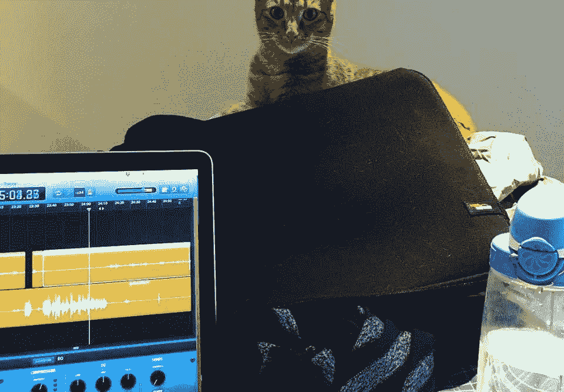

# 开发一个关于软件工程的盈利播客

> 原文：<https://www.indiehackers.com/interview/growing-a-profitable-podcast-on-software-engineering-0fa342480f>

## 你好！你的背景是什么，你在做什么？

我是 Jeff Meyerson，[软件工程日报](https://www.softwaredaily.com/)的主持人。从小玩扑克竞技，大学学计算机。我喜欢[写音乐](https://open.spotify.com/artist/7ypFFBJINZtKfxN7ez5ZVF)。

软件工程日报是一个关于软件主题的每日播客。每集大约 60 分钟，关注一个特定的技术、公司或想法。我们的目标是为听众提供教育和娱乐。

SE Daily 每周有大约 140，000 次下载，在一个好的月份里，我们的广告销售额为 60，000 美元。

 

## 是什么促使你开始每天使用软件工程？

我师从罗伯特·布鲁门，他是[软件工程电台](http://www.se-radio.net/)的编辑。SE Radio 是播放时间最长的关于软件工程的播客。在我为 SE 电台做志愿者的时候，我看到了听众是多么的热情。SE Radio 平均每集有 50，000 次下载。

2015 年，我频繁用完工程播客来听。没有足够的软件工程播客内容。

## 构建最初的产品需要什么？

SE Daily 的制作成本很低。我用了一个便宜的 WordPress 主机，一个便宜的麦克风，和免费的音频编辑软件。

在我离开亚马逊之前，我安排了前 15 次面试。采访主题包括 ReactJS、比特币和 Apache Spark——我对这些技术都没有任何经验。

但是没关系——作为一名播客，你不需要知道正确的答案。你只需要有好的问题。我每天都在研究不熟悉的话题。

 

我花了很长时间慢跑，听《本周创业》和詹姆斯·阿尔图彻。我每餐都吃烤鸡、西兰花和红薯。我爱上了好战的套路。

早期的感觉真好。我有 60%的信心，这个播客可以变成一门生意。下行风险极小。最坏的情况下，我会学到很多东西。我当时处于“心流状态”。

我花了很长时间慢跑，听《本周创业》和詹姆斯·阿尔图彻。我每餐都吃烤鸡、西兰花和红薯。我爱上了好战的套路。

TweetShare

我很感激一些大人物愿意在我的播客早期出现:史蒂夫·沃尔夫勒姆，塞思·戈丁，马泰·扎哈里亚，安德里亚斯·安东诺普洛斯。这些采访提高了我们的知名度。

在我们验证了收入模型后，Pranay Mohan 全职加入了我的团队。Pranay 帮助 SE Daily 建立了长期愿景——我们超越播客的路线图。在他帮助我们的飞轮转动后，他离开去 Snap 公司做工程师。

## 你是如何吸引用户并使软件工程每天成长的？

2015 年 7 月，我发布了 SE Daily 的第一集。自发布以来，我们在大多数工作日都会发布一集。口碑一直是我们主要的增长来源。

| 月 | 听众 |
| --- | --- |
| 2015 年 9 月 1 日 | 1060 |
| 16 年 1 月 1 日 | 2580 |
| 16 年 5 月 1 日 | 4416 |
| 2016 年 9 月 1 日 | 17675 |
| 17 年 1 月 1 日 | 22546 |

SE Daily 是一个双边市场。市场的一边是广告商，另一边是我们的社区。我们试图将这两方面和谐地融合在一起。

Erika Hokanson 于 2016 年加入，并在各个方面拓展了我们的业务。Erika 在 SE Daily 上看到了我视而不见的弱点和机会。

我们喜欢从听众那里得到反馈和批评。我们与广告商密切合作，以确保我们满足他们的需求。

我们从高质量、耐用的媒体公司获取灵感。我们不介意慢慢成长。有人找到我们的时间越长，当他们找到我们时，我们就有越多的内容。

一个显著的扩展是我们的开源项目。它是由 Keith 和 Craig Holliday 创办的，他们是多产的开源开发者。它像滚雪球一样变成了一个贡献者社区。

## 你的商业模式是什么，你是如何增加收入的？

SE Daily 大部分是广告支持的。我们的 iOS、Android 和 web 应用程序允许听众通过每月支付 10 美元或每年支付 100 美元来选择退出广告。我们使用[条](https://stripe.com/)进行订阅支付。

一开始，Hired 和 Digital Ocean 都和 SE Daily 一起冒险。当我给他们发邮件时，我们的听众还不到 2000 人。他们测试了小规模的活动(每项约 2500 美元)，并看到了积极的结果。其他直接回应品牌如 Wealthfront 紧随其后。

我们不介意慢慢成长。有人找到我们的时间越长，当他们找到我们时，我们就有越多的内容。

TweetShare

随着时间的推移，我们发展了对外销售和对内销售。我们的广告客户有很多花钱的选择——我们需要确保他们每天都有良好的体验和投资回报。

我们每月的广告销售额有差异，通常在 3-6 万美元之间。我们专注于向科技公司销售。

播客广告是一个不常见的广告单元，所以我们需要解释它是如何工作的，为什么它是强大的。

当我们无法向广告客户传递价值时，我们的月广告销售额就会下降。或者当我们失去焦点，或者变得过于自信。

| 月 | 收入 |
| --- | --- |
| 2016 年 6 月 | 18000 |
| 2016 年 9 月 | 31100 |
| 2017 年 1 月 | 36000 |
| 2017 年 4 月 | 44100 |
| 2017 年 6 月 | 52500 |
| 17 年 9 月 | 35100 |
| 2018 年 1 月 | 64000

 |

## 你未来的目标是什么？

生产高质量的内容仍然是 SE Daily 的重点。从核心竞争力出发，我们修补邻近的业务。

Jason Bautista 作为软件工程师和设计师全职加入我们。他是创造性扩张的发动机——阿达·芬奇式的人，有着源源不断的想法，但也有着实现独特特征的纪律。

[软件每日开源项目](http://softwareengineeringdaily.github.io)是一个人们社交和软件协作的地方。我们欢迎任何想开发软件的人——不管是不是工程师。专家还是新手。

 

我个人还有另外两个项目:Adforprize 和我的音乐。Adforprize 是一个创意视频市场。在音乐方面，我正在制作我的第六张专辑。

## 你面临的最大挑战和克服的障碍是什么？如果你必须重新开始，你会做什么不同的事？

我在高中和大学玩扑克的那几年形成了我的性格。扑克是了解我自己的好方法——探索风险、心理学和数学。扑克让我接触到宇宙的变化，让我体验到它可能带来的痛苦。

我 19 岁的时候，有一个月我玩得很差，输了大约$25 万。这是我用 100 美元积累起来的钱。之后不久我就辞职了。我花了一段时间来恢复我的心理状态。

我退出扑克后，在接下来的两年里，我感到很失落。幸运的是，我在大学，这是一个迷失的好地方。我试了几个专业。发现计算机科学给了我新的兴奋。

如果我必须重新开始，我会优先考虑健康——锻炼、饮食、睡眠、社交、出去呼吸新鲜空气。我会对爱我的人更好，试着选择善良而不是聪明。

## 有没有发现什么特别有帮助或者有优势的？

我有一个试图理解的人的心理图书馆。我喜欢想象他们眼中的世界。

许多像我一样的学习者正在从研究书本转向研究人。

书籍提供了一个浓缩的宣言。通过推特、播客和 YouTube，你可以看到一个人所有想法的万花筒。

通过关注人们，你会接触到他们的信仰、习惯、饮食、日常锻炼和谈话策略。

许多像我一样的学习者正在从研究书本转向研究人。

TweetShare

探索“智力黑暗网”是有益的:山姆·哈里斯、乔·罗根、乔科·威灵克、蒂姆·费里斯。商业上的对等人物是像彼得·泰尔、杰森·卡拉卡尼斯、维塔利克·布特林、奥伦·霍夫曼这样的人。

我公寓周围的海报上有长期思考的格言:“慢慢变富”，“如果你不知道你想要什么，你就不太可能得到它”，“以结果为出发点。”

 

我喜欢健康的思维拓展活动:烹饪不直观的食物，尝试流行的锻炼方式，鼓励禁忌的对话。

我和我的父母非常幸运。我妈妈是一名企业家。我爸爸成为了一名医生，因为他喜欢与人交谈——他教我问问题。他们给了我成功所需的所有工具。

最后，我的朋友 Edaena Salinas 从大学开始就鼓励我的创造力。有一个会认真对待你并相信你的艺术/创业想法的朋友真的很有帮助。她现在经营着科技展中的女性，激励着更多的人。

## 对于刚刚起步的独立黑客，你有什么建议？

你很特别。我们需要你。你身上有别人无法创造的独特之处。

更努力地鞭策自己。多运动。获取更多信息。多做些实验。对你坚信的事情建立信念。接受中国科技工作者“9-9-6”的心态。(从早上 9 点到晚上 9 点工作，一周六天。)

要有长远眼光。确定 10 年后你想达到的目标，从这个目标开始往回努力，直到你到达现在。

罗伯特·格林和塞思·戈丁是我挑选的作家。听一些播客/YouTube 对他们的采访。如果你喜欢这种材料，请选择精通或伊卡洛斯欺骗。

## 我们可以去哪里了解更多？

*   [推特上的 _ 朊病毒](https://twitter.com/the_prion)和[软件 _ 每日](https://twitter.com/software_daily)
*   [软件工程日报](http://www.softwaredaily.com)
*   Spotify 上的朊病毒和 SoundCloud 上的
*   Adforprize 是一个创意视频广告平台

我喜欢和新认识的人交流。如果出现以下情况，请联系我们:

*   您可以每天在 SE 上获得反馈(或者如果您想与我们一起做广告)
*   你想在音乐上合作
*   你有网络广告的经验

请在下面的评论中提问或提供反馈。

——[<picture id="ember5332142" class="user-avatar ember-view user-link__avatar"></picture>杰夫·梅尔森](/JeffMeyerson?id=KdNm4VOg4FVCvIGFMFD5W5DFcco2)《软件工程日报》创始人

## 想像《软件工程日报》一样自己创业？

你应该加入[独立黑客社区](/)！🤗

我们是几千名创始人，互相帮助建立有利可图的业务和副业。来分享你正在做的事情，并从你的同事那里获得反馈。

还没准备好开始使用你的产品吗？没问题。这个社区是一个认识人、学习和实践的好地方。随意[随便浏览](/)！

—[<picture id="ember5332147" class="user-avatar ember-view user-link__avatar"></picture>考特兰艾伦](/csallen?id=ibTLPyjwVebnZjMGKvz6ztarnuV2)，独立黑客创始人

88votes