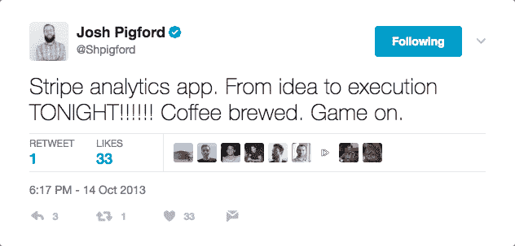
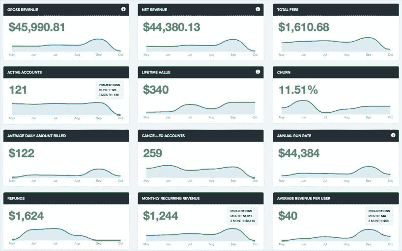
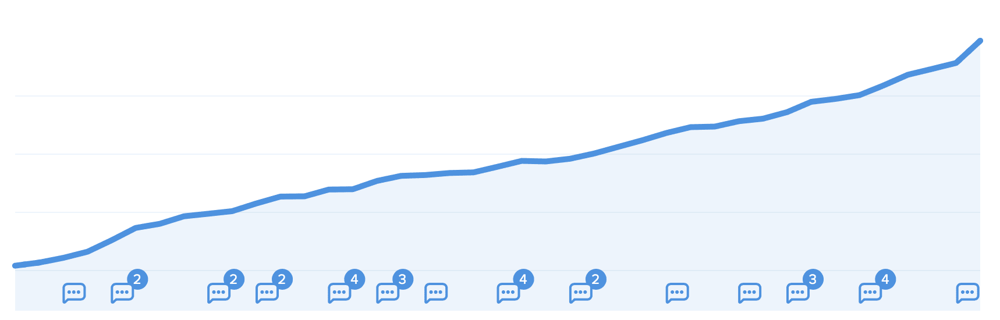

# 将收入分析平台增长到每月 83，000 美元

> 原文：<https://www.indiehackers.com/interview/growing-a-revenue-analytics-platform-to-83-000-mo-6647b9f67d>

## 你好！你的背景是什么，你在做什么？

你好。我是 Josh Pigford，Baremetrics 的创始人。我本质上是一个创造者，从 90 年代就开始为网络做东西。

Baremetrics 是一家商业分析和洞察公司。目前，我们主要致力于为订阅公司提供发展业务的工具。

我成年后基本上一直是个体经营(除了大学毕业后 7 周的判断失误)。在我职业生涯的早期，我为 Adobe、AOL、戴尔、Groupon、华纳兄弟等公司做设计和开发咨询，甚至在 2008 年的选举中为一个总统候选人的网站做过设计(只能说“蓝色还不够总统”这句话被无偿使用)。

在进入 Baremetrics 之前的几年里，我一直在创建小企业和小产品，并取得了一些小的成功和收购。

目前，Baremetrics 每月的收入超过 80，000 美元。我们从 2014 年开始公开我们的指标，你可以在这里看到:【demo.baremetrics.com。

## 是什么促使你开始使用 Baremetrics？

回到 2013 年，我在调查领域经营一家 SaaS 公司。我们有两个独立的产品，对于这两个产品，我很难将一些非常基本的指标整合在一起。比如每月经常性收入()、客户的终身价值(LTV)和流失率。

在那种情况下，你唯一真正的选择是在电子表格中手工计算，或者在后端拼凑一些东西。手动计算是一件苦差事，会被一次又一次地推迟(很像簿记)，而且由于是手动输入，你搞砸它的时机已经成熟。将它们拼凑在一起可以提供一些高层次的见解，但实际上对你的业务运营并没有多大用处。

所以，我决定建造一些东西。最初，它只是我的内部工具，但我很快意识到许多其他创始人也需要它。

你运送东西的速度越快，你就能越早停止假设。

TweetShare

一般来说，我非常反对构建内部工具，但是没有任何东西可以做到这一点。

如果我完全诚实，我建立的 SaaS 公司的增长已经停滞，在某种程度上，我想我有点拖延。或者也许我只是在心理上试探一下，看看有没有其他更好的方法？草总是更绿的，对吗？

在这种情况下，草变得更绿了。

## 构建最初的产品需要什么？

2013 年 10 月的一个晚上，我四处闲逛，拼命想找到一些东西让所有这些 SaaS 指标变得更容易，但我就是找不到。所以，我当时就决定自己来做。

我很快在推特上发布了这条消息:

 

然后我下楼，用我最粗鄙的长胡子男人的声音对我妻子说，“亲爱的，今晚我要建立一个企业。”

那天晚上我并没有真正启动它。(惊喜！这比我想象的要复杂得多！)然而，我确实在一个月后发布了它。

我正在启动一切，同时做咨询工作。因此，在这个月，我正在建立 [Baremetrics](https://baremetrics.com) ，在调查领域运行两个产品，*和*与两个不同的咨询客户合作。我…很忙。

实际上，我总共花了大约 7-8 个工作日来完成 Baremetrics 的第一个版本。第一个版本明确体现了 Baremetrics 中的“裸”:

它本质上是一个静态的仪表板，只显示当天的相关数字，然后是一个只追溯到六个月前的线形图。好奇你上个月的 MRR 是什么吗？太糟糕了！想知道在过去的一年里你减少了多少客户流失？不好意思！最重要的是，数据每天只更新一次…如果星星排列正确的话。是詹基。

我为自己制作了第一个版本。我做的基本上是零客户调查。我不是在追逐一个特定的市场。我在搔自己的痒处。这个版本解决了我的问题，考虑到我正在处理这么多其他事情，花大量时间研究这个似乎是不明智的。

我只需要把它运出去，看看会发生什么。

## 从那以后，Baremetrics 显然已经成长了一吨。怎么会这样？

典型的智慧告诉你，你需要建立炒作和产生嗡嗡声。开个博客！收集电子邮件地址！建立一个登陆页面，人们神奇地输入他们的电子邮件地址！有私测！免费赠送账号！发优惠券！邀请有影响力的人尝试你的产品！发新闻稿！

我做这些都不是为了得到我们的第一批顾客。

我的秘密武器 Baremetrics 大部分首批客户的来源——是 Twitter。

但是仅仅说“推特”有点误导。这并不是说我做了一些#growthhacking 并在一个小时内产生了一百万的注册。事实是，Twitter 只是实际模式的媒介，也就是口头传播。

当我第一次推出 Baremetrics 时，我认识一小群其他的创始人。我向他们伸出手，他们成为了用户，他们开始了口碑雪球。就这么简单。

我们的第一批 100 名付费用户很大程度上来自于此。

口碑传播良好的原因只有一个:痛苦。在某种程度上，痛苦在你做的几乎每一个商业决策中都扮演着重要角色。看看每一个已经建成的 B2B 产品。它几乎总是出于摆脱痛苦过程的需要而诞生的。原因是，痛苦是低效的。我们不惜一切代价避免它。

这就是 Baremetrics 从一开始就为企业所做的事情，这就是任何人都注册的原因，也是他们继续注册的原因。我们正在为许多企业解决一个实际的痛点，当你消除了痛苦，人们就会谈论它。

在过去的口碑相传中，我们*的确*有过一次特别的营销活动，获得了相当可观的回报，并在 3 年后继续成为新客户的主要驱动力。

| 月 | 客户 |
| --- | --- |
| 十二月 | 28 |
| 一月 | 50 |
| 二月（February 的缩写） | 78 |
| 瑕疵 | 95 |
| 四月 | 156 |
| 五月 | 205 |

这张图表是我们前 6 个月的活跃客户。你注意到在 4 月份有所上升。那个月，我们与 Buffer 合作，公开了他们的整套收入指标:【buffer.baremetrics.com。

当时他们“仅仅”做到每月 25 万美元(他们现在做到每月超过 100 万美元)，但即使在那时，他们也以透明而闻名。我们帮助他们利用这一点，让他们的号码甚至*更容易获得*，这非常符合他们的价值观，同时也帮助我们获得更多曝光。

这一切都是在 MicroConf 与 Hiten Shah(他是 Buffer 的顾问之一)共进晚餐时的一次谈话后发生的。几个月前，我公开了我们的仪表板([demo.baremetrics.com](https://demo.baremetrics.com))，这一点希滕是知道的。简单地说，“嘿，我想 Buffer 的人也很乐意公开他们的仪表板。我会发邮件介绍，“球在滚动。

在我们两家公司公开我们的指标后，我们开始让更多的公司要求做同样的事情，这最终导致了[开放创业](https://baremetrics.com/open)倡议的启动。

## 你的商业模式是什么，你是如何增加收入的？

我们有一个非常普通的 SaaS 订阅设置，每月收费从 50 美元到 1000 多美元不等。我们尝试了低至 25 美元的价格，但最终发现该计划中的大多数客户并没有真正处于获得大量价值的有利地位(即真正的新企业，其数据太少，无法获得有意义的见解)。

从一开始，第一天，我们就收取了 Baremetrics 的费用。事实上，我们的第一个签约是 250 美元/月的计划。在早期，我们没有免费试用…你必须立即付费。我们有一个慷慨的退款保证政策，我们在第一年保持了这个政策，而且我们根据实际上不兼容的人做了很多退款。

在 Baremetrics 之前，我总是害怕对自己开发的 SaaS 产品要价过高。也许我潜意识里知道他们没有提供太多的价值？我不知道，但我知道，通过 Baremetrics，我希望将平均价格点从每月 20 美元提高到 100 美元以上。

如果你不能让任何人使用它们或为它们付费，你的惊人想法实际上是糟糕的想法。

TweetShare

在早期，这是一个稍微难卖的东西，因为我坚持在较高的价位上，尽管产品仍然非常原始和基本。不管怎样，我能够每月向许多企业收取 100 美元以上的费用，是因为我们解决了一个重要的痛点。

你需要降低价格或提供免费测试期的想法是假的，因为这样做意味着你已经解决了一个核心的、基础的问题。随着时间的推移，你的产品应该变得更有价值，是的，但是无论什么情况，你都应该提供基本的价值*。这是你定价的起点。*

不要因为别人告诉你你的产品太贵而分心。他们很有可能不是你的客户，而*实际上*是一个定价问题。

令人沮丧的一件事是，功能很少移动指针。这并不是说它们毫无用处，你最好不要添加它们，而是说大多数添加的功能只是增强你提供的价值，而不是创造实际的、有形的、可支付的、*新的*价值。

如果你看那个图表(这是我们有史以来的 MRR 图表),你会在底部看到所有的小气泡。其中每一个都是与功能发布相关联的注释。注意到什么特别的吗？这些项目中基本上没有什么是可以用图表衡量的？这就是我所说的“令人抓狂的沮丧”的部分。

人们很容易陷入这样的想法:如果你“刚刚推出下一个功能”，你会不知何故地发现一个无底的金矿，但不幸的是，下一个功能可能对你的收入没有任何意义。

现在，我一说完，你就可以指出图表上的最后一点了！那个月的角度/增长…更好了。🙂为什么会这样？两件大事。

首先，我们推出了一个名为[恢复](https://baremetrics.com/recover)的新功能。它自动收集失败的费用，并有很多很好的功能，如应用内支付表格和通知等。

第二，我们将新功能作为附加功能定价。从收入增长的角度来看，这被证明是一个非常好的举措。附加定价在这里工作得非常好的原因是，这是一个不是每个人都会使用的功能，所以只是将它捆绑在我们的正常定价计划中意味着它会被埋没，并且我们在大多数情况下也会对它收费。

它不仅被定价为附加功能，而且附加功能的实际数量基于您的 MRR，因为这与您通过该功能实际回收的资金有着非常直接的关系。

这让我们获得了相当多的额外经常性“扩张”收入，这是来自现有客户的新收入。

截至今天，我们每月的经常性收入超过 80，000 美元。你可以在 demo.baremetrics.com[的](https://demo.baremetrics.com)看到我们目前所有的数字。

## 你未来的目标是什么？

归根结底，我们希望帮助企业不仅了解他们的数据，还知道如何利用这些数据*。那么如果你知道你的用户流失率是 5%呢？*为什么*是 5%？还有*你如何*改进它？而那些你甚至不知道去寻找的数据呢？*

 *你不应该需要数据科学或商业学位来获得商业洞察力。任何技能水平的人都应该可以访问它。

这就是我们努力的方向。

## 如果你必须重新开始，你会做什么不同的事？

我犯了无数个相对无关紧要的小错误，但有两个重大决定对整个公司有着更大的影响。

第一个是思维太*小*。bare metrics[的起源源于我自己挠痒痒。最初，我甚至没有意识到它不仅仅是一件让我获得一些高级别数字的内部小事。](https://baremetrics.com)

随着我开始更好地了解其他企业所面临的问题，整个事情就像某种有机的增长和扩展成更多的指标和工具。

尽可能快地从真正的付费顾客那里获得顾客反馈是很重要的。

TweetShare

我很早就做出了许多基础设施和代码决策，完全基于“SaaS 条纹分析”这一利基，我们花了一年的大部分时间来挖掘自己，以便能够高性能地支持跨许多不同数据源的业务。

第二是在我们筹集了一轮资金后，不再纠结于我们的财务状况。回到 2014/2015 年，我们筹集了 80 万美元。对我来说，那感觉就像 800 万美元，我们不可能花光所有的钱……我大错特错了。去年六月，我意识到我们在银行里只剩下几周的现金，不得不做出一些艰难的决定。

经过 8 个月的降薪和团队变动，[我们成功发展了](https://blog.baremetrics.com/how-we-went-from-weeks-of-cash-left-in-the-bank-to-profitable-in-8-months-cfad6f2d6523)业务，让每个人都拿到了全额工资，*和*开始盈利！

我学到了一个非常艰难的教训，那就是控制你的燃烧率和不要对增长过于乐观是多么重要。如果你在银行里有任何数额的资金(无论是来自外部资金还是大量现金储备)，任何*企业都很容易陷入这种境地。诱惑在于超前消费，而这样做是有风险的。*

你必须非常小心，对自己的财务状况有点悲观，以免做出无法挽回的决定。

## 你最大的优势是什么？有什么特别有用的吗？

早期最大的优势是没有其他人这样做。Stripe 真的开始流行了，但是当时没有人在他们的 API 上构建任何真正有意义的东西。(是的，很多人集成了他们的 API 来接受支付，但是很少有商业工具建立在它之上。)

这意味着，在当时， [Baremetrics](https://baremetrics.com) 有点反常。许多人都在从他们的 Stripe 客户那里寻找分析/指标，但如果不自己动手构建，就没有任何方法可以做到这一点。

这对我来说很棒——没有直接竞争*和*我能够在早期与 Stripe 的同事建立一些非常好的关系(这种关系正式和非正式地延续至今)。

这并不是说我计划了这些…这只是正确的地点，正确的时间。

除了运气，我*确实*认为之前 10 年的制造和运输经验让我有了正确的思维方式，不会因为拥有一个“完美”的产品而踌躇不前。我用了基本上一周的时间构建了第一个版本，然后在发布后两个月，我又从头开始重新构建了整个版本。

我看到许多新的企业家陷入了建立他们能想到的一切，然后在 6-12 个月内，他们仍然没有一个付费的客户。他们只是筋疲力尽，从来没有真正运送任何有意义的东西。

尽可能快地从真正的付费顾客那里获得顾客反馈是很重要的。

## 对于刚刚起步的独立黑客，你有什么建议？

我之前暗示的关于快速运输的东西是至关重要的。早期最危险的事情是假设，它会把你引向一条你不知道通向哪里的路。假设是企业家最危险的部分，因为你在没有反馈回路的情况下工作。或者，更具体地说，你的反馈回路是你自己的大脑告诉你这是你创造的最伟大的东西，这几乎肯定是错误的。

你越快发货，你就能越早停止假设，根据实际使用和反馈做出决定。

同样，不要过分依赖你的想法。如果你不能让任何人使用它们或为它们付费，你的惊人想法实际上是糟糕的想法。运东西要快，也要杀东西(产品意义上的)。

没有衡量这些东西是否继续提供价值就不断增加功能，导致软件臃肿，实际上什么都做不好。

## 我们可以去哪里了解更多？

我喜欢谈论工作！说真的，请伸出手。很想知道你在做什么，我也很乐意尽我所能帮忙。

*   邮箱: [【邮箱受保护】](/cdn-cgi/l/email-protection#274d48544f67454655424a4253554e44540944484a)
*   推特: [@Shpigford](https://twitter.com/Shpigford)

我也尝试每周写一篇关于在这里发展你的业务:[baremetrics.com/blog](https://baremetrics.com/blog)

—[<picture id="ember8181579" class="user-avatar ember-view user-link__avatar"></picture>乔希·皮福特](/Shpigford?id=e2P9WCTaLaczfw52CPM5983okup2)【bare metrics】创始人

## 想像 Baremetrics 一样建立自己的企业？

你应该加入独立黑客社区！🤗

我们是几千名创始人，互相帮助建立有利可图的业务和副业。来分享你正在做的事情，并从你的同事那里获得反馈。

还没准备好开始使用你的产品吗？没问题。这个社区是一个认识人、学习和实践的好地方。随意[随便浏览](/)！

—[<picture id="ember8181584" class="user-avatar ember-view user-link__avatar"></picture>考特兰艾伦](/csallen?id=ibTLPyjwVebnZjMGKvz6ztarnuV2)，独立黑客创始人

25votes*