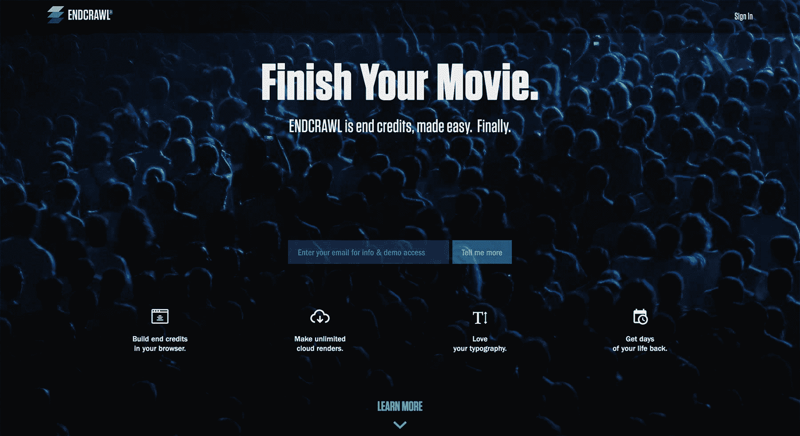
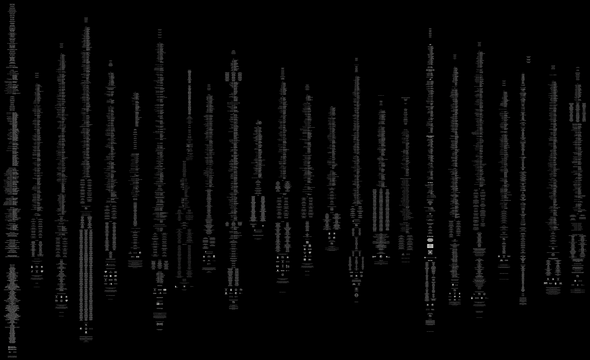

# 用严格的实验为电影行业开发 SaaS 应用

> 原文：<https://www.indiehackers.com/interview/growing-a-saas-app-for-the-film-industry-with-rigorous-experimentation-8aa8348dae>

## 你好！你的背景是什么，你在做什么？

嗨！我们是艾伦·格鲁和约翰·普利尼·艾瑞克。我们建造了 Endcrawl.com。

Endcrawl 是一款制作片尾字幕的 SaaS 应用。你知道——所有那些在电影结尾滚动的名字和标志。

迄今为止，已有 1000 多部电影作品使用了 Endcrawl。其中一些你已经听说过了，比如《T2》中的《月光下的 T3》，它击败了《T4》中的《啦啦啦》获得了去年的奥斯卡最佳影片奖；或者今年提名的像*大病号*、*泥足深陷*、*淑女鸟*。

整个圣丹斯 2018 阵容的三分之一也使用了 Endcrawl。

但是，我们同样对 1000 部其他电影感到兴奋，这些电影可能你从未听说过。我们深入独立电影市场销售的能力是我们故事的重要组成部分。

 

## 是什么促使你开始接触 Endcrawl.com？

普林尼经营了一家后期制作公司八年，在那里他参与了几十部电影，包括《了不起的盖茨比》。

在那段时间里，他锁定了电影制作的许多领域——用艾伦的话来说——“自动化程度很低的混沌引擎。”

但是，虽然其中许多都太小，无法建立一个业务，最终信贷跳出来作为一个头发着火的问题。每部电影都需要它们。现行价格是每次 1500 到 10000 美元。客户和供应商都害怕工作流程:长长的电子邮件链、Word 和 Excel 附件、非结构化数据以及缓慢而错误的反馈循环。

问题空间特别适合 SaaS。我们考虑了一个 NLEs(视频编辑软件)插件。但是我们觉得桌面软件会限制我们的客户群。它也不能解决核心问题，如协作和周转时间。

我们开玩笑说，我们的创始人关系实际上是一种哲学联盟。但这确实与事实相差不远。

TweetShare

我们知道我们将向客户提供大量的视频。例如，一个 4k 分辨率的 5 分钟结束演职员表序列解压缩后重约 250GB。所以我们的后端必须坚如磐石。Alan 带来了强大的全栈和 DevOps 背景。他曾效力于科技巨头(微软、彭博),最近还联合创立了艺术科技公司 iLuminate。

一天晚上，在一次行业假日聚会上，我们喝了太多酒，最终说服自己建造了这个该死的东西。鸡尾酒桌餐巾草图可能会涉及到。

## 构建最初的产品需要什么？

我们的 MVP 是一个 Perl 脚本，是 Pliny 在一个周六的早晨在他的早餐桌上构建的。( ***呻*)。**—艾伦，技术联合创始人)

事实上，我们可能是一个教科书式的精益创业案例研究。我们对精益并不教条，但它非常适合我们。

**礼宾阶段**

Perl 脚本成为了我们的门房 MVP。它是这样工作的:

*   我们给了客户一个谷歌表，他们的最终学分按照我们的规格格式化。
*   他们可以随心所欲地编辑表单。
*   当他们想要一个新的“渲染”(视频输出)，他们会给我们发电子邮件。
*   我们手动将他们的 Google 表单导出到 CSV。
*   然后，我们通过 Perl 脚本手动运行 CSV。
*   我们手动将结果文件上传到 Dropbox。
*   我们手动通过电子邮件向客户发送了他们的下载链接。

这个过程大约需要 15 分钟。但是电影制作人习惯于等待 6 到 24 小时！

我们这里要找的核心 UX 是:

1.  客户控制他们的数据。
2.  视频输出很快，很快，很快。
3.  无限重来。

在那些日子里，我们常常觉得自己就像《精益创业一书中提到的餐桌上的食物》的创始人，亲自为每位顾客准备膳食计划。这种礼宾待遇不会扩大规模，但它帮助我们了解并验证了我们的一些核心假设。

这引起了共鸣。在很短的时间内，我们获得了第一批 24 个客户。我们知道我们有线索了。但是我们不确定它到底有多大。

 

**电子邮件-第一阶段**

下一步是自动化部分流程，并尝试扩大规模。所以我们转向了[“电子邮件优先”策略](http://ryanhoover.me/post/43986871442/email-first-startups)。

在此阶段，客户可以通过电子邮件请求渲染。我们有几个 Unix 程序和一个`makefile`来处理每个请求，而不是创始人们争先恐后。

这也很顺利。

事实上，在我们推出 UI 的第一次迭代之前，我们已经完成了不到 100 个产品——他们乐于支付 500 美元通过电子邮件与 API 进行交互。

## 你是如何吸引用户和发展 Endcrawl.com 的？

一旦 Perl MVP 存在，我们就用 WuFoo 表单拼凑了一个登录页面，并向 Pliny 的电影制作人联系人发送了一封电子邮件。这就是我们发射的范围。

早期增长是 100%有机的。但是我们发现，随着我们的进步，增长变得越来越难——而不是越来越容易。有这样一个创始人谬误:随着你的成长，一切都开始走下坡路。我们发现事实正好相反:一旦所有唾手可得的果实都被采摘下来，真正的销售工作就开始了。

我们或许可以就我们做过的所有营销实验写本书。

TweetShare

如果你和你的公司正处于这个阶段，振作起来。这并不(一定)意味着市场不存在。这只意味着你实际上必须擅长营销。

关于这个话题，我们听过的最好的东西是盖尔·古德曼的演讲“[漫长而缓慢的 SaaS 死亡斜坡](http://businessofsoftware.org/2013/02/gail-goodman-constant-contact-how-to-negotiate-the-long-slow-saas-ramp-of-death/)”这是必看的。

我们或许可以写一本书，介绍我们从那以后进行的所有营销实验。以下是一些亮点。

**奏效:原生广告**

我们在所有新的 [Endcrawl](https://endcrawl.com/) 项目中使用我们的名字和标志。当然，如果客户愿意，他们可以删除它们，但默认的力量是强大的。因此，我们的名字和标志出现在数百部电影中，并将在未来许多年里被人们看到。

我们鼓励所有创始人创造性地思考什么是他们空间中的“原生广告”。

**工作:客户访谈和演示**

一对一的会议和演示对我们来说仍然很重要。它们并不总能带来直接销售，但它们增加了我们的口碑。同行推荐是我们行业的巨大推动力。所以我们学会了把精力集中在增加扩散系数的事情上。

我们还对新的、最近转化的客户进行采访。认识这么多电影制作人本身就是一个很好的社交机会，这种个人联系让我们的客户更有可能推荐我们。当我们问类似“什么对你完全没用？”这样的问题时，我们总能学到一些新东西，“你是怎么听说我们的？”以及“我们还能在哪里联系到你？”

**工作过:专业团体和聚会**

在你的领域里做一个好公民是有帮助的。我们与当地的行业组织如蓝领邮政联盟合作并赞助；普林尼在哥伦比亚大学、费尔斯坦和曼哈顿编辑工作室等地做客座演讲。这些都是品牌营销练习。

**奏效:内容营销**

我们的空间充斥着如何制作电影的链接诱饵。对我们有用的是以清晰独特的声音编写的高度差异化的长篇内容。例如，普林尼在这里做[他最好的本汤普森印象](http://endcrawl.com/blog/film-industry-disruption-smiling-curve/)。偶尔，其中一篇文章甚至会出现在[黑客新闻](https://news.ycombinator.com/item?id=12744737)上。

**已加工:锻造**

赃物可以是一种虚荣心的练习，但它也可以非常有效。和科技行业一样，标志 t 恤在我们的业务中是常见的工作服。当我们的目标客户(制片人)在电影拍摄现场时，我们确切地知道他们站在哪里，我们将服装分发给工作人员，以最大限度地提高知名度。

我们也保持我们最大的拥护者供应充足。一点点爱就能走很长的路。

关于服装还有一点要注意:要包容！不难。我们提供三种不同的款式。如果你正在考虑打印 t 恤，我们强烈建议[先阅读这个](http://geekfeminism.wikia.com/wiki/T-shirts)。

**有效:关注我们的谷歌分析**

我们注意到了流量高峰，并尽最大努力去追踪它们。曾经是一个私人的脸书集团给我们带来了大量的流量。另一次，它是一个小的，但具有高度针对性的行业通讯。我们现在赞助时事通讯。

**管用:推特！**

很难相信，但是推特曾经有一个比脸书更强大的相似产品。我们早期在这个平台上得到了一些很好的牵引，比如用[这个推广的 Tweet](https://twitter.com/endcrawl/status/644911429305274368) 。

我们还利用机械土耳其人进行了一些有趣的实验。我们将使用它来生成刚刚加入新电影节阵容的电影制作人的 Twitter 列表，然后与这些帐户进行互动。成功了！

但是收益递减开始了。社交媒体平台上的行为和偏好会随着时间而变化。更简单地说，推特上的人不够多。

**没起作用:脸书**

我们已经非常擅长在脸书上建立客户群。不幸的是，结果一直很弱。但是我们的客户就是不喜欢在脸书做广告。更重要的是:他们不会想到根据脸书的广告选择一个专业工具。

我们是怎么学会这个的？在所有那些一对一的面试中。

**没用:展示广告**

我们的行业有一些在线社区，但是大多数的聚合器都没有考虑过横幅广告。真是太可惜了。当我们看到一个新的角度时，我们仍然会时不时地尝试一下。但是展示广告在 2018 年的表现和你预期的一样好。

**没用:直接回应**

我们注意到的一个更广泛的模式是，直接回应广告的结果非常复杂。

Endcrawl 不是一年 365 天都需要的服务。客户可能听说过我们，但是通常在他们需要我们的时候就签约了，一秒钟都不会早。

意识到这一点迫使我们在品牌广告上投入更多的资源。你读到的大多数创始人建议都假设了直接回应模型和订阅定价。如果你的公司不符合这个模板，就要小心了。

每个人——包括我们——都希望有一个简单、易增长的飞轮。如果我们可以把美元塞进脸书，然后在注册人数滚滚而来的时候坐以待毙，这不是很好吗？

别指望这个。根据我们的经验，营销和销售并不是一劳永逸的。销售是核心的、存在的创始人技能。

 

## 你的商业模式是什么，你是如何增加收入的？

我们发现定价在 UX 是无法解决的。

我们的核心价值主张围绕着无限重来，并拥有这一过程。因此:

*   如果我们限制视频输出，我们会抑制使用。我们*希望*客户能够随心所欲地进行渲染，因为这对我们来说是一个巨大的优势。
*   如果我们收取订阅费，我们将鼓励我们的客户晚注册，并试图在几天内完成他们的信用。至少，这会给我们的支持团队带来不必要的压力。而且客户更喜欢尽可能长时间地修改他们的最终信用额度。
*   如果我们按用户收费，将会刺激账户共享。片尾字幕有许多利益相关者——当每个人都参与进来时会更好。更多的用户对我们来说也意味着更强的病毒式传播。

所以我们决定对每个项目收取简单的固定费用。

每个项目都有无限的用户，无限的使用和无限的渲染。低分辨率预览视频是免费的，项目升级价格为 499 美元(高清和 2k)或 999 美元(UHD 和 4k)。

我们从第一天开始收费。知道有人乐意免费使用你的产品是没有价值的。

现在，我们的模型可能是异常的。但要点是:确保你的定价不会与你的核心用户体验相冲突。注意你的定价模式创造了什么激励，并使这些激励与你的价值主张保持一致。

## 你未来的目标是什么？

目标是并且一直是自由。首先，根据我们的价值观开展业务的自由。更广泛地说，按照我们的方式生活。这当然包括财务独立，但也包括以更健康的方式安排我们的生活和日常事务的自由。朝九晚五的工作方式践踏了许多自然节奏。

一些创业公司最终成为了金牛犊，总是要求他们的创始人给予更多的敬意。我们试图建立一个为我们、我们的员工和我们的社区服务的公司，而不是相反。

到目前为止，我们建立的不仅仅是一个 SaaS，而是一个销售渠道、一个品牌和一个强大的创始人关系。

再加上不断增长的收入流，给了我们生活中大量的选择。

或者，引用 Jony Ive 的话:

“我一直认为在一个节目的结尾有两个产品；有实物产品或服务，你设法制造的东西，然后是你学到的一切。你所学到的东西的力量使你能够做下一件事，并且使你能够把下一件事做得更好。”

——乔尼·伊夫([来源](https://medium.com/@dropsoftime/quote-5db0c6ebb59)

## 你面临的最大挑战和克服的障碍是什么？如果你必须重新开始，你会做什么不同的事？

**挑战:兼职，不同时区**

艾伦和普林尼生活在不同的时区，并且有全职工作。兼职经营一家分布式公司面临一系列独特的挑战。我们解决这个问题的一些方法是:

*   面对面交流和黑客马拉松时间。
*   认真思考我们的通信堆栈。
*   建立节奏:站立、推理会议和“办公时间”(我们两个同时工作的时间)。
*   为反馈或代码审查等事情的响应时间设定明确的预期。
*   发展我们的书面文化。分布式文化需要强大的书面文化。这意味着强大的内部文档，建立风格指南，就我们如何向客户传达信息达成一致，内部速记和内部笑话，以及知道如何运行良好的拉动式请求。

**挑战:客户支持**

早期，我们能够在晚上和周末处理支持。但是我们已经长大了。

第一个挑战是向自己承认我们必须雇佣员工。作为兼职创始人，管理一个每天 12 小时营业的支持团队，这可能有点独特。

这带来了一系列新的挑战:入职支持代表，建立服务台系统。

但坦率地说，这是我们公司发生的最好的事情之一。独立黑客可能是一个孤独的行业。你可能会想得太多。我们的新团队成员为我们的文化做出了巨大贡献。懈怠现在也有趣多了。

**科技“遗憾”**

回过头来看，我们应该更早地转移到 AWS。我们最初使用 Dropbox 存储，但在产品中使用共享 Dropbox 文件夹的想法从未成功。Dropbox 并不总是可靠的，尽管它从未给我们带来过痛苦，但我们应该更仔细地考虑云存储。

我们拖延的另一件大事是不了解我们的服务器，只是让我们的 DevOps 房子变得井然有序。再说一次，虽然它从来没有咬我们，但长期停电的危险在早期给我们的品牌带来了不必要的风险。结果是:我们结束了[开源我们的零停机部署者](https://github.com/endcrawl/deployer)。

你所做的每一个技术选择在遥远的未来可能都像是一个错误。接受它，但做一个极简主义者。这是控制伤害的最好方法。

**错误:没有更努力、更快地销售**

我们应该从第一天开始就更积极地销售。成长是复利:你早期投入的越多，你以后得到的就越多。

我们没有更快更努力地销售的原因之一是:我们仍然习惯于整个“精益”的事情。电影行业的同行告诉我们“感知就是一切”，如果没有一个超级漂亮、功能齐全、设计精美的网络应用，我们会疯掉。我们允许自己对一些事情有自我意识，比如我们的 Google Sheets 整合，以及礼宾/电子邮件优先。

回想起来，我们本不该担心。更快推出，更大力度销售。

## 有没有发现什么特别有帮助或者有优势的？

**读作“牵引力”**

我们偶然看到了鸭鸭围棋创始人加布里埃尔·温伯格写的书*牵引力*。那本书是一个快速的突破:我们带着足够多的营销实验想法在接下来的一两年里继续。强烈推荐。

也许最好的提示是:在你公司的一个阶段推动增长的东西不一定会在下一个阶段推动增长。例如，当我们应该继续前进的时候，我们可能花了太多时间试图从 Twitter 石头上挤出血来。

留意你的牵引频道。在它们存在的时候享受它们，当它们枯竭的时候抛弃它们，并且总是不断地发现新的。

有这样一个创始人谬误:随着你的成长，一切都开始走下坡路。

TweetShare

**获得顾问委员会**

我们只是最近才这么做的。我们后悔没有早点这么做。BoA 并不仅仅针对风投资助的初创公司。

我们的 BoA 成员提供健全检查、战略观点和关键介绍。他们在哲学上是一致的，他们个人也喜欢我们。换句话说，他们在乎我们是沉还是游。

在受资助的初创企业中，BoA 成员通常会获得一小部分股权。如果你的规模太小，以至于没有意义，还有很多其他的方法来组织这种安排。

每个人都需要建议和指导。走出去，向更明智、更有经验的人寻求帮助。你会惊讶地发现，有多少人会非常高兴地答应。

**查看 Indie.vc**

[Indie.vc](http://www.indie.vc/) 为我们所有人提供了一个与沙丘剧本相反的故事。他们一直是灵感的源泉。

充分披露:我们申请了 Indie.vc，没有最终入围。但事后看来，我们认为他们做出了正确的决定。(不，真的。)今天，我们最好还是 100%独立。

事实上，套用一句著名的电影台词，你可能会说布莱斯最大的诡计就是说服我们不要他的钱。

## 对于刚刚起步的独立黑客，你有什么建议？

**JFDI。光是可选性就值了。**

当我们开始 [Endcrawl](https://endcrawl.com/) 时，我们没有真正意识到会有什么样的连锁反应。但是我们一出去，事情就开始发生了。我们遇到了其他创始人。我们发展了新的网络。我们发展了新技能。门开了。

举一个更具体的例子:当我们开始时，我们不知道我们确切的 TAM(总可用市场)。结果，没人知道。全球电影市场是分散的、无定形的，很难描绘。

Endcrawl 本身就是一个强大的市场研究工具。我们已经将学生电影、网络系列、澳大利亚的自然博士、内布拉斯加州的僵尸 kickstarters 货币化。这就像向我们市场的每个角落发送一系列声纳信号。

说我们比其他任何人都更了解我们的市场可能有点夸张。*可能*。

当你开始运输时，你会学到很多新东西。

**远离尊贵客户**

我们从电影业同行那里听到的一些最常见的建议是“追逐大鱼”和“向电影公司推销”糟糕的建议。幸好我们没拿。

这个想法对实体公司来说是有意义的:如果你的资源是固定的，你需要追求更高的时薪。

但是对于软件公司来说，这种逻辑是颠倒的:扩展资源是相当琐碎的，所以你需要专注于你可以扩展的地方。那些大鱼——即企业客户——接触度高，并且不能很好地扩展。(等着瞧吧，直到你发现写 SLA 需要多少法律费用。)

我们已经看到其他创业公司迷失在“企业销售”的森林中。这是个陷阱！那个你非常想放在登陆页面上的著名公司标志？那是骄傲在扰乱你。不要理会声望的诱惑，转向低端市场。相信我们，下面要好得多。

对于一个软件公司来说，扩展资源是相当琐碎的，所以你需要专注于你可以扩展的地方。

TweetShare

努力建立与创始人关系。

你与共同创始人的关系就像任何其他关系一样:你必须努力改善。你的公司将因其健康而生或死。

我们有固定的单口相声和“办公时间”，但我们也举行单独的签到，我们称之为*推理会议*。那些是留给讨论高层战略、政治、个人和职业斗争、人生目标的。对我们来说至关重要的是不断磨利这把锯子，并把我们在战术层面上所做的事情与我们希望过的生活、我们希望成为的人以及我们希望留下的世界联系起来。

我们曾经开玩笑说，我们的创始人关系真的是一个哲学联盟，我们建立的公司和产品只是那个联盟的副产品。但这确实与事实相差不远。

## 我们可以去哪里了解更多？

请前往 endcrawl.com 的[查看我们的酒店。](https://endcrawl.com/)

在推特上:

*   [@结束爬行](https://twitter.com/endcrawl)
*   [@iampliny](https://twitter.com/iampliny)
*   [@alangrow](https://twitter.com/alangrow)

我们很乐意听取社区的意见！我们是来给予的，我们是来学习的。问我们任何事情。

——[<picture id="ember8182527" class="user-avatar ember-view user-link__avatar"></picture>约翰·艾瑞克](/pliny?id=7RvelADz3yMO4SxEidq9JPQ7Z5f2)，Endcrawl.com 的联合创始人

## 想像 Endcrawl.com 一样建立自己的事业吗？

你应该加入[独立黑客社区](/)！🤗

我们是几千名创始人，互相帮助建立有利可图的业务和副业。来分享你正在做的事情，并从你的同事那里获得反馈。

还没准备好开始使用你的产品吗？没问题。这个社区是一个认识人、学习和实践的好地方。随意[随便浏览](/)！

——[<picture id="ember8182532" class="user-avatar ember-view user-link__avatar"></picture>考特兰艾伦](/csallen?id=ibTLPyjwVebnZjMGKvz6ztarnuV2)，独立黑客创始人

114votes