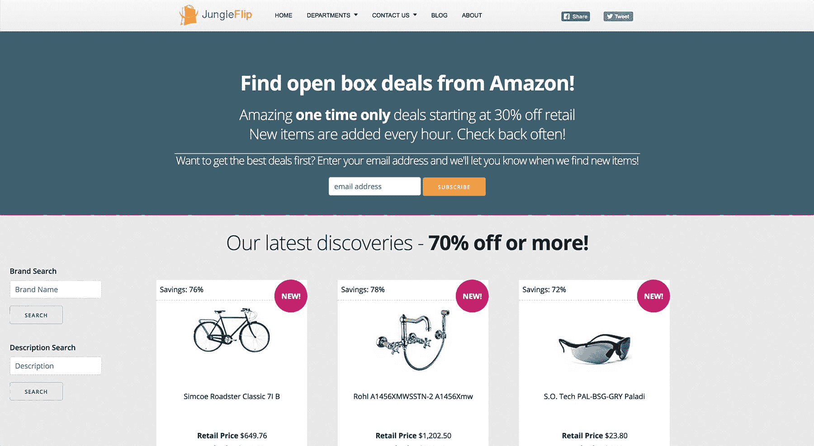
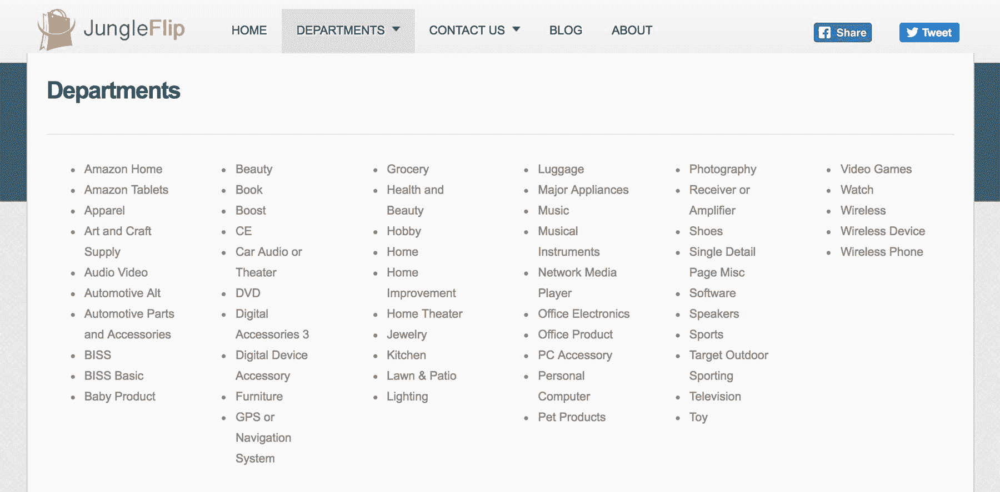

# 在亚马逊平台上开发一款 SaaS 应用，每月 550 美元

> 原文：<https://www.indiehackers.com/interview/growing-a-saas-app-on-the-amazon-platform-to-550-mo-aa752a59e0>

## 你好！你的背景是什么，你在做什么？

我的名字叫[保罗·德西](http://www.pauldessert.com)，我设计、建立和发展互联网业务。白天，我是一个全栈开发者和增长型营销者。在空闲时间，我会创建自己的兼职项目。其中一个项目是 [JungleFlip](http://www.jungleflip.com) 。

JungleFlip 是一个网络应用程序，帮助人们在亚马逊商品上找到令人惊叹的一次性交易。它受到从年轻人到老年人的各种人群的欢迎。人们喜欢 JungleFlip 挖掘出来的宝藏。

该网站刚刚突破 500 美元/月大关。

 

## 是什么促使你开始使用 JungleFlip？

几年前，我创建了一个礼品注册网站。对于人们来说，这是一种快速便捷的方式来创建礼物注册，并从世界上的任何网站添加产品。它获得了一些牵引力，但技术负担是巨大的。我一个人跟不上。我探索了试图获得投资者的想法，但最终决定这将违背我独立的主要目标。

我放弃了 gift registry 网站，开始寻找一种方法来使用我现有的代码库并构建一些新的东西。一天晚上，我偶然发现了亚马逊内部的一个部门，名为“亚马逊仓库交易”。太棒了！

你会失败的。那些从错误中学习的人会成长并成功。

TweetShare

它基本上是亚马逊的“开箱”通道。有些交易令人难以置信。我找到了扬声器系统，电脑，我的卡车零件，以及更多。大多数东西都打了 80%或更多的折扣。

但是有一个条件。很难找到真正划算的交易。大部分商品只打了 5-10 折。我试图操作搜索过滤器，只显示我想要的项目。它是偶然的。[jungle lip](http://www.jungleflip.com)诞生了！

## 构建最初的产品需要什么？

我是全职工作，有家庭，所以发展时间有限。过去，我开发了很多产品，但都失败了。我不希望这个项目以同样的方式结束，我也不想在不必要的特性上浪费时间。我必须明智地把时间花在 JungleFlip 上。

我研究了亚马逊 API，开始写代码。技术挑战实际上比我预期的要困难得多。亚马逊没有放弃我想要的所有信息，所以我必须发挥创造力。

我是全职工作，有家庭，所以发展时间有限。

TweetShare

在站点上查找项目需要两次通过 API。第一遍检索产品数据，而第二遍检索详细信息。最重要的是，Amazon 限制了 API 请求，所以处理需要很长时间。

在两个月的过程中(分分合合)，我得到了一个 MVP。有许多错误，但是我发现它们时就解决了。

## 你是如何吸引用户并发展 JungleFlip 的？

我不太喜欢边项目的“发布”。初始过程的一部分是发现什么可行，什么不可行。“试发布”允许您纠正问题或调整营销信息。相反，一开始我会慢慢来。

对于 [JungleFlip](http://www.jungleflip.com) ，我开始关注一个观众。经销商。有一个利基社区，人们通过寻找打折商品并在易贝、Craigslist 等网站上转售它们来赚取额外的现金。我觉得他们会非常合适。不对。他们对这项服务持批评和怀疑态度。所以，我调整了目标。

我把我的网撒得更广，目标是 18-55 岁之间的男女。然后，我针对这些人群中的一部分精心制作了我的营销材料。JungleFlip 有一个“宠物”栏目，所以我制作了针对对宠物感兴趣的人的广告。我这样做是为了网站上排名前五的部门。

我在意想不到的地方找到了我的观众。我创建了 Craigslist 广告，在宠物店张贴的小传单，只要有机会就告诉人们这个网站。

 

## 你的商业模式是什么，你是如何增加收入的？

这是 100%的会员收入。我从我推荐给亚马逊的每笔销售中提成。在这种模式下，只有两种方法可以增加收入。更多的流量，或后端更大的百分比。由于我在亚马逊没有太多的杠杆，我必须增加流量。

我增加流量的一个方法是添加电子邮件列表功能。用户可以订阅每日更新。每天，当有新产品加入时，我都会发送电子邮件提醒。这是一个巨大的胜利，并且易于实施。

简单，无聊，不性感的东西赚钱。

TweetShare

这种模式的最大风险是对亚马逊的依赖。如果亚马逊终止我的合作关系，我的收入就枯竭了。我正在寻找分散投资的方法，但就目前而言，风险是存在的。

我的花费很少。我只支付大约 30 美元的托管费(数字海洋)，大约 40 美元的电子邮件营销订阅费(滴滴)。随着流量的增加，我预计我的托管费用会增加。

这是最近的一些收入数据。

| 月 | 收入 |
| --- | --- |
| 六月 | 244 |
| 七月 | 318 |
| 八月 | 487 |
| 九月 | 522 |
| 十月 | 586 |

## 你未来的目标是什么？

我对 [JungleFlip](http://www.jungleflip.com) 的目标是稳步增加流量，改善用户体验。我想找到一种更快更有效地从 Amazon 检索数据的方法。

这个网站是我的 5x2000 目标的一部分:我正在建立 5 个产品/服务，每个月将产生 2000 美元以上。我目前有两个项目赚取收入，但我需要在我开始任何新的项目之前提升它们。

## 你面临的最大挑战和克服的障碍是什么？

我最大的挑战是我的心态。我必须打破“编码者”的思维定势，真正专注于业务方面。

能够编码是一笔巨大的财富，但也仅此而已。我的大部分时间都花在营销和运营网站上。

## 有没有发现什么特别有帮助或者有优势的？

当我开始一个新项目时，我有被技术分散注意力的倾向。我会读到一门新的语言或库，我会想去测试它。当我开始 [JungleFlip](http://www.jungleflip.com) 的时候，我不顾一切地让它尽可能快地运行起来。这需要我使用我知道的工具。这是一个巨大的帮助。

我点燃了一个简单的灯堆，开始编码。我没有浪费任何时间去学习如何配置一个新的开发环境，学习语法，或者任何其他的废话。学习新技术是有时间和地点的。这不是那种时候。

我是贾斯廷·杰克逊、布伦南·邓恩和内森·巴里的粉丝。这三个人都教授他们所知道的东西，并且一直是一种激励。我建议你花些时间阅读他们的材料。这三个网站都提供了大量的免费信息。

有一个支持你的配偶也是一个巨大的优势。我的妻子在这次冒险中起了很大的作用。她是我的编辑、作家、研究员，我让她做什么她就做什么。有这种支持会有很大的帮助。

## 对于刚刚起步的独立黑客，你有什么建议？

你会失败的。那些从错误中学习的人会成长并成功。你会变得气馁、愤怒和沮丧。当这种情况发生时，从你的电脑后面走出来，和人们交谈。这就是你如何找到真正的机会。

不要追逐最新的技术。仅仅因为它在本周的黑客新闻上很流行，并不意味着你需要使用它。如果你对运送产品很认真，坚持使用你熟悉的技术。

简单，无聊，不性感的东西赚钱。

## 我们可以去哪里了解更多？

你可以去 www.JungleFlip.com 的[看看 JungleFlip。当你在那里的时候，一定要订阅每日更新邮件列表！](http://www.jungleflip.com)

你也可以在推特上关注我[@ Paul descent](https://twitter.com/pauldessert)，在我的网站上了解我更多:[PaulDessert.com](http://www.pauldessert.com)

我很乐意回答下面评论中的任何问题！

——[<picture id="ember5203751" class="user-avatar ember-view user-link__avatar"></picture>保罗甜品](/pauldessert?id=O5BDleop19aeDuSFZgfmU2ZIodn1)，JungleFlip 联合创始人

## 想像 JungleFlip 一样建立自己的事业？

你应该加入独立黑客社区！🤗

我们是几千名创始人，互相帮助建立有利可图的业务和副业。来分享你正在做的事情，并从你的同事那里获得反馈。

还没准备好开始使用你的产品吗？没问题。这个社区是一个认识人、学习和实践的好地方。随意[随便浏览](/)！

——[<picture id="ember5203756" class="user-avatar ember-view user-link__avatar"></picture>柯特兰艾伦](/csallen?id=ibTLPyjwVebnZjMGKvz6ztarnuV2)，独立黑客创始人

6votes