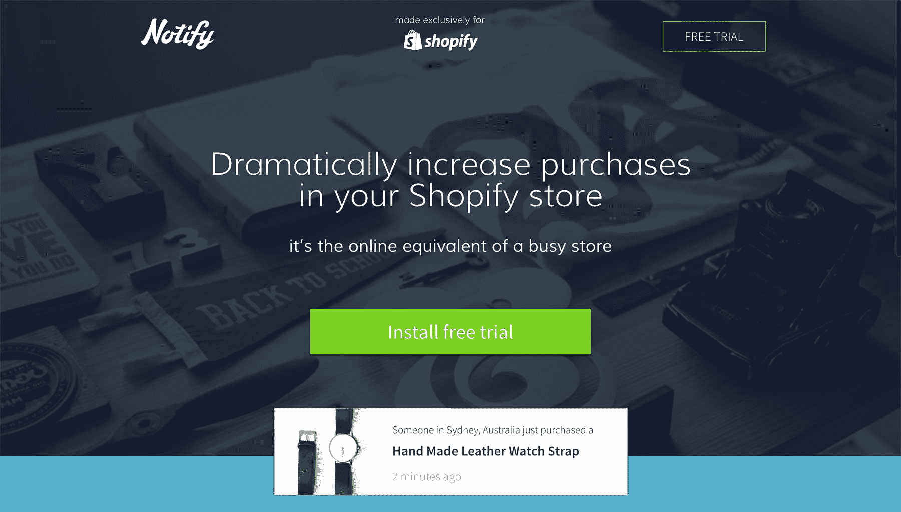
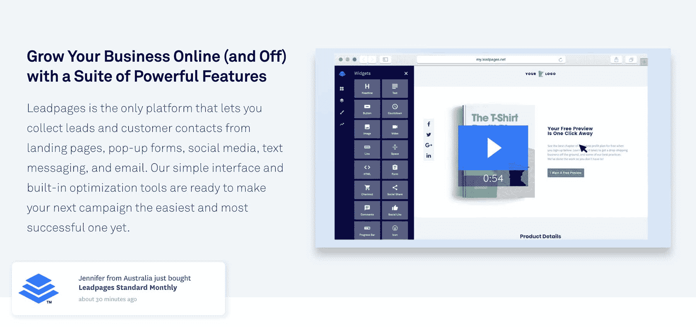
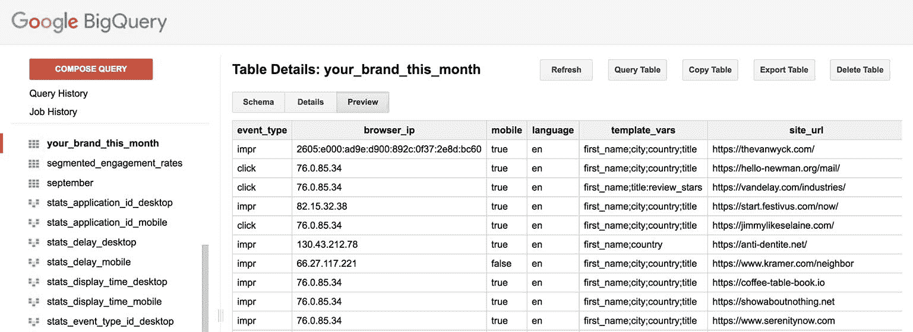

# 将社交验证营销平台的月收入提高到 88 万美元

> 原文：<https://www.indiehackers.com/interview/growing-a-social-proof-marketing-platform-to-88k-mo-in-revenue-05b996966c>

## 你好！你的背景是什么，你在做什么？

你好。我是 Ryan Kulp，Fomo 的创始人。Fomo 是一个转化率优化工具，通过展示最近的客户行为来增加网站转化率。

在 Fomo 之前，我创办了(也失败了)3 家公司，在 5 年多的时间里，我在 30 多家风投支持的初创公司里做过全职营销人员和自由职业者。

作为一名表演音乐家，我在焦虑中度过了青少年时代。我录制了几张专辑，表演了 100 多次，大约赚了 0 美元。我对技术、编程甚至营销都不感兴趣。

但是当我在大学里从事副业的时候，从水烟餐饮到别针纽扣制造，我对消费者购买行为有了更多的了解——为什么我们要做这些事情。

我也有机会与红牛、微软、为美国而教等十几个大品牌合作，做体验式活动和公关噱头。

所有这些都与 Fomo 联系在一起，Fomo 的前提是需要对从众心理、口碑营销以及当然还有社会证明有深入的了解。

如今，Fomo 拥有 5000 多名付费用户，上个月我们赚了 88000 美元。

除了一笔我们打算连本带利偿还的 15 万美元可转换债务贷款，我们也是自力更生的。

我很高兴分享我们的旅程，这样它就可以被各地的独立黑客复制。

## 是什么促使你开始使用 Fomo？

Fomo 的端到端历史是一个[更长的故事](https://blog.usefomo.com/how-we-bought-a-small-software-startup/)，但**TL；博士**:

2016 年 3 月，我和我的合伙人贾斯汀收购了一款名为 Notify 的 Shopify 应用。

 

在四个月的时间里，我们重建了 Notify，并将其更名为 Fomo，于 2016 年 8 月重新启动了产品搜索。

在重建期间，以及之后的几个月里，我们都在其他公司全职工作——我在风险投资公司工作，贾斯汀在电子商务公司工作。

承认这一点有点尴尬，但我们认为 Fomo 是一个附带项目，每周只花 1-2 个晚上来研究它。

然后事情变得真实了。

玛莎·斯图尔特报名了。暗示水也是。我们发送了 10 亿份 Fomo 通知。我们的服务器在黑色星期五崩溃了。

随着越来越多价值数百万美元的品牌开始依赖 Fomo 来提高他们的转化率，我们知道这很特别，需要更多的关注。

幸运的是，当我们收购 Notify 时，我已经学习了大约六个月的代码，与经验丰富的工程师一起工作大大提高了我的开发能力。

保住你的日常工作。不是永远，但直到你的副业随着指针移动而爆开。

TweetShare

这使我们能够非常快速地响应客户请求，在短短几个小时内发布新的集成，或者在短短五分钟内修复错误，甚至在周末的午夜之后。

我的个人座右铭是:你所要做的就是不惜一切代价。

回答你的问题，促使我们创建和发展 Fomo 的是许多营销组织缺乏诚实和透明度。

大多数营销人员似乎更感兴趣的是制造虚假的炒作、虚假的紧迫性、虚假的恐惧(厌恶损失)、虚假的价值。

我们的观点:

*   创业比以往任何时候都容易(太棒了！)
*   因此，竞争空前激烈
*   这导致客户获取成本飙升

数字营销的未来不会是脸书广告或任何形式的付费媒体。更确切地说，营销的未来依赖于企业扩大口碑的能力。

Fomo 提供了一种策略来做到这一点，我们的客户每天花一美元就能看到令人难以置信的效果。

## 构建最初的产品需要什么？

我们购买的应用程序 Notify 只有几十个 PHP 脚本。

我们知道这不会扩展，所以我们雇了一个开发人员来做 Fomo 版的前期工作。

我们对架构也不满意，在“数据”(最近的 Shopify 订单)和它们的呈现(通知)之间只有 1:1 的关系。

 

将它抽象成更灵活的东西成为我们重建 Fomo 的主题。这也让我们能够在短短几周内为几个世界领先的电子商务工具推出插件。

有趣的故事:

在完成 Notify 收购三个小时后，我们的第一个开发人员为所有通知添加了一个简单的“powered by”链接。这给我们的网站带来了成千上万的点击量，但也有几十封愤怒的客户邮件。

*“这不公平！我付钱给你！”*

*“你怎么敢——我要取消。”*

换句话说，我们的第一个产品营销决策完全失败了。我们在当天午夜之前恢复了更改。

看到竞争对手仍在使用这种策略很有趣，因为客户讨厌这种策略。打着“你的访问者会知道这是真实的”的幌子来证明这样的反向链接是我们打算补救的许多不诚实营销策略中的又一个例子。

总之。

在早期，我的大部分时间都花在了传统 Notify 应用的客户支持上。晚上，我和贾斯汀一起参与营销活动，从回答 Quora 上的问题到请求在博客帖子中提及社交证明或“必备的 Shopify 应用程序”

种子阶段的产品很有趣，因为即使每天 10 次额外的点击也能改变现状。除非你需要，否则我不建议将可预测的高质量流量扩展到喷子和祈祷源(即广告)。

我们总共花了四个月的时间和大约 40，000 美元来构建 Fomo v1.0。

这些费用流向了开发者、主机和 Mailchimp/Mixpanel/Gmail 等工具。多亏了那段时间的收入，我们几乎收支平衡。

至于超出预算的 10，000 美元，我们用大通银行的 12 个月零利率信用卡支付。

如果你是自力更生的、负责任的、谨慎的，可以考虑这样的信用安排。他们的行为有点像风险投资，让你越过产品市场契合度的高峰，不受投资者的影响。

## 你是如何吸引用户和发展 Fomo 的？

我们非常幸运，Fomo 是一种可见的产品。

为了给人一种规模感，Fomo 每月提供超过 5 亿条通知——所有这些都在我们的统计服务器上进行跟踪，该服务器托管在 Google BigQuery 上。

当有人注册时，他们会立即加入我们的销售团队，只是他们会付钱给我们，而不是相反。

特别是，当客户是利基行业或用例的一部分时，病毒系数甚至更高。

例如，几个月前，我们得到了第一个加密客户端。他们即将进行 ICO，并希望在他们的 FAQ 页面上展示现场注册和承诺。

几周之内，十几个其他代币销售加入进来，很可能是因为他们在跟踪 ICO 活动并寻找最佳实践。

这也是通过直接竞争发生的。

模仿者在付费媒体上花费巨大，甚至在他们的营销材料中使用 Fomo 客户。但在获得免费试用的几天内，他们辛苦赢得的许多潜在客户转向了我们。相反，我们搜索了 700 多个取消 Fomo 免费试用的网站，其中只有 2 个网站转向了竞争对手。

这里的教训是，如果你有最好的产品，而**不会推销自己**，精明的购物者会在点击竞争对手的昂贵广告后，凭自己的勤奋找到你。

营销的未来依赖于企业能够扩大他们的口碑。

TweetShare

我们还通过与大公司的合作来发展。

通常很难与“大家伙”建立共生关系，但我们合作的大多数平台已经有了正式的联合营销、私有 API 集成等流程。简而言之，我们的策略是不征求许可。我们只是利用现有的文档尽可能地构建，然后在发布后将完成的演示/GIF 发送给合作伙伴经理。

这导致一些潜在合作伙伴坚持了解我们，完全改变了联合营销的动态。在这一点上，我们有体面的杠杆，以建立收入共享协议，认可的反向链接等。

正是这种真实的最终用户接触，以及我们工程师支持的支持团队和一流的产品，推动了我们的大部分增长。

没有花哨的营销活动，没有脸书的广告，没有冷冰冰的电子邮件，没有*的最后机会！“优惠今天到期！”*网络研讨会。

## 你的商业模式是什么，你是如何增加收入的？

Fomo 收取每月订阅费，从 11.99 美元到 750 美元不等。大多数用户使用我们的 29-49 美元计划。

从第一天起，我们就投入了大量的资源来提供出色的技术支持，因为许多用户都希望自己的网站具有独特的定制功能。

因此，我们比市场上任何一家公司都拥有更多的功能和可配置的设置，这进一步增加了复杂性，引发了更多的定制需求。一个有趣的悖论，或者快乐跑步机。

我们目前的客户群(5000+付费)和收入(88000 MRR)非常强劲。此时，我们更关注的是为现有客户增加价值(从而增加 [ARPU](https://en.wikipedia.org/wiki/Average_revenue_per_user) )，而不是扩大客户基础。

鉴于我们在过去 12 个月中三次提价，这一策略到目前为止效果不错。销售年度计划也有帮助，因为一次点击，一个年度计划(对于大客户)就能带来几千美元的额外收入。

| 月 | 收入 |
| --- | --- |
| 8 月 17 日 | 67383 |
| 9 月 17 日 | 73726 |
| 十月十七日 | 74324 |
| 十一月十七日 | 80335 |
| 十二月十七日 | 87100 |
| 1 月 18 日 | 87100 |

## 你未来的目标是什么？

2018 年终于在做“营销”了。

我们的目标是制造轰动，我们将在今年春天发起一场实验性的公关活动。

[https://www.youtube.com/embed/h89KbSiulDE](https://www.youtube.com/embed/h89KbSiulDE)

我们的团队还在内部制作了一部短片，非常有趣，也是表达我们观点的另一种非传统方式。

## 你面临的最大挑战和克服的障碍是什么？

提供高质量的客户支持是我们最大的挑战，也是最大的机遇。

在过去的一年里，有超过 24 家山寨竞争对手成立，但没有一家有多名全职工程师每天直接与客户一起工作 11 个小时。我们对美国东部时间上午 9:30-晚上 8:30 的实时聊天时间保持警惕，这对我们的规模和行业来说是闻所未闻的。

*(我所说的“实时聊天”实际上是指实时聊天。真实故事:有一次，一个潜在客户给我们打电话，只是想看看我们是否在那里，然后从一个过了几天才回复的竞争对手那里转换过来。)*

另一个常见的障碍是满足客户需求。

Fomo 推出了三个集成——Stripe、Zapier 和 Eventbrite——但后来又增加了[40 多个其他的](https://www.usefomo.com/integrations),以及一个 API、自定义 webhooks 等等。

为了实现这一点，我们重构了我们的集成架构，从每次集成 1000 多行代码减少到 80 行。

作为一个经验法则，我们已经能够通过花一半的时间重构技术债务，一半的时间创造更多的技术债务来快速前进。；)

## 有没有发现什么特别有帮助或者有优势的？

简答:每周读一本书。

更长的回答:我们的核心优势是我们的团队——他们的技术技能、客户同理心和对我们愿景的真正兴趣:*给诚实的企业家他们应得的信誉。*

在 Fomo 之前，我开了(也失败了)3 家公司。

TweetShare

Fomo 不仅仅是“通知”或“网站上的一行 JavaScript”。

不断向我们自己和我们的客户传达和展示这一点，推动了深入的产品洞察，从而形成了强大的下一代功能路线图。

我们还幸运地率先进入市场，这使得思想领先更加自然，从而建立了客户信任。

## 对于刚刚起步的独立黑客，你有什么建议？

保住你的日常工作。不是永远，而是直到你的副业随着**指针的移动而破裂。**

在 Fomo 的前 13 个月，我全职工作，也做自由职业者，以保持这艘船的航行。即使在 2017 年初全职工作后，我仍然在接下来的 9 个月里没有拿到我的第一份 Fomo 支票。

## 我们可以去哪里了解更多？

[我们的 Instagram](https://www.instagram.com/use_fomo) 很棒，但是[平台](https://www.usefomo.com)支付我们的租金。

Fomo 是反炒作的，我就不卖你了。事实是，企业要么重视社会证明，要么不重视。他们重视降低客户获取成本，或者不重视。

这算不算推销？

因为我是独立黑客的超级粉丝，我会回复下面的每个问题或评论。再次感谢。

—[<picture id="ember5283810" class="user-avatar ember-view user-link__avatar"></picture>瑞安·库尔普](/ryan?id=kfhcn0b6QiRV9T9lkuuYkHOSacJ3)，Fomo 创始人

## 想像 Fomo 一样建立自己的事业？

你应该加入[独立黑客社区](/)！🤗

我们是几千名创始人，互相帮助建立有利可图的业务和副业。来分享你正在做的事情，并从你的同事那里获得反馈。

还没准备好开始使用你的产品吗？没问题。这个社区是一个认识人、学习和实践的好地方。随意[随便浏览](/)！

—[<picture id="ember5283815" class="user-avatar ember-view user-link__avatar"></picture>考特兰艾伦](/csallen?id=ibTLPyjwVebnZjMGKvz6ztarnuV2)，独立黑客创始人

85votes