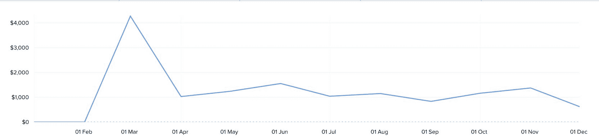
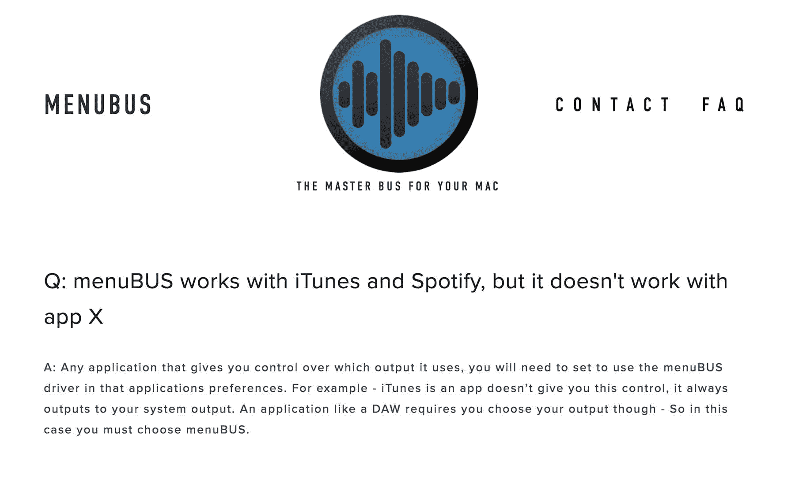
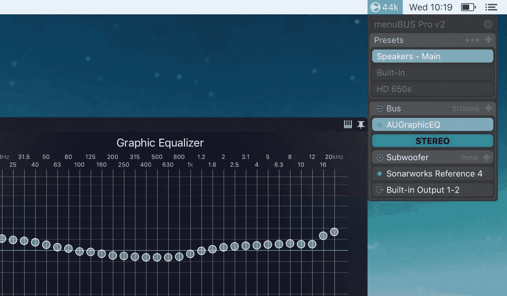

# 将用于 Mac 的音效应用增加到每月 1，000 美元

> 原文：<https://www.indiehackers.com/interview/growing-a-sound-effects-app-for-mac-to-1-000-mo-f522c242fc>

## 你好！你的背景是什么，你在做什么？

嗨！我叫内森·蒂迪，今年 26 岁，我在我父母位于新西兰的山羊农场生活和工作。你说农夫？一个农民在独立黑客上做什么？？在去年年底之前，我也会问自己同样的问题！

我做的不仅仅是种田。在此之前，我作为一名录音师在城市生活和工作了 5 年。2015 年末，这种对制作音乐的兴趣让我走上了开发自己的工具来帮助录制过程的道路。

menuBUS 是一个应用程序，可以让你处理你的 Mac 产生的所有声音，然后再传送到扬声器。这可以让您均衡扬声器以更好地匹配您的房间，提高您正在观看的电影的音量，或者在耳机中添加低音以获得更多声音。menuBUS 并不是第一个这样做的应用程序——如果你使用 Mac，你可能听说过音频劫持，或 Boom 但 menuBUS 是第一个做到这一点的应用程序，它生活在菜单栏中，不会妨碍你。

它是为专业音频工程师设计的，但任何使用音频的 Mac 用户都可以从 menuBUS 找到实用工具。

当我不在农场外面的时候，我就在 Swift 里面乱搞。

TweetShare

menuBUS 最初是我为自己开发的一个简单的应用程序。建成后，我认为我可以卖 5 美元，但随着我添加更多的功能，并看到它在公开测试的那个月越来越受欢迎，我最终确定了 40 美元的价格。

对于一个简单的菜单栏应用程序来说，这听起来很多，但对于许多花费 200 美元以上购买插件 menuBUS 主机的专业人士来说，40 美元并不算多。

当我在 2018 年 1 月中旬写这篇文章时，经过近一年的销售，menuBUS 已经为我赚了 12，000 美元，在开始时你经常会遇到的最初的颠簸之后，我很高兴地报告 menuBUS 的销售非常稳定，平均每月约 1，000 美元。

 

你可以从图表中看到，在发布后的最初高峰之后，销售一直相当稳定。

## 是什么促使你开始使用 menuBUS？

在下载了一款名为 [Sonarworks Reference 3](https://www.sonarworks.com/) 的软件后，我想到了 [menuBUS](https://menubus.audio) 的创意。

Sonarworks 是一个神奇的数字音频工作站插件。它对您房间中的扬声器进行校准测量，并应用定制的校正曲线，以便所有通过插件的音频在从您的扬声器出来时都被调整为完全中性的声音。当你混音和掌握音乐时，扬声器和房间对声音有很大的影响。重要的是要消除这些失真，让某些东西在某人的 iPhone、汽车和高保真音响上听起来很棒。

这个插件的一个问题是它只能在录音工作站上工作。我希望每个应用程序都有这样的修正。不仅仅是我的录音软件，还有 iTunes 和 Safari。

当时，在谷歌上快速搜索会让你找到两种可能的解决方案。其中一种是使用一款名为 Audio 劫持的软件，另一种是使用苹果免费的“AU Lab”和开源虚拟音频设备“SoundFlower”的组合。

AULab + Soundflower 组合运行良好，向我展示了这是一种真正的可能性，音频劫持方法超级流畅，但对于我想一直运行的东西来说，感觉有点重量级。

我知道，对我来说，理想的应用程序应该易于使用，但不能碍事。正是因为这个原因，我喜欢菜单栏应用程序。

## 构建最初的产品需要什么？

我有这个想法，但现在我需要学习编码。学习编程的想法令人望而生畏，但幸运的是，我的一位程序员朋友让我使用了一款名为 maxMSP 的软件。对我来说，开始使用它真的很直观。多亏了 maxMSP 的可视化编程环境，我只用了几个小时就构建出了一个可用的应用程序。除了一些关键的东西，它几乎做了我想要的一切。

1.  它不是也不可能被制作成菜单栏应用程序
2.  该包超过 300MB
3.  它看起来一点也不像 mac 应用程序。

在这一点上，我只是试图为自己解决这个问题——完全没有为其他人做这件事的意图，但这只是困扰着我，到这一点上，我已经发现了编程错误！

有了一个可行的应用程序想法，我现在不那么害怕编码的想法了，所以我开始钻研，下载 [Xcode](https://developer.apple.com/xcode/) 并开始学习 Swift。

当我不在农场的时候，我在里面黑 Swift。我从下载和扩展我在 GitHub 上找到的示例应用程序的功能开始。有时我会面临一个似乎很难解决的问题。当我开始不得不与[核心音频](https://developer.apple.com/documentation/coreaudio)的低级 C API 一起工作时，这种情况经常发生，我经常会放弃这个项目一个月。我发现，每当我在一次大的休息后回到 Xcode，我都有新的精力来解决问题，并继续学习。

开始吧。硬了就停。重新开始。

TweetShare

因此，经过几个月的前前后后，我已经建立了一个 Mac 菜单栏应用程序，与核心音频接口，让我运行插件，就像我想要的那样！

## 你们是如何吸引用户，壮大 menuBUS 的？

menuBUS 的推出获得了巨大的成功。我在专业音频论坛 [Gearslutz](https://www.gearslutz.com/) 上宣布了 menuBUS 的测试版。我网站上的下载链接需要一封电子邮件才能下载，一个月后，我收到了 1000 多封电子邮件，来自下载了测试版的人。我对论坛上参与测试的每个人都公开表示，帮助我测试会有很大的折扣。

当开始销售 menuBUS 的时候，我收到了一堆电子邮件和一个繁荣的 Gearslutz 线程，这意味着我在第一周就卖出了 250 份。我以半价推出了 menuBUS 一周，所以这真的鼓励了人们去购买这个应用程序。

menuBUS 本身就吸引了很多人。到目前为止，我所有的收入大部分来自于我在二月份发布这款应用时在[论坛上写的那篇帖子](https://www.gearslutz.com/board/product-alerts-older-than-2-months/1139326-menubus-master-bus-your-mac-version-1-0-0-available-now.html)，其余的销售来自于口口相传或者人们在社交媒体上写的关于它的文章。

我知道我可以也应该在这里做得更多，但我一直专注于论坛的主题，快速回复支持电子邮件，不断修复漏洞，增加应用程序的功能。

 

## 你的商业模式是什么，你是如何增加收入的？

自从推出 [menuBUS](https://menubus.audio) 以来，我已经有了三种定价模式:

1.  梅努布斯
2.  menuBUS + menuBUS lite
3.  menuBUS Pro + menuBUS free

**1。menuBUS**

起初我用 menuBUS 做了一个非常基本的模型。我有一个 14 天的免费试用版，结束时票价是 40 美元。

我看到这个简单的模型非常成功。

**2。menuBUS + menuBUS lite**

大约销售 3 个月后，我决定做一个更精简的 menuBUS 版本，叫做 menuBUS lite。我用 menuBUS lite 的目标是抓住更多的休闲市场，那些喜欢 menuBUS 概念，但只需要更基本功能集的人。

**3。menuBUS Pro V2 和“lite”的停产**

我不会说‘lite’是一个失败的想法，但随着 menuBUS v2 的推出，我决定停止销售它，因为我想减少潜在客户需要做出的购买决定。

在推出 lite 的时候，它一个月只卖了 5 本左右，我不禁想知道如果我没有选择的话，这 5 本可能会变成 40 美元。

因此，去年 10 月，我推出了版本 2，将价格提高到 55 美元，取消了精简版，同时给人们提供了一个更加精简但完全免费的 menuBUS 永久版。

如果我回顾 menuBUS 的这三个不同时期，销售方面没有什么大的变化。我一个月挣 1000 美元左右，这似乎总是不值得的。不错的零花钱，如果我住在泰国，没有家庭要养，可能足够支持我，但最终我仍然在年底坐在这里，知道这个应用程序有这么多的潜力。

我对谷歌广告词和脸书广告有所涉猎。我没有从这些努力中获得任何直接的销售，并且很难证明这些花费是合理的。我在 12 月开始我的广告测试，12 月是我迄今为止最低的收入！如果你把广告费用考虑在内，我在 12 月基本上什么都没得到:(

那么我来年的计划是什么？

1.  提高我的价格！在 2018 年初，作为一项实验，我决定将应用程序的成本提高近一倍。我想试试也无妨，因为我不依赖这种收入，说实话，我真的很喜欢尝试这种东西，即使有时会受伤！
2.  一月底，我将发布一个应用程序的重大更新，这将为专业人士打开一个全新的市场。目前 menuBUS 不支持 5.1(环绕声)工作流程。有了这个新的更新，应该会有很多人希望用我的软件解决方案取代他们昂贵的硬件显示器控制器，所以我对此很兴奋！
3.  利用电子邮件做更多事情。我知道我必须这么做，但是写这篇采访已经够有挑战性了！

 

## 你面临的最大挑战是什么？你克服的障碍？如果你必须重新开始，你会做什么不同的事？

最大的挑战，也可能是我最大的错误，是使用 Swift 为低级音频处理构建 menuBUS。

Swift 很棒，不要误解我——它帮助我学会了编程！但是当把 menuBUS 放到野外时，我面临了很多缓冲区溢出的问题。我每天都收到客户的电子邮件，抱怨他们的音频中有点击和爆音。那是一场噩梦。

当与 CoreAudio 接口时，你会得到一个非常高优先级的线程，它以回调的形式为你的应用提供一个音频缓冲。如果你做任何事情来阻止这个线程，或者如果你天真地使用 Swift 来与这个回调接口，你将有一段糟糕的时间…

幸运的事情发生了。menuBUS 上市大约 3 个月后，我的一位客户联系我，抱怨 menuBUS 的音频质量，他说如果我花时间将我所有的音频处理代码转换成 C++，那么他愿意查看我的代码，并帮助进行所需的性能优化。这个人是我的救星！谢谢达里尔·福特尼！！

所以我有了这个想法，但是我现在需要学习编码。

TweetShare

自从把这段代码转换成 C++之后，在 menuBUS 上工作就成了一个梦想。界面仍然是用 Swift 编写的，但真正重要的是代码现在具有超强的性能。

## 你最大的优势是什么？有什么特别有用的吗？

我使用这个应用程序的最大优势是我作为音频工程师的经验和对音频社区的了解。

我作为一名音频工程师的经历首先给了我这个想法，因为我了解这个社区，当发布这个产品的时候，我知道我应该首先在哪里推送新闻，因为这正是我多年来获得所有新闻的地方。

我还应该补充的是，另一个主要优势是热情的用户群，他们在开发过程中的一些艰难时刻一直陪伴着我，尤其是在那个用户 Daryl Fortney 的情况下，他真的把我从困境中拉了出来！

## 对于刚刚起步的独立黑客，你有什么建议？

开始吧。硬了就停。重新开始。

## 我们可以去哪里了解更多？

你可以在 [menubus.audio](https://menubus.audio) 了解更多关于我的应用的信息。在推特上关注我[@内森 _ 蒂迪](https://twitter.com/nathan_tiddy)。或者像《T4》中的梅努布斯和《脸书》中的 T5 一样。

我很乐意回答你们黑客的任何问题！

—[<picture id="ember8173318" class="user-avatar ember-view user-link__avatar"></picture>内森·蒂迪](/menuBUS?id=78MOKJAk4pdkH9sRkfgIyYkRbIJ3)，menuBUS 的联合创始人

## 想像 menuBUS 一样建立自己的事业？

你应该加入[独立黑客社区](/)！🤗

我们是几千名创始人，互相帮助建立有利可图的业务和副业。来分享你正在做的事情，并从你的同事那里获得反馈。

还没准备好开始使用你的产品吗？没问题。这个社区是一个认识人、学习和实践的好地方。随意[随便浏览](/)！

—[<picture id="ember8173323" class="user-avatar ember-view user-link__avatar"></picture>考特兰艾伦](/csallen?id=ibTLPyjwVebnZjMGKvz6ztarnuV2)，独立黑客创始人

12votes