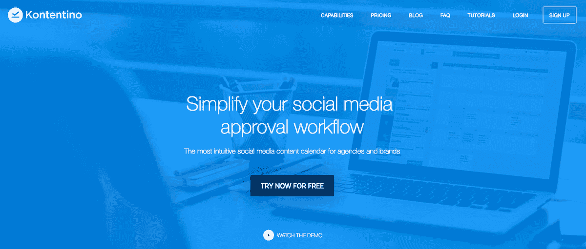
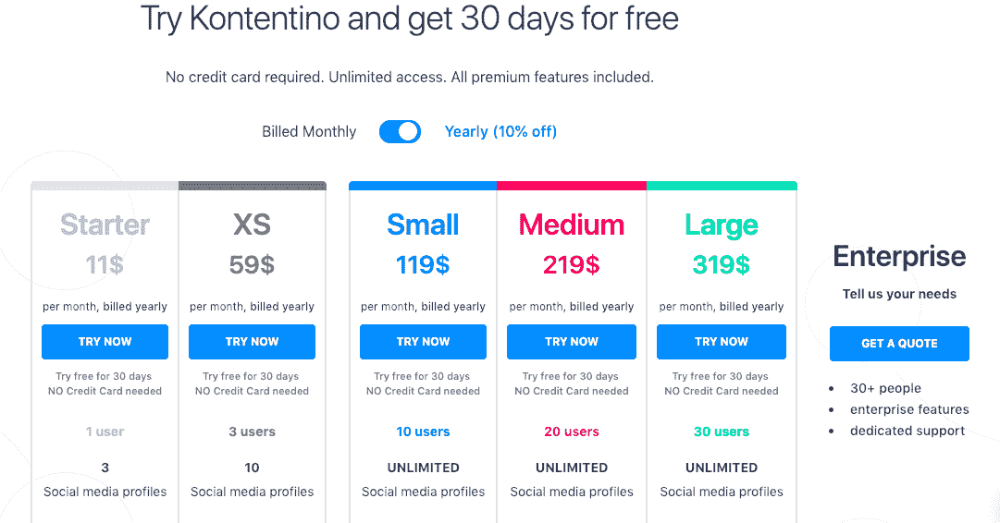
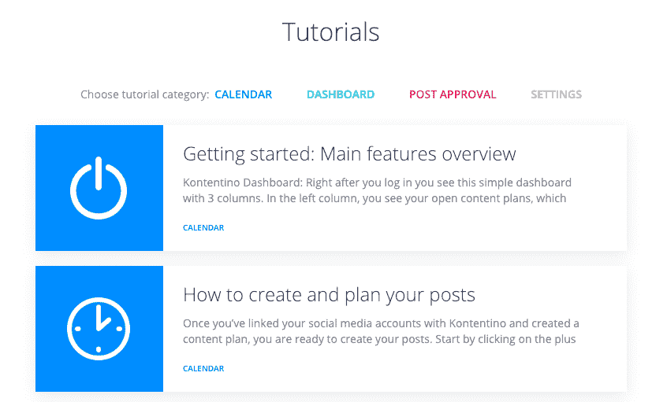

# 将一项衍生业务发展成独立的成功

> 原文：<https://www.indiehackers.com/interview/growing-a-spin-off-business-to-a-standalone-success-4d51087915>

## 你好！你的背景是什么，你在做什么？

大家好，我是 Bohumil Pokš tefl，我是 [Kontentino](https://www.kontentino.com/) 的首席执行官。我在哥本哈根学习创新和运营管理，后来在西弗吉尼亚大学的创新中心工作，帮助人们将创新想法商业化。

Kontentino 是一款专门为协作和内容审批开发的社交媒体管理工具。它可以帮助广告公司更有效地管理客户的多个社交媒体账户。

到目前为止，全球已有超过 1000 家机构和品牌使用 Kontentino。去年，我们获得了 40 万€收入，这是我们 2017 年收入的四倍。截至 2019 年 2 月，我们在 MRR 拥有 4.5 万€(每月经常性收入)。

 

## 是什么促使你开始使用 Kontentino？

Kontentino 最初是作为三合会广告代理的内部工具开发的。当涉及到创建和批准社交媒体内容时，他们的社交媒体经理厌倦了混乱的沟通。整个过程总是涉及大量的电子表格、(丢失的)电子邮件附件和电话。它很乱，导致了很多错误。所以 TRIAD 的人决定开发一个工具，让文案、平面设计师、艺术总监、社交媒体经理和客户之间能够轻松交流。

Kontentino 背后的主要想法是使团队协作和客户批准比以前容易得多。在 Kontentino，用户可以看到实时帖子预览，因此他们可以很容易地想象帖子最终会是什么样子。只需点击“批准”或“拒绝”，客户要么给社交媒体团队开绿灯，要么将帖子发送给他们进行修改。

## 构建最初的产品需要什么？

我来到 Kontentino 完全是偶然的。我想在 TRIAD 做客户经理。面试结束后，考虑到我与美国初创公司打交道的经验，他们让我尝试将 Kontentino 推向市场。那是在 2016 年，大约是 TRIAD 意识到 Kontentino 可能有商业潜力的时候。

我们从 TRIAD 投资于 Kontentino 的初始资金开始，从那时起，我们已经能够赚到一些钱。在 Kontentino 投放市场的第一年，我们获得了 10，000€的收入，并且非常高兴有人愿意付费使用 Kontentino。那段时间，只有我们的 CTO Ivan Hanák 和我。这完全是因为我们两个人与现有客户进行了深入的沟通，并根据他们的反馈对产品的市场适应性进行了微调。

最初，它只是一个基于网络的平台，但后来我们推出了适用于 iOS 和 Android 的移动应用。

## 你们是如何吸引用户，壮大 Kontentino 的？

我们开始接触斯洛伐克和捷克共和国的广告代理商，并向他们展示产品，当 TRIAD 向其他几家代理商发布 Kontentino 时，我们获得了一些其他客户。当我们决定在 2016 年推出 Kontentino 时，我们非常依赖脸书广告进行营销和增长。我们 70%的客户是通过脸书找到我们的，这对于 B2B 业务来说有点不寻常，但我们的目标群体在脸书，所以这是有道理的。脸书让我们以一种视觉上吸引人的方式展示问题和解决方案(产品)，这引起了很多人的兴趣，并创造了大量的销售。

做你喜欢做的事情，做你热爱的事情。这些是你将会掌握并变得非常擅长的事情。

TweetShare

我们的增长一直很大。2016 年，我们有 26 个付费账户和 10k€的收入。一年后，付费账户增加到 168 个，收入达到 10 万€。我们开始时每天只有 5 个注册，一年后就增长到每天 20-25 个。

我们专注于销售线索资格和将销售线索转化为付费客户，转化率为 10%。

我对刚刚起步的创业者的建议？倾听客户的心声。这听起来很老套，但它确实帮助我们制作了产品，这需要了解我们客户的问题并保持高保留率。所以，在冰冷的软件前放一张人脸，人们会喜欢你的。

## 你的商业模式是什么，你是如何增加收入的？

我们是一个基于订阅的 SaaS。我们有五个计划，根据用户数量和页面数量以及其他高级功能而有所不同。客户可以选择按月支付，也可以选择全年支付，享受九折优惠。

我们使用 Braintree，对于一些较大的客户(尤其是企业)，我们有银行转账选项。

我们从第一天开始收费。但是对于一些有价值的潜在客户，我们提供了更长的免费试用期。现在我们向每个人提供 30 天的免费试用。

我们的定价改变了两次。两次我们都把价格提高了一倍。第一次价格变动是成功的，但是第二次价格变动的价值只增长了 30%，而不是 100%，所以现在我们要做一些调整并测试新的定价方案。

 

## 你未来的目标是什么？

我们计划增加更多的模块来帮助我们的用户更有效地进行社交管理。我们计划继续以每月 10-15 %的速度稳步增长。我们不会制定精确的计划，因为我们不是灵媒，但我们会尽最大努力让我们的客户和员工开心，然后其他一切似乎都会水到渠成。我们围绕可持续的长期愿景和商业模式而构建。

## 你面临的最大挑战和克服的障碍是什么？如果你必须重新开始，你会做什么不同的事？

我们依赖社交媒体平台。由于这个行业瞬息万变，很多时候我们需要调整以适应脸书、Instagram 和其他平台的变化和规则。这有时会限制我们想要的增长。

不要计划！而是进行试错过程。计划通常会让你慢下来，而且很少会按计划进行。

TweetShare

我很高兴地说，我们没有任何值得谈论的大错误。我们从我们做的每一项新活动中学习，然后根据我们获得的见解来制定流程。每个月，我们都会召开一次会议，讨论挑战、学习和基于所学知识可以采取的行动。

## 有没有发现什么特别有帮助或者有优势的？

我认为我们最大的优势是我们的广告代理背景。由于 Kontentino 是在社交媒体经理的帮助下开发的，我们确切地知道我们需要为客户提供什么。三合会的人总是愿意伸出援助之手，管理我们在脸书的活动，制作宣传片等等。

不要计划！而是进行试错过程。计划通常会让你慢下来，而且很少会按计划进行；如果你是同行业内的一家衍生公司，利用你周围所有的支持和专业知识。

 

## 对于刚刚起步的独立黑客，你有什么建议？

我推荐去看看西蒙·西内克的想法。他对待生活和工作的积极态度总是让我深受鼓舞。

另一件事就是做你喜欢的和你有激情的事情。这些是你将掌握并变得非常擅长的事情，如果不是最好的话。如果有些任务你不喜欢，但却是你喜欢的活动的一部分，那就先把它们做完，这样你才能继续你的一天。

## 我们可以去哪里了解更多？

如果你想了解更多关于 Kontentino 和我们的工作，请访问我们的网站和我们的博客，我们在那里发表来自社会媒体世界的文章和案例研究。欢迎在推特 [@kontentino](https://twitter.com/kontentino) 或 [@pokstefl](https://twitter.com/pokstefl) 上关注我们，并访问我们的 [Instagram](https://www.instagram.com/kontentino/) 来看看我们的工作生活。

如果你有任何问题，请不要犹豫，写在评论里。非常感谢独立黑客邀请我！

——[<picture id="ember8099692" class="user-avatar ember-view user-link__avatar"></picture>博胡米尔·波克斯特尔](/Pokstefl?id=uTMjyyuwAoM3OzwZMMFmqysQvWL2)，Kontentino 创始人

## 想像 Kontentino 一样建立自己的事业？

你应该加入独立黑客社区！🤗

我们是几千名创始人，互相帮助建立有利可图的业务和副业。来分享你正在做的事情，并从你的同事那里获得反馈。

还没准备好开始使用你的产品吗？没问题。这个社区是一个认识人、学习和实践的好地方。随意[随便浏览](/)！

——[<picture id="ember8099697" class="user-avatar ember-view user-link__avatar"></picture>柯特兰艾伦](/csallen?id=ibTLPyjwVebnZjMGKvz6ztarnuV2)，独立黑客创始人

16votes