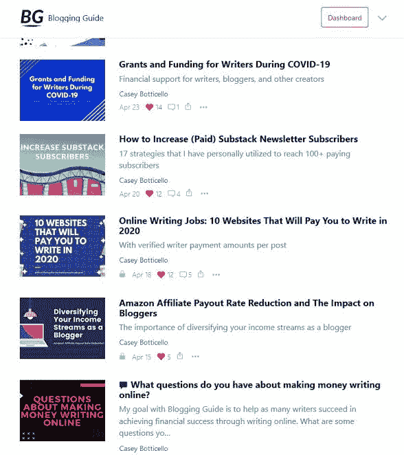
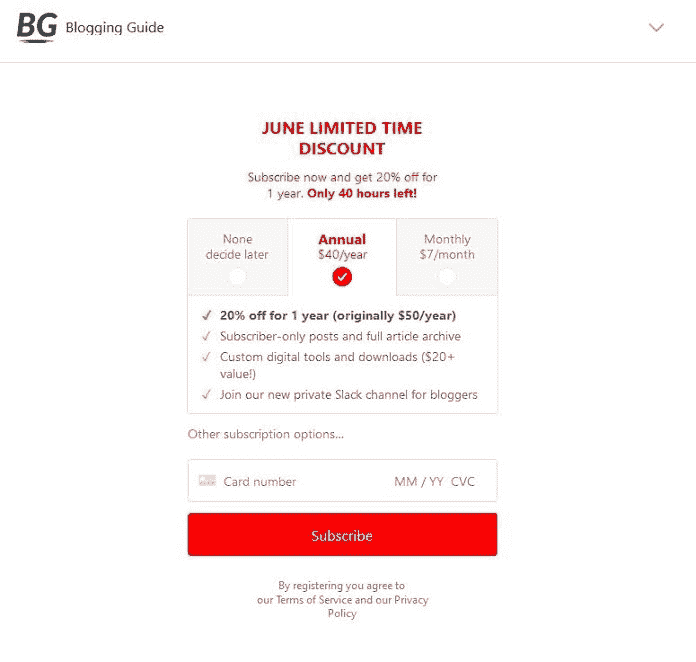

# 通过教别人做同样的事情来发展订阅时事通讯

> 原文：<https://www.indiehackers.com/interview/growing-a-subscription-newsletter-by-teaching-others-to-do-the-same-6ebf2f60b1>

## 你好！你的背景是什么，你在做什么？

我叫[凯西·波提切罗](www.caseybotticello.com)，我是一名企业家、数字营销顾问和私募股权投资者。我是战略传播公司[黑边咨询](https://blackedgeconsulting.com/)的合伙人，专门从事在线声誉管理、数字营销和危机管理。我还是加密货币联盟的创始人和前主席，这是一个致力于加密货币宣传的独立支出委员会(Super PAC)。我之前在一家科技创业公司、一家游说公司和房地产开发公司工作过。我是宾夕法尼亚大学的毕业生。

最近，我一直致力于建立一个叫做博客指南的子堆栈时事通讯和在线社区。

[博客指南](https://bloggingguide.substack.com)是一个优质的子堆栈出版物，帮助作家浏览数字出版领域，并向他们展示如何将他们的内容货币化。《博客指南》获得了 2020 年[子栈独立作家资助](https://on.substack.com/p/substacks-grant-program-recipients)。博客指南有 150 多个付费用户，大约 500 美元 MRR。

## 是什么促使你开始使用博客指南？

我一直对数字出版世界着迷。我既是一个博客写手，也是一个热心的观察者，关注任何为帮助创作者而开发的新兴平台。

成为一名博客写手最困难的事情之一是试图在模糊和过时的文章和指南的海洋中导航。[我在 Medium](https://medium.com/@caseybotticello) 上写了很多主题，但我也很好奇 Medium 这样的平台实际上是如何工作的，产品经理是如何做决定的，以及作者是如何选择他们信任的平台来托管他们的内容的。

通过我的出版物[媒体博客指南](https://medium.com/blogging-guide)，我写了一些文章，解构了在媒体上写作的每一个细节，我知道对这种类型的实用和有用的内容有进一步的需求。

我决定专注于更大的数字出版业(而不是像 Medium 这样的单一平台)，后来我创建了[博客指南简讯](https://bloggingguide.substack.com)。

不要为了金钱而浪费时间去完成类似于你的创业的任务。

TweetShare

虽然我知道我已经创作了许多针对 Medium 的有价值的内容，但我最初担心我的写作可能只有在 Medium 的合作伙伴计划下才会在财务上成功。然而，我欣赏 Substack 刚刚开始推广的商业模式，并决定在 Substack 上推出博客指南，作为时事通讯/博客的混合体，并为作家提供相关的在线社区。

## 构建最初的产品需要什么？

当我第一次有博客指南的想法时，我在媒体上兼职写作，专注于我的咨询业务，这是我大部分收入的来源。然而，我对将我的两个爱好结合起来的潜力感到兴奋:写作和创建新的业务。

虽然我最初认为我可以将许多内容从中等到次级，但我很快意识到，如果我要做一份优质简讯，这些内容都需要 100%原创。这意味着我需要为*制作大量*新内容。

因此，我开始在业余时间起草潜在的帖子，同时试图为时事通讯找出至少一个模糊的内容日历和编辑方向。

我调查了我的一些媒体读者和我主持的几个相关的[写作脸书小组](https://www.facebook.com/groups/mediumwriting)的成员，收到了很多积极的反馈。我认为接下来的步骤最好用时间表来解释。

**事件的简短时间表:**

*   *2020 年 1 月 1 日*根据读者的反馈，我认为有足够的兴趣继续撰写博客指南。
*   *2020 年 1 月 24 日*我在 Substack 上发布了博客指南。我最初并没有将时事通讯货币化。
*   *2020 年 2 月 3 日*我启用了博客指南的付费订阅。我最初计划在更长的一段时间内保持简讯 100%免费，但我对我的简讯最初收到的流量感到惊喜。
*   *2020 年 2 月 7 日*我收到了我的第一个付费订户！收到邮件通知，我惊呆了。几天前，我只写了一篇付费订阅的帖子，我认为至少需要一个月的出版时间/足够大的过期目录才能让读者考虑订阅。我对有人订阅的速度如此之快感到惊讶，*以至于我实际上给第一个订阅者发了电子邮件，以确保他们明白他们订阅的是什么*！哈哈。这个“零对一”的时刻(Substack 上没有其他新闻简报对读者访问基本上是竞争平台的内容收费)是一个真正的游戏规则改变者。这个概念起了作用，有人在我的作品中发现了价值，我可以对质量更高、更有深度的内容收费，这将仅限于那些像我一样关心数字出版平台的人。
*   *2020 年 4 月 20 日*博客指南拥有 100 名付费用户。这是一个惊人的时刻！我仍然不敢相信我这么快就达到了！我认为这是一个重要的里程碑，验证了我的通讯的概念。在整个实验所基于的“1000 个真正的粉丝理论”的背景下，我现在有 10%的方法来实现一个基于可持续激情经济的商业。

## 你的技术是什么？

就我用于博客指南的产品而言，设置实际上非常简单。

*   **子栈:**作为我的博客、电子邮件营销系统和 CRM 工具
*   **Slack:** 为付费用户创造额外的空间
*   **Gumroad:** 当会员订阅时，自动向他们分发免费的数字下载
*   **Stripe:** 是我的支付处理器(典型的 Substack 简讯)

因为所有这些都是免费产品(或者至少免费提供关键功能)，博客指南实际上不需要任何初始资金。正如我的大多数数字创业一样，这需要我投入时间。虽然我非常珍惜我的时间，但这是有利的，因为几乎没有开销，有限的财务风险，时事通讯模式是完全可扩展的，我不需要任何人来运行博客指南。

## 你是如何吸引用户和发展博客指南的？

我利用了我已经花了一年多时间培养的观众。博客指南对我来说是自然的下一步。在这之前的几个月和几年里，我有幸与许多博客作者接触并帮助他们，有效地建立了我自己的读者群。

我从 Substack 获得了一笔[写作资助，这有助于提高我的知名度，并给我的时事通讯增加了一些可信度。](https://on.substack.com/p/substacks-grant-program-recipients)

我在我的许多社交媒体平台上积极推广博客指南。这可能包括转贴关键线索产生的文章，或只是包括在各种个人资料的简历我的通讯网址。

我继续管理相关用户的在线社区(主要是我的[媒体写作脸书小组](https://www.facebook.com/groups/mediumwriting))。这些是我最大的支持者，也是我接触最多的人。

我写了一些与[相关的客座博文](https://inspirefirst.com/why-writing-on-medium-is-great-for-bloggers/)来帮助扩大我的受众，成为了一些播客的[嘉宾，并且](https://www.tgitools.com/episode/tgi-46-how-to-earn-writing-on-substack-with-casey-botticello/)[在 YouTuber 的一个频道上受到了](https://youtu.be/aZqG2ESJUaw?t=134)的特别报道，作为博客主题专家，拥有超过 150 万的追随者。

关于发展 Substack 时事通讯和将免费注册转化为付费订阅的技巧，我推荐[我写的这篇文章](https://bloggingguide.substack.com/p/how-to-increase-paid-substack-newsletter)，它非常详细地讨论了这个话题。

对于那些对创建订阅时事通讯(在任何平台上)持观望态度的人，我的总体建议是，如果你有一个不错的追随者(在任何平台或在线论坛上)或者你真的对一个利基主题充满热情，那么就试一试。

从技术上来说，订阅简讯*已经存在很长时间了，但是在没有任何技术知识的情况下，创建一个订阅简讯从来没有这么容易过。更不用说使用 Substack 这样的平台的过程比拥有单独的网站/平台(如你自己的网站、主机、正确集成到你的网站的第三方支付处理器、使用 Mailchimp 或其他一些昂贵的电子邮件营销系统等)要*无限*容易。*

订阅时事通讯不仅是赚取额外收入的好方法，而且数字出版的灵活性和可扩展性允许单个内容创作者有效地利用他们有限的时间。订阅简讯也可以作为作品集，可以用来帮助推广你的相关产品、公司，甚至是其他网站上的文章。

## 你的商业模式是什么，你是如何增加收入的？

我的商业模式相当简单。订阅者可以按月或按年付费访问我的高级时事通讯、在线社区(Slack)、我的免费数字产品，以及我经营的另一个相关时事通讯 [Canva 设计](https://canvadesign.substack.com/)的折扣。我通过时事通讯带来的新咨询客户间接赚钱。

在最初的 100%免费注册期间，我收到了很多积极的评论和反馈。当我决定将我的时事通讯货币化时，我将价格定在 Substack 允许的最低水平(每月 5 美元或每年 30 美元)。最重要的是，我为初始用户提供了 50%的折扣(所以实际上每月花费 2.5 美元，每年花费 15 美元)。

尽管这是一个非常低的价格点，但我担心很少有人会订阅，如果有的话，因为大多数作家已经不愿每月支付 5 美元或每年支付 50 美元来阅读媒体上的文章。我想我会用三个月左右的时间来测试这个低价点，看看我是否能得到一个订户。

令我惊讶的是，在我的时事通讯上启用货币化四天后，我有了第一个付费订户！

今天我在 MRR 赚了大约 500 美元。我的大多数用户都是按年订阅的，由于我运营不到一年，我不确定每年的用户流失率会是什么样的(少数按月订阅的用户流失率非常低)。

## 你未来的目标是什么？

从长远来看，我希望最终达到 1000 名全价用户。这大概就是我可以少做咨询工作，多关注我的时事通讯(以及其他创业项目)的地方。

我想我可以通过简单地继续我现在正在做的事情来实现这个目标，写一篇适度推广的时事通讯，但是这将花费比我希望的更长的时间。因此，我预计我会更多地尝试付费广告、赞助以及与其他作家合作，以帮助加速我的成长。

最主要的障碍是，我需要将我的受众扩展到远远超出原来核心的“媒体博主”受众。我的大部分专业知识都是针对特定媒体的，虽然我研究了所有主要的数字出版平台(并有许多更广泛的博客见解)，但在其他一些平台上，我并没有很高的知名度或固定的受众。

## 有没有发现什么特别有帮助或者有优势的？

我发现以下平台和产品对创建博客指南非常有帮助:

*   **子栈:**底层订阅简讯架构
*   **中:**惊人的受众覆盖和 SEO
*   **Gumroad:** 促进我的产品的数字下载
*   **松弛:**沟通
*   **概念:**内容日历、工作流和一般组织
*   **indie hacker:**作为企业家的支持和激励
*   **Canva:** 为帖子创建图像

我认为我的决心和激光焦点也是创建博客指南的主要资产。订阅时事通讯是一项长期的商业冒险，需要如此对待。我以为用户增长会比实际情况慢得多。

这可能也有助于我在过去的十年里发展了许多被动收入流，这给了我财务上的灵活性，甚至可以探索这个想法。

也可能有一些成功归因于随机时间。例如，我在全球疫情开始时推出了这项业务。许多传统企业因此被摧毁，而网络出版业(对独立作家来说，*不是*传统媒体)实际上在许多方面都蓬勃发展。

## 对于刚刚起步的独立黑客，你有什么建议？

不要因为缺乏技术技能而却步。任何人都可以通过现在可用的一套无代码工具和用户友好的软件成为成功的企业家。

完美的确是成功的敌人。这是我个人仍在努力解决的问题，但我认为人们往往会忽视这个建议。

真正直接通过写作赚钱的方式只有两种:拥有有用或有趣的内容。如果你主要关心的是赚钱，不要落入为自己写作的陷阱。

探索你能得到的每一个免费工具！我用来创建博客指南(和许多其他盈利业务)的几乎所有工具都是 100%免费的。你不需要在面向大用户的企业解决方案或软件上花费大量金钱。我发现的许多令人惊奇的免费工具实际上启发了我最终创造的。

我不是以健康为代价的“忙碌文化”的支持者。相反，成为一名企业家需要大量的时间，而且很少有益于健康的工作生活平衡。这就是为什么对你的项目的热情如此重要。做好努力的准备。不管你是否成功，你几乎肯定会投入大量的时间去探索和开发新产品或服务。

如果你主要关心的是赚钱，不要落入为自己写作的陷阱。

TweetShare

不要为了金钱而浪费时间去完成类似于你的创业的任务。例如，如果你是一名作家，想创建一份时事通讯或某种社区，随着你越来越接近成功，你会得到很多从事自由职业的机会。随着你在利基社区中的地位上升，不仅客户数量会增加，客户支付给你的费用也会增加。很多人在这一点上“出卖”,接受更高的工资，放弃他们的激情项目。这种情况我见过很多次了。如果你成功了，不要满足于高薪的自由职业。

## 我们可以去哪里了解更多？

*   你可以通过访问[博客指南](https://bloggingguide.substack.com)查看我在这篇文章中提到的 Substack 时事通讯。我也有一个相关的 Substack 简讯，名为 [Canva Design](https://canvadesign.substack.com/) ，它发送定制的 Canva 模板，可以使用 Canva 的免费软件进行编辑。此外，我还有一份关于 Substack 的免费时事通讯，名为[个人理财](https://personalfinance.substack.com/)，是我和我的好友克里斯一起写的。
*   如果你想联系我，你可以通过我的[个人网站](www.caseybotticello.com)，或者在 [Twitter](https://twitter.com/caseybotticello) 或 [LinkedIn](https://www.linkedin.com/in/caseybotticello/) 上给我发消息。
*   要阅读我写的一些东西，你可以查看我的[媒体简介](https://medium.com/@caseybotticello)和阅读[我的一些最受欢迎的文章](https://medium.com/@caseybotticello/table-of-contents-with-my-most-popular-and-useful-articles-aee32a1de0e9)。

感谢您花时间阅读本文！如果你有任何问题，请在下面的评论中告诉我。

我也总是愿意与其他企业家合作新项目，所以请随时给我发电子邮件:[【电子邮件保护】](/cdn-cgi/l/email-protection)

—[<picture id="ember5268110" class="user-avatar ember-view user-link__avatar"></picture>凯西·波提切罗](/Casey_Botticello?id=Spi9ebdFseget9GU2MHMpjLWDlj2)【博客指南创始人

## 想像博客指南一样建立自己的事业吗？

你应该加入[独立黑客社区](/)！🤗

我们是几千名创始人，互相帮助建立有利可图的业务和副业。来分享你正在做的事情，并从你的同事那里获得反馈。

还没准备好开始使用你的产品吗？没问题。这个社区是一个认识人、学习和实践的好地方。随意[随便浏览](/)！

—[<picture id="ember5268115" class="user-avatar ember-view user-link__avatar"></picture>考特兰艾伦](/csallen?id=ibTLPyjwVebnZjMGKvz6ztarnuV2)，独立黑客创始人

14votes