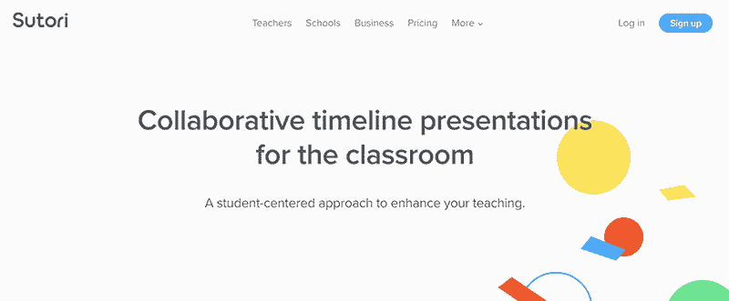
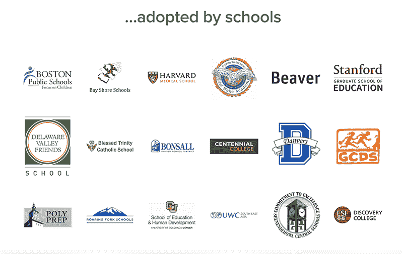
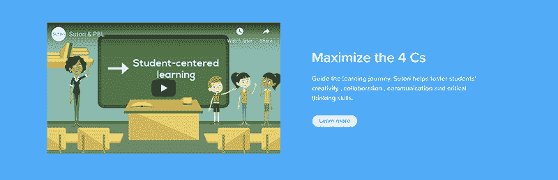

# 尽管用户市场不景气，但业务仍可持续发展

> 原文：<https://www.indiehackers.com/interview/growing-a-sustainable-business-despite-a-tough-user-market-a982af2a06>

## 你好！你的背景是什么，你在做什么？

嗨，IH！我是托马斯·凯切尔，苏托里公司的联合创始人之一。我在大学学过历史和中文，但一直想自己创业。

我的第一次是在布鲁塞尔的一家酒吧为游客爬行；谢天谢地，我最终做了更有价值的事情。我创办了 Sutori，这是一个有超过 100 万教育工作者和学生使用的教育平台。这是一个协作平台，是 Powerpoint 或谷歌幻灯片的替代品。这项业务是自给自足的，每个月大约 300 美元，我们中的三个人以此为生。

 

## 是什么促使你开始与 Sutori 合作？

这是一个相当长的故事。当时我住在中国北京，从事环保项目，同时为绿色和平组织等组织做一些社交媒体工作。当时我们对中国的空气污染越来越感到厌倦，所以我们想出了一个简单的主意。我们会在 Twitter 上重温 1952 年伦敦的大烟雾，就好像有人有一部智能手机，在事件发生时在 Twitter 上直播，同时将其与今天的空气污染进行比较。它被许多英国媒体转载，我们有成千上万的关注者和大量的印象。我们不确定它将如何演变，起初我们认为这只是一次性的幸运事件。

我们考虑过创建一个机构来提供这些一次性项目，但我们真的不想成为顾问。我们想打造自己的产品，远离 Twitter。我和学校的朋友 Yoran Brondsema(全栈开发人员)以及我的兄弟 Jonathan Ketchell(教师)一起合作。我们三个人一起开始尝试。

在中国，很多东西仍然受到审查，制作一部以历史为主题的作品没有太大意义。我们搬回欧洲，和英国的学生一起尝试了我们伟大的烟雾事件。他们真的很喜欢这些内容，我们将这些内容打包成一个垂直时间轴格式，包含视频、测验和大量精彩的图片。在得到英国和荷兰学校的一些认可后，我们认为我们能够聚集足够的兴趣来筹集一些资金。不幸的是，我们遭到了所有比利时天使投资者的拒绝，而且我们从政府获得的资助也已经用完了。我们把所有剩余的钱都投入到了一个在荷兰播放的儿童使用 [HSTRY](https://vimeo.com/86550356) 的宣传片中。

那时，我们需要做出一个决定:要么停止生产产品，要么寻找一个更容易接受教育技术的市场。

美国的一些商业天使对我们的产品感兴趣，我们能够获得足够的资金并搬到美国。在一些试点学校开始使用该工具后，我们很快意识到学生们想要创建自己的演示文稿和时间表。我们还得出结论，我们不会只用我们三个人重写整个历史课程。

所以我们做了第一个转变，目的是专注于建立一个创建工具，它将允许老师和学生创建交互式时间线。该产品在课堂上使用的早期反馈帮助我们认识到，我们必须让*用户*创造内容。这将决定公司的发展和未来的成功。

自从我们获得天使投资以来，我们在过去三年中没有获得更多的资本，因为我们只是有机增长，并专注于通过我们的用户获得收入。我们现在的收入完全可持续，并制定了一个支付计划来回报我们的投资者。

即使有像我们这样的多功能教育技术产品，我们也很难找到一个特定的预算范围。

TweetShare

## 构建最初的产品需要什么？

我们的第一个版本是作为一个静态时间线硬编码的。这是一项手工工作——我们将想法记录在电子表格上，然后 Yoran 将它添加到网站上。前端是一个 Ember 单页应用，后端是 Ruby。

我们有一些基本的互动元素，比如评论或喜欢一个帖子。我们还花钱请一位设计师为第一版设计了一些草图。我们花了大约三个月的时间完成了最初的产品，总共花费了大约 5000 美元。我们有一个经验丰富的开发人员来帮助 Yoran，但最终成本太高。由于财政原因，我们不得不尽快放弃他。

那时我们没有工资，靠在波士顿得到的小额投资生活。我们没有收入，我们的平台完全免费。尝试用 HSTRY 谋生成了我们的全职工作，但我们早期的赚钱计划并不成功。我们找不出一个可行的模型，因为我们的大多数用户告诉我们他们没有预算(他们现在仍然没有！).

 

## 你们是如何吸引用户，壮大 Sutori 的？

自从我们创立 Sutori 以来，我们一直专注于口碑和有机增长:

**1。通过电子邮件和推特**
进行冷接触当我们刚开始时，我们只有一个针对教师的测试版，并努力获得第一批用户。我们结合使用电子邮件和推文让第一批用户试用我们的产品。但是一旦他们开始在学生中使用它，我们的人数就呈指数级增长。一位老师带来了大约 20 到 25 名学生，而且人数还在不断增加。这些推文和电子邮件非常随意，我们尽最大努力向他们保证，我们正在寻求帮助他们的教学。

**2。寻找教育技术的影响者**
我们开始了解谁是教育技术领域最有影响力的博客作者，我们联系了他们中的许多人，请他们对产品进行评论。我们很幸运地得到了一些早期报道和随后的滚雪球效应。更多的用户在评论和谈论我们的产品。如果你在 Sutori 上向下滚动时间轴，你可以看到早期所有关于我们的博客文章:[https://www.sutori.com/press](https://www.sutori.com/press)。这无疑给了我们很大的帮助，帮助我们成长为几千名教师。

**3。被列为“时间线的顶级工具”**
一旦我们有了一些初步的动力，我们就会出现在[一篇在谷歌上排名很高的文章](https://elearningindustry.com/top-10-free-timeline-creation-tools-for-teachers)中——它仍然每天吸引大约 100 人注册 Sutori。这是增长的一个巨大因素。

**4。SEO 和用户生成的内容**
当你在 Sutori 上创建时间轴时，默认情况下一切都是私有的，但是有一些教师和用户将他们的工作“公开”以与社区共享。如果他们这样做了，内容就会被谷歌编入索引。由于我们有成千上万的原创内容，我们从随机搜索中获得了大量的流量。我们还允许用户在他们的网站上“嵌入”他们的 Sutori 演示文稿，然后提供 Sutori 的反向链接。

 

## 你的商业模式是什么，你是如何增加收入的？

Sutori 采用免费增值模式。我们向教师个人(99 美元)、学校(650 美元)和企业(399 美元)出售年度订阅。

在推出的前三年，我们的付费服务并不适合我们的受众。教师们已经在预算上挣扎，许多人没有从学校得到任何资金来购买技术工具。因此，我们决定追加销售我们的许多教师没有兴趣单独购买的任何功能。

最初，我们确实尝试了月度模型；但是我们很快就发现，有很多老师是先付了一个月的钱，和他们的学生一起完成一个项目，然后就取消了(而且再也不回来了)。我们取消了月度定价选项，专注于年度计划。

当我们决定限制 Sutori 的创作工具(我们提供的核心)时，我们提供了 30 天的免费试用，并将免费版本限制为基本的创作体验。从那以后，我们的数字大幅上升，使我们处于一个更好、更可持续的位置。我们花了大量的迭代和客户对话才达到这个特定的付费墙。

教育是一个很难销售的市场。当我们搬到美国后第一次开始时，我们没有意识到学校和学区仍然使用古老的购买流程。我们继续通过采购订单和支票接收学校的大部分销售。在学校或学区系统中，要获得供应商资格并准备好所有正确的文档，需要做大量的手工工作。销售周期可能很长，平均在三到六个月之间。

即使有像我们这样的多功能教育技术产品，我们也很难找到一个特定的预算范围。由于我们不提供任何内容，我们经常被分配到“数字工具”预算。目前我们已经卖给了图书馆、社会研究、ELA、科学和数学系。我们看到特许学校比公立学校更成功。

我们已经多次为学校改变了我们的增值，从简单的时间表工具转变为基于项目的学习工具，专注于 21 世纪学习的 4c。我认为我们需要做得更好，找出我们对管理员的真正价值。我们很好地满足了教师的需求，这是一个明显的价值，但买家是另一种动物，他们是一个没有太多时间的管理员。对于那些寻求购买工具的人来说，我们目前更多的是一种维生素，而不是一种直接的止痛药。

客户流失是我们持续面临的一个问题，还没有能够有效地解决它。我们的许多学校都在续订(70%)，但个别教师在一年后继续取消订阅。不幸的是，许多教师不得不自掏腰包，除非他们每月至少在课堂上使用几次 Sutori，否则他们无法证明价格的合理性。

运营 Sutori 时，我们尽量保持低成本。专注于获得启动折扣对 AWS & Stripe 这样的产品帮助很大。我们也使用对讲机和 Mailchimp，但随着用户规模的扩大，这些服务变得过于昂贵；最终，我们不得不转向更便宜的替代品，如 Crisp 和 SES。

我建议你在创业的时候尽量量入为出，除非你使用的服务对你的销售或生产力来说是真正必要的，否则没有它你也能活下去。

除非你所使用的服务对你的销售或生产力来说是真正必要的，否则你可能不需要它。

TweetShare

## 你未来的目标是什么？

我们现在处在一个陌生的地方。我们有周期性的有机增长，这推动了我们的 MRR 和用户，但我们感到停滞不前。这是因为我们已经尝试了许多不同的实验来发展和接触新的用户群，但都没有成功。我们尝试进行一些有偿收购实验，但毫无进展。

我们未来的主要目标是继续发展，并努力使我们的签约教师人数翻倍，这将使我们处于更有利的位置。我们很可能需要进行更多的实验来找出正确的通道。

## 你面临的最大挑战和克服的障碍是什么？如果你必须重新开始，你会做什么不同的事？

如果我们必须重新开始，我们肯定会从第一天开始就专注于货币化。我们花了太长时间试图增长，但没有真正考虑如何赚钱。我们早期的货币化产品并不合适，我们浪费了很多时间。我们还把筹款作为一个目标，而我们应该把重点放在增加收入上。从零开始建立这家公司是一次很好的学习经历，但我们应该更关注收入，为正确的市场创造正确的产品。

## 有没有发现什么特别有帮助或者有优势的？

在建立 Sutori 的过程中，有两位共同创始人是非常有利的；我们多样化的技能组合使我们能够真正扩大产品。作为一个远程团队，有一件事对我们有帮助，那就是有一个适当的结构——我们在短时间内(两周)为开发项目和一些长期计划工作。这个早期的习惯使我们能够保持自律，并专注于以一致的方式构建产品。

我们也很幸运，在正确的时间赶上了谷歌 Chromebooks 冲击数字教室的浪潮。考虑到我们专注于构建一个 web 应用程序(而不是像大多数公司当时所做的那样是原生的)，这是一个很好的选择——我们超过 70%的用户都在使用 Chromebook！

## 对于刚刚起步的独立黑客，你有什么建议？

我敢肯定，这个建议得到了很多人的分享，但是尽早关注你正在解决的问题。我们首先创造了一个产品，意识到它不能解决太多问题，然后设法转向；但也浪费了很多时间。尽快开始与你的客户交谈是至关重要的。不要担心有一个完美的或者设计良好的 MVP——仅仅有一个纸上的 MVP 就足够了。从第一天开始就创建一个简讯和电子邮件营销活动。这为你的追随者和潜在客户提供了透明度。

## 我们可以去哪里了解更多？

前往 www.sutori.com，在这里阅读我们的故事全文。请随时给我发电子邮件，地址是 [【电子邮件保护】](/cdn-cgi/l/email-protection#c1b5a9aeaca0b281b2b4b5aeb3a8efa2aeac) ，或者你可以在 Twitter 上找到我[@ tomketch](https://twitter.com/tomketch)——我总是很乐意谈论教育技术和在教育市场发展业务。

——[<picture id="ember5249435" class="user-avatar ember-view user-link__avatar"></picture>托马斯·凯切尔](/tomketch?id=9iZMQuAxJ2a02lpriOwJqc57BEU2)，苏托利的创始人

## 想像 Sutori 一样建立自己的事业？

你应该加入独立黑客社区！🤗

我们是几千名创始人，互相帮助建立有利可图的业务和副业。来分享你正在做的事情，并从你的同事那里获得反馈。

还没准备好开始使用你的产品吗？没问题。这个社区是一个认识人、学习和实践的好地方。随意[随便浏览](/)！

——[<picture id="ember5249440" class="user-avatar ember-view user-link__avatar"></picture>柯特兰艾伦](/csallen?id=ibTLPyjwVebnZjMGKvz6ztarnuV2)，独立黑客创始人

15votes