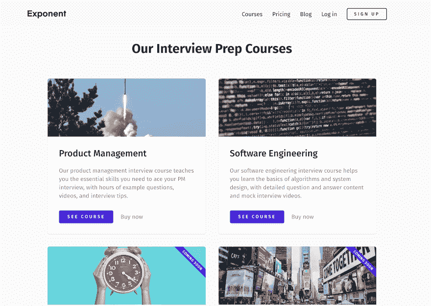
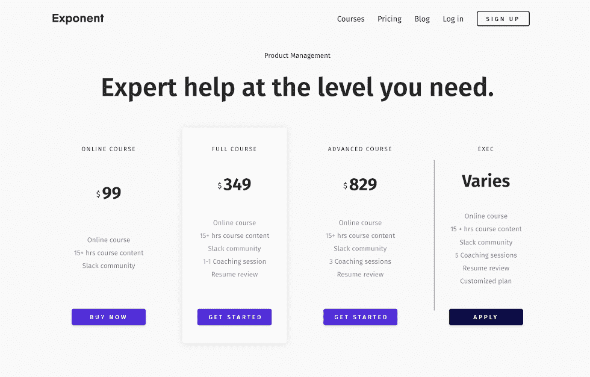
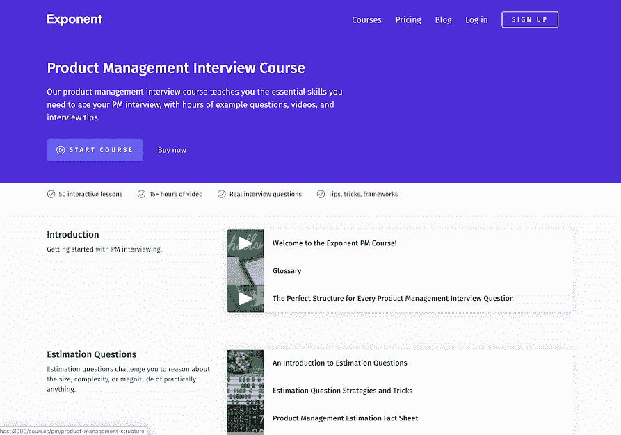

# 一年内将技术面试准备业务从 0 美元增长到 30 万美元

> 原文：<https://www.indiehackers.com/interview/growing-a-tech-interview-prep-business-from-0-to-300k-in-one-year-09d52744a4>

## 你好！你的背景是什么，你在做什么？

嗨！我是斯蒂芬，指数公司的创始人兼首席执行官，这是一个在线课程和教练平台，帮助人们找到他们梦想的技术工作。我也是前谷歌产品经理，普林斯顿计算机科学毕业生。

我和雅各布·西蒙(Jacob Simon)共同创立了这家公司，他也是普林斯顿计算机系的毕业生和软件工程师。仅在推出一年内，Exponent 就已经创造了超过 25 万美元的总收入！Jacob 和我非常兴奋地看到这一增长，这证明了我们的高质量产品和敬业的社区。

## 是什么促使你开始使用 Exponent？

在谷歌工作了一段时间后，我想尝试开始可持续的商业想法。我记得当我面试产品管理工作时，找到高质量的资源来帮助我准备面试是多么困难。我知道有机会帮助人们了解他们自己的项目经理面试，这符合我个人对辅导和指导的热情。

 

我开始以每小时 10 美元的价格辅导我在网上论坛上找到的经前综合症，看看人们是否会为这样的服务付费。随着时间的推移，我提高了教练课程的价格和质量。我在 Medium 上写了很多关于产品管理的博客，并利用它围绕我的 PM 教练建立了一个 listserv 和一个品牌。该网站的第一次迭代是一个糟糕的 Wix 网站，只是为了收集入站请求。

几个月后，我请我的朋友兼大学同学雅各布·西蒙帮忙设计网站。Jacob 建议制作一个在线课程来更好地帮助有抱负的产品经理，我们创建了 Exponent 的第一个迭代(后来命名为“PMLesson”)。

## 构建最初的产品需要什么？

咖啡因，大量的咖啡因。

我们自己启动了公司，投入了我们自己的时间和金钱来运作和建立我们的 MVP。我花了几个小时编写和修改详细的 PM 面试问题和答案，而 Jacob 花了晚上和周末设计和构建课程平台。最终，我们花了大约三个月的时间来运输最初的产品。

尽早并经常测试假设。

TweetShare

写了几篇内容之后，我们决定通过给我们的 listserv 上的一些人发电子邮件来验证这个想法，并询问他们是否愿意以 8 美元的价格购买 PDF 版本。我们从中看到的早期验证是我们完成产品构建的有益动力。

我从这次经历中得到的总体教训是:尽早并经常测试假设。通过这样做，我们能够验证哪些课程是有价值的，人们甚至会为这些课程付费，但最重要的是，感到兴奋并有动力继续努力。

我们发现像 [Fullstory](https://www.fullstory.com/) 这样的应用程序非常有助于识别用户在我们的网站上看什么，以及流程的哪些部分可能已经中断。

## 你是如何吸引用户和增长指数的？

我们在最初的产品发布会上投入了大量时间。然而，尽管我们做了很多努力，我们还是没能登上首页，我们看到只有很少一部分销售额来自它。老实说，我们并不完全确定我们的发射出了什么问题。也许它不太适合这个社区，或者我们对产品的定位不够好。我们的教训是，把所有的鸡蛋放在一个篮子里不是正确的举动。

 

从那以后，我们开发了各种策略来推动我们的产品在一系列不同渠道的采用。我把它们从最有希望到最没有希望排列如下:

*   YouTube:我们最早的一些反馈是在课程中添加视频内容，所以我开始记录自己给出的关键提示和教训。最终我们意识到人们真正想要的是模拟面试视频；本质上，完美的项目经理面试答案的例子来自脸书和谷歌这样的公司的真正的产品经理。一年后的今天，我们的 YouTube 频道已经有了 5000 名订户，并成为我们最大的流量来源之一。

*   代销商:通常，我只是简单地给一个潜在的代销商网站的创始人发封电子邮件，要求找个 30 分钟的时间聊聊天。在此基础上，我们双方评估是否有合适的人选，如果有，巩固合作关系的细节。

*   时事通讯:我们的邮件列表是我们一个重要的增长渠道。在我们的博客帖子中嵌入注册表单有助于我们增加受众，并测试新的想法和功能，比如我卖给一些客户的最初的 PDF 包。

*   SEO 和客座博文:我们用 Ghost 创建了一个公司博客，开始编写与用户在 Google 中搜索的内容相匹配的内容。我们还利用我们的博客采访了知名创始人，如 Sachin Rekhi 和 SC Moatti，这有助于提高我们的品牌认知度。虽然像这样的 SEO 努力并不是一夜之间的成功，但从长远来看，它们确实有所帮助，我们已经开始看到投资的回报。

*   社交媒体:起初，我们在社交媒体帖子上投入了大量精力，但我们一直在努力寻找这些平台上的大规模采用。

对我们来说，总的结论是倾听我们的用户，了解他们喜欢什么内容。然后，找到最符合这一点的平台，并随着时间的推移提高质量和努力。

## 你的商业模式是什么，你是如何增加收入的？

我们通过两种方式赚钱:在线课程和辅导。我们有意用免费增值的商业模式来创建我们的课程；我们希望潜在客户在购买之前看一看我们的课程，并确保它非常适合。

今年的一个巨大成功是我们与顶级 MBA 学校的合作。我们向斯坦福大学商学院和耶鲁大学管理学院等学校出售了 PM 面试课程的学生许可证。虽然他们没有产生大量的原始收入，但这些都是将我们的课程定位为高质量产品和扩大我们的用户群的绝佳方式。

| 四分之一 | 收入 |
| --- | --- |
| 2018 年第三季度 | 13483 |
| 2018 年第四季度 | 26214 |
| Q1 19 年 | 45623 |
| Q2 19 年 | 76166 |
| 2019 年第三季度 | 95631 |

## 你未来的目标是什么？

我们计划为软件工程、数据科学、产品营销管理等推出新的面试准备课程。我们已经在内部开发了许多内容，但我们也在尝试引入一些内容贡献者，在雅各布和我需要更多建议的领域帮助我们。最近，我们聘请了教练来满足这些新的职业轨迹的需求。

在我们推出新课程的同时，我们还通过与其他顶级 MBA 和本科院校建立联系来扩大我们的学校客户。我们对这些合作感到兴奋，因为学生将免费获得我们的课程，我们梦想帮助每个人准备好技术面试过程。

这个世界比我们想象的更容易被征服。今天你能做些什么来朝那个梦想迈进一步呢？

TweetShare

我们已经开发了一些新的产品，并在最近发布，您可以在这里查看:

*   [软件工程](https://www.tryexponent.com/software-engineering)
*   [数据科学](https://www.tryexponent.com/data-science)
*   [产品营销](https://www.tryexponent.com/pmm)

最后，我们准备在课程的同时推出一个全新的产品，这将真正帮助人们准备面试。该产品目前处于隐形模式，但如果您是一名有抱负的项目经理，并愿意花一个小时左右的时间与我们的团队一起测试它，请联系我们！

## 你面临的最大挑战和克服的障碍是什么？

我们的团队大多位于偏远地区，这给组织和沟通带来了很多挑战和额外的工作。最重要的是，有时在远程工作中，如果不明确登记，很难发现潜在的人际关系问题。

 

我们的团队遇到过几次这种情况，因此我们现在在整个团队中安排季度同步(这包括我们的 20 多名教练、5 多名承包商，有时还有我们的附属合作伙伴)。在每个季度会议上，我们都积极征求积极和建设性的反馈。我们发现，这些定期的虚拟签到有助于我们防止未来更严重的团队冲突。

## 有没有发现什么特别有帮助或者有优势的？

Exponent 是一个团队的努力，我们很幸运在这个过程中与这么多聪明善良的人联系在一起。我永远对我们团队中教练的出色素质印象深刻，他们提供了宝贵的产品建议，是我们不断发展的社区中不可或缺的成员。我们还带来了一些搜索引擎优化和内容创作方面的合同帮助，这大大节省了 Jacob 和我的时间，让我可以专注于产品战略。

尽早并经常获得帮助。我不知道有多少次，我与顾问或导师进行了 30 分钟的电话交谈，通过确保我们不会犯其他创始人在我们之前犯过的错误，节省了我们几周的时间。

## 对于刚刚起步的独立黑客，你有什么建议？

我认为对我有帮助的第一个习惯是“行动偏好”大多数人围坐在餐桌旁，谈论他们将在未来某一年开始的商业想法。但是这些人很少会问:“让这成为现实的下一步是什么？”这个世界比我们想象的更容易被征服。今天你能做些什么来朝那个梦想迈进一步呢？

## 我们可以去哪里了解更多？

你可以访问 [Exponent 的网站](https://www.tryexponent.com/)或者查看我们 [YouTube 频道](https://www.youtube.com/exponentTV)上的一些内容。我们还在我们的[博客](https://blog.tryexponent.com/)上发布了大量关于科技面试准备的内容。

我们希望听到你们所有人的意见！你可以在下面的评论中向我们提问👇。

—[<picture id="ember7996560" class="user-avatar ember-view user-link__avatar"></picture>斯蒂芬·科格内塔](/stervy?id=XS0MAYbhOTNovWK2hCEzXa3P7N83)【指数联合创始人

## 想像 Exponent 一样建立自己的事业？

你应该加入[独立黑客社区](/)！🤗

我们是几千名创始人，互相帮助建立有利可图的业务和副业。来分享你正在做的事情，并从你的同事那里获得反馈。

还没准备好开始使用你的产品吗？没问题。这个社区是一个认识人、学习和实践的好地方。随意[随便浏览](/)！

——[<picture id="ember7996565" class="user-avatar ember-view user-link__avatar"></picture>考特兰艾伦](/csallen?id=ibTLPyjwVebnZjMGKvz6ztarnuV2)，独立黑客创始人

27votes