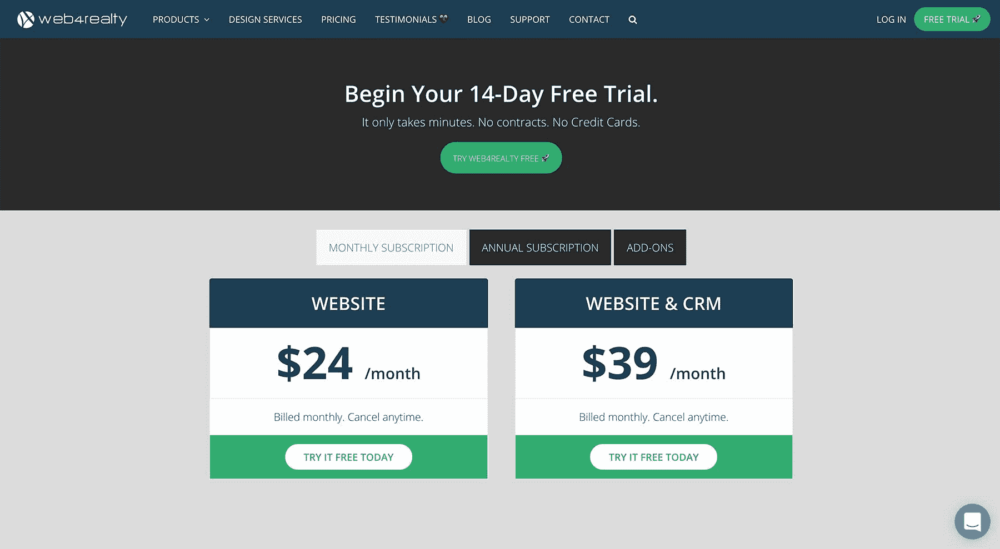
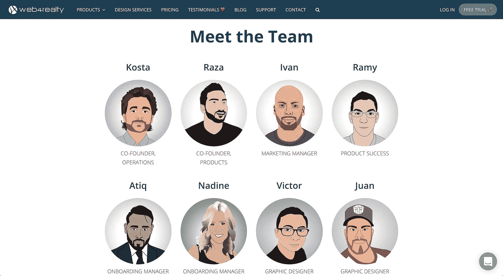

# 将房地产代理商的网络营销工具增长到每月 10 万美元

> 原文：<https://www.indiehackers.com/interview/growing-a-web-marketing-tool-for-real-estate-agents-to-100k-mo-cf121861b8>

## 你好！你的背景是什么，你在做什么？

我叫科斯塔·帕纳高利亚斯，我是 Web4Realty 的联合创始人，这是一家 SaaS 公司，为房地产经纪人提供网络营销解决方案。我们提供一套营销工具，房地产经纪人使用这些工具来管理和发展他们的业务。我们的核心产品包括网站构建器、CRM 系统和电子邮件营销平台。

我们是一家完全自力更生的公司。我们已经从我父母家地下室里的两个创始人成长为一个拥有 14 名全职团队成员的团队，遍布 6 个国家，并且我们已经拥有了数以千计的付费客户。我们的整个团队完全是远程的，分散的，没有实际的办公地点。

我拥有瑞尔森大学会计专业的商业学士学位。我不是程序员，也不是开发人员，没有任何真正的“技术”经验。我从来没有真正的公司工作。首先，我认为自己是一个企业家和商人，只是碰巧进入了软件世界！

 

## 是什么促使你开始使用 Web4Realty？

大约在我大学二年级的时候，我真的开始渴望自己做点什么。拉扎(我的联合创始人)和我每周五晚上都会聚在一起，想办法赚一百万美元。我们会努力想出一些商业点子，或者想出一种方法，让一百万人每人付给我们一美元。哪个穷小子不想成为百万富翁？！

我们的第一次互联网创业起源于一个网站，你可能还记得，叫做[百万美元主页](http://www.milliondollarhomepage.com/)。如果你对它不熟悉，一个来自英国的学生创建了一个网站，一百万像素排列在一个 1,000 x 1,000 像素的网格中。基于图像的链接售价为每像素 1 美元(10 x 10 块)。这些区块的购买者提供了他们将放置他们的标志/口号的图像，以及链接图像的 URL。百万美元主页的创建者成功地卖出了网格，并获得了 100 万美元的收入！在那之后，数以千计的克隆像素网格网站推出，没有一个曾经销售一空。

首先，我认为自己是一个企业家和商人，只是碰巧进入了软件世界！

TweetShare

我们的想法是创建一个类似的网格，有点扭曲。我们与《时代》杂志达成了一项协议，我们将在 2009 年年度人物杂志中获得两页的版面，为我们的像素网格做广告。基本上，我们向购买者提供的价值是，他们不仅会在我们网站的网格上获得空间，而且他们的徽标/口号也会出现在我们在《时代》杂志上的两页版面上。我们与时间的交易取决于我们是否出卖了电网。

正如你可能想象的那样，我们的网格没有售罄(甚至没有关闭)，但我们确实设法让一些大品牌加入进来，包括 H&M、GAP 和一些大型在线公司。我仍然认为这是一个相当不错的想法，但我们只是在执行上惨败了。

在我们的 pixel 网站失败后不久，Raza 拿到了他的房地产执照，并与我们地区一位成功的房地产经纪人合作。然后，他想为自己建立一个房地产网站，所以他开始通过几家供应商。他发现，所有这些提供商都定价过高，过时，而且看不出为一个网站花这么多钱有什么价值。

一个星期五的晚上，在我们的一次“百万美元会议”中，Raza 提到了他与这些房地产网站提供商打交道的经历。然后，我们意识到有机会以比竞争对手更低的价格提供更好的产品。那是我们的“啊哈”时刻，从那时起我们开始了 Web4Realty。

## 构建最初的产品需要什么？

我们都没有任何技术经验，更不用说软件经验，所以一切对我们来说都是陌生的。前几个月，我们花了数百个小时对商业和行业进行研究。这主要包括仔细梳理加拿大和美国的竞争对手，了解每家公司的产品、术语、定价模式等。

我一定打电话给几十个竞争对手，假装是房地产经纪人，试图尽可能多地了解每家公司，包括他们有多少用户，他们有多少员工，他们从事业务多长时间，他们的入职流程，销售流程，以及我可以挤出的任何其他信息，包括一些收入数字。如果你只是简单地问一下，你会对你可能学到的东西感到惊讶！

在尽可能多的学习之后，我们终于准备好开始开发了。我们的第一个任务是雇佣一个开发者。我们没有钱雇佣当地的开发商，所以我们很自然地决定放眼海外。我们决定从巴基斯坦开始寻找，因为 Raza 是巴基斯坦裔，会说巴基斯坦语。我们在谷歌上搜索了“巴基斯坦的 php 开发人员”,找到了我们的第一个开始开发软件的雇员，他今天仍然和我们在一起。

这段时间我刚毕业，攒了几千块钱，用来发展。我也通过经营一些博客和为小公司创建 WordPress 网站赚了一些钱。Raza 全职工作，有稳定的收入，这也有助于资助发展。大约 1.5 年后，我们终于有了一个准备上市的 MVP。这是非常基本和故障，但我们终于在业务。

 

## 你是如何吸引用户和发展 Web4Realty 的？

*开始拉客*

自从我们从第一天开始启动以来，我们必须非常节省我们的资源。实际上，我们在销售和营销上花了 0 美元，通过直接的推挤和努力，赢得了我们的第一批几百个客户。

我们很幸运处在一个收集线索信息非常容易的行业。对我们来说幸运的是，房地产经纪人到处张贴他们的电子邮件和电话号码，这非常方便。Raza 和我在最初的几个月里一直在给潜在客户打电话，不断收集更多的电子邮件地址和号码，一封接一封地发送个人营销邮件。

当时，我们在我父母的地下室工作，有时领导想亲自见我们，我们当然不想拒绝见面。所以有时候我开车穿过城市去见一个客户，只是为了结清一个 20 美元的账户。还有其他时候，我们用一个家庭成员的办公室作为自己的办公室，以满足一个潜在的客户。混乱绝对是真实的。我们在 Excel 上管理我们的销售流程——记住，我们完全盲目地全押，边走边学。我们以这种方式运营了 5-6 个月，发展到大约 200-300 名付费用户。

电子邮件营销是迄今为止吸引新业务和获得销售的最佳方式，至少对我们的目标市场是如此。

TweetShare

*引入效率*

随着我们的第一批几百名付费客户的到来，以及一些收入的到来，我们继续学习这个行业，获得更多的知识，自然地，我们的“推销”阶段开始成熟了一些。我们没有使用 Excel 来管理我们的客户和潜在客户，而是最终升级并投入了一些资金来开始使用 Salesforce。如此基本的东西，在当时对我们来说实际上是一个大动作。事实证明，它在许多不同的方面都至关重要，因为它给了我们一种结构感和稳定性，并为我们提供了一个扩展的机会，这是我们当时没有意识到的，但却是一个非常重要的垫脚石。

我们仍在使用 Gmail 发送营销电子邮件，但我们开始使用一款名为 [Toutapp](https://www1.toutapp.com/) 的应用程序来跟踪谁打开并点击了我们发送的电子邮件。因此，我们现在能够通过电子邮件来了解谁是热门和冷门销售线索，而不是随机致电销售线索。这设法提高了我们的销售效率，使我们能够大幅加快增长速度。这一小小的增长让我们雇佣了第一个销售代表，并最终开始复合我们的增长。

*营销自动化*

大约两年后，我们拥有了大约 1000 名付费客户。这是我们真正成为一家有吸引力的企业的时候了。我们的团队在成长，我们在赚钱，而且利润丰厚。到目前为止，电子邮件营销是吸引新业务和获得销售的最佳方式，至少对我们的目标市场来说是这样，所以我们决定在这一领域投入巨资。我们设置了一个营销自动化漏斗，它将从本质上培养销售线索，并为我们完成大部分销售。整合营销自动化流程需要大量的学习、策略和测试，以便将其优化到最大能力。

随着营销自动化的全面展开，我们的销售代表严格地说是“热情呼叫”，而不是冷呼叫。我们只接触了解我们产品的潜在客户，并通过电子邮件进行交流。在我们给他们打电话之前，我们就掌握了如此多的信息，这使得销售变得更加容易，我们的销售配额迅速增加，新用户也因此开始滚雪球。此外，由于这些线索随着时间的推移会自动得到培养，它开始带来更多的集客销售。

*缩放成真正的 SaaS*

目前，我们几乎所有的线索都来自我们网站的免费试用注册。虽然我们仍然做了大量的电子邮件培育工作，但我们的重点是内容营销。我们定期在公司博客上发布非常有用的内容，这些内容在搜索引擎上排名很高。这推动了每月数百次的试用注册。我们能够将近 60%的注册用户转化为付费用户。

此外，我们在付费营销渠道上几乎没花什么钱，所以那里也有我们计划探索的巨大机会和潜力。

我们当前的销售流程和对内部结构的进一步改进为我们提供了非常有效地拓展新市场的框架。

 

## 你未来的目标是什么？

我们的长期目标是在加拿大和美国的每个重要房地产市场都留下足迹。最近，我们在内部流程上投入了大量时间和资源，这将为我们提供高效扩展的平台。

我们已经在多伦多开拓了相当大的市场份额，多伦多是加拿大和美国最大的房地产市场之一。到 2018 年底，我们希望完全融入至少三个主要市场，并复制我们在多伦多的成功。

## 你面临的最大挑战和克服的障碍是什么？

*胸怀大志*

在以一种特殊的方式工作和运营了 4-5 年后，我们来到了商业旅程的十字路口。一方面，我们将继续做我们正在做的事情，以稳定的速度增长，并且非常舒适。毕竟，我们在赚钱，有利可图，过着美好的生活。另一方面，如果我们想成为这个领域的领导者，不仅是本地市场的领导者，而且是加拿大和美国的领导者，我们必须有更远大的目标。我们必须彻底改造我们的方法、我们的思维方式，当然还有我们的销售和营销流程。我们选择了后者。

这些新的远大抱负需要一些相当激烈的变革来实现，不仅从业务结构的角度来看，而且从思维的角度来看。我们花了整整 6-8 个月的时间来理解和实施这种新的工作方式。每个部门都必须改变，以便与事情的发展方向保持一致，并考虑到可伸缩性。

最具挑战性的一个方面是让我们习惯于以特定方式工作的团队改变他们的心态，并让他们与新的公司愿景保持一致。幸运的是，我们拥有世界上最有才华、最敬业的团队！

*走向远方*

我们最近克服的另一个挑战是让我们的公司完全远离。在过去的几年里，我们投入了大量时间来提高我们的内部效率和流程，尝试和测试了数十种不同的工具和应用程序，以帮助我们的生活变得更加轻松。不知不觉中，这些年来我们组织内的所有这些改进为我们成为一个 100%分布式团队铺平了道路。

不幸的是，并非所有人都能够有效地处理远程工作。它需要一定的品质，比如自律和自我激励。因为这个原因，我们不得不对我们的团队做了一些改变，但一切都变得更好了。经过两年的远程工作，我们看到了工作效率的提高，跳出框框思考和获得创造力的更多自由，更多的透明度，当然，还有一些生活方式上的优势。

*招聘*

管理一家成长中的公司的最大挑战之一是雇佣新员工。我学到的非常重要的一点是，招聘是一项真正的技能，随着经验的积累会变得更好。招聘和入职过程应该非常认真，不应该草率从事。对于一个自举式的公司来说尤其如此，他们没有能力投入时间、金钱、资源和培训给一个不会成功的新员工。一次失败的招聘可能会给一家自筹资金的初创公司造成很大的财务压力，因为它没有足够的现金来重新开始招聘过程。

## 有没有发现什么特别有帮助或者有优势的？

我认为，某些人类特征让一些企业家比其他人更有优势——职业道德和坚持不懈。这两种特质将会弥补任何可能缺乏的技能。如果没有这些特征，我们不可能在一个对我们来说如此陌生的行业中坚持这么久。

我们在我父母的地下室工作。还有其他时候，我们把一个家庭成员的办公室当成自己的。混乱绝对是真实的。

TweetShare

作为一名财务出身的人，我认为至少有一名创始人必须对你公司的账目和财务有深刻的理解。这是确保您的公司保持稳定和盈利的重要组成部分。

永远不要停止学习和教育自己，尤其是向其他在你的行业中被证明是成功的创始人学习，这一点很重要。我通过播客、Twitter、博客和像独立黑客这样的网站，不断地从同行和行业领导者那里吸收尽可能多的信息。其他创始人分享了如此多的开放和透明，这令人惊叹。这就是为什么我认为分享我的经验并回馈创业生态系统对我来说很重要的原因之一。

## 对于刚刚起步的独立黑客，你有什么建议？

我不相信 B 计划。很多人不同意我的观点，但是我相信如果你在为失败做打算，那么你几乎注定会失败。没有必要在你的头脑中灌输一点怀疑。相信你正在做的事情，不达目的不罢休。没有 B 计划！

我的商业口号是“准备，开火，瞄准”，而不是传统的“准备，瞄准，开火”。我遇到很多有抱负的企业家，他们太专注于商业规划、[形式上的](https://en.wikipedia.org/wiki/Pro_forma)和物流，而他们应该走出去与客户交谈，只是简单地启动轮子。

虽然计划当然重要，但我也认为它可能不切实际。在一家初创企业中，计划每周甚至每天都在不断变化。太多的人在太早的时候做了太多的计划，觉得他们需要详细的商业计划，结果却看到那些“计划”在他们面前告吹。

一位导师曾提出“一页战略计划”，出自[掌握洛克菲勒习惯](https://www.amazon.com/Mastering-Rockefeller-Habits-Increase-Growing/dp/0978774957)。如果你需要计划，一页纸就够了。

 

我们可以去哪里了解更多信息？

公司网站:[web4realty.com](https://web4realty.com/)个人网站:[founderviews.com](http://www.founderviews.com/)推特: [@kostapana](https://twitter.com/kostapana)

欢迎在下面的评论中问我任何问题，或者在 Twitter 上联系我！

—[<picture id="ember5307036" class="user-avatar ember-view user-link__avatar"></picture>科斯塔帕纳高利亚斯](/kostapana?id=Iueo8GncM5cau8jlbG2Ijg0PXeR2)，Web4Realty 联合创始人

## 想像 Web4Realty 一样建立自己的事业？

你应该加入独立黑客社区！🤗

我们是几千名创始人，互相帮助建立有利可图的业务和副业。来分享你正在做的事情，并从你的同事那里获得反馈。

还没准备好开始使用你的产品吗？没问题。这个社区是一个认识人、学习和实践的好地方。随意[随便浏览](/)！

——[<picture id="ember5307041" class="user-avatar ember-view user-link__avatar"></picture>柯特兰艾伦](/csallen?id=ibTLPyjwVebnZjMGKvz6ztarnuV2)，独立黑客创始人

19votes