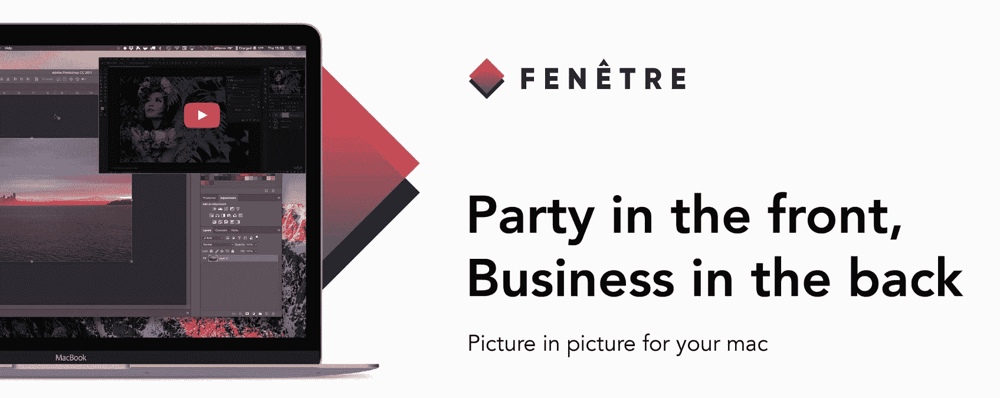
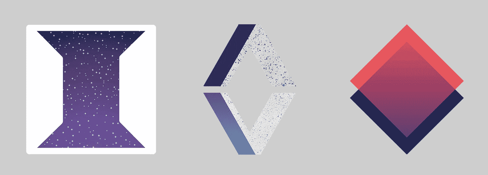
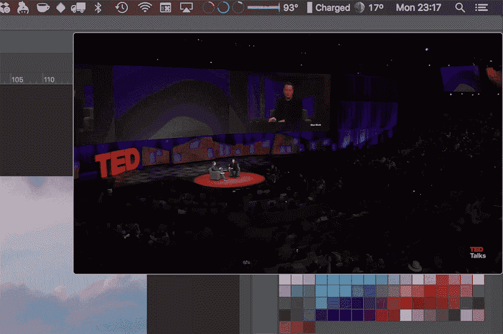
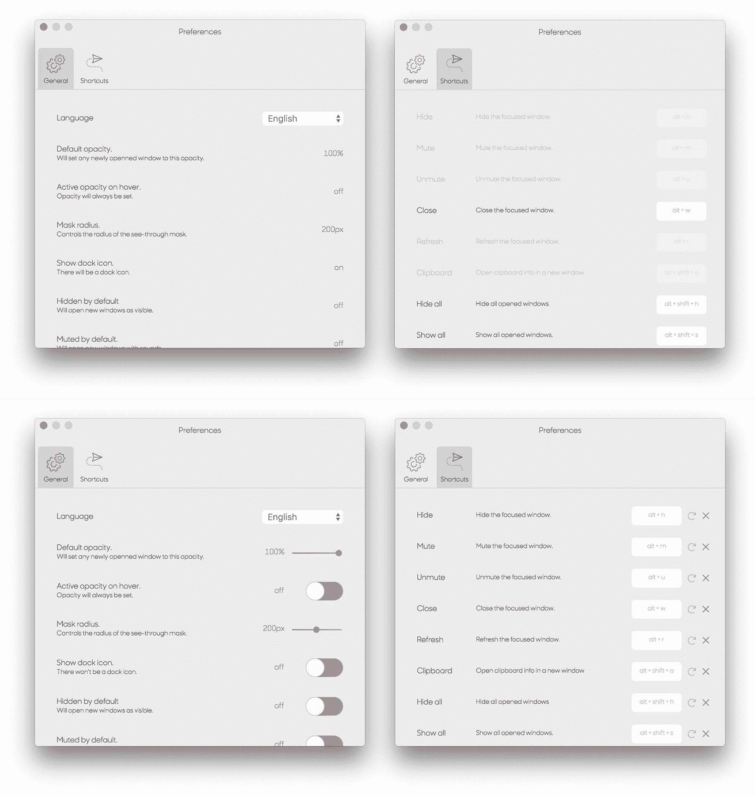
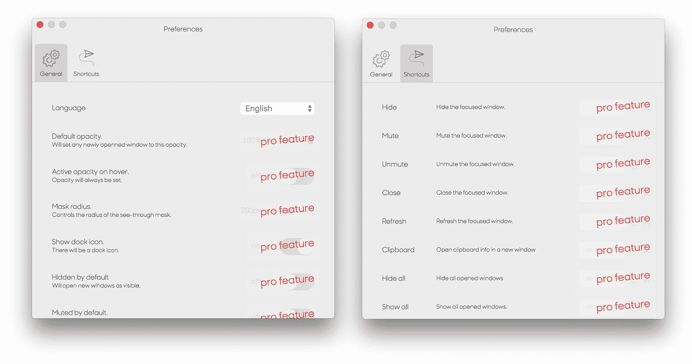

# 将用于 Mac 的窗口管理应用增加到每月 1，500 美元

> 原文：<https://www.indiehackers.com/interview/growing-a-window-management-app-for-mac-to-1-500-mo-d0a544052b>

## 你好！你的背景是什么，你在做什么？

你好！我的名字是[约恩·莫内](https://github.com/yoannmoinet)。我是蒙彼利埃 [Zendesk](https://www.zendesk.com/) 的一名法国🇫🇷高级软件工程师，从 2016 年开始在那里工作。

我从 2007 年开始写 JavaScript，2011 年在蒙特利尔广告公司 [Cossette](http://www.cossette.com) 担任 ActionScript (Flash ⚡️)开发人员，然后在 2013 年在 [Autodesk](https://www.autodesk.com/) 担任 web 应用工程师。

我在 2017 年 10 月初发布了[fenêtre](https://xn--fent-ipa.re/)《fənɛtʁ》。这是一个非常简单的应用程序，可以让你在 Mac 上更好地进行多任务处理。它为任何网站或 web 应用程序、图像、视频或平面文件启用了[画中画](https://en.wikipedia.org/wiki/Picture-in-picture)模式。

你可以在 Mac App Store 上找到免费版[和专业版](https://itunes.apple.com/us/app/fen%C3%AAtre-lite/id1288451627)。

 

它将帮助您优化您的屏幕的房地产。这对于工作时观看视频或阅读教程，同时保持主程序处于焦点位置特别有用。

在最初的两个月里，除了苹果的分成、域名费用(30%+130 美元)和几乎没有任何支持之外，我几乎赚了 3000 美元。

我通过摆弄脸书的广告定位来维持收入，写关于我使用的技术的文章(到目前为止我已经写了 5 篇)，并在 Hacker News、Reddit 和 Product Hunt 上分享所有这些。它大大增加了付费应用的入口数量。

我还有一个免费版本，通过展示 pro 功能的预览来帮助转换。

## 是什么促使你开始使用 Fenêtre？

这一切都始于 2017 年初，当时我的一位同事向我展示了 [Helium](http://heliumfloats.com/) ，这是一款非常好的软件，可以让你在所有其他东西面前有一个浮动的浏览器窗口。

在接下来的几个月里，我广泛地使用它，一边编码一边听演讲和看网飞(*请不要告诉我的老板*🙏).但是越用越沮丧。氦是失踪的一些非常利基功能，我需要的。像透明模式、加载本地文件的能力、markdown 查看器、代码高亮功能、更多嵌入和自定义快捷方式。

与此同时，我还想了解更多关于 Mac 应用程序的生态系统、打包、提交和审核循环。几个月后我要休四个月的育儿假。

行星已经排成一行了！

## 构建最初的产品需要什么？

我在 6 月份开始致力于概念验证，当时我还在 Zendesk 全职工作。晚上和我的孩子和妻子在一起后，我每天大约花 2-3 个小时在这个项目上。

我想看看我是否可以用一种我非常熟悉的技术:JavaScript，按照稳定的时间表，很快拥有一个类似的特性集。

[电子](https://electron.atom.io/)来救援(👋*仇人*)！因为我想要的主要是在一个窗口中加载一个网站，所以使用 webview 框架与**非常相关。**

在一周的在家加班和支持我怀孕的妻子后🤰🏻我有了第一个非常粗略的概念证明、一个徽标和一个最小的功能集。在发布最终应用之前，这就是我在接下来的六个月里保持动力所需要的一切。

这是一个附带项目，我没有多少资金来做。所以我尽可能的限制成本。

TweetShare

这个非常原始的截屏帮助我吸引了我的同事马克斯·威廉·尼尔森，他是碧昂斯最大的粉丝😜，并说服他为 Fenêtre 做一些设计，从 logo 开始。他跟进了网站和应用程序的设置屏幕。

这是标志的演变，从我第一次在左边尝试到 Max 最新的，最棒的一个。

 

因为这是一个副业项目，我几乎没有资金去做。所以我尽可能的限制成本。起初，我想自己处理升级和许可，但这意味着每月支付和维护基础设施。

所以我选择独家使用 App Store，它处理更新和授权非常好，占所有收入的 30%。我也在使用 GitLab 进行免费的私有库和免费的静态网站托管。

总而言之，这花了我一年 115 美元和 30%的销售额。这是细目分类:

*   苹果开发者许可证: **$99**
*   域名: **$15**
*   私有存储库: **$0**
*   托管: **$0**

我在“AppStore 上的电子”系列的第一篇文章中详细介绍了 Fenêtre [的早期创建阶段。](https://medium.com/@yoannm/pushing-electron-on-the-mac-appstore-early-stages-7dcb85936f92)

## 你是如何吸引用户并发展壮大的？

我于 10 月 5 日在三个不同的地方发布了这款应用。

*   在[产品搜寻上](https://www.producthunt.com/posts/fenetre)
*   Reddit 上有两个专门的 sub， [/r/apple](https://www.reddit.com/r/apple/comments/74vyca/i_made_a_mac_app_to_let_you_have_a_window_in/) 和 [/r/macapps](https://www.reddit.com/r/macapps/comments/74vw47/fen%C3%AAtre_picture_in_picture_for_your_mac/)
*   上[黑客新闻](https://news.ycombinator.com/item?id=15410725)

这是前六周去 fenêtére 的详细情况。

| 周 | 游客 |
| --- | --- |
| 第一周 | 998 |
| 第二周 | 189 |
| 第三周 | 70 |
| 第四周 | 30 |
| 第五周 | 28 |
| 第六周 | 30 |

这是我们同期的销售额:

| 月 | 客户 |
| --- | --- |
| 第一周 | 311 |
| 第二周 | 105 |
| 第三周 | 32 |
| 第四周 | 41 |
| 第五周 | 10 |
| 第六周 | 5 |

App Store 不让你追踪销售来自哪里，所以没有办法从网站上的点击量知道到底是谁买了这个应用。这就是为什么网站的转化率比实际销售数量高的原因。

我还把它提交给了各种各样的初创公司列表，这些列表带来的访问量很少，转化就更少了。令人惊讶的是，我提交了电子公司的应用程序列表。它不会产生那么多的访问，但转化率是惊人的。一天 10 次访问，我得到 20%的转化率。我的猜测是，观众非常专业，对我的产品感兴趣。

后来，我开始写一篇文章，讲述我在 App Store、electronic 和创建原生应用程序方面的全部经历。我有太多的话要说，结果变成了五篇不同的文章。

*   [早期阶段](https://medium.com/@yoannm/pushing-electron-on-the-mac-appstore-early-stages-7dcb85936f92):涵盖应用的概念化。
*   [痛苦&眼泪](https://medium.com/@yoannm/pushing-electron-on-the-mac-appstore-pain-tears-88414921e72d):一切与电子有关的事情，为麦克·OSX 开发都是挑战。
*   [发货](https://medium.com/@yoannm/pushing-electron-on-the-mac-appstore-ship-it-a8c6bb141ece):关于 AppStore 的 app 签名打包。
*   [走向市场](https://medium.com/@yoannm/pushing-electron-on-the-mac-appstore-go-to-market-256aed5d995a):涵盖 it 的分享和营销方面。
*   [发布后](https://medium.com/@yoannm/pushing-electron-on-the-mac-appstore-post-release-b2930a70cfb4):应用程序的生命周期，支持和更新。

它对我的应用程序的转换和可见性帮助很大。在 Reddit 和 Hacker News 等多个地方获得好评。

在[这篇与营销相关的文章](https://medium.com/@yoannm/electron-on-the-appstore-pain-tears-iv-go-to-market-256aed5d995a#e838)中，我提出了一个关于各种分享渠道的理论。它解释了你必须如何调整你的内容，以适应你最有可能通过不同渠道接触到的观众。

我也尝试过广告。目前只有谷歌和脸书，但结果已经很明显了。谷歌不会像脸书那样让你锁定你的受众。这导致广告几乎毫无用处，在谷歌网络中永远不会被点击。所以我仍然在脸书的设置上坐立不安，以尽可能有最好的目标。结果还没有真正的结论。

## 你的商业模式是什么，你是如何增加收入的？

Fenêtre 是一款免费增值应用。它有一个免费版本,在 App Store 上提供有限的功能。也有一个[专业版](https://itunes.apple.com/us/app/fen%C3%AAtre/id1286743037)会给你全套的功能。第一个月有 35%的折扣优惠，以促进销售和知名度。

免费应用程序提供了完全相同的核心功能。你可以打开一个窗口，它将停留在其他所有东西的上面。您可以打开与专业版完全相同的内容，甚至可以使用浏览器扩展来这样做。

唯一的限制是你可以打开的窗口数量:免费版只有一个，你会错过一些糖衣功能，如透视/点击功能，不透明，历史，自定义热键，剪贴板访问等。

 

为了帮助转换，免费版本通过在托盘菜单中禁用这些功能来提供对这些功能的一瞥，在它们的正下方有一个链接可以转到专业版本。

在专业版上，您可以访问所有内容:

 

在设置中，注意与专业版的区别:

 

我试着让设置更明显，但被苹果拒绝了，这是可以理解的:

 

免费增值模式的主要问题是，你依赖于固定费率，你没有任何经常性收入。如果卖不出去，你就没有收入。所以这完全取决于你的应用程序的营销和可见性。

但就目前而言，销售额正在下降:

| 月 | 收入 |
| --- | --- |
| 第一个月 | 2530 |
| 第二个月 | 377 |
| 第三个月 | 295 |
| 第 4 个月 | 193 |

## 你未来的目标是什么？

我目前正在考虑从应用程序中获得更多经常性收入的各种方法:

*   要在托盘菜单中显示的特色内容
*   与内容提供平台的伙伴关系(例如教程)
*   提高脸书广告的效率
*   运送我自己的许可和升级基础设施(不再收取 30%的 Apple 费用)
*   Windows 版本

但所有这些都需要时间，而我现在时间很紧，既要照顾孩子，又要做全职工作。

## 你面临的最大挑战和克服的障碍是什么？如果你必须重新开始，你会做什么不同的事？

我面临的最大挑战之一是技术上的。

一开始使用电子是一个很好的解决方案，因为它让我很快就能制作出一个 MVP。

但随着我越来越倾向于非常具体的功能，这也很快变成了一个麻烦。其中一些对电子来说是不可能的:

*   应用内购买，即你提供一个带有可解锁专业版的免费应用
*   将应用程序注册为系统服务(这将允许更好地与操作系统集成)
*   使用自定义方案打开特定的 URL(这对浏览器扩展非常有用)

此外，因为你是在苹果生态系统和 XCode 之外开发，很多东西都不会再免费了，比如你的应用程序的打包和签名。现在，这是一个您必须自己处理的手动过程。

回想起来，我想如果我一开始就选择 Swift 可能会更容易。而且在我有了跨平台的 app 之前，Electron 相对于一门母语并没有任何优势。

在开发阶段，我还面临许多其他的挑战。举几个例子:

*   DRM 内容
*   产品名称中的非 ASCII 字符
*   电子封装的尺寸
*   不支持的内容

我在本文中更深入地讨论了这个问题[。](https://medium.com/@yoannm/pushing-electron-on-the-mac-appstore-pain-tears-88414921e72d)

## 有没有发现什么特别有帮助或者有优势的？

由于包装和签名是如此麻烦，而且苹果公司没有很好的记录，我花了大量的时间寻找解决方案。

我发现的最有帮助的资源之一是[Feross](https://feross.org/)’[WebTorrent Github 资源库](https://github.com/webtorrent/webtorrent-desktop)，更确切地说是[打包脚本](https://github.com/webtorrent/webtorrent-desktop/blob/master/bin/package.js)。它帮助我理解了以一种苹果会接受的方式包装和签署应用程序需要什么。

在营销方面，我不知道如何在产品搜索上分享一些东西，但[他们关于产品搜索的博客文章](https://blog.producthunt.com/how-to-launch-on-product-hunt-7c1843e06399)非常有价值，帮助我在平台上写了我的文章。

另一件有助于应用程序发展的事情是我从我分享的不同平台上获得的所有反馈。它有助于针对非常边缘情况的错误和概念化的新功能。多亏了这一点，我才能够在最初发布后一周发布更新，修复了几十个我在开发过程中没有注意到的错误。

## 对于刚刚起步的独立黑客，你有什么建议？

对我来说最重要的是通过做你喜欢和相信的事情来保持动力。

如果你的想法是新的和/或不是主流，一些人会认为它不好或不可行。但这通常是因为他们从未在野外见过它，无法具体描绘出来。重要的是你能。

那是你的想法。你发现了它，自己建造了它；你知道它将如何工作；而你将是实现它的人。不要理会怀疑者的话，或者至少对其持保留态度。

对我来说最重要的是通过做你喜欢和相信的事情来保持动力。

TweetShare

一旦你准备好分享你的工作，总是积极的，愿意帮助新用户。人们一开始可能不理解，这不是一种侮辱。这并不意味着你的产品是坏的或无用的——这只是意味着他们需要帮助理解他们为什么需要它以及如何正确使用它。

制作关于 Fenêtre 的视频有助于提供现实生活中的应用实例。它展示了主要特性、最佳用例，并有助于打破僵局。

一旦你的应用公开发布，不要把任何事情看得太个人化。人们可能会很苛刻，有时会觉得自己有权享受某种高级待遇，即使事实并非如此。保持礼貌，把它们关掉。

## 我们可以去哪里了解更多？

你可以通过我的[个人网站](https://yoannmoi.net)联系到我。我也可以在[推特](https://twitter.com/yoannm)上找到我，在那里我愿意讨论任何事情。

你也可以在 [GitHub](https://github.com/yoannmoinet) 上找到我的开源作品，或者在 [Medium](http://medium.com/@yoannm) 上关注我(在那里你可以读到更多关于 [Fenêtre](https://medium.com/@yoannm/pushing-electron-on-the-mac-appstore-early-stages-7dcb85936f92) 的内容)。关于产品本身的详细信息，网站是最好的资源。

我正要开始一项新的副业。这一次，它将是一个带有 React Native 的移动应用程序。但是我有点担心时间管理。你如何在全职工作、家庭和多个兼职项目之间管理你的时间？我做过一次，发现了一些小技巧，但是现在我又多了一个宝宝，又多了一个项目要处理。

——[<picture id="ember5316727" class="user-avatar ember-view user-link__avatar"></picture>yoan Moinet](/Yoann?id=1GSx2HnfSPTp2cf2pYyugElaTD82)，Fenêtre 创始人

## 想像 Fenêtre 一样建立自己的事业？

你应该加入[独立黑客社区](/)！🤗

我们是几千名创始人，互相帮助建立有利可图的业务和副业。来分享你正在做的事情，并从你的同事那里获得反馈。

还没准备好开始使用你的产品吗？没问题。这个社区是一个认识人、学习和实践的好地方。随意[随便浏览](/)！

—[<picture id="ember5316732" class="user-avatar ember-view user-link__avatar"></picture>考特兰艾伦](/csallen?id=ibTLPyjwVebnZjMGKvz6ztarnuV2)，独立黑客创始人

39votes