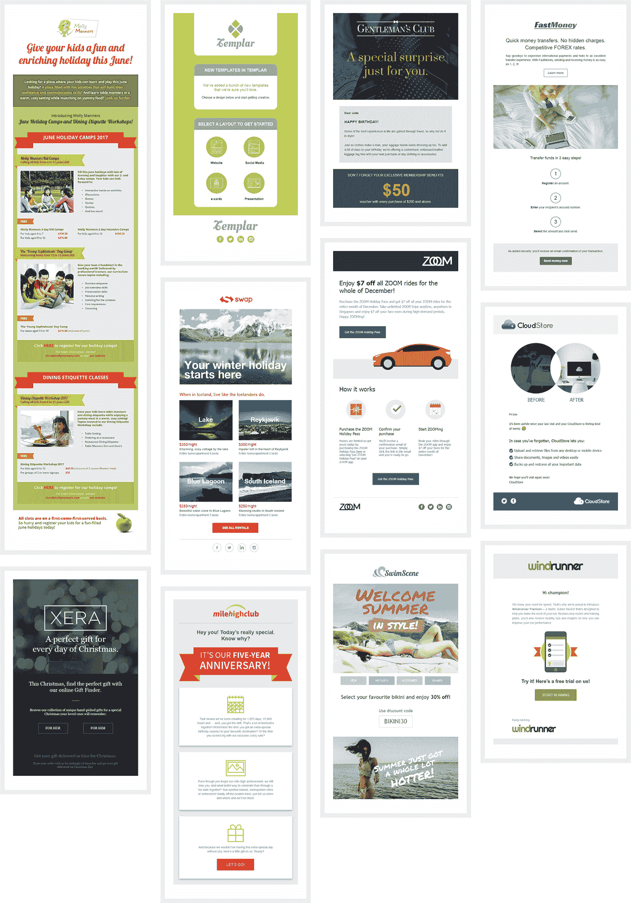

# 开发一款应用程序，将电子邮件营销简化到每月 1，500 美元

> 原文：<https://www.indiehackers.com/interview/growing-an-app-that-simplifies-email-marketing-to-1-500-mo-849c9a7a28>

## 你好！你的背景是什么，你在做什么？

嗨，我们是 Shevon 和 Chris，我们是 [BuildMyEmails](https://BuildMyEmails.com) 的创建者。此前，Shevon 是一家创意机构的艺术总监，负责营销和品牌推广活动。Chris 曾在金融行业担任 IT 专家。我们边喝边聊，发现我们可以为了一个共同的目标好好利用我们的综合技能。BuildMyEmails 就是这样诞生的。

本质上，BuildMyEmails 是一个面向企业的电子邮件开发工具。这意味着，我们编写、设计和编码营销电子邮件，以便企业发送到他们的数据库。

我们处理从内容创建和模板设计到针对每个平台和设备的电子邮件测试和编码的一切事务。通过自动化整个流程，我们还保持了较低的成本。这通过我们的低价格和有竞争力的包装转化为我们的客户。

如今，BuildMyEmails 每月产生约 1500 美元的收入。

 

## 是什么促使你开始使用 BuildMyEmails？

[BuildMyEmails](https://BuildMyEmails.com) 的想法确实受到了数字时代的启发。电子邮件营销仍然是最成功的数字营销形式之一。不幸的是，许多公司没有意识到这一点，也没有充分利用它的潜力。因此，我们想创造一些东西，鼓励公司采用电子邮件营销作为他们的关键营销工具之一。

那时，我在一家设计公司工作，而克里斯在一家金融机构工作。尽管我们各自都取得了成就，但我们都积极寻求摆脱工作，开创自己的事业。但是，那时候我们还不是很熟。

碰巧我有一个自由职业客户需要调整他们的内部沟通。和这个客户一起工作让我意识到公司是多么需要这项服务。不仅仅是小企业，就像我合作的客户这样的跨国公司也是如此。就在那时，我决定和克里斯聊聊。

如果你今天能完成，就不要把事情留到明天。就像耐克说的，做就是了。

TweetShare

我们开始考虑这个想法，我们所能提供的东西真的让我们大吃一惊。我们最初的计划只是创建一个平台，公司可以购买标准模板。但是我们谈得越多，就越意识到公司不只是外包他们的电子邮件营销——他们外包*所有的营销工作。*

没有多少公司拥有内部创意或数字团队。这意味着他们会在电子邮件开发过程中的某个时候需要帮助，无论是在内容、设计还是编码方面。然后他们会转向第三方供应商。但是所有这些都是额外的时间、压力和金钱。

有了这个认识，我们决定 BuildMyEmails 是一个值得探索的可行项目。此外，鉴于我在品牌、营销和设计方面的丰富经验，以及 Chris 在数据安全方面的专业知识，我们已经有了一个赢家。

## 构建最初的产品需要什么？

当我们第一次开始构建 [BuildMyEmails](https://BuildMyEmails.com) 时，我们决定只需要最基本的东西作为开始。因此，我们为初始设置设定了大约 5000 美元的保守预算。一旦我们知道我们需要多少，克里斯打了几个电话，和他的朋友和家人交谈，询问他们是否有兴趣资助 BuildMyEmails。总之，我们设法筹集了 3 万多美元。

由于我们的目标从一开始就是在自动化电子邮件营销平台(如 MailChimp)和设计机构之间架起一座桥梁，因此我们寻找能够支持这一目标的最佳系统。经过几次尝试，我们决定采用 Laravel 框架。

为了构建实际的系统，我们采访了许多开发人员，寻找那些熟悉 Laravel 并且足够熟练来创建我们想要的特性的人。这个过程差点害死我们。

如果事情变糟，你只能随波逐流。它发生了。但永远不要让它让你沮丧。

TweetShare

许多公司没有意识到的是，找到合适的人需要花费大量的时间和精力。长话短说，我们最终以自由职业者的身份雇佣了两名开发人员。我们决心尽一切努力留住他们。在我们经历了这些之后，我们真的不想每 6 个月就去寻找和培训一个人。

在建立这个系统的时候，我们认为如果整个过程都是自动化的，那将是一个很大的好处，所以我们把它加入到我们的计划中。最后，三个月后，我们推出了 BuildMyEmails。尽管网站现在已经启动并运行，但我们仍在发展和改进系统，增加新的自动化功能。

## 你是如何吸引用户和增加 BuildMyEmails 的？

我们知道最困难的部分是接触企业并从竞争中脱颖而出。这就是为什么我们要将自己与所有其他提供电子邮件营销服务的公司区分开来。

考虑到这一点，我们创建了我们的网站来突出我们的 USPs(独特的销售主张)并展示我们的服务。这导致通过该网站进行了几次查询。但是后来我们遇到了一个问题:很多人还是不了解我们业务的真实性质。所以这是回到绘图板和重写网站的内容，以便它会一目了然地显示我们提供了什么。

什么都不会按计划进行。如果你正在创业，确保你的后备计划有后备计划。

TweetShare

首先，我们将自己与 MailChimp 等邮件服务提供商区分开来。我们还改变了各个部分的标题，以清楚地说明我们的客户会得到什么。最后，我们从头到尾演示了整个过程。

完成后，我们向我们的数据库发送了一封电子邮件。我们还决定利用不同的社交媒体平台，如脸书、Twitter 和 LinkedIn，来传播这个消息。除了为 [BuildMyEmails](https://BuildMyEmails.com) 创建账户，我们还加入了 LinkedIn 群组和电子邮件营销人员论坛。我们定期在电子邮件营销上发布材料，以确立我们在行业中的思想领袖地位，并提高我们的声誉。接下来，我们上网研究展示新技术创业的合法团体，比如独立黑客！

理解了内容的力量，我们也开始创建高质量的、有洞察力的博客文章来提升我们的搜索引擎优化和谷歌排名。虽然花了一些时间，但是我们的努力得到了回报。现在，我们在电子邮件营销的搜索结果中排名很高。

[

建立我的邮件组合](https://BuildMyEmails.com/portfolio) 

## 你的商业模式是什么，你是如何增加收入的？

我们真正感到兴奋的一件事是，客户可以选择只购买他们需要的东西。我们的主要业务是为公司开发营销电子邮件。但并不是每个公司都想定期开展电子邮件营销活动(尽管这是我们努力的方向)。因此，我们决定采用一种灵活的支付模式，用户可以决定他们是想要一封电子邮件还是多封电子邮件，是一次性的还是长期的。额外的好处是，他们订购的电子邮件越多，就越便宜。

我们早在 2015 年就开始这样做了，到目前为止，效果很好。我们每月收入 1500 美元，我们的目标是到 2020 年达到 370 万美元，我们对这个目标感觉非常好。我们充满信心的原因是自动化。如果可以自动化，我们拒绝手工做任何事情。这就是[建立我的邮件](https://BuildMyEmails.com)的愿景。

如果你没有远见，你的想法就不会转化为收入。

TweetShare

此外，我们对风险采取相当保守的态度。我们不会强求我们力所不及的东西。我们保持脚踏实地，我们总是为最坏的情况做准备。现在，除了建立我的邮件，我们还在为客户做其他事情。然而，BuildMyEmails 是我们的主要业务，我们希望发展它并使其盈利，这样我们就可以继续建设其他创新项目。

如前所述，价格是我们的一个关键卖点。自从我们开始以来，我们没有增加任何价格。我们对常规设计机构的电子邮件营销收费做了深入研究，我们已经将收费降低到市场价格的三分之一。我们认为我们的价格很有竞争力，所以不会再便宜了。我们真的不想打价格战。另外，我们需要赚点利润。也就是说，我们可能会在未来稍微提高我们的利率。但不会超过 10%，因为我们仍然希望 BuildMyEmails 成为最实惠的电子邮件营销服务。

总的来说，这对我们来说还不错。我们目前平均每个月有 2 个客户，每周发一封邮件，每封邮件 350-400 美元。每个客户有 4 封邮件。除此之外，我们每周还有大约 2 个临时客户。

## 你面临的最大挑战和克服的障碍是什么？

我们最近才意识到的一件事是，我们应该早点这样做。如果我们没有拖延，只是着手去做，我们会在很久以前就建立这个系统，它现在可能做得很好。所以，如果你今天能完成，就不要把事情留到明天。就像耐克说的，做就是了。

我们在这个过程中学到的另一个教训是，没有事情会按计划进行。如果你正在创业，确保你的后备计划有后备计划。

也就是说，这是一次很好的经历。我们犯了很多错误，但我们也从中吸取了很多教训，这有助于我们更快地实施变革。

## 你最大的优势是什么？有什么特别有用的吗？

我们最大的优势大概就是经验。Shevon 在品牌和营销方面的专业知识为 [BuildMyEmails](https://BuildMyEmails.com) 提供了战略方向，而 Chris 在数据安全方面的技能帮助确保了我们系统的完整性。

随着时间的推移，我们还成功地聚集了一批才华横溢的文案、设计师和程序员，他们在自己的工作领域拥有多年的经验，并有记录为证。

## 对于刚刚起步的独立黑客，你有什么建议？

三件事——第一件是坚持你的想法并坚持到底。听起来很老套，但你真的是自己命运的主人。如果事情变糟，你只能随波逐流。它发生了。但永远不要让它让你沮丧。关键是继续前进。只要你做了，你就会进步。

其次，每天留出一些时间来思考你的想法。你的计划可能已经很棒了，但是把它分解，重新组合，然后再分解。如果你没有远见，你的想法就不会转化为收入。通过从各个角度审视你的计划并认真思考，你可能会顿悟并“发现了！”更好的时刻到了。

最后，一定要知道所有的事情。没有所谓的信息太多或信息错误。你在为人们制造产品，在这之前，你需要了解他们是如何工作的。所以让每天都成为一个学习的过程，尽可能多的吸收。你知道的越多，你就能更好地计划。

## 我们可以去哪里了解更多？

查看我们在[https://buildmyemails.com](https://buildmyemails.com)的服务，或者访问我们在[http://blog.buildmyemails.com](http://blog.buildmyemails.com)的博客，了解与电子邮件营销相关的任何事情。你也可以通过[脸书](https://www.facebook.com/buildmyemails)和[推特](https://twitter.com/buildmyemails?lang=en)与我们取得联系。或者你可以在下面的评论中问我们。

—[<picture id="ember5202807" class="user-avatar ember-view user-link__avatar"></picture>Shevon Perera](/buildmyemails?id=bSCeGv87zcbbsZs4BSuDDmzhOUs1)，BuildMyEmails 的创建者

## 想像 BuildMyEmails 一样建立自己的事业？

你应该加入独立黑客社区！🤗

我们是几千名创始人，互相帮助建立有利可图的业务和副业。来分享你正在做的事情，并从你的同事那里获得反馈。

还没准备好开始使用你的产品吗？没问题。这个社区是一个认识人、学习和实践的好地方。随意[随便浏览](/)！

—[<picture id="ember5202812" class="user-avatar ember-view user-link__avatar"></picture>考特兰艾伦](/csallen?id=ibTLPyjwVebnZjMGKvz6ztarnuV2)，独立黑客创始人

4votes