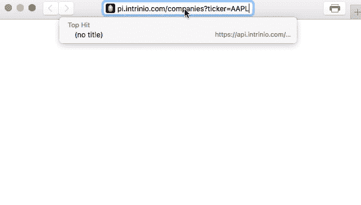
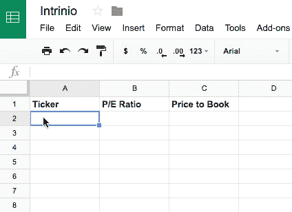

# 通过保持活力、价格合理和平易近人来实现增长

> 原文：<https://www.indiehackers.com/interview/growing-by-staying-scrappy-affordable-and-approachable-f9698c811a>

## 你的背景和工作是什么？

我叫 Andrew Carpenter，我在科罗拉多州立大学学习的是工业/组织心理学，在科罗拉多大学学习的是商业分析。我的使命是结合这两个领域，商业数据的研究和商业人的研究，产生使人成功的商业流程。

我在 Intrinio 担任人力资源分析总监，它给了我这样做的机会。2015 年，我作为第四名员工加入 Intrinio。从那以后，我帮助创建了公司需要扩展的销售、支持、人力资源和营销基础设施。

Intrinio 在[金融科技市场](https://intrinio.com/marketplace/data)提供金融数据和分析这些数据的应用。我们的用户平均分为使用[我们的 API](https://intrinio.com/tutorial/web_api) (应用编程接口)为投资者构建应用的开发者和使用这些应用做出投资决策的投资者。在我们开发的内部系统的帮助下，我们已经成功扩展到超过 10，000 个用户，并且我们目前每天接纳 50-60 个用户。

我的希望是，通过这次采访，我可以揭示一些业务流程和工具，让我们用一个非常小的团队来处理如此大的工作量。他们帮助我们从 2016 年每月收入 10，000 美元的初创公司成长为用户每天进行 500 万次 API 调用的规模化企业。

 

## Intrinio 如何开始的背后有什么故事？

乔伊·弗伦奇和瑞秋·卡彭特(我妹妹)在 2012 年创立了 Intrinio。他们都有金融背景，认为应该有一种方法来自动进行金融分析。他们开始开发一个应用程序，只需按一下按钮就能对股票进行估值。

然而，当他们去金融数据提供商那里寻找支持应用程序的数据时，报价是每月 5 万美元。

当时他们没有资金，所以每年花 60 万美元购买数据是不可能的。

我们的团队经历了我们的平台解决的所有问题。

TweetShare

相反，他们决定为自己获取数据，并在 2012 年至 2013 年学习编码，以便直接从 SEC 获取数据。在这个过程中，他们意识到他们收集的数据比他们原来的应用程序更有价值，所以他们放弃了应用程序开发，开始考虑如何出售数据。

## 是什么说服你加入的？

乔伊和瑞秋对数据提供商很不满，他们的愤怒也影响到了我。

让普通人做出良好投资决策的应用并不多，因为初创应用开发者无法获得构建创新工具所需的数据。结果是穷人无法学会为自己投资，因为只有“专业人士”才能负担得起了解市场所需的培训和工具。

由于我们已经有了数据，我们最终建立了最初的自动化投资应用程序的想法，但到了 2015 年，数据成为了焦点，所以我们免费提供了这个应用程序。今天，我们保持财务数据的可负担性和易访问性，特别是对独立开发者而言。

## 构建最初的产品需要什么？

我们在 2012-2015 年期间筹集了 50 万美元，这在金融数据行业是很小的一笔钱。这些钱来自几个在金融行业有经验的人，他们直接知道金融数据有多昂贵。他们明白问题所在——金融专业的学生、个人投资者和开发人员无法访问数据。

这笔资金帮助支付了 AWS 服务器、一个小办公室和一些外包开发工作，直到我们的团队真正学会了如何编码。

在 [RokkinCat](http://www.rokkincat.com) 的外包开发人员使用 Ruby Padrino 将存放我们财务数据的后端数据库与[的 API](https://intrinio.com/tutorial/web_api) 连接起来，开发人员可以在那里使用这些数据。在内部，我们与 HTML 和 CSS 合作建立了一个网站，用户可以通过 [Stripe](https://stripe.com) 注册和支付，以及 Visual Basic 为投资者制作一个 [Excel 插件](https://intrinio.com/tutorial/excel)。

在那个时候，我们筹集的资金刚刚够建立一个 MVP(最低可行产品)。然而，它一开始卖得并不好，所以我们团队的大多数人都在[葡萄酒麦当娜](http://winemadonna.com)找了份调酒师的工作来维持生计。我们中的两个人住在一艘帆船上；还有两个住在工作室里。

如果我们只是想解决一个问题，我们两年前就会退出。我们正试图纠正一个错误。

TweetShare

这是艰难的时期，但它使我们能够“引导”更多的平台，因为我们保持了低成本。如果我们筹集了大量资金，我们将不得不收取高昂的费用来证明资金的合理性，这与我们的目标背道而驰。

到 2015 年年中，也就是开始的三年多后，我们拥有了数据平台的基础。开发者可以订阅我们的 API 并开发应用程序，投资者可以订阅并分析 Excel 或 Google Sheets 中的数据。

 

## 你在哪里找到你的第一批顾客？你是如何从那里成长起来的？

一开始，我们不知道如何获得牵引力。没有人像我们这样卖数据。相对于竞争对手，我们的价格非常低，以至于我们的潜在客户(独立投资者和开发商)不知道如何使用我们的服务。他们甚至没有寻找解决方案，因为他们认为财务数据是负担不起的。

我们没有任何资金来教育公众，我们只有少量的网络流量。

解决方案是聊天支持，我们在 2015 年末使用[对讲机](https://www.intercom.com)将其添加到网站中。对讲机让我们给网站上的访问者发信息，也让那些访问者向我们提问。团队中的每个人都有全天候的聊天功能，我们开始回答关于我们产品的问题，使我们的服务更容易使用。

也许 20 次对话中有 1 次会促成销售，但 20 次对话中有 20 次会带来有用的信息。

TweetShare

我们也开始问自己的问题:

*   你怎么找到我们的？
*   你喜欢《T2》里的《T3》的什么？
*   你讨厌什么？
*   我们应该添加什么？

我们很快了解到，如果你非常友好和乐于助人，网站访问者会回报你。诀窍是没有生活——你实际上必须从早到晚都在那里抓住用户的问题。也许 20 次对话中有 1 次会促成销售，但 20 次对话中有 20 次会带来有用的信息。

随着开发人员将用户反馈整合到平台中，团队的其他成员将目标对准了问答网站和聊天室，开发人员说他们在那里找到了我们。我们开始在 [Quora](https://www.quora.com) 、 [Reddit](https://www.reddit.com) 、 [Stack Overflow](http://stackoverflow.com) 和社交媒体论坛上发帖，令我们惊讶的是，潜在用户真的在询问我们的产品。

这种方法对 Intrinio 来说确实很有效(并将继续有效)，但它需要我们的营销人员在他们的岗位上付出认真的努力。如果你用低质量的帖子浪费人们的时间，并且没有找到真正适用于你的产品的论坛和用户问题，你将得不偿失。这些网站擅长剔除不遵守规则的营销人员。如果你真诚地发帖，并确保你在帮助别人，你会得到越来越多的流量。

如果你想让你的流量增长得更快，建立[谷歌分析](https://analytics.google.com)并尝试不同的网站。从一个来源检查你的流量，贴几天，然后再检查。要科学。坚持生产的来源，放弃不生产的渠道。

| 月 | 维护、修理和更换 |
| --- | --- |
| 十一月 | 8 |
| 十二月 | 3 |
| 一月 | 22 |
| 二月（February 的缩写） | 15 |
| 瑕疵 | 81 |
| 四月 | 100 |
| 五月 | 146 |
| 六月 | 68 |
| 七月 | 58 |
| 八月 | 110 |
| 九月 | 114 |
| 十月 | 186 |
| 十一月 | 134 |
| 十二月 | 95 |
| 一月 | 169 |
| 二月（February 的缩写） | 144 |
| 瑕疵 | 167 |
| 四月 | 200 |
| 五月 | 277 |
| 六月 | 266 |
| 七月 | 289 |
| 八月 | 461 |
| 九月 | 411 |
| 十月 | 388 |
| 十一月 | 377 |
| 十二月 | 534 |
| 一月 | 995 |
| 二月（February 的缩写） | 1103 |
| 瑕疵 | 1114 |
| 四月 | 999 |
| 五月 | 1303 |

## 你的商业模式是什么，你是如何增加收入的？

为了履行我们的使命，让从初创公司到学生的每个人都能负担得起财务数据，我们提供了大量数据。

我们有一个免费增值模式，每个注册的人都可以免费获得基本的收入/资产负债表、经济、新闻发布和基本的公司数据。通过提供数据，我们让用户开始与我们互动变得非常容易。我想这就是为什么我们每天都有这么多注册的原因——我们的免费产品实际上非常有用，而其他提供商却为此收取很高的费用。

我们也给初创公司 6 个月的免费数据。考虑到我们自己尝试构建一个应用程序却负担不起数据的经历，这感觉棒极了。到目前为止，我们已经有 70 多家初创公司参与了该计划，我们预计到 2017 年底将成为佛罗里达州最大的金融科技孵化器。

这种商业模式增加了收入，因为初创公司会毫不犹豫地注册一个免费程序，我们也不会花很多时间试图向他们推销。在为期六个月的项目结束后，许多初创公司最终向 Intrinio 支付了数据费用。他们可以免费测试他们的应用程序，如果他们成功了，我们不会提高他们的费用。这有助于培养忠诚的顾客。

我们商业模式的另一个独特方面是，我们没有合同，我们试图将实际价格保持在低得离谱的水平。这也有助于我们的高容量。

如果你不从事金融工作，不打扰客户和拥有优惠价格听起来并不是一个新概念，但它肯定没有在金融科技领域出现过。我们的用户可以订阅他们需要的数据，我们的条款和价格对普通人来说是有意义的。我们不会从每个用户身上赚很多钱，但这正是我们打算做的，所以没关系。

我们仍然向所有人提供免费聊天支持。我在两年内与用户进行了 2500 次对话。我们团队的其他人也有同样多的经历。这可能会令人筋疲力尽，但当你的平台很复杂，需要一些时间来学习时，这是值得的。从一个好的、有知识的团队成员那里得到一个快速的答案是忠诚用户和离开用户的区别。

除了对讲机，我们使用的另一个伟大的工具是 [Pipedrive](https://www.pipedrive.com) 。它的预算很少，而且它非常适合跟踪我们从与用户聊天中获得的潜在销售线索。每个企业都应该以适合其产品和市场的方式进行销售，但使用 CRM(客户关系管理)工具，通过跟踪您赢得和失去的销售交易，可以更容易地找出哪些有效，哪些无效。

## 你未来的目标是什么？

这个问题的简短答案是，我们的目标是通过试验新的营销渠道来增加我们的网络流量。我们召集团队，集思广益，列出用户可能在的数字地点，使用谷歌分析工具构建图表，显示我们从这些来源获得的流量，然后开始发布和衡量结果。如果一个来源产生了低跳出率的好流量，我们就去追踪它。如果没有，我们就放弃。

从一个来源检查你的流量，贴几天，然后再检查。要科学。

TweetShare

这个问题的长答案是，我们使用业务数据来确定我们的目标应该是什么。我们的客户都经历了非常相似的旅程。他们找到我们(网络点击率)，创建帐户(免费注册)，使用免费产品(活跃用户)，订阅付费产品(付费客户)。我的商业分析培训给了我测量每个步骤的流量和转化率所需的技能。

我们知道我们获得了多少网络点击率，有多少变成了免费注册用户，等等，一直到付费用户。在旅程的每个阶段，流量和转化率都很高，所以我们的重点是获得更多的流量。以下是我们的数据来源:

*   [谷歌分析 API](https://developers.google.com/analytics/devguides/reporting/core/v4) :网络流量
*   [对讲 API](https://developers.intercom.com/v2.0/reference) :免费用户量和点击量转化
*   [对讲 API](https://developers.intercom.com/v2.0/reference) :活跃*用户量和自由*用户转化**
*   [Stripe API](https://stripe.com/docs/api) :付费*用户量和活跃*用户转化
**   [Pipedrive API](https://developers.pipedrive.com/docs/api/v1) :销量*

 *使用这些工具不仅能为我们节省资金，还能让我们跟踪销售、营销和支持，从而衡量我们在公司目标上的进展。

## 你克服的最大挑战是什么？

我们克服的最明显的挑战是无法访问财务数据。解决这一挑战成了我们的全部任务。

我认为，独立黑客注意到一个问题，并开始为处于相同情况的其他人提供解决方案的业务是很常见的。与 Intrinio 的不同之处在于，我们最终免费提供了最初的解决方案，因为我们在构建它时面临的其他挑战被证明是更好的产品。

从运营的角度来看，直到我们系统地了解了我们的工作方式，我们才看到我们的平台真正实现了。我们尝试雇佣聪明、有经验、高薪的人来“做销售”或“做营销”。他们失败了，因为他们习惯了在成熟的企业中工作。他们可以管理其他人，但他们无法管理自己。

对我们来说，唯一有效的方法就是写下我们的过程。以下是一些看似微不足道但实际有效的例子:

1.  如何支持用户
2.  如何在社交媒体上发帖
3.  如何进行销售

一旦我们开始为我们正在做的所有事情编写流程，我们就意识到我们正在做的一些工作并不需要完成。然后我们开始雇人“执行销售流程”和“执行支持用户流程”。这些新员工之所以成功，是因为他们有一套工作体系。

我希望我们一开始就这样做了。当只有你们四个人的时候，以这种方式经营企业是很烦人的，但它给了我们清晰的思路和发展的途径。

## 有什么特别有帮助或有利的事情吗？

愤怒是内在联系的一个巨大优势。

我们的团队经历了我们的平台解决的所有问题:我们是没有学习金融所需数据的学生，没有我们应用程序数据的开发者，以及因为我们无法获得数据进行分析而支付高额费用的投资者。我们疯了，这让我们经历了商业模式的痛苦演变。

[

Intrinio 团队疯狂至极。](https://intrinio.com) 

如果我们只是想解决一个问题，我们两年前就会退出。我们正试图纠正一个错误。

从实际的角度来看，没有大量的资金已经把我们变成了一个精简、吝啬的数据机器。我们必须斗志昂扬；断断续续地添加到我们的平台，而不是构建一个全面的解决方案。这使得我们的平台不同于其他数据提供商，并且最终更加实惠，因为我们对它进行了大量的引导。

没有资金意味着我们转向易于实施的销售、营销、支付和支持工具。我们使用的每个业务工具都有一个 API，这意味着我们可以提取自己的业务数据，并用它来跟踪公司的目标。具有优秀 API 的工具通常有对初创公司有意义的定价计划，这意味着如果你的企业规模小，你的成本就小。

## 对于刚刚起步的独立黑客，你有什么建议？

与你的用户交流。不要外包这个。强大的支持通过与网站访问者展开对话来推动你的销售努力。它通过从少量用户那里获得反馈来推动开发工作。它推动了营销，因为你将确定你的网络流量的来源。

我在两年内与用户进行了 2500 次对话。我们团队的其他人也有同样多的经历。

TweetShare

使用具有优秀 API 的工具来构建您的业务运营——如果您刚刚起步，Stripe、Intercom、Pipedrive 和 Google Analytics 都是免费或接近免费的。他们也给你指标。作为一个小型的独立开发者并不意味着你不应该像一个大企业一样思考你的 KPI(关键性能指标)。

如果你有那些工具，或者类似的工具，你就不用花钱做营销了。通过跟踪你的帖子在问答网站上的影响，你可以产生更大的影响，因为用户已经在那里寻找你的产品了。

以下是一些非常有用的资源:

谷歌分析查询浏览器(Google Analytics Query Explorer):如果你以前从未使用过 API，谷歌的是最容易学习的。他们的文档非常好。一旦你学会了用程序分析你的网络流量，你就可以分析你业务的任何部分。查询浏览器向您展示了什么是可能的。我们如此喜欢它，以至于我们建立了自己的[API explorer](https://intrinio.com/api-explorer)。

[领导力管道](https://www.amazon.com/Leadership-Pipeline-Build-Powered-Company/dp/0470894563/ref=sr_1_1?s=electronics&ie=UTF8&qid=1495048810&sr=8-1&keywords=the+leadership+pipeline):如果你的目标是扩大业务规模，你需要人才。这本书解释了为什么管理自己所需的技能与管理他人所需的技能不同。

[优势](https://www.amazon.com/Advantage-Organizational-Health-Everything-Business/dp/0470941529/ref=sr_1_1?s=books&ie=UTF8&qid=1495048927&sr=1-1&keywords=the+advantage+book):独立黑客通常会逃离朝九晚五的企业。这本书解释了如何让你的成长中的组织变得清晰，这样你就不会犯同样的错误，你试图通过自己创业来避免这些错误。

Stripe API :我们模仿了 Stripe 的 API 文档，因为它很容易使用。在这里学习阅读 API 文档。如果你真的读了它，你会开始像黑客一样思考，并找出如何自动化你的竞争对手雇佣昂贵员工的业务部分。

## 我们可以去哪里了解更多？

你可以在我们的网站上了解 [Intrinio，如果你在 LinkedIn](https://intrinio.com) 上查看我，你可以看到我出版的一些书。[我们的博客](http://blog.intrinio.com)是学习如何使用 API 的好地方。我们也在推特上: [@Intrinio](https://twitter.com/intrinio?ref_src=twsrc%5Egoogle%7Ctwcamp%5Eserp%7Ctwgr%5Eauthor) 。

如果你评论这篇文章，我可以回答更多关于 Intrinio 如何系统化我们的业务的深入问题。

最后，我要感谢科特兰对我的面试。独立黑客和 Intrinio 有着相似的使命。我们都想让独立开发者帮助解决各种用户的问题。如果我能以任何方式帮助你或你的企业，请随时给我发信息，地址: [【电子邮件受保护】](/cdn-cgi/l/email-protection#244547455654414a504156644d4a50564d4a4d4b0a474b49) 。

—[<picture id="ember5250747" class="user-avatar ember-view user-link__avatar"></picture>Intrinio](/Intrinio?id=sTq3m1ncKBREVzZEOKRity7u73W2)，Intrinio 的创建者

## 想像 Intrinio 一样建立自己的事业？

你应该加入独立黑客社区！🤗

我们是几千名创始人，互相帮助建立有利可图的业务和副业。来分享你正在做的事情，并从你的同事那里获得反馈。

还没准备好开始使用你的产品吗？没问题。这个社区是一个认识人、学习和实践的好地方。随意[随便浏览](/)！

——[<picture id="ember5250752" class="user-avatar ember-view user-link__avatar"></picture>柯特兰艾伦](/csallen?id=ibTLPyjwVebnZjMGKvz6ztarnuV2)，独立黑客创始人

10votes*