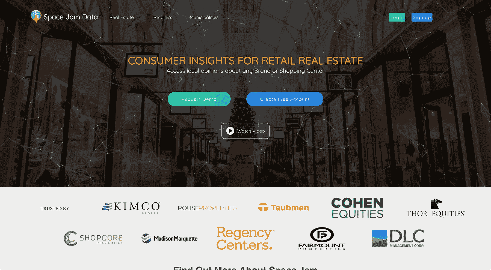

# 将我的 B2B 房地产众包工具增长到每月 2.5 万美元

> 原文：<https://www.indiehackers.com/interview/growing-my-b2b-real-estate-crowdsourcing-tool-to-25k-mo-de9023f078>

## 你好！你的背景是什么，你在做什么？

嘿科特兰！我是[杰克·克兰西](https://twitter.com/jack_clancy93),[太空堵塞数据](http://spacejamdata.com)的联合创始人。在全职工作于 Space Jam 之前，我是作为一名自由前端开发人员参加南加州大学的。

目前，我是 Space Jam Data 的首席技术官，这是一个房地产众包工具，允许零售房地产专业人士与当地购物者进行自然对话，并衡量他们对某些类型零售商的愿望。

Space Jam 使用地理定位社交媒体广告来收集特定中心的数据。然后，我们使用专有的 [NLP](https://en.wikipedia.org/wiki/Natural_language_processing) 管道来分析原始文本数据，并将其汇总到仪表板中，供我们的客户进行分析。我们主要与各种房地产公司合作，他们使用我们的工具来帮助通知他们的零售租赁工作和客户体验管理。

从 Space Jam 成立到现在已经接近两年了，我们现在和美国多家最大的 [REITs](https://en.wikipedia.org/wiki/Real_estate_investment_trust) 和房地产私募公司合作，收入超过 2 万/月。

 

## 是什么促使你开始研究太空堵塞数据？

当我在上海留学的时候，我和我的一个同学，Benji Cohen 成为了好朋友。我们经常因为对技术及其在社会中的作用的共同兴趣而联系在一起。

回家后我们一直保持联系，回到美国大约六个月后，Benji 联系我关于[太空堵塞数据](http://spacejamdata.com)的想法。他在旧金山工作，是巴布森学院孵化器 a(“国外科技学期”)的一部分。在《太空堵塞》之前，我对商业地产一无所知，但 Benji 是在商业地产根深蒂固的影响下长大的。

我们不是一个传统的团队。我们是一群完全未经证实的应届大学毕业生，攻击最难的 B2B 行业之一。

TweetShare

我们验证产品的第一步是看看是否有人会对我们提供的数据集感兴趣。我们联系了许多我们认为可能感兴趣的公司，免费向他们提供了该产品的早期版本。人们对数据集表现出兴趣，因此我们着手使围绕该数据集的产品更加强大，以便我们的客户能够提取更多价值。

我们花了将近六个月的时间反复研究技术和产品，与我们想要的客户密切合作，为他们创造一些有价值的东西。直到我们让他们相信有投资回报，我们才开始要钱。

对我来说，这似乎是一种非常非传统的创业方式，但我们并不是一个传统的团队。我们是一群完全未经证实的应届大学毕业生，攻击最难的 B2B 行业之一。

我认为我从这次经历中学到的最大的东西是，成功获得你的第一笔销售没有一成不变的方法——它取决于各种特定行业的情况。

房地产(尤其是商业房地产)在很大程度上是一个非常老派的行业。

## 构建最初的产品需要什么？

前六到九个月的工作是为了验证我们提供的产品和数据集。我们把所有的时间都花在了构建/改进我们的技术或寻找销售线索上。在这个最初的验证期，我们没有向任何用户要钱，只是为了帮助我们改进产品。

我们试图在工程方面尽可能地精益。我们产品的最初几次迭代是伪装成 web 应用程序的硬编码 HTML 页面。我们还开始通过 Excel 手动收集数据，这非常耗时。

一旦我们觉得我们已经实现了产品与市场的契合，我们就开始通过引入另一名工程师 Orson 来扩大我们的工程资源，他专门研究数据，并帮助我们建立了 NLP 管道。幸运的是，在太空堵塞出现时，我们都在大学，这为我们提供了财政支持和足够的时间来致力于这个项目。

## 你是如何吸引用户和增长空间堵塞数据的？

我认为自从我们以高度迭代的方式构建产品以来，我们从未有过正式的发布，但可能是[太空堵塞](http://spacejamdata.com)早期最重要的时刻是收到我们的第一张财产报告支票。

作为一个企业应用，我们的用户获取过程看起来与消费者面对的完全不同。我们的用户数量也低得多，但我们的 VPAU(每活跃用户价值)高得多。

用户获取可能是创业最难的方面之一。

TweetShare

我们使用的两个最有效的用户获取策略是:

1.  提供冷领导自由空间堵塞报告，让关系开始，并从那里向上销售。
2.  利用关系网把我们想卖给的人介绍给他们。

对于那些正在考虑如何吸引用户到他们不断增长的业务中的有抱负的企业家，我建议尽可能地坚持和耐心。用户获取可能是创业最难的方面之一。找到对你有用的东西，然后跟着它跑。

## 你的商业模式是什么，你是如何增加收入的？

我们通过向客户收取他们众包数据的每一笔费用来赚钱。

当我们第一次开始使用[空间堵塞数据](http://spacejamdata.com)时，我们会制作免费的数据报告，不要求任何回报就能接触到潜在客户。在客户开始看到数据报告的价值后，他们同意为未来的报告付费。这种“抽样”策略非常有效，我们仍然在我们的销售周期中使用它。

我们的定价策略真的没有那么科学。我们通过与客户的持续协商，确定了一个价格点，同时为我们自己提供了合理的利润。

从第一天开始，做一些你可以赚钱的东西，然后让你的客户为你的成长买单。

TweetShare

今天，我们每月大约赚 20，000 美元，我们希望这个数字还会增长。假设第一年的收入基数较低，我们经历了接近 232%的同比收入增长率。关于我们的收入增长，最令人兴奋的是，通过每笔交易，我们同时通过聚合更多数据来增加我们的企业价值。

收入增长归因于但不限于以下因素:

1.  客户信任:我们作为一个企业存在的时间越长，我们的客户就越相信我们会继续创新并帮助他们。时间也为投资回报案例研究和我们市场的口碑传播创造了机会。
2.  改进/更新:我们的大多数产品更新都是由客户的反馈推动的。每当我们有市场驱动的产品更新时，我们确保与潜在客户分享，这通常有助于我们的销售。
3.  缩短学习曲线:一旦你开始获得更多的经验，许多试图销售产品的耗时耗力的过程就会减少或消失。

 

以下是一些更高层次的数据点:

1.  平均每个客户 10，000 美元
2.  我们大约 40%的客户是在纽约证券交易所(T3)上市的 T2 公司
3.  收入同比增长 232%
4.  毛利率:在 50-60%之间

建议:在深思熟虑和持续行动之间找到健康的平衡。从第一天开始，做一些你可以赚钱的东西，然后让你的客户为你的成长买单。如果你坚持不懈地努力工作，大量的机会就会出现。

## 你未来的目标是什么？

我们目前正在努力减少报告创建过程中所需的人工干预，这将是我们在运营方面向前迈出的一大步。

这是通过构建一个内部应用程序来实现的，该应用程序将监控并帮助自动化我们运营工作流程的每一步。

对我个人来说，另一个重要的里程碑是年收入超过 100 万美元。不过，要做到这一点还有很长的路要走。:)

## 如果你必须重新开始，你会做什么不同的事？

[Space Jam Data](http://spacejamdata.com) 可能是我经历过的最伟大的学习旅程之一，也绝对是最自我导向的。

我希望我们一开始就有更多的技术专长。一开始我是一个巨大的 00b，这导致了很多糟糕的工程选择，拖了我们很长一段时间。幸运的是，我们保持积极的态度，我试着从我犯的错误中学到尽可能多的东西。

时至今日，我们面向客户的平台和内部平台比以往任何时候都更加健壮，容错能力也更强。知道自己已经成长为一名工程师，这给了我一种非常大的成就感，但还有很长的路要走。

## 有没有发现什么特别有帮助或者有优势的？

我们在开始时做了许多好的和坏的决定，但我将从坏的开始:我们花了很多时间来构建我们认为很棒的复杂功能，但我们的最终用户并没有真正找到帮助。但是在生活中，我们从错误中学习。

现在，在编写一行代码之前，我们会验证我们集成到面向客户的平台中的每个功能，以便尝试和优化我们的工程资源。

在深思熟虑的思考和持续的行动之间保持健康的平衡。

TweetShare

我认为，在初创公司，最重要的习惯之一是持续沟通的文化。我们的懈怠几乎从不沉默，它有助于保持每个人的积极性和步调一致。

这对许多人来说是一个惊喜，但我们相信对我们的业务最有帮助的外部市场趋势之一是亚马逊在零售市场日益增长的主导地位。随着全国各地的房地产业主越来越担心他们的业务被电子商务蚕食，这迫使他们在决策时变得更加以数据为导向和分析性，因为一个糟糕的租赁可能会导致他们走上破产的道路。

## 对于刚刚起步的独立黑客，你有什么建议？

我认为人们越来越理解初始验证过程，但是我看到人们犯的一个大错误是过度设计/构建他们的初始产品。

保持范围尽可能小，不要担心从一开始就构建完美的代码库。您的业务需求和功能在开始时会处于不断变化的状态，所以要保持简单。正如保罗·格拉厄姆的名言，“做不可扩展的事情。”

## 我们可以去哪里了解更多？

网址:[http://spacejamdata.com](http://spacejamdata.com)推特:【https://twitter.com/jack_clancy93】T2，[https://twitter.com/benjicohen421](https://twitter.com/benjicohen421)邮箱: [【邮箱受保护】jamdata.com](/cdn-cgi/l/email-protection#e68c87858da695968785838c878b82879287c885898b)

如果你对空间堵塞有任何问题，请告诉我们！

—[<picture id="ember5317156" class="user-avatar ember-view user-link__avatar"></picture>杰克克兰西](/jackc?id=VPOhwJXy7aXA4BG5aZbUkIGqxGY2)【空间堵塞数据的创建者

## 想像空间堵塞数据一样建立自己的事业？

你应该加入独立黑客社区！🤗

我们是几千名创始人，互相帮助建立有利可图的业务和副业。来分享你正在做的事情，并从你的同事那里获得反馈。

还没准备好开始使用你的产品吗？没问题。这个社区是一个认识人、学习和实践的好地方。随意[随便浏览](/)！

——[<picture id="ember5317161" class="user-avatar ember-view user-link__avatar"></picture>柯特兰艾伦](/csallen?id=ibTLPyjwVebnZjMGKvz6ztarnuV2)，独立黑客创始人

7votes