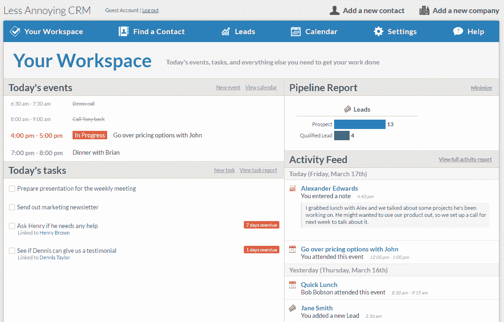
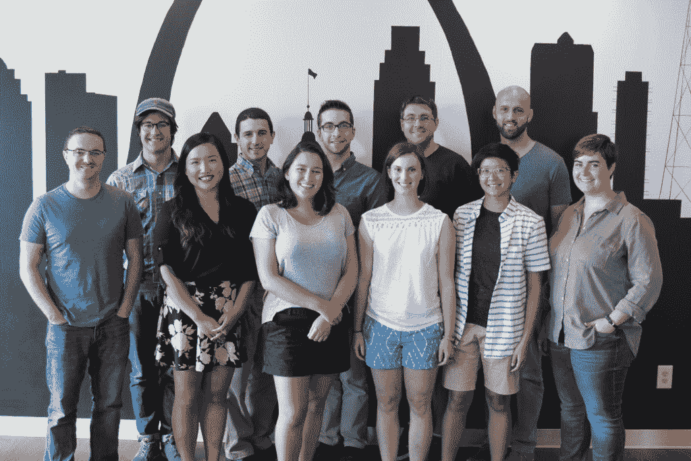

# 在别人争先恐后的时候保持耐心，发展我的业务

> 原文：<https://www.indiehackers.com/interview/growing-my-business-by-being-patient-where-others-might-rush-1e92c5d297>

## 你好！你的背景是什么，你在做什么？

嗨！我叫泰勒，是[不那么烦人的 CRM](https://www.lessannoyingcrm.com) (简称 LACRM)的 CEO/联合创始人。我的背景是软件开发和产品设计，但自从创办 LACRM 以来，我发现自己什么都做一点。

LACRM 是一家位于密苏里州圣路易斯的 SaaS 公司。我们专门为小型企业制作了一个简单的客户关系管理器。你可能知道，有无数的 CRM 公司，所以竞争是激烈的，但这也是一个巨大的市场，所以每个人最终都会找到自己的位置。对我们来说，有两件事让我们与众不同:

首先，我们的设计关注产品的最终用户(销售代表、支持代表等)。)而不是经理/高管。我们专注于制造人们愿意使用的产品，即使这会以自动化和报告为代价，而这正是高层通常想要的。一般来说，如果一家公司足够大，以至于负责购买 CRM 软件的人不会亲自使用它，我们就会失去这笔生意。

其次，我们在客户支持方面投入巨资。这意味着年龄较大、不太懂技术或者不想自己解决问题的客户更愿意与我们合作。

我和哥哥布雷肯在 2009 年创办了 LACRM。我们的团队现在有 11 个人(今年晚些时候还会有两个人加入)，我们每月从 12，000 名付费用户那里获得约 120，000 美元的经常性收入。(我们的产品成本是 10 美元/用户/月，所以计算起来很简单。)

## 你是如何开始从事不那么烦人的 CRM 的背后有什么故事？

我最终来到这里几乎完全是个错误。我在大学主修计算机科学，在最后一年，一个高中朋友说服我加入了他在犹他州工作的一家风投支持的初创公司。我对创业完全没有兴趣，但它看起来像是一家即将起飞的有前途的公司，所以我冒险加入了。大约一年后，资金枯竭，公司几乎所有人都被解雇了(那是 2008 年，所以这种情况到处都在发生)。我在组织结构图的最底层，所以我是他们能留住的少数人之一。

接下来的一年，我参加了一个疯狂的创业速成班，因为公司里所有比我级别高的人都被解雇了，包括首席执行官。和其他一些在裁员中幸存下来的低层员工一起，我基本上可以为公司做任何我想做的事情。我们不知道该做什么，所以我们只是尝试商业模式，直到最终我们能够让公司盈利。有一天我意识到我在扮演一个企业家的角色，我很喜欢。我觉得自己开公司会更好。

我和我的兄弟布莱肯一起做了很多兼职项目，我知道我们合作得很好。我哥哥是我见过的最有才华的人。一天，他向我提出了一个想法，让我开发一个应用程序，让人们在股市上进行虚拟交易，并跟踪他们的表现。我不在乎这个想法，时间，或者其他任何东西。我们立即同意开办公司。那之后不久我就辞职了。

没多久我就意识到股票交易应用程序是个坏主意。这真的很难赚钱，而且可能会有一些我们不想处理的监管混乱。因此，我们想出了一个应用程序来自动更新小型企业网站的想法。我们认为那也不好。最后，我们集思广益，反复考虑了很多不同的想法，最终确定了一个我们都喜欢的想法。

在我之前的创业公司，我建立了一个小的内部 CRM 来帮助我们的经销商跟踪他们推荐给我们的客户。这些经销商大多是独立的保险代理人，当他们看到我建立的 CRM 时，他们欣喜若狂。他们中的许多人以前从未听说过 CRM，并喜欢它对他们的帮助。我有为那家初创公司组建 Salesforce 的经验，知道这有多复杂。这些经历让我和布雷肯有了一个共同的想法:不那么烦人的 CRM。

## 构建和发布最初的产品需要什么？

布雷肯和我一起拥有制造产品所需的所有技能。他做 DevOps 和后端开发，我做设计和全栈开发。

我很清楚人们想从我在以前公司与保险代理人共事的经历中得到什么，这让我们可以在客户研究方面走一些捷径。我们只是拼凑了一些粗略的模型，然后埋头编码，直到 MVP 完成。我们花了大约三个月的时间组装了一个基本的 PHP/MySQL/jQuery web 应用程序，我们认为它足够好，有人愿意为它付费。当然，我们最终会知道所有我们做错的事情，但是我们有足够的东西是正确的，我们能够开始销售最初的产品。

鉴于我们的背景，产品是容易的部分。最难的是其他的事情。我们根本不知道如何获得顾客。我们不知道我们需要考虑哪些法律和会计要求。一开始我们甚至不知道公司会设在哪里。(最终我搬到了旧金山，而布雷肯在波士顿，我们只是远程工作。)

如果说在过去的 7.5 年里我学到了什么，那就是没有什么是容易的，魔法子弹是不存在的。

TweetShare

也许我们要解决的最大问题是钱。在我之前的创业公司，我看到了风险投资的阴暗面，所以我知道自举是唯一的选择，但我们仍然必须支付账单。这意味着我和布莱肯各自兼职做其他工作，这样我们就可以支付自己的生活费用以及运营拉克姆的最低成本。这种情况持续了大约 3.5 年，我们才能够用 LACRM 的收入养活自己。最初几年，他是一名全日制博士生，然后加入了波士顿的一家生物技术创业公司。我很幸运地从上一家咨询/承包公司得到了一份每周约 20 小时的工作，在我们等待 LACRM 起飞的时候，我还和妈妈一起开了一个美食博客来贴补收入。

我不想撒谎，在尝试创办 LACRM 的同时做其他工作是很艰难的。我只想把我所有的精力都放在拉克姆身上，但我负担不起。这意味着最初的启动和最初几年的业务比预期的要慢。但在我看来，这种交换是非常值得的。

## 为了不那么烦人的 CRM，你用过哪些找客户的策略？

这里涉及的内容很多。我可能应该首先说，我们没有为[不那么烦人的 CRM](https://www.lessannoyingcrm.com) 本身“发布”。没有博客帖子或黑客新闻提交。我们没有希望收到电子邮件的人的名单。我甚至不认为我在我的个人社交网站上发布过这件事。

在公司的整个历史中，我们从来没有一件单独的事情能一下子带来有意义的新客户激增。(我们曾经几次登上 HN 的顶峰，但它实际上并没有为我们做任何事情。)在过去的七年半时间里，这是一场令人难以置信的缓慢沸腾，我预计这种情况将无限期持续下去。

当我们开始时，我们没有任何真正的营销策略，但我们认为我们可以通过 Adwords 在网站上吸引一些眼球。我们意识到我们仍在学习，投资回报率可能会很糟糕，但我们没有任何更好的想法。尽管我们对投资回报率的预测是正确的，但我们实际上能够承受一小部分最终成为付费用户的访问者。6 个月后，我们有 6 个付费用户，一年后有 47 个，一年半后有 200 个。我们不擅长营销，所以这是一个非常缓慢的过程，但最终我们积累了足够的动力，看起来这个业务可能会成功。

| 月 | 收入 |
| --- | --- |
| 一月 | 0 |
| 四月 | 4 |
| 七月 | 9 |
| 十月 | 19 |
| 一月 | 47 |
| 四月 | 115 |
| 七月 | 200 |
| 十月 | 376 |
| 一月 | 584 |
| 四月 | 745 |
| 七月 | 1048 |
| 十月 | 1243 |
| 一月 | 1476 |
| 四月 | 2017 |
| 七月 | 2535 |
| 十月 | 2933 |
| 一月 | 3391 |
| 四月 | 3941 |
| 七月 | 4489 |
| 十月 | 5162 |
| 一月 | 5714 |
| 四月 | 6480 |
| 七月 | 6996 |
| 十月 | 7394 |
| 一月 | 7923 |
| 四月 | 9011 |
| 七月 | 9835 |
| 十月 | 10793 |
| 一月 | 11297 |

这就是缓慢但稳定增长的样子。

我在这个过程中学到了两个没人想听的关键事情:

**先有**，获客渠道来来去去。Adwords 一度是我们唯一的流量来源，但它变得越来越贵，直到我们不得不完全停止使用它。大约在那个时候，Chrome 网上商店开始兴起。这太棒了，因为我们得到了大量的线索，而且它们是 100%免费的，但是谷歌忽略了这个项目，它最终变得无关紧要。如果你还没有准备好，这将是一场情感的过山车。

现在我意识到，让多个不同的渠道并行运行是非常重要的，而且你总是需要寻找下一个东西，因为你当前的渠道不会永远有效。目前，我们从博客、电子邮件简讯、应用程序目录、潜在客户生成公司(不是垃圾邮件类型的东西，更像是我们和感兴趣的买家之间的媒人)和许多其他东西中获得客户。知道我们不依赖任何单一渠道，我晚上睡得更香。

**第二**，无鳞。什么都没有。梦想是找到一些营销渠道，在那里你可以以可接受的价格购买用户。(对我们来说，每个付费用户可以得到 100-150 美元。)然后你就有了一台机器，你可以把钱倒在上面，等几个月，甚至更多的钱从下面出来。问题是，对于我尝试过的每一个渠道，即使它在低容量下也能工作，但当你试图提高投资回报率时，它会变得越来越差。这也是多通道并行运行而不是单一通道的另一个原因。

但是忘记我上面说的一切。到目前为止，我们增长中最重要的因素是低流失率和高口碑。我真的不知道如何营销，没有人应该接受我的营销建议，但一旦我们有了客户，我们在留住他们并让他们告诉他们的朋友方面取得了巨大的成功。几乎我们所有的增长都是有机的。这也有不好的一面:需要很长时间，没有办法踩油门，等等。但这比我尝试过的任何营销渠道都不那么脆弱，也更具可持续性。

当我们开始时，我们认为让客户满意的关键是打造一个伟大的产品。在某种程度上，这显然是对的，但其他所有软件公司也在努力这么做。但有一件事，很少有其他软件公司在做，甚至比拥有一个伟大的产品更有影响力:客户服务。

我们赢得如此多的销售仅仅是因为我们愿意拿起电话。

TweetShare

我们完全是无意中发现了这一点，但是免费提供快速电话和电子邮件支持给我们带来的好处是无法估量的。我甚至可以说，作为首席执行官，我现在为帮助业务增长所做的最重要的事情就是尽可能招募最好的支持人员。剩下的会自己解决。

## 你的商业模式和营收背后有什么故事？

这一部分真的会令人失望，因为我们的商业模式没有任何聪明或有趣的地方。我们对每个用户每月收费 10 美元。除此之外，我们从未向任何人收取任何费用。有些顾客选择预付，但最后还是一样的价格。

我们是怎么拿到 10 美元的？这看起来只是一个不错的整数，我们认为这足以让我们盈利。

几乎每个 SaaS 思想领袖都会在这里告诉我，我是个白痴。我总是从几乎所有在互联网上赚了一美元的人那里读到“多收点钱”作为默认建议。我不知道，那并不能真正激励我。

弄清楚你想从中得到什么，并在任何时候接受任何人的建议时使用这个镜头。

TweetShare

如果你不盈利的话，考虑金钱和盈利能力以及你的商业模式是非常重要的。但是一旦你的生意变得有利可图，那么你就有自由决定你自己关心什么。如果“股东价值最大化”是你鼓舞人心的使命，那就去做吧。但这不是我关心的事情。我知道，如果我们提高价格、增加层级、预先获取信用卡信息、要求签订年度合同等，我们可以赚更多的钱。，但我现在赚了很多钱，所以我不认为有任何理由去努力解决那些我不感兴趣的问题。

对我来说，这是自举的最大好处之一。没有什么能阻止创业者尽可能多地赚钱，但他们也有为其他目标优化的自由。当你从投资者那里筹到钱的时候，你真的别无选择。

好吧，我现在就离开我的演讲台，以一些关于企业收入方面的随机花絮来结束:

*   直到我们有了第一批真正的用户后几个月，我们才有一个可用的计费系统。我们只是编造理由延长他们的免费试用期(比如，“谢谢你找到那个 bug，这里有两个月的免费期”)，直到我们有时间完成计费系统。
*   我们使用条纹为我们的帐单。我真的很喜欢它们，尽管我个人认为最好不要外包经常性收入逻辑。我们处理所有的逻辑，电子邮件等。在我们的代码中，Stripe 只是一个愚蠢的 API，当我们告诉他们的时候，它就向他们的卡收费。
*   因为我们是自力更生的，没有任何退出的计划，给员工发放股权将是一种空洞的姿态。相反，我们想出了一个独特的利润分享计划，非常接近模仿股票的行为和激励。

## 你未来的目标是什么，你打算如何实现它们？

短期来看，我们的目标主要集中在组建团队和提高产品开发能力上。公司已经变得太大了，我和布雷肯已经不能成为主要的程序员了。我们正在学习如何雇佣和培养技术人才，因此我们有希望改进我们的产品，并推出一些用户一直期待的关键功能:新日历、大幅改进的自定义字段、更好的移动体验等。在过去的 1.5 年里，我们已经从两个开发人员变成了四个(另一个从今年夏天开始)，并切换到一个新的基于 React 的前端框架，所以我认为我们处于一个非常好的位置，可以真正加快产品开发。

从长远来看，这很难说。绝对有可能我们会继续逐渐增长(甚至停滞或开始萎缩)，继续做我们一直在做的事情。但我希望我们能追求更远大的目标。

这可能有点像白日梦，因为如果说在过去的 7.5 年里我学到了什么，那就是没有什么是容易的，魔法子弹是不存在的。但我不会让这阻止我的梦想。该公司真正的愿景是最终推出一套不同的产品，能够满足小型企业几乎所有的技术需求。我们有大量的产品创意(包括模型、营销创意等)。)但是我们还没有足够的资源来真正地转向栅栏。

## 你面临的最大挑战和克服的障碍是什么？如果你必须重新开始，你会做什么不同的事？

这些年来，我犯了太多的错误，但是缓慢稳定增长的一个好处是，我通常能够在错误变成大问题之前发现并纠正它们。我曾多次做出重大决定(用一种我从未使用过的新语言完全重写代码库，旋转产品，等等)。)并开始走上那条路，只是在一个月后意识到我的错误并收回了这条路。如果我们以独角兽创业的速度增长，在意识到错误之前，我们可能已经陷得太深了，现在我们可能已经失败了。

话虽如此，我们面临的一个挑战我没有处理好，我希望能够重新来过。当我们开始的时候，我和我的兄弟并没有真正考虑雇人，得到一间办公室，或者做任何其他“真正的公司”的事情。我们只是想制造出顾客喜爱的伟大产品。当很明显我们正在做一些事情，我们需要开始建立一个团队，像一个真正的公司一样行动时，转变真的很难。

[

不那么烦人的 CRM 团队。](https://www.lessannoyingcrm.com/About) 

我采取的方法是试图雇用真正有才华的人来拥有公司的主要部分，并假设他们能够比我做得更好。事实上，我成功地招募了一些很棒的人，他们显然比我更好，更聪明(至少在他们的专业领域内)，我只是觉得我可以不用担心他们现在在监管什么。我们在技术、营销、销售和客户服务方面都有优秀的领导者。我的工作只是协调他们。简单吧？

以前做过这种事的人现在可能正在摇头。我当时天真得难以置信，毫无准备。由于这个决定涉及到雇佣员工，所以它并不像“回滚”那么简单。两年来，我们试图让它工作。在此期间，该公司在客户服务方面取得了重大成功，但在技术和客户获取方面却举步维艰。事情就是不顺利。我们在这次转变之前拥有的魔力已经完全丧失了。最终，我们雇佣的四个领导者中的两个离开了公司，这很难处理，但肯定是最好的。我从那次经历中学到了很多，并总结了以下成长的规则:

*   聪明人在一个房间里不会自动产生结果。作为首席执行官，我需要领导和扶持他们，不管他们有多能干。
*   文化和使命很重要。如果一个员工试图完成与公司使命背道而驰的事情，那么他有多有才华并不重要。
*   没有人应该被孤立。尤其是在小公司，每个人都需要知道其他人在做什么。协作是关键。
*   利用我们所拥有的。无论是营销、客户服务还是产品，所有的改进都应该是迭代的。试图从零开始一些项目扼杀了我们的动力。
*   可能的话，培训初级员工更好。这可能不是每个公司的最佳建议，但我们发现，让一个初级员工适应当前的系统并改进它比让一个有经验的人去做要容易得多(他们更可能想从头开始，这样他们就可以按自己的方式做事)。
*   专注于重要的事情。不要开始一个项目，除非我们能投入资源来完成它。如果我们不愿意投入这些资源，就取消这个项目，因为它显然不重要。

我怎么强调这次学习经历对我个人来说都不为过。尽管很难，但我以前在发展团队时没有任何纪律或计划。自从学习了上面的课程，事情变得很好，我对我们的计划很有信心。

## 你最大的优势是什么？有什么特别有用的吗？

我认为，几乎任何企业拥有的任何优势都可以被描述为竞争对手不能或不想做的事情。所以每当我考虑如何与他人竞争时，我都从试图弄清楚别人不愿意做的事情开始。

在这个案例中，我认为我们最大的优势是我们愿意有耐心。我们没有任何投资者盯着我们，我们没有急于退出，我们没有努力工作到快累垮的地步，我们也没有寻求提前退休。只要我像目前为止一样享受这一旅程，我就非常乐意这样做，直到我老了(我现在 31 岁了)。尽管有几十家(或者几百家)CRM 公司，但实际上没有一家比我们更有耐心。他们都在短跑，我们在跑马拉松。

为什么这是优势？这意味着我们可以收取比我们应该收取的少一点的费用。这意味着我们可以提供更好的客户服务，即使这会损害我们的利润。这意味着我们可以把口碑作为我们的主要增长渠道，尽管它非常缓慢(但从长远来看，它更有弹性)。看到其他创业公司超越我们有点糟糕，但我们正在建立一个真正强大的快乐客户基础，我认为这将是未来一个惊人的竞争优势。

但这很笼统。对我们来说，肯定还有更具体的事情:

*   正如我前面提到的，我们偶然意识到拥有优质的客户服务是一个巨大的优势。我们赢得如此多的销售仅仅是因为我们愿意拿起电话。
*   在招聘方面投入巨资一直很好。即使只有 11 个人，我们已经足够大了，以至于我自己作为一个个体贡献者无法产生太大的影响，所以确保我们雇佣了优秀的人才是我能做的最有影响力的事情。
*   专注于真正的小企业。风投支持的 CRM 公司总是开始与相同的客户竞争，但不可避免的是，他们开始更快扩张的时候到了，这在这个领域真的很难。那些公司都企业化了，他们把小客户留给我们。
*   离开旧金山，搬到圣路易斯。如果你正在筹集资金，湾区是伟大的。如果你是自举，几乎世界上任何一个城市都更好。我认为圣路易斯特别适合自助创业(如果你有兴趣了解更多，请联系我)。

## 对于刚刚起步的独立黑客，你有什么建议？

弄清楚你想从中得到什么，并在任何时候接受任何人(包括我)的建议时使用这个镜头。绝大多数创业建议是由那些可能与你没有共同目标的人(比如风投)写的，所以这些建议可能与你无关，甚至对你有害。

不要把名气和成功混为一谈。在创业领域，有很多人众所周知，但从未真正做过任何事情。如果你跟随他们的领导，你可能会以同样的方式结束。除非你的客户是程序员，否则在《黑客新闻》上发帖并不重要。在你当地的创业网络活动中被每个人所知并不重要。赢得一堆创业竞赛并不重要。在我看来，只有两种受众很重要:你的客户和(如果你有客户的话)你的员工。如果你花时间试图给这两类人以外的人留下深刻印象，那你就是在浪费时间。

培养快速决定什么重要什么不重要的能力。无论你拥有什么样的技能，只要你能把它们用在正确的事情上，它们都会成倍增加。

我读的书不多(我基本上只看这样的网站)，但我真的很喜欢马特·布隆伯格的《初创公司首席执行官》和加布里埃尔·温伯格和贾斯汀·马雷斯的《T2 牵引》。

## 我们可以去哪里了解更多？

我喜欢和企业家们谈论工作，所以请不要犹豫联系我们。你可以通过[推特](https://twitter.com/TylerMKing)、[邮箱](/cdn-cgi/l/email-protection#4034392c2532002c253333212e2e2f39292e2723322d6e232f2d)联系我，或者在这个采访的评论里。

如果您想购买 CRM，您可以[查看我们的](https://www.lessannoyingcrm.com)。我们还有一个博客，你可能会对我们的[自举帖子](https://www.lessannoyingcrm.com/resources/Small_Business/bootstrapping)特别感兴趣(我们很快会添加更多)。

—[<picture id="ember8042176" class="user-avatar ember-view user-link__avatar"></picture>泰勒·金](/tilikang?id=kYKM4gjJCBeHgamLfmTyik8tmLK2)【少烦 CRM CEO/联合创始人

## 想像不那么烦人的 CRM 一样建立自己的事业？

你应该加入[独立黑客社区](/)！🤗

我们是几千名创始人，互相帮助建立有利可图的业务和副业。来分享你正在做的事情，并从你的同事那里获得反馈。

还没准备好开始使用你的产品吗？没问题。这个社区是一个认识人、学习和实践的好地方。随意[随便浏览](/)！

——[<picture id="ember8042181" class="user-avatar ember-view user-link__avatar"></picture>考特兰艾伦](/csallen?id=ibTLPyjwVebnZjMGKvz6ztarnuV2)，独立黑客创始人

25votes