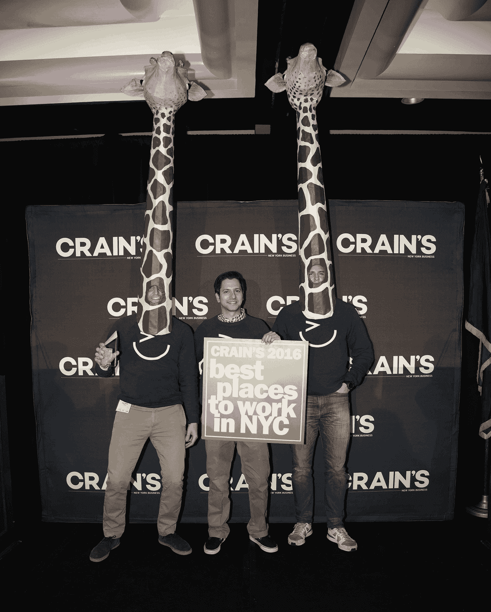

# 通过引入新技术来发展我的业务

> 原文：<https://www.indiehackers.com/interview/growing-my-business-by-bringing-new-tech-to-recruiting-d96ad16f2c>

## 你好！你的背景是什么，你在做什么？

我叫亚当·高德斯坦，是招聘市场 [Vettery](http://synd.co/2ktfafx) 的联合创始人，这个市场为顶尖人才和成长型公司牵线搭桥。在 Vettery 之前，我和我的联合创始人(Brett Adcock)在一家对冲基金研究、分析和投资招聘和人员配置行业。这些天来，我们致力于通过为求职者和公司创造机会和透明度来改变招聘行业。

Vettery 拥有 5000 多名顶级工程师，他们愿意与公司讨论新的机会，而且我们每个月还会增加数千人。公司能够在与候选人直接联系之前查看候选人的经历、薪酬数据和首选职位，而无需使用人事代理。

由于该平台所展示的价值，我们每月收到超过 10，000 份来自渴望使用 Vettery 找到梦想工作的求职者的申请。为了帮助评估候选人，我们使用一种结合人类智能的算法，最终导致不到 5%的候选人被平台接受。目前，Vettery 在三个核心城市(纽约、旧金山和洛杉矶)的两个垂直行业(技术、金融)开展业务。

[Vettery](http://synd.co/2ktfafx) 被 2000 多家公司使用，包括优步、蓝色围裙和 Casper 等顶级科技公司，以及较小的初创公司。

## 是什么促使你开始使用 Vettery？你最初的目标是什么，你是如何产生这个想法的？

2009 年，布雷特和我开设了一个博客，培训人们如何在金融领域找到工作。我们出于沮丧创建了这个博客，因为申请我们公司的申请人完全没有准备，我们希望在申请不透明的金融服务领域的工作时让人们占上风。我们以为只有少数人会阅读我们的博客，但我们错了——数百万人涌向它，它成了业内的一个重要来源。

随着我们尝试构建不同类型的基于技术的招聘工具，如视频面试、移动工作申请和申请人跟踪系统，我们对人力资源行业的热情持续增长。

我们很快意识到，价值 1000 多亿美元的招聘行业主要由经纪人主导，他们对技术创新沾沾自喜。从那时起，我们的任务就变成了将招聘提高到其他几个行业的标准，这些行业通过技术强化的流程得到了改进，并淘汰了过时的猎头系统。

大约两年前，我们在纽约推出了市场(T1 ),最初专注于技术领域。从一开始，公司就争相进入这个平台，因为这个行业以前从未有机会以如此透明的方式接触到高质量的候选人。

大部分招聘人员会一次给一家公司发 2-3 份简历；在与招聘人员共事的过程中，你可能只会看到少量的简历，所以你对其他方面的看法非常狭隘。Vettery 让公司能够同时接触到数千名高质量、经过审查的候选人，使客户能够控制和广泛了解合格的人才。Vettery 提供关键的候选人详细信息，包括简历、薪酬详细信息和工作偏好。

随着候选人的质量和平台上公司的数量以惊人的速度增长，我们伸出手来选择风险投资家来筹集一轮资本，以真正给公司提供实现我们愿景所需的燃料。由 Groupon 创始人创办的 Lightbank 的风险投资人喜欢这个想法，是我们最早的支持者之一。他们和 Brian Spaly(Bonobos and Trunk Club 的创始人)一起，把我们介绍给 Greycroft Partners，后者是我们的第一批支持者。

## 建造 Vettery 及其背后的技术是什么？

在我们开始 [Vettery](http://synd.co/2ktfafx) 的时候，Brett 和我已经开发了几个其他的软件技术产品，所以产品本身并不是最紧迫的挑战。真正的困难是启动和培育一个健康的市场。每个市场都面临着同样的挑战:如何以合适的比例吸引买家(雇主)和卖家(求职者)？或者根本没有？

市场的任何一方都不能达到临界质量，就会导致整个平台的崩溃。考虑到这一点，当我们推出时，我们不知疲倦地努力吸引尽可能多的人进入市场。有许多不眠之夜，我们不确定它是否会工作。

深入的技术工作是在我们启动市场后开始的。我们最大的资产是我们的数据，所以我们需要预测跟踪和存储什么，甚至在我们使用它之前。从一开始，数据完整性和管理就是我们的核心实践，并不断产生效益。

最直接的是，我们知道这些数据可以用来为我们的客户提供高质量的候选人匹配。通过根据客户喜欢的求职者类型和他们正在寻找的职位来分析客户行为模式，我们可以预测哪些候选人拥有成功所需的技能和经验。

## 你用了哪些营销策略来扩大 Vettery 的客户群？

第一天只是一个忙碌的工作。我们不得不打电话，发邮件，联系每一个我们认识的人。我们牵线搭桥，请人帮忙，送纸杯蛋糕，尽我们所能让公司和候选人进入市场。

扩大客户群没有真正的秘诀。每个人都在寻找“成长秘诀”，但有时有价值的事情因为某种原因变得很难，而且没有捷径。事实是，你需要汗水、灵活性和一点点运气。我们同时解决了公司和候选人两方面的市场问题，因为我们不得不这样做。对我们来说，这是生死攸关的问题，所以我们坚持不懈地努力着。我们今天仍然这样做！

我们最大的渠道之一一直是创意营销。我们从来没有钱进行昂贵的广告活动或赞助大型活动，所以我们必须变得有创意。无论我们去哪里，我们总是创造一个场景，以产生免费的嗡嗡声。2016 年，我们被评为 Crain 的最佳工作场所之一，在荣誉午餐上，我们戴着 6 英尺高的定制长颈鹿头面具，这样上千名与会者中的每一个人都会知道我们在那里。由于这样的努力，我们也碰巧在那一年赢得了 Crain 的最佳创意奖。

 

在筹集了首轮融资后，我们有一些钱来做广告，但不多，所以我们仍然必须有创意，小心我们的支出。我们尝试了内容营销、活动、推荐系统和直邮。随着时间的推移，所有这些活动都有助于将公司定位为该领域的公认品牌。

我们最好的营销渠道是推荐系统，因为我们已经从我们平台的用户那里收到了非常积极的反馈。他们将永远是你最好的增长来源，因为比起 300x250 像素的广告，人们更信任他们的同行。我们一直刻意保持谨慎的一个渠道是社交活动和小组讨论。虽然你有机会接触到大量的观众，但通常这可能是错误的观众，从金钱和时间的角度来看都是昂贵的。

## 你的商业模式是如何运作的？你的营收背后有什么故事？

[Vettery](http://synd.co/2ktfafx) 有两种主要的创收方式。该平台是免费试用的，雇主唯一的成本是他们雇用候选人的时候。在这种情况下，我们收取候选人第一年工资的 15%。我们还有一个无限制的雇佣订阅计划，根据公司的规模和需求，每月从 3000 美元到 10000 美元不等。

订阅计划是企业的未来。一旦一家公司致力于产品，并消除按雇佣付费的模式，整个关系就会改善。Vettery 为客户提供关于面试哪些候选人以及如何有效地结束这些候选人的额外建议。与传统的招聘人员相比，没有利益冲突。典型地，当经纪人(例如招聘人员)被金钱激励来安置候选人时，他们会说并且做几乎任何事情来让雇主雇用他们的候选人；但如果雇主只支付固定费用，就没有动力去推动招聘，从而导致客户和招聘人员之间更信任的伙伴关系。

我们很幸运，我们在一个有明确和结构化收入模式的领域中竞争，这使我们能够花更多时间专注于改善用户体验和提高产品的采用率。

## 你未来的目标是什么？

我们的目标是成为世界上最大的平台，用于招聘任何行业的任何职位。今天，我们只在技术和金融领域运营，但今年晚些时候，我们将扩展到其他垂直行业。

此外，我们希望给招聘行业带来快乐。如果你听到任何人谈论招聘，通常都是负面的——无论是求职者抱怨填写申请表，还是招聘人员哀叹缺乏优质候选人。我们认为，招聘应该被视为一个积极的因素。这对于求职者来说是一个巨大的人生事件，对于雇主来说是一个全新的团队成员。我们的目标是让人们对招聘的反应恰当地反映出寻找理想工作的过程是多么令人惊奇。

就个人而言，我有两个主要的目标，我把它们作为路标:1)我想建立一个大公司，2)我想建立一个充满积极性的公司。

## 如果你必须重新开始，你会做什么不同的事？

我中了书中最古老的诡计，如果可以的话，我会撤销它:我把生意和友谊混为一谈，不出所料，结局很糟糕。我们都听过这一课一遍又一遍。但不管出于什么原因，我认为我可以做到。

梦想肯定是能够和朋友一起庆祝成功，虽然这可能是关于旅程而不是目的地，但有时如果你不得不牺牲一段稳定的友谊，旅程也会很痛苦。

这就是为什么当我开始 [Vettery](http://synd.co/2ktfafx) 时，我选择与我真正鄙视的人合作。开玩笑的，布雷特。也就是说，我绝对会在下一次公司足球锦标赛上摧毁你的球队...

## 你最大的优势是什么？有什么特别有用的吗？

我喜欢阿什莉·万斯(Ashlee Vance)关于埃隆·马斯克(Elon Musk)的书，这本书给了我一个不可思议的视角，告诉我可以做些什么，以及完成有价值的事情需要不懈的努力。每当我的团队中有人告诉我他们不能做某事时，我总是告诉他们，我们不会将可重复使用的火箭降落在海洋中的无人驾驶船上——相信我，这是可行的。通常都是这样。

我甚至在我们的主会议室挂了一张埃隆·马斯克的照片，一些团队成员认为把它变成一个神龛会很有趣。我们决定留下它，尽管参观者不时会有些困惑，但它为团队提供了额外的动力，这是值得的。

我的另一个巨大影响是[托尼·罗宾斯](http://amzn.to/2le3JNc)。我试图在一天中保持最佳状态。每当我感觉自己慢下来或精力不足时，我就戴上耳机，放一些响亮的音乐。托尼·罗宾斯告诉我，为了把工作做到最好，你需要在精神和身体上都处于巅峰状态。疲惫是一种心态，很少会成为现实。

## 对于刚刚起步的独立黑客，你有什么建议？

只有在你全力以赴的情况下，才全力以赴。没有对冲。烧船，占领这个岛。每当我听到企业家们谈论后备计划，或者他们将如何兼职创业，很明显，他们甚至在开始之前就已经死了。

每个初创公司都有多个濒临死亡的时期，如果有备用选择，这将是一条诱人的道路。不幸的是，伟大的事业很少会一帆风顺，如果你一遇到麻烦就放弃，你将永远无法实现你的全部潜力。你需要 100%全身心投入。

## 我们可以去哪里了解更多？

我们很乐意聊天，因此如果您对 Vettery 有任何其他问题，可以随时发表评论。你也可以在 www.vettery.com[或推特](http://synd.co/2ktfafx)上或[找到我们！](https://twitter.com/vettery)

—[<picture id="ember8046842" class="user-avatar ember-view user-link__avatar"></picture>AdamVettery](/AdamVettery?id=K1CBhBnCZZTNhonhtF2b1cqa4fz1)，Vettery 的创建者

## 想像 Vettery 一样建立自己的事业？

你应该加入独立黑客社区！🤗

我们是几千名创始人，互相帮助建立有利可图的业务和副业。来分享你正在做的事情，并从你的同事那里获得反馈。

还没准备好开始使用你的产品吗？没问题。这个社区是一个认识人、学习和实践的好地方。随意[随便浏览](/)！

——[<picture id="ember8046847" class="user-avatar ember-view user-link__avatar"></picture>柯特兰艾伦](/csallen?id=ibTLPyjwVebnZjMGKvz6ztarnuV2)，独立黑客创始人

6votes