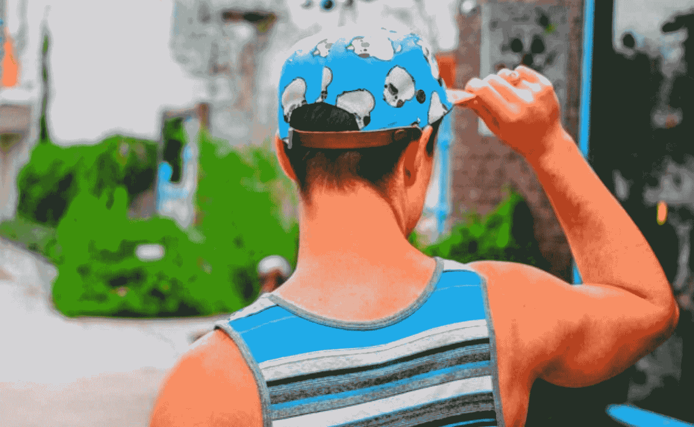
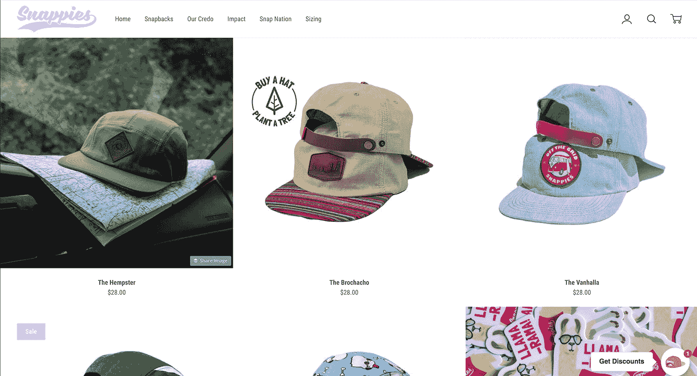

# 在 12 个月内将我的电子商务产品增长到每月 15000 美元

> 原文：<https://www.indiehackers.com/interview/growing-my-e-commerce-product-to-1-5k-mo-in-twelve-months-7a3045cf10>

## 你好！你的背景是什么，你在做什么？

嘿！我是魁梧的罗宇胜，Snappies 的创始人。我的背景是销售和营销，尽管我当时并不知道，但这给了我开创自己品牌的技能和动力。

我喜欢把 Snappies 描述为一个试图改变 snapback 帽子定义的品牌。崇高的目标，我知道。我使用优质材料，如皮革和黄铜按扣，代替大多数按扣帽子上的廉价塑料按扣。创造服务于更大目标的东西对我来说一直很重要；这就是为什么我将每顶帽子的收益捐给非营利组织，帮助种植 10 棵树。

目前，我的月平均收入约为 1，500 美元，但随着广告预算和库存的增加，我希望能超过这个数字。

## 是什么促使你开始吃 Snappies？

我是个戴帽子的人。我喜欢戴帽子，尤其是 snapbacks。问题是，我把帽子戴反了，而且我从来不喜欢把塑料带子扎进我的前额。

我不明白为什么这些品牌都不尝试用塑料以外的东西做表带。所以，我决定试着做些更好的东西。

## 构建最初的产品需要什么？

最初，我试图模仿两个塑料带扣在一起的设计，同时用皮革和黄铜代替塑料。然而，在摆弄了它并制作了原型之后，我发现它无法工作。所以我最终选择了我现在的设计，把搭扣放在帽子的背面，用一根带子扣上。当然，这是不同的，但它给了我的帽子一种独特的外观和感觉。

最初的几个原型花了一些时间。我没有皮革加工或制作服装产品的经验。我早期的大部分时间都在逛当地的皮革和工艺品商店，试图找出最好的材料(皮革类型、尺寸)。

从零开始给了你尝试任何事情的优势。

TweetShare

我面临的一大障碍是尺寸。如果帽子太小或太大，哪怕只有一厘米，都会破坏整个设计。因为我的帽子只有三种尺寸，所以我不得不尝试按扣放置的方式，以便找到适合大多数人的设计。幸运的是，我有很多不同头脑的朋友，所以我可以招募他们来测试适合度。

对于帽子上的实际设计来说，这要简单一些。就像我说的，我有市场营销的背景，包括平面设计，所以我能够创建我自己的图形，并在 Photoshop 中制作模型来确定品牌外观。这真的帮助我节省了资金，因为我不必外包设计工作。

我全职工作，所以所有这些都是在我的空闲时间里用我自己的钱做的。所以这是你的老套故事，工作到深夜修补一些新的，未经证实的产品。

## 你是如何吸引用户并种植 Snappies 的？

我没有一个大的启动计划或战略，回头看，这是一个错过的机会。我最初的客户来自 Snappies [Instagram 页面](https://www.instagram.com/snappiesco/)。从零开始是艰难的，但我能够通过接触我的目标人群、评论、喜欢照片等方式在 Instagram 上慢慢增加粉丝。人们常常低估了创立一个品牌所花费的时间和精力。

 

一旦我有了一些顾客和品牌支持者，培养这些追随者是至关重要的，因为他们通常是你最大的品牌拥护者。我创造了“Snap Nation”这个词来指代我的追随者，以此来建立对品牌成功至关重要的部落主义。鼓励顾客分享戴着 [Snappies](https://www.snappiesco.com) 帽子的照片不仅给了我免费的广告——这也是在我自己的品牌页面上转发内容的绝佳来源。

从零开始给了你尝试任何事情的优势。它让你可以自由地做营销工作，这需要时间，也不能扩大规模，但有助于初步增长。早期我使用[游击营销](http://www.investopedia.com/terms/g/guerrilla-marketing.asp)作为获得初始品牌知名度的一种方式。

我住的地方离一些大学很近，所以我四处走动，张贴我的品牌和 Snappies 网址的传单。老实说，我并不指望它能做多少，但令我惊讶的是，我能够从它那里获得一些客户。

## 你的商业模式是什么，你是如何增加收入的？

我通过 [Shopify](https://www.shopify.com) 通过我的电子商务网站直接向顾客销售 [Snappies](https://www.snappiesco.com) 帽子。如果你刚开始从事电子商务，Shopify 是一个不错的选择。超级精简，即使是新手也能拼凑出一个看起来很现代的网站。

那里有大量的免费资源。读起来。看看什么对其他人有用，使用这些策略。

TweetShare

真正帮助我品牌扩张的是脸书广告。他们最近已经起飞，这造成了库存问题。我将比预期更快地消耗库存，我将不得不放慢广告速度，这导致了最近月收入的溜溜球效应。当我有足够的库存时，我平均每个月大约 1500 美元，但这取决于我在广告上的预算。

对于电子商务领域的任何企业家来说，脸书广告都有着不可思议的影响力。包括我自己在内的许多人开始遇到的问题是确定目标，使其有利可图。有这么多的目标选择和变量，很难知道什么是有效的，什么是浪费你的钱。

直到我使用基于过去客户或时事通讯注册的自定义受众，我才开始看到真正的结果。我给那些被脸书广告烧伤的企业家的建议是，等到你有了一个可靠的联系人名单(客户、注册用户、网站访问者)，然后通过长相相似的受众根据这些名单锁定目标受众。在一天结束时，它需要大量的试验和错误，所以不要害怕失去一些钱来测试你的广告。

我的成本仍然很高，因为我的帽子是定制的，而且我没有大量订购，这降低了单位成本(1000+)。目前，我的产品利润约为 30%。

## 你未来的目标是什么？

我开始做 Snappies 是因为我想做我喜欢的帽子，但是没有。所以对我来说，成功很简单:设计和创造我认为很棒的帽子。幸运的是，其他人似乎也这么认为，所以这给了我资源来推出更多的产品。

我在网上销售方面取得了成功，但我希望进入零售业，增加另一个收入渠道。我正在和一些零售商谈话，这应该有助于通过批发销售更多的产品。

## 你面临的最大挑战和克服的障碍是什么？

一开始，寻找制造商并让我的产品大规模生产是一个障碍。我犯的一个关键错误是没有绝对精确的产品规格。如果你不把它拼出来，你不能想当然地认为制造商知道你期望的确切尺寸、材料或颜色。

最终，在我对最终产品满意之前，我必须经历多次迭代。这可能会非常慢，尤其是当你准备开始销售你的产品时，但在订购数百个设计之前，你必须确切地知道你想要什么。

## 有没有发现什么特别有帮助或者有优势的？

我的背景无疑是一个额外的奖励，它让我可以自己完成许多创业任务。从产品摄影到图形，我都能亲自动手，这在一开始就节省了资金。

我能够创建我自己的图形，并在 Photoshop 中制作实体模型来打造品牌形象。

TweetShare

如果你还没有读过，看看马尔孔·格拉德威尔的《T2 引爆点》。这是一本很好的书，从一个很好的角度讲述了即使是很小的改变也能带来很大的不同。

## 对于刚刚起步的独立黑客，你有什么建议？

不要陷入分析麻痹。在某种程度上，你只需要接受挑战，然后勇往直前。事情总是可以变得更好或者更好，但是如果你不开始，你将一事无成。

有大量的免费资源，无论是独立黑客还是 reddit。读起来。看看什么对别人有用，并把这些策略用于你的生意。

最后，想尽一切办法把话传出去。你永远不知道什么是有效的，直到你尝试了，所以你不妨全部尝试。当你从零开始，任何事情都是一种进步。

## 我们可以去哪里了解更多？

在 snappiesco.com 的[来看看我们吧。您也可以在 Twitter 上关注](https://www.snappiesco.com/) [@snappiesco](https://twitter.com/SnappiesCo) 或通过电子邮件 [【电子邮件保护】](/cdn-cgi/l/email-protection#91f2feffe5f0f2e5d1e2fff0e1e1f8f4e2f2febff2fefc) 联系我。

问我你有什么问题，我一定会在下面回答你。

——[<picture id="ember8110676" class="user-avatar ember-view user-link__avatar"></picture>魁梧的](/Burly?id=E73UYax1YlfVt7IH6dyDEfC9mOx2)，快照的创造者

## 想像 Snappies 一样建立自己的事业吗？

你应该加入独立黑客社区！🤗

我们是几千名创始人，互相帮助建立有利可图的业务和副业。来分享你正在做的事情，并从你的同事那里获得反馈。

还没准备好开始使用你的产品吗？没问题。这个社区是一个认识人、学习和实践的好地方。随意[随便浏览](/)！

—[<picture id="ember8110681" class="user-avatar ember-view user-link__avatar"></picture>考特兰艾伦](/csallen?id=ibTLPyjwVebnZjMGKvz6ztarnuV2)，独立黑客创始人

4votes